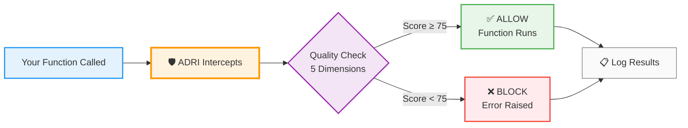

# ADRI - Stop AI Agents Breaking on Bad Data

**Prevent AI agent failures with one decorator**

## 5-Minute Quickstart

Install → Generate Standard → Assess → Decorate

```bash
pip install adri

# Bootstrap project folders and sample data
adri setup --guide

# Generate a standard from your "good" dataset
adri generate-standard examples/data/invoice_data.csv \
  --output examples/standards/invoice_data_ADRI_standard.yaml

# Validate a new dataset against the generated standard
adri assess examples/data/test_invoice_data.csv \
  --standard examples/standards/invoice_data_ADRI_standard.yaml
```

What you should see

- Allowed ✅ when data complies with the generated standard
- Blocked ❌ with a summary of failed checks when the test data violates the standard

```python
from adri import adri_protected

@adri_protected(standard="invoice_data_standard", data_param="invoice_rows")
def your_agent_function(invoice_rows):
    # Your existing code - now protected!
    return result
```

Start warn-first, then switch to raise when confident:

```python
@adri_protected(standard="invoice_data_standard", data_param="invoice_rows", on_failure="warn")
```

**ADRI automatically creates standards from your data patterns and blocks bad data before it reaches your agents.**

## How ADRI Works

ADRI acts as a quality gate for your AI functions - intercepting calls, checking data quality across 5 dimensions, and deciding whether to allow or block execution.



**The 5 Quality Dimensions:**
- ✅ **Validity** - Correct formats (emails, dates, types)
- ✅ **Completeness** - No missing required fields
- ✅ **Consistency** - Same format across records
- ✅ **Plausibility** - Realistic values (age 0-120, not -5)
- ✅ **Freshness** - Data recency and relevance

## Key Features

- **🛡️ One-Decorator Protection** - Add `@adri_protected` to any function
- **🤖 Framework Agnostic** - Works with LangChain, CrewAI, AutoGen, LlamaIndex, etc.
- **🚀 Smart Defaults** - Zero-config start with optional fine-grained control
- **📊 5-Dimension Validation** - Completeness, validity, consistency, plausibility, freshness
- **📋 Detailed Reporting** - JSON logs and actionable error messages
- **⚡ Enterprise Ready** - Local-first with a path to managed Verodat supply

## Quick Example

```bash
# Generate a data standard once
adri generate-standard data/customers_clean.csv \
  --output ADRI/dev/standards/customer_data_standard.yaml

# Use the same standard to guard new inputs
adri assess data/customers_latest.csv \
  --standard ADRI/dev/standards/customer_data_standard.yaml
```

```python
from adri import adri_protected

@adri_protected(standard="customer_data_standard", data_param="invoice_rows")
def process_customers(invoice_rows):
    return ai_analysis(invoice_rows)  # Only runs on quality data
```

## Documentation

📖 **[Getting Started](docs/docs/users/getting-started.md)** - Installation and first success
❓ **[FAQ](docs/docs/users/faq.md)** - Answers for agent engineers and data teams
🧠 **[Framework Playbooks](docs/docs/users/frameworks.md)** - Copy/paste fixes for LangChain, CrewAI, LlamaIndex, and more
🧭 **[Adoption Journey](docs/docs/users/adoption-journey.md)** - When to move from local logging to Verodat MCP
🏗️ **[Architecture](ARCHITECTURE.md)** - How ADRI is built
📋 **[Examples](examples/)** - Ready-to-run use cases and standards
🤝 **[Contributing](CONTRIBUTING.md)** - Join the community

## Framework Support

ADRI works seamlessly with all major AI frameworks:
- **LangChain** - Protect chains and agents
- **CrewAI** - Validate crew inputs
- **AutoGen** - Secure multi-agent conversations
- **LlamaIndex** - Guard query engines
- **Any Python Function** - Universal protection

See [docs/docs/users/frameworks.md](docs/docs/users/frameworks.md) for copy-paste playbooks.

## Support

- **[GitHub Issues](https://github.com/adri-standard/adri/issues)** - Report bugs and request features
- **[GitHub Discussions](https://github.com/adri-standard/adri/discussions)** - Community support

---

## ADRI Adoption Path

See the Adoption Journey for next steps: [docs/docs/users/adoption-journey.md](docs/docs/users/adoption-journey.md)

When to scale up to Verodat MCP: [docs/docs/users/flip-to-enterprise.md](docs/docs/users/flip-to-enterprise.md)

---

## License & Attribution

**Apache 2.0 License** - Use freely in any project. See [LICENSE](LICENSE) for details.

ADRI is founded and maintained by [Verodat](https://verodat.com).
