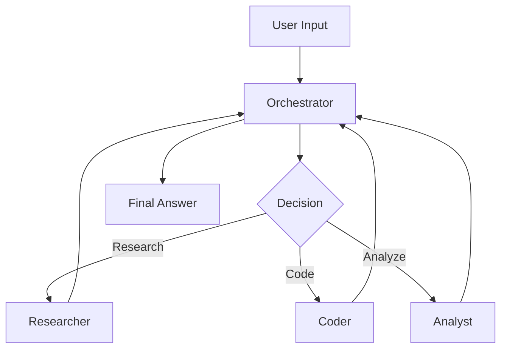

# Low Priority / Nice-to-Have Features

These optimizations have lower immediate impact but could provide value in specific scenarios or future development.

---

## [OPT-11] Agent-to-Agent (A2A) Communication

**Priority:** 🟢 Low | **Effort:** 🔨 High (2-3 weeks)

### Overview

Enable direct agent-to-agent communication without orchestrator mediation using the A2A protocol.

### Benefits

- Direct agent collaboration
- Reduced orchestrator overhead
- Protocol-based messaging
- Better scalability

### Use Cases

- Peer-to-peer agent networks
- Decentralized multi-agent systems
- Agent marketplaces

### Implementation

```python
from agent_framework_a2a import A2AAgent

researcher = A2AAgent(
    base_agent=create_researcher_agent(),
    protocol_endpoint="http://researcher:8080"
)

# Agents can message each other directly
response = await researcher.send_message(coder, "Please analyze this data")
```

---

## [OPT-12] Workflow Visualization

**Priority:** 🟢 Low | **Effort:** 🔨 Low (3-5 days)

### Overview

Export workflow graphs as visual diagrams (DOT, Mermaid, PNG).

### Benefits

- Documentation generation
- Onboarding new developers
- Debugging complex workflows
- Presentation materials

### Implementation

```python
from agent_framework import WorkflowViz

workflow = create_workflow()
viz = WorkflowViz(workflow)

# Export as various formats
viz.export_dot("workflow.dot")
viz.export_mermaid("workflow.mmd")
viz.export_png("workflow.png")
```

### Example Output



---

## [OPT-13] Redis-based State Persistence

**Priority:** 🟢 Low | **Effort:** 🔨 Medium (1-2 weeks)

### Overview

Implement Redis-based state storage for distributed deployments and session persistence.

### Benefits

- Multi-instance deployments
- Session persistence across restarts
- Distributed caching
- High availability

### Use Cases

- Production deployments
- Load-balanced instances
- Microservices architecture

### Implementation

```python
from agent_framework_redis import RedisCheckpointStorage

workflow = (
    WorkflowBuilder()
    .with_checkpointing(
        RedisCheckpointStorage(
            host="redis.example.com",
            port=6379,
            db=0,
            password=settings.redis_password
        )
    )
    .build()
)
```

### Configuration

```yaml
# config/workflow.yaml
workflow:
  checkpointing:
    storage_type: redis
    redis:
      host: localhost
      port: 6379
      db: 0
      password: ${REDIS_PASSWORD}
      ttl_seconds: 86400  # 24 hours
```

---

## [OPT-14] AF Labs Features

**Priority:** 🟢 Low | **Effort:** 🔨 High (3-4 weeks)

### Overview

Integrate experimental features from Agent Framework Labs for research and advanced use cases.

### Features Available

#### 1. Benchmarking

```python
from agent_framework_lab.benchmarking import AgentBenchmark

benchmark = AgentBenchmark()
results = await benchmark.run(
    agents=[orchestrator, researcher, coder],
    test_suite="standard",
    metrics=["latency", "cost", "quality"]
)
```

#### 2. Reinforcement Learning

```python
from agent_framework_lab.rl import RLTrainer

trainer = RLTrainer(workflow)
trainer.train(
    episodes=1000,
    reward_function=custom_reward,
    policy="ppo"
)
```

#### 3. Research Tools

- Agent behavior analysis
- Performance profiling
- A/B testing framework
- Experiment tracking

### Benefits

- Cutting-edge features
- Research capabilities
- Performance optimization
- Continuous improvement

---

## [OPT-15] Advanced Tool Modes

**Priority:** 🟢 Low | **Effort:** 🔨 Low (3-5 days)

### Overview

Implement advanced tool usage modes for better control over when and how tools are used.

### Features

#### 1. Required Tools

```python
from agent_framework import ToolMode

agent = create_coder_agent()
agent.set_tool_mode(ToolMode.REQUIRED)  # Must use tools for every response
```

#### 2. Conditional Tools

```python
def enable_code_tool(ctx):
    return "code" in ctx.input.lower()

agent.set_tool_condition(code_interpreter_tool, enable_code_tool)
```

#### 3. Dynamic Registration

```python
# Add tools at runtime based on context
if user.has_permission("file_access"):
    agent.add_tool(file_system_tool)
```

#### 4. Tool Chaining

```python
# Define tool dependencies
agent.add_tool_chain([
    web_search_tool,
    data_extraction_tool,
    analysis_tool
])
```

### Benefits

- Fine-grained control
- Context-aware tooling
- Better security
- Flexible configurations

---

## Implementation Priority

If time and resources permit, tackle these in order:

1. **OPT-12** (Visualization) - Quick win, good for documentation
2. **OPT-15** (Tool Modes) - Easy to implement, useful features
3. **OPT-13** (Redis) - If deploying to production
4. **OPT-11** (A2A) - For advanced use cases
5. **OPT-14** (Labs) - For research/experimentation

---

## Success Criteria (Overall)

- Documentation exists for all features
- Examples provided for each optimization
- Tests pass for implemented features
- Performance metrics are positive
- User feedback is incorporated

---

**Status:** Documented for Future Consideration
**Review Date:** After Phase 3 completion
