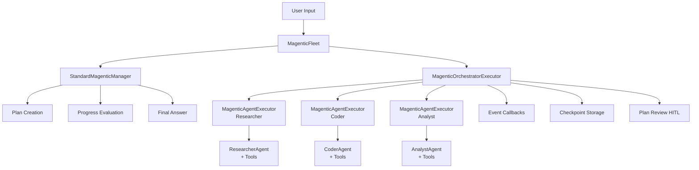

# Magentic Fleet Architecture

## Overview

AgenticFleet is transitioning from a custom orchestration pattern to a **Magentic workflow architecture** powered by Microsoft's Agent Framework. The new architecture introduces the concept of a "**Fleet**" — a Magentic-based coordination system that dynamically orchestrates specialized agents.

## Architecture Goals

1. **Magentic-First**: Use Microsoft Agent Framework's `MagenticBuilder` to create planner-driven workflows
2. **Fleet as Orchestrator**: Create `./src/agenticfleet/fleet/` module containing Magentic workflow components
3. **Agent Pluggability**: Specialized agents from `/agents` participate as Magentic participants when needed
4. **Response API Format**: Continue using OpenAI Response API format via `OpenAIResponsesClient`
5. **Enhanced Observability**: Leverage Magentic's callback system for streaming and progress tracking

## High-Level Architecture



## Key Components

### 1. MagenticFleet (`fleet/magentic_fleet.py`)

The primary workflow orchestrator that replaces `MultiAgentWorkflow`:

```python
class MagenticFleet:
    """
    Magentic-based fleet orchestrator.

    Uses StandardMagenticManager for planning and MagenticOrchestratorExecutor
    for coordination. Specialized agents participate via MagenticAgentExecutor.
    """

    def __init__(
        self,
        checkpoint_storage: CheckpointStorage | None = None,
        approval_handler: Any | None = None,
    ):
        # Build workflow using MagenticBuilder
        self.workflow = self._build_magentic_workflow()

    def _build_magentic_workflow(self):
        # Create manager with custom prompts
        # Register researcher, coder, analyst as participants
        # Enable checkpointing, callbacks, plan review
        pass

    async def run(self, user_input: str) -> str:
        # Execute Magentic workflow
        pass
```

### 2. FleetBuilder (`fleet/fleet_builder.py`)

Wrapper around `MagenticBuilder` with AgenticFleet-specific configuration:

```python
class FleetBuilder:
    """
    Constructs Magentic workflow with AgenticFleet conventions.
    """

    def __init__(self):
        self.builder = MagenticBuilder()
        self.config = settings.fleet_config

    def with_agents(self, agents: dict[str, AgentProtocol]):
        """Register specialized agents as participants."""
        for name, agent in agents.items():
            self.builder.participants({name: agent})
        return self

    def with_manager(self, instructions: str):
        """Configure StandardMagenticManager with custom prompts."""
        return self

    def with_observability(self):
        """Add streaming and progress callbacks."""
        return self

    def build(self) -> Workflow:
        """Build and return the Magentic workflow."""
        return self.builder.build()
```

### 3. Fleet Callbacks (`fleet/callbacks.py`)

Event handlers for streaming and observability:

```python
async def streaming_agent_response_callback(message: MagenticResponseMessage):
    """Stream agent responses to logs/UI."""
    logger.info(f"Agent {message.agent_name}: {message.content}")

async def plan_creation_callback(ledger: MagenticTaskLedger):
    """Log plan creation and facts gathered."""
    logger.info(f"Plan: {ledger.plan}")
    logger.info(f"Facts: {ledger.facts}")

async def progress_ledger_callback(ledger: MagenticProgressLedger):
    """Track progress evaluation and next actions."""
    logger.info(f"Complete: {ledger.is_request_satisfied}")
    logger.info(f"Next: {ledger.next_speaker} - {ledger.instruction}")
```

## Coordination Flow

### 1. Plan Phase

```
User Query → StandardMagenticManager.plan()
  → Gather facts about available agents
  → Create bullet-point plan
  → Store in MagenticTaskLedger
```

### 2. Evaluate Phase

```
MagenticOrchestratorExecutor → Manager.create_progress_ledger()
  → Is request satisfied?
  → Is workflow in a loop?
  → Who should act next?
  → What instruction should they receive?
  → Return MagenticProgressLedger (JSON)
```

### 3. Act Phase

```
Orchestrator → MagenticRequestMessage → Selected Agent
  Agent → Execute tools (code_interpreter, web_search, etc.)
  Agent → Return MagenticResponseMessage
  Orchestrator → Append to chat_history
```

### 4. Completion Phase

```
Progress indicates completion
  → Manager.prepare_final_answer()
  → Synthesize findings from chat_history
  → Return ChatMessage to user
```

## Configuration Structure

### `config/fleet.yaml`

```yaml
fleet:
  manager:
    model: "gpt-4o"
    instructions: |
      You are coordinating a fleet of specialized AI agents.
      Delegate to:
      - researcher: For web searches and information gathering
      - coder: For code execution and analysis
      - analyst: For data analysis and visualization

      Always synthesize findings and provide FINAL_ANSWER when complete.

  orchestrator:
    max_round_count: 15
    max_stall_count: 3
    max_reset_count: 2

  plan_review:
    enabled: true
    require_human_approval: true

  callbacks:
    streaming_enabled: true
    log_progress_ledger: true
    log_tool_calls: true
```

## Agent Participation

Agents participate in the fleet by implementing the required protocol:

```python
# agents/researcher/agent.py
def create_researcher_agent() -> AgentProtocol:
    """
    Create researcher agent compatible with Magentic participation.

    Must implement:
    - id: str
    - name: str
    - description: str
    - async run(messages, *, thread=None, **kwargs)
    - run_stream(messages, *, thread=None, **kwargs)
    """
    return ChatAgent(
        name="researcher",
        model=config["model"],
        system_prompt=config["system_prompt"],
        client=OpenAIResponsesClient(...),
        tools=[web_search_tool, ...],
    )
```

## Tool Response Format

Since `StandardMagenticManager` only sees `chat_history`, agents must narrate tool outcomes:

```python
# Before (tool returns structured data)
@tool
def web_search_tool(query: str) -> WebSearchResponse:
    return WebSearchResponse(results=[...])

# After (agent narrates tool outcome in response)
async def agent_with_narration(messages):
    # Agent executes tool
    search_result = web_search_tool("Python best practices")

    # Agent narrates outcome in final message
    response = f"""
    I searched for "{search_result.query}" and found {len(search_result.results)} results.
    The top result indicates that Python best practices include:
    - Use type hints
    - Follow PEP 8
    - Write tests

    Based on these findings, I recommend...
    """
    return ChatMessage(content=response)
```

## Migration Strategy

### Phase 1: Parallel Implementation *(completed)*

- Built `MagenticFleet` alongside the legacy workflow in `./src/agenticfleet/fleet/`
- Introduced the `--workflow` CLI flag (now defaults to `magentic`; other values fall back to Magentic for compatibility)

### Phase 2: Feature Parity *(completed)*

- Ensured the Magentic implementation supports:
  - Checkpointing
  - HITL plan review
  - Tool execution
  - Streaming responses
  - Error recovery

### Phase 3: Transition *(completed)*

- Updated documentation and examples to use Magentic
- Made Magentic the default mode
- Deprecated the custom MultiAgentWorkflow

### Phase 4: Cleanup *(current)*

- Remove legacy workflow code ✅
- Consolidate documentation (in progress)
- Update all tests to use Magentic ✅

## Benefits Over Current Approach

### Legacy (MultiAgentWorkflow)

- Manual DELEGATE token parsing
- Custom round/stall counting
- Limited plan visibility
- Hard-coded agent routing

### New (MagenticFleet)

- Automatic delegation via StandardMagenticManager
- Built-in loop detection and replanning
- Structured plan review with HITL
- Dynamic participant selection
- Checkpoint-aware state management
- Rich callback/event system
- JSON-structured progress tracking

## Testing Strategy

### Unit Tests

```python
# tests/test_magentic_fleet.py
async def test_fleet_initialization():
    fleet = MagenticFleet()
    assert fleet.workflow is not None
    assert len(fleet.participants) == 3  # researcher, coder, analyst

async def test_plan_creation():
    fleet = MagenticFleet()
    result = await fleet.workflow.run("Analyze Python code quality")
    assert "FINAL_ANSWER" in result

async def test_agent_delegation():
    # Mock agents and verify MagenticRequestMessage routing
    pass
```

### Integration Tests

```python
# tests/test_fleet_integration.py
async def test_end_to_end_workflow():
    # Run complete workflow with real agents
    # Verify checkpointing, HITL, callbacks
    pass
```

## References

- Microsoft Agent Framework Magentic Documentation: `docs/analysis/TODOS/MAGENTIC_README.md`
- Current Workflow Implementation: `src/agenticfleet/fleet/magentic_fleet.py`
- Agent Factories: `src/agenticfleet/agents/*/agent.py`
- Configuration: `src/agenticfleet/config/settings.py`

## Next Steps

See [`operations/backlog.md`](../operations/backlog.md) for the active implementation task list.
