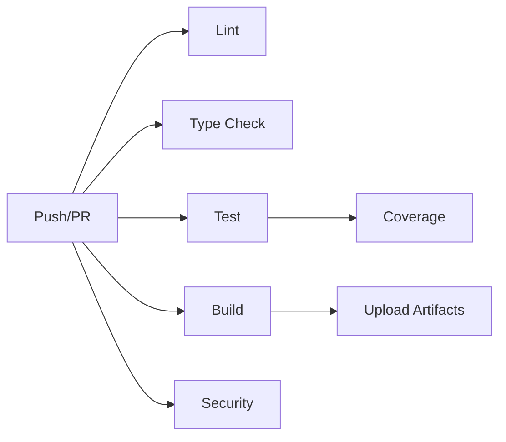

# GitHub Actions Quick Reference

## 📋 Workflows Overview

```text
.github/
├── workflows/
│   ├── ci.yml                      # Main CI pipeline
│   ├── release.yml                 # PyPI releases
│   ├── codeql.yml                  # Security scanning
│   ├── dependency-review.yml       # PR dependency checks
│   ├── stale.yml                   # Issue/PR cleanup
│   ├── pr-labels.yml              # Auto PR labeling
│   ├── label-sync.yml             # Label management
│   └── pre-commit-autoupdate.yml  # Hook updates
├── ISSUE_TEMPLATE/
│   ├── bug_report.yml             # Bug report form
│   ├── feature_request.yml        # Feature request form
│   └── config.yml                 # Template config
├── dependabot.yml                 # Dependency updates
├── labels.yml                     # Label definitions
├── labeler.yml                    # Auto-labeling rules
├── pull_request_template.md       # PR template
└── README.md                      # Workflow docs
```

## 🚀 Common Commands

### Running Tasks

```bash
# Sync dependencies
uv sync

# Run tests
uv run pytest -v

# Run with coverage
uv run pytest -v --cov=src/agenticfleet --cov-report=term-missing

# Lint code
uv run ruff check .

# Format code
uv run black .

# Type check
uv run mypy .

# Run all checks
make check
```

### GitHub CLI Commands

```bash
# View workflow runs
gh run list
gh run watch

# View specific run
gh run view <run-id>
gh run view --log

# Trigger workflow manually
gh workflow run ci.yml
gh workflow run release.yml

# Create release
gh release create v0.5.0 --title "v0.5.0" --notes "Release notes"
```

## 🏷️ Labels Reference

### Type Labels

- `type: bug` - Something isn't working
- `type: feature` - New feature or request
- `type: enhancement` - Enhancement to existing functionality
- `type: documentation` - Documentation improvements
- `type: refactor` - Code refactoring
- `type: test` - Test-related changes

### Priority Labels

- `priority: critical` - Must be addressed immediately
- `priority: high` - High priority
- `priority: medium` - Medium priority
- `priority: low` - Low priority

### Area Labels

- `area: agents` - Agent-related code
- `area: workflow` - Workflow orchestration
- `area: tools` - Tool implementations
- `area: config` - Configuration system
- `area: memory` - Memory/context provider
- `area: cli` - Command-line interface

### Status Labels

- `status: in-progress` - Work in progress
- `status: blocked` - Blocked by dependency
- `status: needs-review` - Needs maintainer review
- `status: needs-info` - Needs more information

## 🔄 CI Pipeline Jobs



### Job Details

- **Lint**: Ruff + Black (1-2 min)
- **Type Check**: mypy (1-2 min)
- **Test**: pytest across matrix (3-5 min)
- **Build**: Package build + validation (1 min)
- **Security**: Bandit scan (1 min)

**Total CI Time**: ~5-7 minutes

## 📦 Release Process

### Automatic Release

```bash
# 1. Update version in pyproject.toml
# 2. Commit changes
git commit -am "chore: bump version to 0.5.1"

# 3. Create and push tag
git tag v0.5.1
git push origin v0.5.1

# 4. Workflow automatically:
#    - Builds package
#    - Publishes to PyPI
#    - Creates GitHub release
```

### Manual Release

```bash
gh workflow run release.yml -f version=v0.5.1
```

## 🔒 Security Workflows

### CodeQL

- **Runs**: Weekly + on push/PR
- **Purpose**: Find security vulnerabilities
- **Languages**: Python
- **Queries**: security-extended, security-and-quality

### Dependency Review

- **Runs**: On every PR
- **Purpose**: Check for vulnerable dependencies
- **Fails on**: Moderate+ severity
- **Action**: Posts summary in PR

### Bandit

- **Runs**: Part of CI
- **Purpose**: Python security linting
- **Reports**: Uploaded as artifacts

## 🤖 Automation Features

### Auto PR Labeling

Automatically labels PRs based on changed files:

- `src/agenticfleet/agents/**` → `area: agents`
- `src/agenticfleet/fleet/**` → `area: workflow`
- `**/*.md` → `type: documentation`
- `tests/**` → `type: test`

### Stale Management

- **Issues**: Stale after 60 days → Close after 14 days
- **PRs**: Stale after 30 days → Close after 7 days
- **Exempt**: `pinned`, `security`, `roadmap`, `in-progress`

### Dependabot

Groups updates for:

- **Azure packages**: `azure-*`
- **Agent Framework**: `agent-framework*`
- **Dev dependencies**: `pytest*`, `black`, `ruff`, `mypy`

## 📊 Status Badges

Add to README.md:

```markdown
[](https://github.com/Qredence/AgenticFleet/actions/workflows/ci.yml)
[](https://github.com/Qredence/AgenticFleet/actions/workflows/codeql.yml)
[](https://github.com/Qredence/AgenticFleet/actions/workflows/release.yml)
```

## 🔧 Required Setup

### Repository Secrets (Optional)

```text
OPENAI_API_KEY
AZURE_AI_PROJECT_ENDPOINT
AZURE_AI_SEARCH_ENDPOINT
AZURE_AI_SEARCH_KEY
AZURE_OPENAI_CHAT_COMPLETION_DEPLOYED_MODEL_NAME
AZURE_OPENAI_EMBEDDING_DEPLOYED_MODEL_NAME
```

### Branch Protection (Recommended)

Protect `main` and `0.5.0a`:

- ✅ Require PR reviews (1 approval)
- ✅ Require status checks: `lint`, `type-check`, `test`
- ✅ Require conversation resolution
- ✅ Require branches to be up to date

### PyPI Trusted Publishing

1. Go to PyPI → Account Settings → Publishing
2. Add pending publisher:
   - Project: `agentic-fleet`
   - Owner: `Qredence`
   - Repo: `AgenticFleet`
   - Workflow: `release.yml`
   - Environment: `pypi`

## 🐛 Troubleshooting

### CI Failing on Secrets

**Issue**: Tests fail due to missing API keys
**Solution**: Expected for public repos. Tests use `continue-on-error: true`

### Release Not Publishing

**Issue**: Tag pushed but no PyPI release
**Solution**: Check PyPI trusted publishing setup and environment config

### Dependabot Not Creating PRs

**Issue**: No automatic dependency updates
**Solution**: Enable Dependabot in Settings → Security → Code security

### Workflows Not Triggering

**Issue**: Push doesn't trigger CI
**Solution**: Check branch names match workflow config (`main`, `0.5.0a`, `develop`)

## 📖 Documentation

- **Workflow Details**: `.github/WORKFLOWS.md`
- **Setup Guide**: `docs/GITHUB_ACTIONS_SETUP.md`
- **Security Policy**: `SECURITY.md`
- **Contributing**: See PR template

## 🎯 Next Steps

1. ✅ Configure repository settings
2. ✅ Add required secrets
3. ✅ Set up PyPI trusted publishing
4. ✅ Configure branch protection
5. ✅ Enable Dependabot
6. ✅ Sync labels: `gh workflow run label-sync.yml`
7. ✅ Add status badges to README
8. ✅ Test CI by creating a PR
9. ✅ Create first release

---

**Quick Start**: Push to any protected branch to trigger CI automatically!
