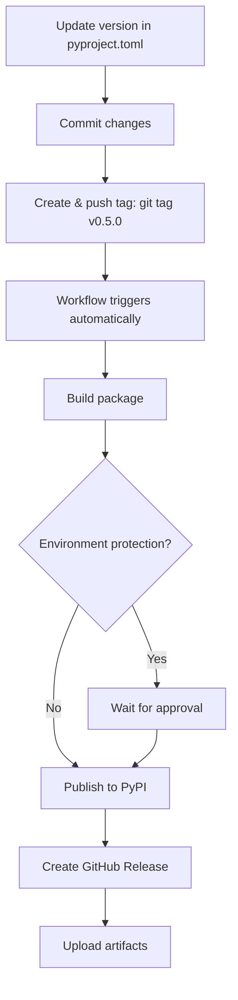

# PyPI Environment Setup Guide

## 🎯 Overview

This guide will help you set up the PyPI publishing environment for AgenticFleet to enable automated releases through GitHub Actions.

## Quick Checklist

- [ ] Create a GitHub environment named `pypi` and lock it to tag pattern `v[0-9]+.[0-9]+.[0-9]+*`.
- [ ] (Optional) Add required reviewers for the environment.
- [ ] On PyPI, add a pending trusted publisher with project `agentic-fleet`, owner `Qredence`, repo `agentic-fleet`, workflow `release.yml`, environment `pypi`.
- [ ] Push a tagged build (e.g. `v0.5.0-alpha1`) and approve the deployment if prompted.
- [ ] Verify the package appears on <https://pypi.org/project/agentic-fleet/> and the GitHub release is created.
- [ ] If using API tokens instead of trusted publishing, store the token as `PYPI_API_TOKEN` in the `pypi` environment and update `.github/workflows/release.yml` accordingly.

## ✅ Prerequisites

- [x] GitHub repository admin access
- [x] PyPI account (create at <https://pypi.org/account/register/>)
- [x] GitHub CLI installed and authenticated

## 📋 Setup Options

You have two options for PyPI authentication:

### Option 1: Trusted Publishing (Recommended) ⭐

**Pros:**

- ✅ No API tokens to manage
- ✅ More secure (uses OpenID Connect)
- ✅ No expiration
- ✅ Automatic rotation

**Cons:**

- ⚠️ Requires initial PyPI setup

### Option 2: API Token

**Pros:**

- ✅ Quick setup
- ✅ Works immediately

**Cons:**

- ⚠️ Requires token management
- ⚠️ Can expire
- ⚠️ Less secure than trusted publishing

---

## 🚀 Step-by-Step Setup

### Part 1: Create GitHub Environment (Required for Both Options)

#### 1. Navigate to Repository Settings

Open: <https://github.com/Qredence/agentic-fleet/settings/environments>

Or manually:

1. Go to your repository
2. Click **Settings** (top right)
3. In the left sidebar, click **Environments**

#### 2. Create New Environment

1. Click **"New environment"** button (green button, top right)
2. Enter environment name: **`pypi`**
3. Click **"Configure environment"**

#### 3. Configure Deployment Protection

On the environment configuration page:

1. **Deployment branches and tags**:

   - Select: ✅ **"Selected tags"**
   - Click **"Add deployment branch or tag rule"**
   - Enter tag pattern: **`v[0-9]+.[0-9]+.[0-9]+*`**
     - This matches: `v0.5.0`, `v1.0.0`, `v0.5.0-alpha1`, etc.
     - Note: Use this exact pattern, not `v*.*.*` (which causes "Name is invalid" error)
   - Click **"Add rule"**

2. **Required reviewers** (Optional but recommended):

   - Toggle **"Required reviewers"** ON
   - Add yourself or other maintainers
   - This adds manual approval before each release

3. **Wait timer** (Optional):

   - Set a delay before deployment (e.g., 0 minutes)

4. **Prevent self-review** (Optional):

   - Toggle ON if using required reviewers

5. Click **"Save protection rules"**

---

### Part 2A: Set Up Trusted Publishing (Recommended) 🌟

#### 1. Go to PyPI Publishing Settings

Open: <https://pypi.org/manage/account/publishing/>

Or manually:

1. Log in to PyPI
2. Click your username (top right)
3. Click **"Account settings"**
4. Scroll to **"Publishing"** section

#### 2. Add Pending Publisher

Scroll to **"Add a new pending publisher"** section and fill in:

| Field                 | Value           |
| --------------------- | --------------- |
| **PyPI Project Name** | `agentic-fleet` |
| **Owner**             | `Qredence`      |
| **Repository name**   | `AgenticFleet`  |
| **Workflow name**     | `release.yml`   |
| **Environment name**  | `pypi`          |

Click **"Add"**

#### 3. Verify Configuration

After adding, you should see a pending publisher listed. It will show:

- ✅ Project name: agentic-fleet
- ✅ Owner: Qredence
- ✅ Repo: AgenticFleet
- ✅ Workflow: release.yml
- ✅ Environment: pypi

**Note**: The publisher remains "pending" until your first successful release. After the first release, it becomes "active".

#### 4. That's It

Your release workflow is already configured to use trusted publishing. No additional secrets needed!

---

### Part 2B: Set Up API Token (Alternative)

#### 1. Generate PyPI API Token

1. Go to: <https://pypi.org/manage/account/token/>
2. Click **"Add API token"**
3. Token name: `AgenticFleet GitHub Actions`
4. Scope: **"Entire account"** (or specific project if it exists)
5. Click **"Add token"**
6. **Copy the token immediately** (starts with `pypi-`)
7. Store it securely - you won't see it again!

#### 2. Add Token to GitHub Environment

1. Go to: <https://github.com/Qredence/agentic-fleet/settings/environments>
2. Click on **"pypi"** environment
3. Scroll to **"Environment secrets"**
4. Click **"Add secret"**
5. Name: `PYPI_API_TOKEN`
6. Value: Paste your PyPI token
7. Click **"Add secret"**

#### 3. Update Release Workflow

The workflow needs to be modified to use the token instead of trusted publishing.

Open `.github/workflows/release.yml` and update the PyPI publishing step:

```yaml
- name: Publish distribution to PyPI
  uses: pypa/gh-action-pypi-publish@release/v1
  with:
    password: ${{ secrets.PYPI_API_TOKEN }} # Add this line
    skip-existing: true
```

---

## 🧪 Optional: TestPyPI Setup

For testing releases before publishing to production PyPI:

### 1. Create TestPyPI Environment

1. Go to: <https://github.com/Qredence/agentic-fleet/settings/environments>
2. Click **"New environment"**
3. Name: **`testpypi`**
4. Configure same deployment rules as `pypi`

### 2. Set Up TestPyPI Publishing

**For Trusted Publishing:**

1. Register at: <https://test.pypi.org/> (separate account)
2. Go to: <https://test.pypi.org/manage/account/publishing/>
3. Add pending publisher with same details

**For API Token:**

1. Generate token at: <https://test.pypi.org/manage/account/token/>
2. Add secret `TEST_PYPI_API_TOKEN` to `testpypi` environment

---

## ✅ Verification Checklist

Before creating your first release, verify:

### GitHub Environment

- [ ] Environment `pypi` exists
- [ ] Tag rule `v*.*.*` is configured
- [ ] Required reviewers added (if desired)

### PyPI Configuration

- [ ] Pending publisher added on PyPI OR
- [ ] API token added to GitHub secrets

### Workflow Configuration

- [ ] `.github/workflows/release.yml` exists
- [ ] Workflow uses correct environment name (`pypi`)
- [ ] Package name matches: `agentic-fleet`

### Package Configuration

- [ ] `pyproject.toml` has correct package name
- [ ] Version is set correctly
- [ ] All metadata is complete

---

## 🧪 Testing Your Setup

### Test 1: Manual Workflow Trigger (Dry Run)

This won't actually publish anything:

```bash
gh workflow run release.yml
```

Check status:

```bash
gh run list --workflow=release.yml
gh run watch
```

### Test 2: Create Test Tag

```bash
# Create and push a test tag
git tag v0.5.0-test
git push origin v0.5.0-test
```

This will:

1. Trigger the release workflow
2. Build the package
3. **Stop at environment approval** (if required reviewers are set)
4. Wait for your approval to publish

### Test 3: First Production Release

When ready for your first real release:

```bash
# Make sure version in pyproject.toml is correct
# Create and push production tag
git tag v0.5.0
git push origin v0.5.0
```

**For trusted publishing**: The first release will activate the pending publisher.

---

## 🔍 Monitoring Releases

### View Workflow Runs

```bash
# List all release workflow runs
gh run list --workflow=release.yml

# Watch the latest run
gh run watch

# View specific run
gh run view <run-id> --log
```

### Check on GitHub

1. Go to: <https://github.com/Qredence/agentic-fleet/actions/workflows/release.yml>
2. Click on the latest run
3. View logs for each job

### Check on PyPI

1. Go to: <https://pypi.org/project/agentic-fleet/>
2. Verify version and metadata
3. Check that README displays correctly

---

## 🐛 Troubleshooting

### Issue: "Environment not found"

**Problem**: Workflow can't find the `pypi` environment

**Solution**:

1. Verify environment exists: <https://github.com/Qredence/agentic-fleet/settings/environments>
2. Check environment name matches exactly: `pypi` (lowercase)
3. Ensure tag matches pattern: `v*.*.*`

### Issue: "Trusted publishing authentication failed"

**Problem**: PyPI trusted publishing not configured correctly

**Solution**:

1. Verify pending publisher on PyPI: <https://pypi.org/manage/account/publishing/>
2. Check all fields match exactly:
   - Project name: `agentic-fleet`
   - Owner: `Qredence`
   - Repo: `AgenticFleet`
   - Workflow: `release.yml`
   - Environment: `pypi`
3. Wait a few minutes and retry

### Issue: "Package already exists"

**Problem**: Version already published to PyPI

**Solution**:

1. Bump version in `pyproject.toml`
2. Create new tag with new version
3. PyPI doesn't allow re-uploading same version

### Issue: "Workflow waiting for approval"

**Problem**: Required reviewers are set

**Solution**:

1. Go to: <https://github.com/Qredence/agentic-fleet/actions>
2. Click on waiting workflow run
3. Click **"Review deployments"**
4. Select environment
5. Click **"Approve and deploy"**

---

## 📊 Release Process Summary



---

## 🎯 Quick Reference

### Key URLs

- **Repository Settings**: <https://github.com/Qredence/agentic-fleet/settings>
- **Environments**: <https://github.com/Qredence/agentic-fleet/settings/environments>
- **PyPI Publishing**: <https://pypi.org/manage/account/publishing/>
- **TestPyPI Publishing**: <https://test.pypi.org/manage/account/publishing/>
- **Workflow Runs**: <https://github.com/Qredence/agentic-fleet/actions/workflows/release.yml>
- **Package on PyPI**: <https://pypi.org/project/agentic-fleet/>

### Quick Commands

```bash
# Run setup helper script
./tools/scripts/setup-pypi-environment.sh

# Create release
git tag v0.5.0
git push origin v0.5.0

# Monitor release
gh run watch

# View release history
gh release list

# Check package info
pip show agentic-fleet
```

---

## 📚 Additional Resources

- [PyPI Trusted Publishing Guide](https://docs.pypi.org/trusted-publishers/)
- [GitHub Environments Documentation](https://docs.github.com/en/actions/deployment/targeting-different-environments/using-environments-for-deployment)
- [PyPA gh-action-pypi-publish](https://github.com/pypa/gh-action-pypi-publish)
- [Semantic Versioning](https://semver.org/)

---

## ✨ Next Steps

After completing this setup:

1. ✅ Test with a pre-release tag (e.g., `v0.5.0-alpha1`)
2. ✅ Verify package appears on PyPI
3. ✅ Test installation: `pip install agentic-fleet`
4. ✅ Check package metadata and README
5. ✅ Create production release when ready

---

**Need Help?**

- Check workflow logs: `gh run view --log`
- Review this guide: `docs/PYPI_ENVIRONMENT_SETUP.md`
- See main setup: `docs/GITHUB_ACTIONS_SETUP.md`
- Run helper script: `./tools/scripts/setup-pypi-environment.sh`
