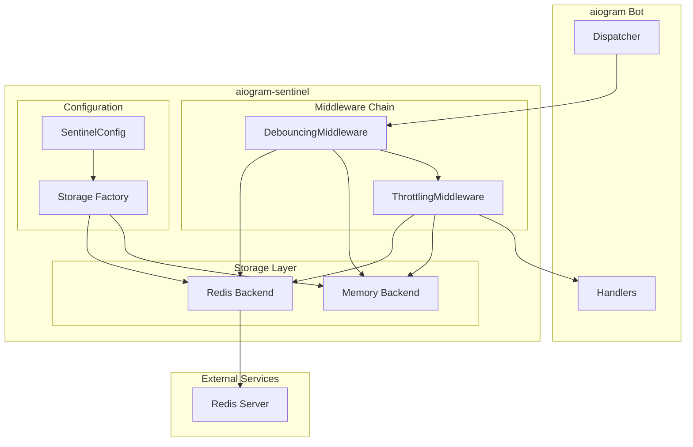
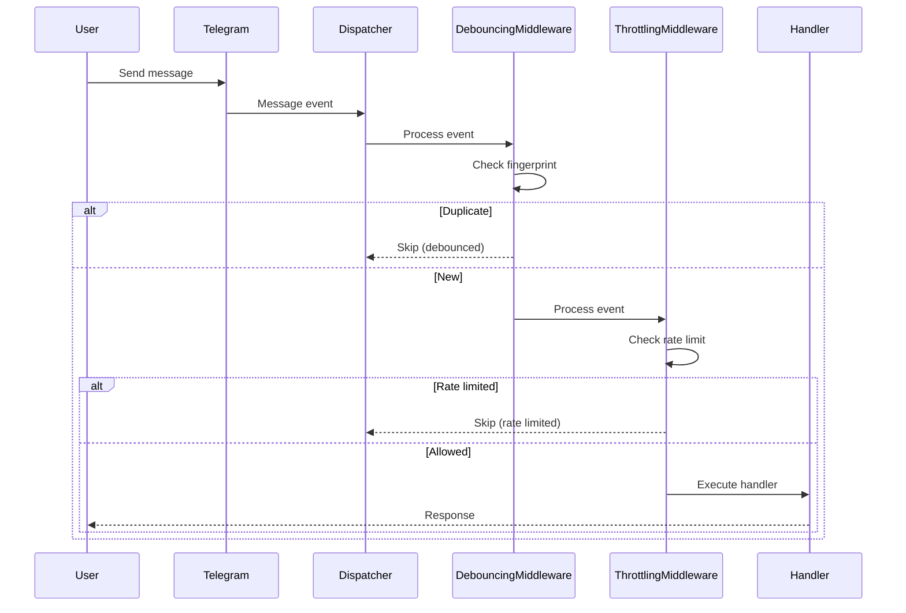

# Architecture

This document explains the system design and architecture of aiogram-sentinel.

## Goals & Non-Goals

### Goals

**Primary Goals:**
- **Drop-in Protection**: Easy integration with existing aiogram v3 bots
- **Production Ready**: Scalable, reliable, and performant for real-world usage
- **Developer Experience**: Clear APIs, good defaults, comprehensive documentation
- **Flexibility**: Configurable protection levels and extensible architecture
- **Type Safety**: Full type annotations and runtime validation

**Secondary Goals:**
- **Zero Dependencies**: Core functionality works without external services
- **Battery Included**: Sensible defaults that work out of the box
- **Observability**: Hooks and metrics for monitoring and debugging
- **Security**: Protection against common attack vectors and data leaks

### Non-Goals

**Explicitly Out of Scope:**
- **AI/ML Spam Detection**: No machine learning or content analysis
- **Database Integration**: No direct database connections (use Redis or custom backends)
- **Bot Framework**: Not a replacement for aiogram, just protection middleware
- **GUI/Admin Interface**: No web interfaces or management dashboards
- **Multi-Platform**: Telegram-only, no support for other messaging platforms
- **Real-time Analytics**: No built-in analytics or reporting features
- **User Authentication**: No built-in user management (use aiogram-auth for that)
- **Blocking Management**: No built-in blocking features (use aiogram-auth for that)

## High-Level Architecture



## Overview

aiogram-sentinel is designed as a focused rate limiting and debouncing library for aiogram v3 bots. It provides protection against spam and abuse through middleware, storage backends, and event hooks.

## Core Components

### 1. Storage Backends

Storage backends provide the data persistence layer for all aiogram-sentinel operations.

#### Backend Protocols

All backends implement standardized protocols defined in `storage/base.py`:

- **RateLimiterBackend**: Rate limiting with sliding windows
- **DebounceBackend**: Message deduplication and timing

#### Memory Backend

The memory backend (`storage/memory.py`) provides:

- **Fast access**: In-memory data structures for development
- **Thread safety**: `asyncio.Lock` for concurrent access
- **Sliding windows**: `collections.deque` for rate limiting
- **No persistence**: Data lost on restart

#### Redis Backend

The Redis backend (`storage/redis.py`) provides:

- **Persistence**: Data survives restarts
- **Scalability**: Multiple bot instances can share data
- **Namespacing**: Key prefixes prevent conflicts
- **Atomic operations**: Redis commands ensure consistency

### 2. Middlewares

Middlewares are the core protection mechanisms that process events before they reach handlers.

#### Middleware Order

The middleware chain follows a strict order for optimal performance:

```
ErrorHandling (optional) → PolicyResolver → Debouncing → Throttling → Handlers
```

**Note**: `ErrorHandlingMiddleware` is installed as the outermost middleware (when configured) to catch exceptions from all other middlewares and handlers.

#### DebounceMiddleware

- **Purpose**: Prevent duplicate message processing
- **Method**: SHA256 fingerprinting of message content
- **Data**: Sets `data["sentinel_debounced"] = True` when duplicate
- **Scope**: Message and callback events
- **Configurable**: Per-handler debounce windows via `@debounce` decorator

#### ThrottlingMiddleware

- **Purpose**: Rate limiting with configurable windows
- **Features**: Per-handler limits, retry notifications
- **Data**: Sets `data["sentinel_rate_limited"] = True` when limited
- **Hooks**: Optional `on_rate_limited` callback
- **Configurable**: Per-handler limits via `@rate_limit` decorator

#### ErrorHandlingMiddleware (Optional)

- **Purpose**: Centralized error handling for all exceptions
- **Features**: Exception classification, i18n hooks, RetryAfter sync, event emission
- **Data**: Publishes `ErrorEvent` to internal event bus
- **Hooks**: Optional `on_error` callback, domain classifier, locale/message resolvers
- **Configurable**: Via `ErrorConfig` with comprehensive options

### 3. Setup Helper

The setup helper (`sentinel.py`) provides a simplified one-call configuration:

```python
# Basic setup
router, infra = await Sentinel.setup(dp, config)

# Advanced setup with hooks
Sentinel.add_hooks(router, infra, config, on_rate_limited=callback)
```

**Features**:
- Automatic middleware registration
- Backend instantiation
- Router inclusion
- Hook configuration for advanced users

## Data Flow

### Event Processing

```
1. Event arrives → Dispatcher
2. DebounceMiddleware → Check duplicates
3. ThrottlingMiddleware → Check rate limits
4. Handler execution
```

### Rate Limiting Flow



## Configuration

### SentinelConfig

The main configuration class provides:

- **Backend selection**: `memory` or `redis`
- **Default limits**: Global rate limiting defaults
- **Redis settings**: URL, prefix, and connection options
- **Debounce settings**: Default debounce windows

### Decorators

Handler-level configuration via decorators:

```python
@router.message()
@rate_limit(5, 60)  # 5 messages per minute
@debounce(1.0)      # 1 second debounce
async def handler(message: Message):
    pass
```

## Key Generation

### Rate Limiting Keys

Rate limiting keys follow the pattern:
```
{prefix}:rate:{user_id}:{handler_name}:{scope?}
```

### Debounce Keys

Debounce keys follow the pattern:
```
{prefix}:debounce:{user_id}:{handler_name}:{fingerprint}:{scope?}
```

### Fingerprinting

Message fingerprinting uses SHA256 of:
- Message text (for text messages)
- Callback data (for callback queries)
- File ID (for media messages)

## Performance Considerations

### Memory Backend

- **O(1) operations**: Hash table lookups
- **Memory usage**: Grows with active users
- **Cleanup**: Automatic removal of expired entries
- **Thread safety**: Async locks for concurrent access

### Redis Backend

- **Network latency**: Consider Redis connection pooling
- **Key expiration**: Automatic TTL management
- **Pipelining**: Batch operations for better performance
- **Memory usage**: Redis handles memory management

## Error Handling

### Backend Failures

- **Graceful degradation**: Fall back to allowing requests
- **Logging**: Comprehensive error logging
- **Monitoring**: Hook callbacks for observability

### Configuration Errors

- **Validation**: Runtime configuration validation
- **Defaults**: Sensible fallback values
- **Documentation**: Clear error messages

## Extensibility

### Custom Backends

Implement the protocol interfaces:

```python
class CustomRateLimiter(RateLimiterBackend):
    async def allow(self, key: str, limit: int, window: int) -> bool:
        # Custom implementation
        pass
```

### Custom Hooks

Register custom callbacks:

```python
async def on_rate_limited(event, data, retry_after):
    await event.answer(f"Rate limited. Try again in {retry_after}s.")

Sentinel.add_hooks(router, infra, config, on_rate_limited=on_rate_limited)
```

## Security Considerations

### Key Isolation

- **User separation**: Keys include user ID
- **Handler separation**: Keys include handler name
- **Scope separation**: Optional scope for additional isolation

### Data Privacy

- **No content storage**: Only fingerprints and timestamps
- **Automatic cleanup**: Expired data removal
- **Configurable retention**: TTL settings

## Monitoring and Observability

### Hooks

- **on_rate_limited**: Called when rate limit is exceeded
- **Custom metrics**: Easy integration with monitoring systems

### Logging

- **Structured logging**: JSON format for parsing
- **Configurable levels**: Debug, info, warning, error
- **Performance metrics**: Timing and count information

## Best Practices

### Configuration

1. **Start with defaults**: Use sensible defaults for development
2. **Tune for production**: Adjust limits based on usage patterns
3. **Monitor performance**: Use hooks to track rate limiting effectiveness
4. **Test thoroughly**: Verify behavior under load

### Deployment

1. **Use Redis for production**: Memory backend is for development only
2. **Configure connection pooling**: Optimize Redis connections
3. **Monitor memory usage**: Track Redis memory consumption
4. **Set up alerts**: Monitor rate limiting and error rates

### Development

1. **Use decorators**: Prefer handler-level configuration
2. **Test edge cases**: Verify behavior with rapid requests
3. **Profile performance**: Measure middleware overhead
4. **Document custom hooks**: Explain custom callback behavior