# ClickUp Fuzzy Search Algorithm Documentation

## Overview

The ClickUp fuzzy search system provides intelligent approximate string matching for tasks, lists, and folders when exact matches are not possible or when users need to avoid navigating through the complete ClickUp hierarchy tree.

**Key Features:**
- Three-tier scoring algorithm for optimal performance
- Unified word coverage analysis with intelligent weighting
- Smart substring matching with coverage-based boosting
- RapidFuzz fuzzy matching for typo tolerance
- Generic name filtering and descriptive name prioritization

## How the Algorithm Works

### Three-Tier Scoring System

The algorithm evaluates each query against target text using three approaches and returns the highest score:

#### **Tier 1: Unified Word Coverage Scoring**

Analyzes word-level matches with intelligent weighting:

```python
# Split into words and find overlaps
query_words = set(query.split())
text_words = set(text.split())
common_words = query_words & text_words

if common_words:
    query_coverage = len(common_words) / len(query_words)  # How much of query matched
    text_coverage = len(common_words) / len(text_words)    # How much of text matched

    score = 0.45 + 0.22 * query_coverage + 0.08 * text_coverage + 0.02
```

**Examples:**
- `"project"` vs `"new project setup"` → **Score: 0.693** (100% query coverage, 33% text coverage)
- `"starfleet"` vs `"STARFLEET COMMAND"` → **Score: 0.65** (100% query coverage, 50% text coverage)
- `"task management"` vs `"important task notes"` → **Score: 0.583** (50% query coverage, 33% text coverage)

#### **Tier 2: Smart Substring Matching**

Direct substring detection with intelligent boosting:

```python
if query in text:
    coverage_ratio = len(query) / len(text)

    # Smart boosting for substantial matches
    if len(query) >= 4 and coverage_ratio >= 0.3:
        score = 0.4  # Minimum viable score
    else:
        score = 0.9 * coverage_ratio  # Proportional score
```

**Examples:**
- `"urgent"` vs `"urgent task item"` → **Score: 0.4** (meets boosting criteria)
- `"ai"` vs `"planning meeting"` → **Score: 0.11** (too short, no boost)

#### **Tier 3: RapidFuzz Fuzzy Matching**

Handles typos and fuzzy similarities using optimized metrics:

```python
# Use only the most effective metrics for performance
partial_ratio = fuzz.partial_ratio(query, text) / 100.0
token_set_ratio = fuzz.token_set_ratio(query, text) / 100.0
best_fuzzy = max(partial_ratio, token_set_ratio)

if best_fuzzy >= 0.7:
    score = 0.5 + (best_fuzzy - 0.7) * 0.5  # High fuzzy score
else:
    score = best_fuzzy * 0.5  # Low fuzzy score
```

**Examples:**
- `"meetnig"` vs `"meeting notes"` → **Score: ~0.52** (typo correction)
- `"starfleet command"` vs `"command starfleet"` → **Score: ~0.60** (word reordering)

### Score Adjustments

#### Generic Name Penalty
Reduces scores for unhelpful single-word names:
```python
generic_names = ["list", "project", "task", "item", "folder"]
if is_generic_name and score < 0.5:
    score = score * 0.5  # Cut score in half
```

#### Descriptive Name Bonus
Boosts longer, more descriptive names:
```python
if word_count >= 3:
    score = min(1.0, score * 1.1)  # 10% bonus, capped at 1.0
```

### Filtering and Ranking

1. **Threshold Filtering:** Remove matches below 0.35 (empirically optimized)
2. **Minimum Results:** Always keep at least 20 results if available
3. **Ranking:** Sort by score (DESC), then by `date_updated` (DESC)

## Configuration

All behavior is controlled through constants in `constants.py`:

### Core Settings
```python
FUZZY_SEARCH_MIN_QUERY_LENGTH = 6      # Minimum query length
FUZZY_SEARCH_MIN_SCORE = 0.35          # Optimized threshold
FUZZY_SEARCH_DEFAULT_SCAN_SIZE = 500   # Items to scan per search
FUZZY_SEARCH_MAX_PAGES = 5             # Maximum API pages
FUZZY_SEARCH_MIN_RESULTS = 20          # Minimum results to return
```

### Scoring Weights
```python
# Word coverage: score = base + A * query_coverage + B * text_coverage + bonus
FUZZY_LITE_WORD_BASE = 0.45            # Base score for any word matches
FUZZY_LITE_WORD_A = 0.22               # Weight for query coverage
FUZZY_LITE_WORD_B = 0.08               # Weight for text coverage
FUZZY_LITE_WORD_ANY_MATCH_BONUS = 0.02 # Small bonus for any matches

# Substring matching
FUZZY_SEARCH_SUBSTRING_MULTIPLIER = 0.9     # Basic substring score
FUZZY_SEARCH_SUBSTRING_MIN_LENGTH = 4       # Minimum length for boosting
FUZZY_SEARCH_SUBSTRING_MIN_COVERAGE = 0.3   # Minimum coverage for boosting
FUZZY_SEARCH_SUBSTRING_BOOST_SCORE = 0.4    # Boosted score value

# Fuzzy matching thresholds
FUZZY_SEARCH_FUZZY_HIGH_THRESHOLD = 0.7     # High fuzzy score threshold
FUZZY_SEARCH_FUZZY_HIGH_BASE = 0.5          # Base for high scores
FUZZY_SEARCH_FUZZY_HIGH_MULTIPLIER = 0.5    # Multiplier for high scores
FUZZY_SEARCH_FUZZY_LOW_MULTIPLIER = 0.5     # Multiplier for low scores
```

## Performance Characteristics

### Benchmark Results

The algorithm delivers excellent performance across different dataset sizes:

| Dataset Size | Average Time | Throughput |
|--------------|--------------|------------|
| 10,000 items | ~26ms | 0.37 M items/s |
| 25,000 items | ~68ms | 0.37 M items/s |
| 50,000 items | ~140ms | 0.36 M items/s |

### Key Performance Features

1. **Optimized RapidFuzz usage** - Uses only the most effective metrics (partial_ratio, token_set_ratio)
2. **Efficient word-level analysis** - Single unified coverage calculation
3. **Smart substring detection** - Direct matching with intelligent boosting
4. **Linear scaling** - Performance scales predictably with dataset size

## Algorithm Flow Diagram

```mermaid
flowchart TD
    A["🔍 Query Input"] --> B["📝 Normalize Text<br/>(lowercase, trim)"]
    B --> C{"🎯 Exact Match?"}
    C -->|"✅ Yes"| D["⭐ Score: 1.0"]
    C -->|"❌ No"| E["📊 Tier 1: Word Coverage"]

    E --> F["📚 Split into words<br/>Find overlaps"]
    F --> G{"🔤 Any words match?"}
    G -->|"✅ Yes"| H["🟢 Calculate Coverage Score<br/>0.45 + 0.22×query_cov + 0.08×text_cov + 0.02"]
    G -->|"❌ No"| I["🔍 Tier 2: Substring Check"]

    I --> J{"📏 Query in text?"}
    J -->|"✅ Yes"| K{"⚡ Boost criteria?<br/>(len≥4 AND coverage≥30%)"}
    K -->|"✅ Yes"| L["🔵 Boosted: 0.4"]
    K -->|"❌ No"| M["⚪ Basic: 0.9 × ratio"]
    J -->|"❌ No"| N["🤖 Tier 3: Fuzzy Analysis"]

    N --> O["📡 RapidFuzz Analysis<br/>(partial_ratio, token_set_ratio)"]
    O --> P{"⚡ High fuzzy ≥ 70%?"}
    P -->|"✅ Yes"| Q["🟦 High Score<br/>0.5 + (score-0.7)×0.5"]
    P -->|"❌ No"| R["🔘 Low Score<br/>score × 0.5"]

    H --> S["⚙️ Score Adjustments"]
    L --> S
    M --> S
    Q --> S
    R --> S
    D --> T["✨ Final Score"]

    S --> U{"⚠️ Generic penalty?"}
    U -->|"✅ Yes"| V["📉 score × 0.5"]
    U -->|"❌ No"| W{"📈 Descriptive bonus?"}
    V --> W
    W -->|"✅ Yes"| X["📈 min(1.0, score × 1.1)"]
    W -->|"❌ No"| T
    X --> T

    T --> Y{"🚪 Score ≥ 0.35?"}
    Y -->|"✅ Yes"| Z["✅ Keep Match"]
    Y -->|"❌ No"| AA["🗑️ Filter Out"]

    style A fill:#e1f5fe
    style D fill:#c8e6c9
    style H fill:#c8e6c9
    style L fill:#e3f2fd
    style Q fill:#e8f5e8
    style T fill:#f3e5f5
    style Z fill:#e8f5e8
```



## Usage Guidelines

### When to Use Fuzzy Search

Use fuzzy search **only** when:
1. **Direct searches fail** - Normal context searches don't find the item
2. **Hierarchy navigation is inefficient** - You know the name but not the location
3. **Approximate matching needed** - You remember part of the name but not exact spelling

### Typical Workflow
```
User: "Find lists containing 'star fleet'"
↓
1. fuzzy_search_lists(query="star fleet")
   → Returns: [{"id": "123", "name": "STARFLEET COMMAND", "match_score": 0.65}]
↓
2. Use ID with other tools for full details
   → get_list_details(list_id="123")
```

### Threshold Optimization

The minimum score threshold was empirically optimized:

| Threshold | Pass Rate | Assessment | Use Case |
|-----------|-----------|------------|----------|
| 0.6 | 0% | Too strict | Blocks all partial matches |
| 0.5 | 0% | Too strict | Blocks good single-word matches |
| 0.4 | 20% | Restrictive | Misses important matches |
| **0.35** | ✅ **Optimal** | **Perfect balance** | **Recommended** |
| 0.3 | 40% | Too permissive | Allows noise through |

## Performance Benchmark

You can run this benchmark from the `toolkits/clickup` directory to test performance:

```bash
uv run python - <<'PY'
import os, sys, time, random, importlib.util
random.seed(42)

ROOT = os.path.abspath('.')
MOD_PATH = os.path.join(ROOT, "arcade_clickup", "utils", "fuzzy_search_utils.py")
spec = importlib.util.spec_from_file_location("fsu", MOD_PATH)
fsu = importlib.util.module_from_spec(spec)
spec.loader.exec_module(fsu)

vocab = ['starfleet','command','project','urgent','meeting','report','notes','alpha','bravo','charlie','delta','echo','foxtrot','golf','hotel','india','juliet','kilo','lima','mike','november','oscar','papa','quebec','romeo','sierra','tango','uniform','victor','whiskey','xray','yankee','zulu']

def make_item(name, ts):
    return {"name": name, "date_updated": str(ts)}

def dataset(n, inject=0.05):
    items = []
    base = int(time.time() * 1000)
    inject_pool = ['STARFLEET COMMAND', 'starfleet ops', 'command center', 'fleet command', 'project starfleet', 'urgent starfleet command']
    for _ in range(n):
        name = random.choice(inject_pool) if random.random() < inject else ' '.join(random.choices(vocab, k=random.randint(2, 5)))
        ts = base - random.randint(0, 10_000_000)
        items.append(make_item(name, ts))
    return items

def bench(n, query, runs=3):
    items = dataset(n)
    fsu.filter_and_rank_matches(items, query, name_field='name')  # warmup
    t0 = time.perf_counter()
    kept = 0
    for _ in range(runs):
        res = fsu.filter_and_rank_matches(items, query, name_field='name')
        kept = len(res)
    t1 = time.perf_counter()
    dt = (t1 - t0) / runs
    thr = n / dt / 1e6
    print(f"Dataset={n:>7,} | Query='{query:<18}' | Matches={kept:>4} | Avg={dt*1000:6.1f} ms | Throughput={thr:5.2f} M items/s")

print("\\nFuzzy Search Performance\\n" + "-"*70)
for n in (10_000, 25_000, 50_000):
    for q in ('star', 'starfleet command', 'project report', 'random xyz'):
        bench(n, q, runs=3)
print("-"*70)
PY
```

**Example output:**
```
Fuzzy Search Performance
----------------------------------------------------------------------
Dataset= 10,000 | Query='star              ' | Matches=2708 | Avg= 26.0 ms | Throughput= 0.38 M items/s
Dataset= 10,000 | Query='starfleet command ' | Matches=2331 | Avg= 28.0 ms | Throughput= 0.36 M items/s
Dataset= 25,000 | Query='star              ' | Matches=6374 | Avg= 68.0 ms | Throughput= 0.37 M items/s
Dataset= 50,000 | Query='starfleet command ' | Matches=11655| Avg=140.0 ms | Throughput= 0.36 M items/s
----------------------------------------------------------------------
```

The algorithm delivers **consistent performance** with excellent throughput across different query types and dataset sizes.

---

*This documentation reflects the current implementation optimized for both performance and accuracy.*
