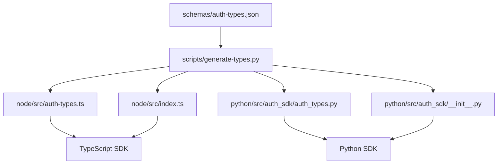

# Arvasit Auth SDK

[](https://badge.fury.io/js/@pratik_25%2Fauth-sdk)
[](https://badge.fury.io/py/arvasit-auth-sdk)
[](https://opensource.org/licenses/MIT)

Authentication SDK for Node.js and Python with comprehensive auth features.

## 🚀 Quick Setup

### Node.js
```bash
npm install @pratik_25/auth-sdk
```

```typescript
import { AuthService, AuthServiceConfig } from '@pratik_25/auth-sdk';

const config: AuthServiceConfig = {
  url: 'https://your-auth-service.com',
  publicKey: 'your_public_key',
  secretKey: 'your_secret_key'
};

const authService = new AuthService(config);
```

### Python
```bash
pip install arvasit-auth-sdk
```

```python
from auth_sdk import AuthService, AuthServiceConfig

config = AuthServiceConfig(
    url="https://your-auth-service.com",
    public_key="your_public_key",
    secret_key="your_secret_key"
)

auth_service = AuthService(config)
```

## ✨ Features

- **User Authentication**: Signup, login, logout
- **Two-Factor Authentication**: Complete 2FA setup and management
- **Password Management**: Reset, change, forgot password
- **Email & Phone Verification**: Account verification
- **Session Management**: Token management and refresh
- **Login Activity**: Track and monitor user activities
- **Type Safety**: Full TypeScript and Python type definitions
- **Schema-Driven**: Single JSON schema generates both SDKs

## 📋 Available Methods

### Authentication
- `signup()` - Register new user
- `loginWithPassword()` / `login_with_password()` - User login
- `logout()` - User logout
- `refreshAccessToken()` / `refresh_access_token()` - Refresh token

### Password Management
- `forgotPasswordSendOTP()` / `forgot_password_send_otp()` - Send reset OTP
- `updatePassword()` / `update_password()` - Change password
- `enterCredentialForForgotPassword()` / `enter_credential_for_forgot_password()` - Start reset flow

### Two-Factor Authentication
- `generateQRCodeAndSecretFor2FA()` / `generate_qr_code_and_secret_for_2fa()` - Enable 2FA
- `verifyQRCodeAndSecretFor2FA()` / `verify_qr_code_and_secret_for_2fa()` - Verify 2FA
- `generateRecoveryCodes()` / `generate_recovery_codes()` - Generate backup codes

### User Management
- `checkCredential()` / `check_credential()` - Check user exists
- `suggestUsername()` / `suggest_username()` - Suggest usernames
- `checkAvailableUserName()` / `check_available_username()` - Check username availability

### Login Activity
- `loginActivityCounts()` / `login_activity_counts()` - Get activity counts
- `loginActivityDetails()` / `login_activity_details()` - Get activity details

## 🔧 Configuration

Both SDKs use the same configuration:

```typescript
// Node.js
const config: AuthServiceConfig = {
  url: 'https://your-auth-service.com',    // Your auth service URL
  publicKey: 'your_public_key',            // Public API key
  secretKey: 'your_secret_key'             // Secret API key
};
```

```python
# Python
config = AuthServiceConfig(
    url="https://your-auth-service.com",    # Your auth service URL
    public_key="your_public_key",           # Public API key
    secret_key="your_secret_key"            # Secret API key
)
```

## 📚 Examples

### Complete User Registration Flow

```typescript
// Node.js
const user = await authService.signup({
  firstName: 'John',
  lastName: 'Doe',
  email: 'john@example.com',
  password: 'secure_password123'
});

const loginResult = await authService.loginWithPassword({
  credential: 'john@example.com',
  password: 'secure_password123'
});

const twofaData = await authService.generateQRCodeAndSecretFor2FA(loginResult.accessToken);
```

```python
# Python
user = auth_service.signup(SignupRequest(
    firstName="John",
    lastName="Doe", 
    email="john@example.com",
    password="secure_password123"
))

login_result = auth_service.login_with_password(LoginRequest(
    credential="john@example.com",
    password="secure_password123"
))

twofa_data = auth_service.generate_qr_code_and_secret_for_2fa(login_result.accessToken)
```

### Forgot Password Flow

```typescript
// Node.js
await authService.enterCredentialForForgotPassword('john@example.com');
const resetToken = await authService.verifyForgotPasswordOtp({
  credential: 'john@example.com',
  otp: '123456'
});
```

```python
# Python
auth_service.enter_credential_for_forgot_password('john@example.com')
reset_token = auth_service.verify_forgot_password_otp('john@example.com', '123456')
```

## 🛠️ Development & SDK Generation

This project uses a **schema-driven approach** where both SDKs are generated from a single JSON schema.

### Prerequisites
- **Python 3.8+** (for generation script)
- **Node.js 18+** (for TypeScript compilation)
- **npm** (for package management)

### Generate SDKs from Schema

1. **Update Schema**: Edit `schemas/auth-types.json`
2. **Generate Types**: Run `python3 scripts/generate-types.py`
3. **Build TypeScript**: Run `cd node && npm run build` (optional)
4. **Test Changes**: Verify both SDKs work

### Adding New API Types

1. **Add to Schema**:
```json
"YourNewRequest": {
  "type": "object",
  "properties": {
    "param1": {"type": "string"},
    "param2": {"type": "integer"}
  },
  "required": ["param1"]
}
```

2. **Regenerate**: `python3 scripts/generate-types.py`

3. **Use in Code**:
```typescript
// TypeScript
import { YourNewRequest } from '@pratik_25/auth-sdk';
```

```python
# Python
from auth_sdk import YourNewRequest
```

## 📦 Package Details

### Node.js SDK
- **Package**: `@pratik_25/auth-sdk`
- **Registry**: npmjs.org
- **Dependencies**: axios, luxon
- **TypeScript**: Full type definitions

### Python SDK  
- **Package**: `arvasit-auth-sdk`
- **Registry**: PyPI
- **Dependencies**: requests, pydantic, python-dateutil
- **Type Safety**: Pydantic models

## 🔄 Schema-Driven Benefits

- ✅ **Single Source of Truth**: One JSON schema drives both SDKs
- ✅ **Zero Duplication**: No maintaining types in two places  
- ✅ **Automatic Consistency**: Types always synchronized
- ✅ **Easy Maintenance**: Update schema → Both SDKs updated
- ✅ **Type Safety**: Full TypeScript and Python definitions

## 📄 License

MIT License - see [LICENSE](LICENSE) file for details.

## 🆘 Support

- **Documentation**: This README and examples
- **Issues**: [GitHub Issues](https://github.com/arvasit/auth-sdk/issues)
- **Discussions**: [GitHub Discussions](https://github.com/arvasit/auth-sdk/discussions)

---

**Made with ❤️ by the Arvasit team**

## 📁 Project Structure

```
arva-auth-sdk/
├── schemas/                    # Single source of truth
│   ├── auth-types.json        # JSON schema definitions
│   └── README.md              # Schema documentation
├── scripts/                   # Generation scripts
│   └── generate-types.py      # Auto-generates both SDKs
├── node/                      # Node.js SDK
│   ├── src/                   # Source code
│   │   ├── auth-service.ts    # Main service class
│   │   ├── auth-types.ts      # Generated TypeScript interfaces
│   │   └── index.ts           # Generated exports
│   ├── dist/                  # Compiled JavaScript (generated)
│   ├── package.json           # Node.js package configuration
│   └── tsconfig.json          # TypeScript configuration
├── python/                    # Python SDK
│   ├── src/auth_sdk/          # Python package
│   │   ├── __init__.py        # Generated imports
│   │   ├── auth_service.py    # Main service class
│   │   └── auth_types.py      # Generated Pydantic models
│   ├── examples/              # Usage examples
│   │   └── basic_usage.py     # Comprehensive examples
│   └── pyproject.toml         # Python package configuration
├── README.md
└── LICENSE
```

## 🛠️ Development & SDK Generation

### Prerequisites

Before generating the SDK, ensure you have:

- **Python 3.8+** (for the generation script)
- **Node.js 18+** (for TypeScript compilation)
- **npm** (for package management)

### Generating the SDK from Schema

This project uses a **schema-driven approach** where both Node.js and Python SDKs are generated from a single JSON schema file.

#### Step 1: Update the Schema

Edit the schema file to define your API types:

```bash
# Edit the schema file
vim schemas/auth-types.json
```

The schema follows JSON Schema Draft 7 format:

```json
{
  "$schema": "http://json-schema.org/draft-07/schema#",
  "title": "Arvasit Authentication Types",
  "definitions": {
    "YourNewType": {
      "type": "object",
      "properties": {
        "field1": {
          "type": "string",
          "description": "Description of field1"
        },
        "field2": {
          "type": "integer",
          "description": "Description of field2"
        }
      },
      "required": ["field1"]
    }
  }
}
```

#### Step 2: Generate Both SDKs

Run the generation script to create both TypeScript and Python types:

```bash
# Generate types for both SDKs
python3 scripts/generate-types.py
```

This script will:
- ✅ **Validate** the JSON schema
- ✅ **Generate TypeScript interfaces** (`node/src/auth-types.ts`)
- ✅ **Update TypeScript exports** (`node/src/index.ts`)
- ✅ **Generate Python Pydantic models** (`python/src/auth_sdk/auth_types.py`)
- ✅ **Update Python imports** (`python/src/auth_sdk/__init__.py`)
- ✅ **Test Python imports** to ensure everything works

#### Step 3: Build TypeScript SDK (Optional)

If you need the compiled JavaScript:

```bash
# Build TypeScript to JavaScript
cd node
npm run build
```

This creates the `dist/` folder with compiled JavaScript and TypeScript declarations.

#### Step 4: Test Your Changes

Verify everything works:

```bash
# Test Python SDK
cd python
python3 -c "from src.auth_sdk import AuthService, YourNewType; print('✅ Python imports work')"

# Test TypeScript compilation
cd node
npm run build
```

### Schema Features Supported

The generation script supports:

- ✅ **Basic Types**: `string`, `integer`, `boolean`, `array`, `object`
- ✅ **Optional Properties**: Properties not in `required` array
- ✅ **Enums**: String enums with specific values
- ✅ **Arrays**: Arrays with typed items
- ✅ **References**: `$ref` to other definitions
- ✅ **Nested Objects**: Complex object structures
- ✅ **Additional Properties**: `additionalProperties: true`

### Adding New API Types

To add a new API type:

1. **Add to Schema**:
   ```json
   "YourNewRequest": {
     "type": "object",
     "properties": {
       "param1": {"type": "string"},
       "param2": {"type": "integer"}
     },
     "required": ["param1"]
   }
   ```

2. **Regenerate SDKs**:
   ```bash
   python3 scripts/generate-types.py
   ```

3. **Use in Code**:
   ```typescript
   // TypeScript
   import { YourNewRequest } from '@arvasit/auth-sdk';
   const request: YourNewRequest = { param1: "value", param2: 123 };
   ```

   ```python
   # Python
   from auth_sdk import YourNewRequest
   request = YourNewRequest(param1="value", param2=123)
   ```

### Troubleshooting Generation

**Common Issues:**

1. **Invalid JSON Schema**:
   ```bash
   ❌ Schema validation failed - found 0 definitions
   ```
   **Solution**: Check your JSON syntax and ensure `definitions` section exists

2. **Python Import Errors**:
   ```bash
   ❌ Python imports test failed
   ```
   **Solution**: Check for syntax errors in generated Python files

3. **TypeScript Compilation Errors**:
   ```bash
   ❌ TypeScript build failed
   ```
   **Solution**: Check for duplicate exports or syntax errors

**Debug Tips:**

- Use a JSON schema validator to check your schema
- Test Python imports manually: `python3 -c "from src.auth_sdk import YourType"`
- Check TypeScript compilation: `cd node && npx tsc --noEmit`

## ⚡ Quick Start

### Node.js (TypeScript/JavaScript)

```bash
npm install @pratik_25/auth-sdk
```

```typescript
import { AuthService, AuthServiceConfig, SignupRequest } from '@pratik_25/auth-sdk';

const config: AuthServiceConfig = {
  url: 'https://your-auth-service.com',
  publicKey: 'your_public_key',
  secretKey: 'your_secret_key'
};

const authService = new AuthService(config);

// Sign up a new user
const user = await authService.signup({
  firstName: 'John',
  lastName: 'Doe',
  email: 'john@example.com',
  password: 'secure_password123'
});

console.log(`User created with ID: ${user.authId}`);
```

### Python

```bash
pip install arvasit-auth-sdk
```

```python
from auth_sdk import AuthService, AuthServiceConfig, SignupRequest

config = AuthServiceConfig(
    url="https://your-auth-service.com",
    public_key="your_public_key",
    secret_key="your_secret_key"
)

auth_service = AuthService(config)

# Sign up a new user
signup_data = SignupRequest(
    firstName="John",
    lastName="Doe",
    email="john@example.com",
    password="secure_password123"
)

user = auth_service.signup(signup_data)
print(f"User created with ID: {user.authId}")
```

## 📦 Node.js SDK

### Installation

```bash
npm install @pratik_25/auth-sdk
```

### Available APIs

- **Authentication**: `signup()`, `loginWithPassword()`, `loginWithOtp()`, `logout()`
- **Magic Link Authentication**: `verifyMagicLink()`
- **User Management**: `suggestUsername()`, `checkAvailableUserName()`, `checkCredential()`
- **Password Management**: `enterCredentialForForgotPassword()`, `forgotPasswordSendOTP()`, `updatePassword()`
- **Two-Factor Authentication**: `generateQRCodeAndSecretFor2FA()`, `verifyQRCodeAndSecretFor2FA()`
- **Recovery Codes**: `generateRecoveryCodes()`, `listOfRecoveryCode()`
- **Token Management**: `refreshAccessToken()`
- **Login Activity**: `loginActivityCounts()`, `loginActivityDetails()`

## 🐍 Python SDK

### Installation

```bash
pip install arvasit-auth-sdk
```

### Available APIs

- **Authentication**: `signup()`, `login_with_password()`, `login_with_otp()`, `logout()`
- **Magic Link Authentication**: `verify_magic_link()`
- **User Management**: `suggest_username()`, `check_available_username()`, `check_credential()`
- **Password Management**: `enter_credential_for_forgot_password()`, `forgot_password_send_otp()`, `update_password()`
- **Two-Factor Authentication**: `generate_qr_code_and_secret_for_2fa()`, `verify_qr_code_and_secret_for_2fa()`
- **Recovery Codes**: `generate_recovery_codes()`, `list_of_recovery_code()`
- **Token Management**: `refresh_access_token()`
- **Login Activity**: `login_activity_counts()`, `login_activity_details()`

## Common Use Cases

### Complete User Registration and 2FA Setup

```typescript
// Node.js
const user = await authService.signup(signupData);
const loginResult = await authService.loginWithPassword(loginData);
const twofaData = await authService.generateQRCodeAndSecretFor2FA(loginResult.accessToken);

// Python
user = auth_service.signup(signup_data)
login_result = auth_service.login_with_password(login_data)
twofa_data = auth_service.generate_qr_code_and_secret_for_2fa(login_result.accessToken)
```

### Magic Link Authentication

```typescript
// Node.js
const magicLinkResult = await authService.verifyMagicLink({
  token: 'magic-link-token-from-email',
  credential: 'john@example.com'
});

// Python
magic_link_result = auth_service.verify_magic_link(
    VerifyMagicLinkRequest(
        token="magic-link-token-from-email",
        credential="john@example.com"
    )
)
```

### Forgot Password Flow

```typescript
// Node.js
const contactInfo = await authService.enterCredentialForForgotPassword('john@example.com');
const resetToken = await authService.verifyForgotPasswordOtp({ credential: 'john@example.com', otp: '123456' });

// Python
contact_info = auth_service.enter_credential_for_forgot_password('john@example.com')
reset_token = auth_service.verify_forgot_password_otp('john@example.com', '123456')
```

### Login Activity Monitoring

```typescript
// Node.js
const activityCounts = await authService.loginActivityCounts({
  accessToken: accessToken,
  startDate: '2023-01-01',
  endDate: '2023-01-31'
});

// Python
activity_counts = auth_service.login_activity_counts(
    access_token=access_token,
    start_date='2023-01-01',
    end_date='2023-01-31'
)
```

## Configuration

Both SDKs require the same configuration parameters:

```typescript
// Node.js
const config: AuthServiceConfig = {
  url: 'https://your-auth-service.com',
  publicKey: 'your_public_key',
  secretKey: 'your_secret_key'
};
```

```python
# Python
config = AuthServiceConfig(
    url="https://your-auth-service.com",
    public_key="your_public_key",
    secret_key="your_secret_key"
)
```

## Dependencies

### Node.js SDK

- TypeScript 5.8+
- Node.js 18+
- axios>=1.8.4
- luxon>=3.6.1

### Python SDK

- Python 3.8+
- requests>=2.31.0
- pydantic>=2.0.0
- python-dateutil>=2.8.2

## Testing

Both SDKs include comprehensive test suites:

```bash
# Node.js
cd node
npm test

# Python
cd python
python -m pytest tests/ -v
```

## Examples

- **Node.js**: Check the `node/src/` directory for usage examples
- **Python**: Check the `python/examples/` directory for comprehensive examples

## API Coverage

Both SDKs provide **100% feature parity** with the following categories:

| Feature Category | Node.js SDK | Python SDK |
|------------------|-------------|------------|
| User Authentication | ✅ | ✅ |
| User Management | ✅ | ✅ |
| Password Management | ✅ | ✅ |
| Two-Factor Authentication | ✅ | ✅ |
| Recovery Codes | ✅ | ✅ |
| Token Management | ✅ | ✅ |
| Login Activity | ✅ | ✅ |
| Type Safety | ✅ | ✅ |
| Error Handling | ✅ | ✅ |

## 🔄 Schema-Driven Development

This project uses a **revolutionary schema-driven approach** that eliminates duplicate code and ensures perfect consistency between SDKs.

### 🎯 Key Benefits

- ✅ **Single Source of Truth**: One JSON schema drives both SDKs
- ✅ **Zero Duplication**: No more maintaining types in two places
- ✅ **Automatic Consistency**: Types are always perfectly synchronized
- ✅ **Type Safety**: Full TypeScript and Python type definitions
- ✅ **Easy Maintenance**: Update schema → Both SDKs updated automatically
- ✅ **Schema Validation**: JSON schema provides runtime validation
- ✅ **Better Documentation**: Schema includes property descriptions

### 🏗️ How It Works



### 📊 Current Schema Stats

- **41 Type Definitions** in the schema
- **40 Exported Types** (excluding duplicates)
- **100% Feature Parity** between Node.js and Python
- **Automatic $ref Resolution** for complex types

## 📚 Examples & Documentation

### Comprehensive Examples

- **Python**: Check `python/examples/basic_usage.py` for complete usage examples
- **Node.js**: All examples are in the Quick Start section above

### API Documentation

Both SDKs provide full IntelliSense/autocomplete support:

- **TypeScript**: Full type definitions with JSDoc comments
- **Python**: Pydantic models with field validation and documentation

### Common Patterns

```typescript
// Complete authentication flow
const user = await authService.signup(signupData);
const loginResult = await authService.loginWithPassword(loginData);
const twofaData = await authService.generateQRCodeAndSecretFor2FA(loginResult.accessToken);
```

```python
# Complete authentication flow
user = auth_service.signup(signup_data)
login_result = auth_service.login_with_password(login_data)
twofa_data = auth_service.generate_qr_code_and_secret_for_2fa(login_result.accessToken)
```

## 🔧 Development

### Contributing

1. **Fork the repository**
2. **Update the schema** (`schemas/auth-types.json`)
3. **Regenerate SDKs** (`python3 scripts/generate-types.py`)
4. **Test your changes** (both Node.js and Python)
5. **Submit a pull request**

### Local Development

```bash
# Clone the repository
git clone https://github.com/arvasit/auth-sdk.git
cd auth-sdk

# Generate SDKs
python3 scripts/generate-types.py

# Test Node.js SDK
cd node && npm install && npm run build

# Test Python SDK
cd ../python && python3 -c "from src.auth_sdk import AuthService; print('✅ Python SDK works')"
```

## 📄 License

MIT License - see [LICENSE](LICENSE) file for details.
## 🆘 Support

- **Documentation**: Check this README and examples
- **Issues**: [GitHub Issues](https://github.com/arvasit/auth-sdk/issues)
- **Discussions**: [GitHub Discussions](https://github.com/arvasit/auth-sdk/discussions)

## 🎯 Roadmap

- [ ] **Go SDK** - Generate Go client from the same schema
- [ ] **Java SDK** - Generate Java client from the same schema
- [ ] **OpenAPI Integration** - Generate OpenAPI spec from schema
- [ ] **GraphQL Support** - Add GraphQL schema generation
- [ ] **Enhanced Validation** - Runtime schema validation
- [ ] **Documentation Generation** - Auto-generate API docs

---

**Made with ❤️ by the Arvasit team**

