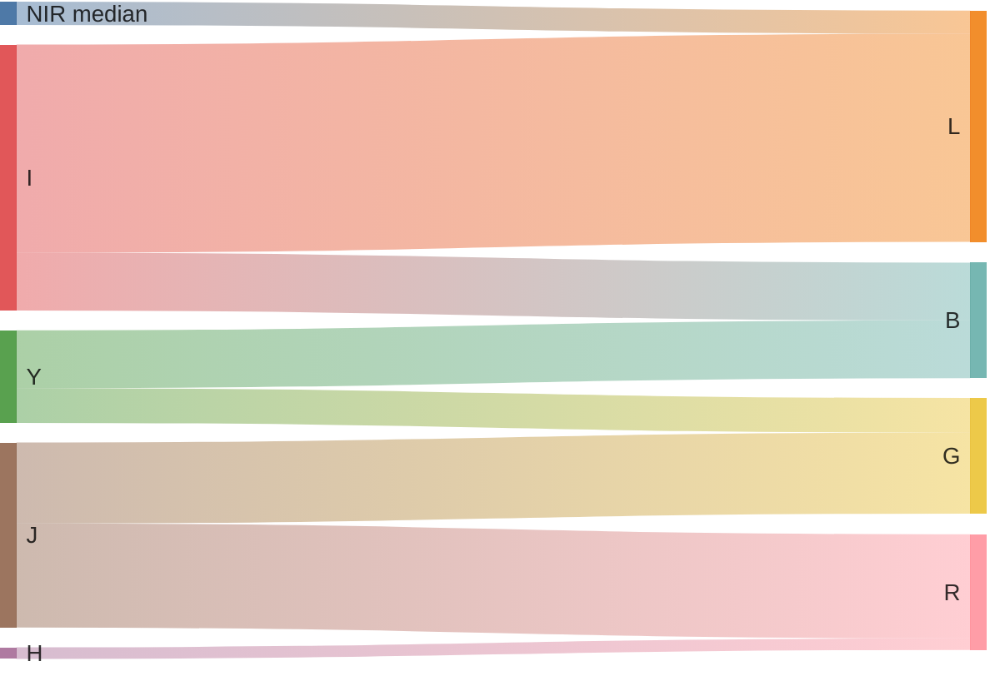

# Algorithm

## Basics

We want to output an RGB image from four input channels: one VIS (I) and three NIR bands (Y, J, H).
We decide to keep the wavelength ordering: I < Y < J < H.
Two adjacent input channels may contribute to an output channel, e.g. Y and J may contribute to G.
An input channel may contribute to two adjacent output channels, e.g. Y may contribute to B and G.
Resolution in I is better than in other channels, therefore it has higher weight in the output intensity (more precisely, lightness).
Different weight parameters control the different contributions.

The dynamic range is arcsinh-scaled, which yields pleasing results for both low- and high-energy regions.
The function is linear-like for low values and log-like for high values.
Scaling is controlled by two bounds -- black and white points -- and a stretching parameter which sets the transition point between linear-like scaling and log-like scaling.

Bad pixels (those with extremely high values or null value in the input bands) are inpainted, either as white points or using biharmonic inpainting.
Inpainting is adequate for DEEP tiles, but may be ugly in some of the WIDE tiles.
Relying on bitmasks to decide on the inpainting technique would be better, especially for VIS ghosts, yet I did not find a satisfying selection method, which would work both for WIDE and DEEP tiles...

## Blending

Using:

* Upper case for arrays, lower case for scalars;
* VIS, NIR-Y, NIR-J, NIR-H channels as $I, Y, J, H$.
* Channel-wise gains $g_x$ for $x$ in $I, Y, J, H$;
* Weights $w_{J, R}, w_{Y, G}, w_{I, B}, w_{\text{NIR}, L}$ between 0 and 1;
* Linear interpolation function $\text{lerp}_l(x, y) := w_l \times y + (1 - w_l) \times y$;
* Stretching parameter $a$;
* Black and white points $b$ and $w$;
* $(a, b)$-clipping function $\text{clip}_{a, b}(x)$;
* Color space components $\text{hue}(r, g, b), \text{saturation}(r, g, b)$;

Do:

* Balancing: Multiply channels $I, Y, J, H$ by gains $g_I, g_Y, g_J, g_H$, respectively.
* Blending: Set
  * $R = \text{lerp}_{J, R}(J, H)$,
  * $G = \text{lerp}_{Y, G}(Y, J)$,
  * $B = \text{lerp}_{I, B}(I, Y)$,
  * $L = \text{lerp}_{\text{NIR}, L}(\text{median}(Y, J, H), I)$.
* Stretching: Set
  * $x = \text{arcsinh}(x / a)$ for $x$ in $R, G, B, L, b, w$,
  * $x = \text{clip}_{0, 1}((x - b) / (w - b))$ for $x$ in $R, G, B, L$.
* Saturation: Set $S = g_S \times \text{saturation}(R, G, B)$.
* Remapping: Recompute $R, G, B$ from $\text{hue}(R, G, B), L, S$.

Default parameters give good resuts in the vast majority of cases.
For corner cases, check `azul process -h` and experiment!
