# cjm-fasthtml-tailwind


<!-- WARNING: THIS FILE WAS AUTOGENERATED! DO NOT EDIT! -->

## Install

``` bash
pip install cjm-fasthtml-tailwind
```

## Project Structure

    nbs/
    ├── builders/ (2)
    │   ├── colors.ipynb  # Color system builders for Tailwind CSS utilities
    │   └── scales.ipynb  # Numeric and named scale builders for Tailwind CSS utilities
    ├── cli/ (13)
    │   ├── cli_config.ipynb            # Configuration system for multi-library CLI support
    │   ├── core_utils_discovery.ipynb  # Functions to discover and display core utility functions like combine_classes:
    │   ├── display.ipynb               # Functions to format and display the discovered information:
    │   ├── dynamic_examples.ipynb      # Functions to generate dynamic examples for help text:
    │   ├── example_discovery.ipynb     # Functions to discover and extract test example functions:
    │   ├── explorer.ipynb              # CLI tool for API exploration of cjm-fasthtml-tailwind utilities
    │   ├── factory_extraction.ipynb    # Functions to extract BaseFactory instances from modules:
    │   ├── helper_discovery.ipynb      # Functions to discover and extract helper functions:
    │   ├── imports.ipynb               # Functions for getting import statements.
    │   ├── pattern_scanner.ipynb       # Scan Python code for replaceable CSS class patterns
    │   ├── search.ipynb                # Functions to search across all library components:
    │   ├── test_code.ipynb             # Functions to test code snippets using the library:
    │   └── utils.ipynb                 # Utility functions for CLI tools
    ├── core/ (3)
    │   ├── base.ipynb       # Base classes, types, and protocols for Tailwind CSS abstractions
    │   ├── resources.ipynb  # CDN resources and headers for Tailwind CSS
    │   └── testing.ipynb    # Standardized test page creation for Jupyter notebooks with FastHTML
    └── utilities/ (15)
        ├── accessibility.ipynb              # Accessibility utilities for Tailwind CSS
        ├── backgrounds.ipynb                # Background utilities for Tailwind CSS
        ├── borders.ipynb                    # Border utilities for Tailwind CSS
        ├── effects.ipynb                    # Shadow, opacity and other visual effect utilities for Tailwind CSS
        ├── filters.ipynb                    # Filter utilities for Tailwind CSS
        ├── flexbox_and_grid.ipynb           # Flexbox and CSS Grid utilities for Tailwind CSS
        ├── interactivity.ipynb              # Interactivity utilities for Tailwind CSS
        ├── layout.ipynb                     # Display, position, overflow, z-index and other layout utilities for Tailwind CSS
        ├── sizing.ipynb                     # Width, height, and min/max sizing utilities for Tailwind CSS
        ├── spacing.ipynb                    # Padding and margin utilities for Tailwind CSS
        ├── svg.ipynb                        # SVG utilities for Tailwind CSS
        ├── tables.ipynb                     # Table utilities for Tailwind CSS
        ├── transforms.ipynb                 # Transform, rotate, scale, skew, translate and other transformation utilities for Tailwind CSS
        ├── transitions_and_animation.ipynb  # Transition and animation utilities for Tailwind CSS
        └── typography.ipynb                 # Typography utilities for Tailwind CSS

Total: 33 notebooks across 4 directories

## Module Dependencies

``` mermaid
graph LR
    builders_colors[builders.colors<br/>colors]
    builders_scales[builders.scales<br/>scales]
    cli_cli_config[cli.cli_config<br/>CLI Configuration]
    cli_core_utils_discovery[cli.core_utils_discovery<br/>Core Utilities Discovery]
    cli_display[cli.display<br/>Display Functions]
    cli_dynamic_examples[cli.dynamic_examples<br/>Dynamic Example Helpers]
    cli_example_discovery[cli.example_discovery<br/>Example Discovery]
    cli_explorer[cli.explorer<br/>explorer]
    cli_factory_extraction[cli.factory_extraction<br/>Factory Extraction]
    cli_helper_discovery[cli.helper_discovery<br/>Helper Function Discovery]
    cli_imports[cli.imports<br/>imports]
    cli_pattern_scanner[cli.pattern_scanner<br/>pattern_scanner]
    cli_search[cli.search<br/>Search Functions]
    cli_test_code[cli.test_code<br/>Test Code Functionality]
    cli_utils[cli.utils<br/>utils]
    core_base[core.base<br/>base]
    core_resources[core.resources<br/>resources]
    core_testing[core.testing<br/>testing]
    utilities_accessibility[utilities.accessibility<br/>accessibility]
    utilities_backgrounds[utilities.backgrounds<br/>backgrounds]
    utilities_borders[utilities.borders<br/>borders]
    utilities_effects[utilities.effects<br/>effects]
    utilities_filters[utilities.filters<br/>filters]
    utilities_flexbox_and_grid[utilities.flexbox_and_grid<br/>flexbox_and_grid]
    utilities_interactivity[utilities.interactivity<br/>interactivity]
    utilities_layout[utilities.layout<br/>layout]
    utilities_sizing[utilities.sizing<br/>sizing]
    utilities_spacing[utilities.spacing<br/>spacing]
    utilities_svg[utilities.svg<br/>svg]
    utilities_tables[utilities.tables<br/>tables]
    utilities_transforms[utilities.transforms<br/>transforms]
    utilities_transitions_and_animation[utilities.transitions_and_animation<br/>transitions_and_animation]
    utilities_typography[utilities.typography<br/>typography]

    builders_colors --> core_base
    builders_scales --> core_base
    cli_core_utils_discovery --> cli_cli_config
    cli_display --> cli_utils
    cli_display --> cli_factory_extraction
    cli_display --> cli_helper_discovery
    cli_display --> cli_core_utils_discovery
    cli_display --> cli_search
    cli_display --> cli_example_discovery
    cli_display --> cli_imports
    cli_display --> cli_cli_config
    cli_display --> cli_test_code
    cli_display --> cli_pattern_scanner
    cli_dynamic_examples --> cli_display
    cli_dynamic_examples --> cli_utils
    cli_dynamic_examples --> cli_factory_extraction
    cli_dynamic_examples --> cli_helper_discovery
    cli_dynamic_examples --> cli_core_utils_discovery
    cli_dynamic_examples --> cli_search
    cli_dynamic_examples --> cli_example_discovery
    cli_dynamic_examples --> cli_imports
    cli_dynamic_examples --> cli_cli_config
    cli_dynamic_examples --> cli_test_code
    cli_dynamic_examples --> cli_pattern_scanner
    cli_example_discovery --> cli_utils
    cli_explorer --> cli_display
    cli_explorer --> cli_dynamic_examples
    cli_explorer --> cli_search
    cli_explorer --> cli_cli_config
    cli_explorer --> cli_test_code
    cli_explorer --> cli_pattern_scanner
    cli_explorer --> cli_utils
    cli_factory_extraction --> cli_utils
    cli_factory_extraction --> core_base
    cli_helper_discovery --> cli_utils
    cli_helper_discovery --> cli_example_discovery
    cli_imports --> cli_helper_discovery
    cli_imports --> cli_utils
    cli_imports --> cli_core_utils_discovery
    cli_imports --> cli_factory_extraction
    cli_imports --> cli_cli_config
    cli_search --> cli_helper_discovery
    cli_search --> cli_utils
    cli_search --> cli_example_discovery
    cli_search --> cli_factory_extraction
    cli_test_code --> cli_helper_discovery
    cli_test_code --> cli_utils
    cli_test_code --> cli_factory_extraction
    cli_test_code --> cli_cli_config
    cli_utils --> cli_cli_config
    core_testing --> utilities_sizing
    core_testing --> utilities_layout
    core_testing --> utilities_accessibility
    core_testing --> utilities_flexbox_and_grid
    core_testing --> utilities_backgrounds
    core_testing --> core_resources
    core_testing --> utilities_spacing
    core_testing --> utilities_typography
    core_testing --> utilities_transitions_and_animation
    core_testing --> utilities_borders
    core_testing --> core_base
    core_testing --> utilities_effects
    utilities_accessibility --> core_testing
    utilities_accessibility --> builders_scales
    utilities_accessibility --> core_base
    utilities_backgrounds --> builders_colors
    utilities_backgrounds --> core_base
    utilities_backgrounds --> core_testing
    utilities_backgrounds --> builders_scales
    utilities_borders --> core_base
    utilities_borders --> core_testing
    utilities_borders --> builders_scales
    utilities_borders --> builders_colors
    utilities_effects --> builders_colors
    utilities_effects --> core_base
    utilities_effects --> core_testing
    utilities_effects --> builders_scales
    utilities_filters --> builders_colors
    utilities_filters --> core_base
    utilities_filters --> core_testing
    utilities_filters --> builders_scales
    utilities_flexbox_and_grid --> core_base
    utilities_flexbox_and_grid --> core_testing
    utilities_flexbox_and_grid --> builders_scales
    utilities_interactivity --> core_base
    utilities_interactivity --> core_testing
    utilities_interactivity --> builders_scales
    utilities_interactivity --> builders_colors
    utilities_layout --> core_base
    utilities_layout --> builders_scales
    utilities_layout --> core_testing
    utilities_sizing --> builders_scales
    utilities_sizing --> core_testing
    utilities_sizing --> core_base
    utilities_spacing --> core_base
    utilities_spacing --> core_testing
    utilities_spacing --> builders_scales
    utilities_svg --> builders_colors
    utilities_svg --> core_base
    utilities_svg --> core_testing
    utilities_svg --> builders_scales
    utilities_tables --> core_base
    utilities_tables --> core_testing
    utilities_tables --> builders_scales
    utilities_transforms --> builders_scales
    utilities_transforms --> core_base
    utilities_transforms --> core_testing
    utilities_transitions_and_animation --> core_base
    utilities_transitions_and_animation --> core_testing
    utilities_transitions_and_animation --> builders_scales
    utilities_typography --> core_base
    utilities_typography --> core_testing
    utilities_typography --> builders_scales
    utilities_typography --> builders_colors
```



*114 cross-module dependencies detected*

## CLI Reference

### `cjm-tailwind-explore` Command

    usage: cjm-tailwind-explore [-h]
                                {modules,factories,factory,examples,example,helpers,helper,search,test-code,core-utils,core-util,imports,scan}
                                ...

    cjm_fasthtml_tailwind CLI Explorer

    This tool helps you explore the cjm_fasthtml_tailwind library, which provides:
    - Python-native Tailwind CSS v4 utility class builders for FastHTML projects
    - Type-safe, dynamic CSS class generation without hardcoded strings
    - Comprehensive utility factories (forced_color_adjust, not_sr_only, sr_only, etc.)
    - Helper functions for common patterns
    - Full integration with FastHTML components

    Purpose: This CLI tool enables autonomous exploration of the library's API by:
    - Discovering all available utility modules and their documentation
    - Listing factory instances with their built-in documentation
    - Showing usage examples from test functions
    - Providing source code for helper functions
    - Searching across all library components
    - CRITICALLY: Testing code snippets with automatic imports BEFORE implementation
    - Generating recommended import statements
    - Scanning existing code for replaceable CSS patterns

    All information is dynamically extracted from the library itself - nothing is hardcoded.

    positional arguments:
      {modules,factories,factory,examples,example,helpers,helper,search,test-code,core-utils,core-util,imports,scan}
                            Available commands
        modules             List all utility modules
        factories           List factories
        factory             Show detailed info for a specific factory
        examples            Show usage examples
        example             Show source code for a specific example
        helpers             Show helper functions
        helper              Show source code for a specific helper
        search              Search across all library components
        test-code           ⚠️ CRITICAL: Test code snippets using the library
                            (ALWAYS use before implementation)
        core-utils          List core utility functions
        core-util           Show source code for a core utility
        imports             Show recommended import statements
        scan                Scan code for replaceable CSS patterns

    options:
      -h, --help            show this help message and exit

    Getting Started:
      1. List all modules:     cjm-tailwind-explore modules
      2. View factories:       cjm-tailwind-explore factories
      3. Search for patterns:  cjm-tailwind-explore search <query>
      4. CRITICAL: Test code:  cjm-tailwind-explore test-code "<code>"
      5. Get imports:          cjm-tailwind-explore imports
      6. Scan existing code:   cjm-tailwind-explore scan <file>

    Exploration Workflow:
      - Start with 'modules' to see available utility categories
      - Use 'factories -m <module>' to explore specific modules
      - Use 'factory <module> <name>' for detailed factory information
      - Use 'examples' to see test-based usage patterns
      - Use 'search' to find specific functionality
      - CRITICAL: ALWAYS use 'test-code' to validate code BEFORE implementation
      - Use 'scan' to analyze existing code for migration opportunities

    IMPORTANT: Code Validation
      ⚠️  ALWAYS use 'test-code' to verify generated code before using it
      ⚠️  This ensures correct syntax, proper imports, and expected output
      ⚠️  Never skip this step - it prevents errors and saves debugging time

    Key Concepts:
      - Factories: Objects that generate CSS classes (e.g., forced_color_adjust, not_sr_only, sr_only)
      - Modules: Categories of utilities (accessibility, backgrounds, borders, etc.)
      - Examples: Test functions demonstrating usage patterns
      - Helpers: Convenience functions for common patterns

    Tips for Coding Assistants:
      - MANDATORY: Use 'test-code' to validate ALL generated code before implementation
      - Use 'search --include-source' to find usage patterns in code
      - Use 'imports' to get all necessary import statements
      - Use 'scan' to identify replaceable hardcoded CSS classes
      - Factory names are intuitive: forced_color_adjust, not_sr_only, sr_only
      - Combine utilities with combine_classes() function
      - All factories support method chaining and attribute access

    Example Usage Flow:
      cjm-tailwind-explore modules                                           # See what's available
      cjm-tailwind-explore factories -m accessibility                        # Explore accessibility utilities
      cjm-tailwind-explore factory accessibility forced_color_adjust         # Learn about forced_color_adjust factory
      cjm-tailwind-explore example accessibility fasthtml                    # See usage examples
      cjm-tailwind-explore test-code 'print(str(forced_color_adjust.auto))'  # CRITICAL: Test your understanding
      cjm-tailwind-explore scan app.py                                       # Analyze existing code

For detailed help on any command, use
`cjm-tailwind-explore <command> --help`.

## Module Overview

Detailed documentation for each module in the project:

### accessibility (`accessibility.ipynb`)

> Accessibility utilities for Tailwind CSS

#### Import

``` python
from cjm_fasthtml_tailwind.utilities.accessibility import (
    forced_color_adjust,
    sr_only,
    not_sr_only,
    ForcedColorAdjust,
    test_accessibility_forced_color_adjust_examples,
    test_accessibility_screen_reader_examples,
    test_accessibility_fasthtml_examples,
    visually_hidden,
    high_contrast_safe,
    test_accessibility_helper_examples
)
```

#### Functions

``` python
def test_accessibility_forced_color_adjust_examples(
)
    "Test forced color adjust utilities."
```

``` python
def test_accessibility_screen_reader_examples(
)
    "Test screen reader utilities imported from layout module."
```

``` python
def test_accessibility_fasthtml_examples(
)
    "Test accessibility utilities in practical FastHTML component examples."
```

``` python
def visually_hidden(
    focusable: bool = False  # Whether the element should be visible when focused
) -> str:  # CSS classes for hiding element visually
    """
    Hide an element visually but keep it available to screen readers.
    
    Args:
        focusable: If True, element becomes visible when focused (useful for skip links)
    
    Returns:
        CSS classes for visual hiding with optional focus visibility
    """
```

``` python
def high_contrast_safe(
    *classes: str  # Additional CSS classes to combine
) -> str:  # CSS classes including forced color adjust
    """
    Create classes that work well with high contrast mode.
    
    Args:
        *classes: Additional CSS classes to include
    
    Returns:
        Combined CSS classes with forced-color-adjust-auto
    """
```

``` python
def test_accessibility_helper_examples(
)
    "Test helper functions for common accessibility patterns."
```

#### Classes

``` python
class ForcedColorAdjust(Enum):
    "Forced color utility values"
```

#### Variables

``` python
forced_color_adjust  # The forced color adjust factory
```

### backgrounds (`backgrounds.ipynb`)

> Background utilities for Tailwind CSS

#### Import

``` python
from cjm_fasthtml_tailwind.utilities.backgrounds import (
    bg_attachment,
    bg_clip,
    bg,
    bg_none,
    bg_linear,
    bg_radial,
    bg_conic,
    from_color,
    via_color,
    to_color,
    bg_origin,
    bg_position,
    bg_repeat,
    bg_size,
    BackgroundAttachment,
    test_backgrounds_attachment_examples,
    BackgroundClip,
    test_backgrounds_clip_examples,
    test_backgrounds_color_examples,
    test_backgrounds_opacity_examples,
    GradientUtility,
    GradientFactory,
    GradientStopUtility,
    GradientStopFactory,
    test_backgrounds_gradient_examples,
    test_backgrounds_gradient_stops_examples,
    test_backgrounds_gradient_composition_examples,
    test_backgrounds_origin_examples,
    test_backgrounds_position_examples,
    test_backgrounds_repeat_examples,
    test_backgrounds_size_examples,
    test_backgrounds_arbitrary_examples,
    test_backgrounds_fasthtml_examples
)
```

#### Functions

``` python
def test_backgrounds_attachment_examples()
    "Test background attachment utilities."
```

``` python
def test_backgrounds_clip_examples()
    "Test background clip utilities."
```

``` python
def test_backgrounds_color_examples()
    "Test background color utilities with various color values."
```

``` python
def test_backgrounds_opacity_examples()
    "Test background colors with opacity modifiers."
```

``` python
def test_backgrounds_gradient_examples()
    "Test gradient background utilities."
```

``` python
def test_backgrounds_gradient_stops_examples()
    "Test gradient color stop utilities."
```

``` python
def test_backgrounds_gradient_composition_examples()
    "Test composing gradient backgrounds with color stops."
```

``` python
def test_backgrounds_origin_examples()
    "Test background origin utilities."
```

``` python
def test_backgrounds_position_examples()
    "Test background position utilities."
```

``` python
def test_backgrounds_repeat_examples()
    "Test background repeat utilities."
```

``` python
def test_backgrounds_size_examples()
    "Test background size utilities."
```

``` python
def test_backgrounds_arbitrary_examples()
    "Test background utilities with arbitrary values."
```

``` python
def test_backgrounds_fasthtml_examples()
    "Test background utilities in practical FastHTML component examples."
```

#### Classes

``` python
class BackgroundAttachment(Enum):
    "Background attachment utility values"
```

``` python
class BackgroundClip(Enum):
    "Background clip utility values"
```

``` python
class GradientUtility:
    def __init__(
        self,
        gradient_type: str,  # Type of gradient (linear, radial, conic)
        value: Optional[Union[str, int]] = None,  # Direction, angle, or custom value
        negative: bool = False  # Whether to negate the angle
    )
    "Utility class for gradient backgrounds with angle support."
    
    def __init__(
            self,
            gradient_type: str,  # Type of gradient (linear, radial, conic)
            value: Optional[Union[str, int]] = None,  # Direction, angle, or custom value
            negative: bool = False  # Whether to negate the angle
        )
        "Initialize gradient utility."
```

``` python
class GradientFactory:
    def __init__(
        self,
        gradient_type: str,  # Type of gradient (linear, radial, conic)
        doc: Optional[str] = None  # Documentation
    )
    "Factory for gradient utilities with angle and direction support."
    
    def __init__(
            self,
            gradient_type: str,  # Type of gradient (linear, radial, conic)
            doc: Optional[str] = None  # Documentation
        )
        "Initialize gradient factory."
    
    def get_info(
            self
        ) -> Dict[str, Any]:  # Factory information
        "Get information about this gradient factory."
```

``` python
class GradientStopUtility:
    def __init__(
        self,
        stop_type: str,  # Type of stop (from, via, to)
        value: Optional[Union[ColorValue, str, int]] = None,  # Color or percentage
        is_position: bool = False  # Whether this is a position value
    )
    "Utility class for gradient color stops with percentage support."
    
    def __init__(
            self,
            stop_type: str,  # Type of stop (from, via, to)
            value: Optional[Union[ColorValue, str, int]] = None,  # Color or percentage
            is_position: bool = False  # Whether this is a position value
        )
        "Initialize gradient stop utility."
```

``` python
class GradientStopFactory:
    def __init__(
        self,
        stop_type: str,  # Type of stop (from, via, to)
        doc: Optional[str] = None  # Documentation
    )
    "Enhanced factory for gradient color stops with percentage support."
    
    def __init__(
            self,
            stop_type: str,  # Type of stop (from, via, to)
            doc: Optional[str] = None  # Documentation
        )
        "Initialize gradient stop factory."
```

#### Variables

``` python
bg_attachment  # Background attachment factory
bg_clip  # Background clip factory
bg  # The background color factory
bg_none  # Remove background image
```

### base (`base.ipynb`)

> Base classes, types, and protocols for Tailwind CSS abstractions

#### Import

``` python
from cjm_fasthtml_tailwind.core.base import (
    TailwindScale,
    TailwindFraction,
    TailwindArbitrary,
    TailwindCustomProperty,
    TailwindValue,
    PSEUDO_CLASS_MODIFIERS,
    PSEUDO_ELEMENT_MODIFIERS,
    RESPONSIVE_MODIFIERS,
    THEME_MODIFIERS,
    MOTION_MODIFIERS,
    PRINT_MODIFIERS,
    ORIENTATION_MODIFIERS,
    CONTRAST_MODIFIERS,
    DIRECTION_MODIFIERS,
    STATE_MODIFIERS,
    CHILD_MODIFIERS,
    ALL_MODIFIER_GROUPS,
    CONTAINER_SCALES,
    BREAKPOINTS,
    T,
    DIRECTIONS,
    is_numeric_scale,
    is_fraction,
    is_custom_property,
    is_arbitrary_value,
    TailwindBuilder,
    BaseUtility,
    ModifierMixin,
    ModifierGroup,
    StandardUtility,
    NamedScale,
    Breakpoint,
    BaseFactory,
    UtilityFactory,
    combine_classes,
    SingleValueUtility,
    SingleValueFactory,
    Direction,
    DirectionalUtility,
    NegativeableUtility
)
```

#### Functions

``` python
def is_numeric_scale(
    value: Any  # The value to check - can be int, float, or string
) -> bool:  # True if the value is a valid numeric scale, False otherwise
    "Check if value is a valid numeric scale (int, float, or 'px')."
```

``` python
def is_fraction(
    value: Any  # The value to check for fraction format
) -> bool:  # True if the value is a valid fraction string, False otherwise
    "Check if value is a valid fraction string (e.g., '1/2', '3/4')."
```

``` python
def is_custom_property(
    value: Any  # The value to check for CSS custom property format
) -> bool:  # True if the value is a CSS custom property, False otherwise
    "Check if value is a CSS custom property (starts with --)."
```

``` python
def is_arbitrary_value(
    value: Any  # The value to check for arbitrary CSS value format
) -> bool:  # True if the value contains CSS units or calc(), False otherwise
    "Check if value is an arbitrary value (contains units or special chars)."
```

``` python
def combine_classes(
    *args: Union[str, BaseUtility, TailwindBuilder, BaseFactory, None]
) -> str:  # Space-separated class string
    "Combine multiple class builders or strings into a single class string."
```

#### Classes

``` python
@runtime_checkable
class TailwindBuilder(Protocol):
    "Protocol for all Tailwind utility builders."
    
    def build(
            self,
            *args,
            **kwargs
        ) -> str:  # The built CSS class string
        "Build and return the CSS class string."
```

``` python
class BaseUtility:
    def __init__(
        self,
        prefix: str  # The utility prefix (e.g., 'w' for width, 'p' for padding)
    )
    "Base class for all Tailwind utility builders."
    
    def __init__(
            self,
            prefix: str  # The utility prefix (e.g., 'w' for width, 'p' for padding)
        )
        "Initialize with a utility prefix."
    
    def build(
            self,
            value: Optional[TailwindValue] = None  # Optional value to override the stored value
        ) -> str:  # The built CSS class string
        "Build and return the CSS class string."
    
    def with_modifiers(
            self,
            *modifiers: str  # Modifier strings to apply (e.g., 'hover', 'focus', 'dark')
        ) -> 'BaseUtility':  # A new instance with the modifiers applied
        "Create a new instance with additional modifiers.
Modifiers are applied in the order they are passed."
```

``` python
class ModifierMixin:
    "Mixin to add modifier support to any utility with convenient property access."
    
    def hover(
            self
        ) -> 'BaseUtility':  # TODO: Add return description
        "Apply hover modifier."
    
    def focus(
            self
        ) -> 'BaseUtility':  # TODO: Add return description
        "Apply focus modifier."
    
    def active(
            self
        ) -> 'BaseUtility':  # TODO: Add return description
        "Apply active modifier."
    
    def visited(
            self
        ) -> 'BaseUtility':  # TODO: Add return description
        "Apply visited modifier."
    
    def disabled(
            self
        ) -> 'BaseUtility':  # TODO: Add return description
        "Apply disabled modifier."
    
    def checked(
            self
        ) -> 'BaseUtility':  # TODO: Add return description
        "Apply checked modifier."
    
    def required(
            self
        ) -> 'BaseUtility':  # TODO: Add return description
        "Apply required modifier."
    
    def invalid(
            self
        ) -> 'BaseUtility':  # TODO: Add return description
        "Apply invalid modifier."
    
    def valid(
            self
        ) -> 'BaseUtility':  # TODO: Add return description
        "Apply valid modifier."
    
    def before(
            self
        ) -> 'BaseUtility':  # TODO: Add return description
        "Apply before pseudo-element modifier."
    
    def after(
            self
        ) -> 'BaseUtility':  # TODO: Add return description
        "Apply after pseudo-element modifier."
    
    def placeholder(
            self
        ) -> 'BaseUtility':  # TODO: Add return description
        "Apply placeholder modifier."
    
    def selection(
            self
        ) -> 'BaseUtility':  # TODO: Add return description
        "Apply selection modifier."
    
    def sm(
            self
        ) -> 'BaseUtility':  # TODO: Add return description
        "Apply small breakpoint modifier."
    
    def max_sm(
            self
        ) -> 'BaseUtility':  # TODO: Add return description
        "Apply max small breakpoint modifier variant."
    
    def md(
            self
        ) -> 'BaseUtility':  # TODO: Add return description
        "Apply medium breakpoint modifier."
    
    def max_md(
            self
        ) -> 'BaseUtility':  # TODO: Add return description
        "Apply max medium breakpoint modifier variant."
    
    def lg(
            self
        ) -> 'BaseUtility':  # TODO: Add return description
        "Apply large breakpoint modifier."
    
    def xl(
            self
        ) -> 'BaseUtility':  # TODO: Add return description
        "Apply extra large breakpoint modifier."
    
    def dark(
            self
        ) -> 'BaseUtility':  # TODO: Add return description
        "Apply dark mode modifier."
    
    def motion_reduce(
            self
        ) -> 'BaseUtility':  # TODO: Add return description
        "Apply reduced motion modifier."
    
    def motion_safe(
            self
        ) -> 'BaseUtility':  # TODO: Add return description
        "Apply safe motion modifier."
    
    def first(
            self
        ) -> 'BaseUtility':  # TODO: Add return description
        "Apply first child modifier."
    
    def last(
            self
        ) -> 'BaseUtility':  # TODO: Add return description
        "Apply last child modifier."
    
    def odd(
            self
        ) -> 'BaseUtility':  # TODO: Add return description
        "Apply odd child modifier."
    
    def even(
            self
        ) -> 'BaseUtility':  # TODO: Add return description
        "Apply even child modifier."
    
    def group(
            self, 
            state: Optional[str] = None,  # Optional state like 'hover', 'focus'
            name: Optional[str] = None    # Optional group name for nested groups
        ) -> 'BaseUtility':  # The utility with group modifier applied
        "Apply group modifier with optional state and name."
    
    def peer(
            self, 
            state: Optional[str] = None,  # Optional state like 'hover', 'focus'
            name: Optional[str] = None    # Optional peer name for multiple peers
        ) -> 'BaseUtility':  # The utility with peer modifier applied
        "Apply peer modifier with optional state and name."
    
    def has(
            self,
            selector: str  # CSS selector for :has() pseudo-class
        ) -> 'BaseUtility':  # The utility with has modifier applied
        "Apply has modifier with a selector."
    
    def aria(
            self,
            attribute: str,  # ARIA attribute name
            value: Optional[str] = None  # Optional value for the attribute
        ) -> 'BaseUtility':  # The utility with aria modifier applied
        "Apply aria modifier with attribute and optional value."
    
    def data(
            self,
            attribute: str,  # Data attribute name
            value: Optional[str] = None  # Optional value for the attribute
        ) -> 'BaseUtility':  # The utility with data modifier applied
        "Apply data modifier with attribute and optional value."
    
    def arbitrary(
            self,
            selector: str  # Arbitrary CSS selector
        ) -> 'BaseUtility':  # The utility with arbitrary modifier applied
        "Apply arbitrary modifier with custom selector."
```

``` python
@dataclass
class ModifierGroup:
    "Group of related modifiers with descriptions."
    
    name: str
    description: str
    modifiers: Dict[str, str]  # modifier_name -> tailwind_variant
```

``` python
class StandardUtility(BaseUtility, ModifierMixin):
    "Standard utility class with common value formatting and modifier support."
    
```

``` python
@dataclass
class NamedScale:
    "Represents a named scale with optional CSS variable."
    
    name: str
    var: Optional[str]
    comment: Optional[str]
    
    def format(
            self
        ) -> str:  # The name of the scale for use in CSS classes
        "Format as Tailwind class suffix."
```

``` python
@dataclass
class Breakpoint:
    "Responsive breakpoint definition."
    
    name: str
    min_width: Optional[str]
```

``` python
class BaseFactory:
    def __init__(
        self,
        doc: str  # Documentation string describing what this factory creates
    )
    "Base factory class with documentation support."
    
    def __init__(
            self,
            doc: str  # Documentation string describing what this factory creates
        )
        "Initialize with documentation string."
    
    def describe(
            self
        ) -> str:  # A formatted description of the factory
        "Return a formatted description of this factory."
    
    def get_info(
            self
        ) -> Dict[str, Any]:  # Dictionary with factory information
        "Get detailed information about this factory's options and valid inputs.

Should return a dictionary with keys like:
- 'description': Factory description
- 'valid_inputs': List/description of valid input values
- 'options': Available options or methods"
```

``` python
class UtilityFactory:
    def __init__(
        self,
        utility_class: type[T],  # The utility class to instantiate
        prefix: str,  # The prefix to use for the utilities
        doc: Optional[str] = None  # Optional documentation string
    )
    "Factory for creating utility instances with fluent API."
    
    def __init__(
            self,
            utility_class: type[T],  # The utility class to instantiate
            prefix: str,  # The prefix to use for the utilities
            doc: Optional[str] = None  # Optional documentation string
        )
        "Initialize factory with a utility class and prefix."
    
    def get_info(
            self
        ) -> Dict[str, Any]:  # Dictionary with factory information
        "Get information about this utility factory."
```

``` python
class SingleValueUtility:
    def __init__(
        self,
        value: str  # The complete utility class string (e.g., "container", "sr-only")
    )
    "A utility that represents a single fixed value."
    
    def __init__(
            self,
            value: str  # The complete utility class string (e.g., "container", "sr-only")
        )
        "Initialize with a complete utility value."
```

``` python
class SingleValueFactory:
    def __init__(
        self,
        value: str,  # The utility class string (e.g., "container")
        doc: str  # Documentation describing what this utility does
    )
    "Factory for a single utility class with modifier support."
    
    def __init__(
            self,
            value: str,  # The utility class string (e.g., "container")
            doc: str  # Documentation describing what this utility does
        )
        "Initialize with a value and documentation."
    
    def build(
            self
        ) -> str:  # The utility class string
        "Build and return the utility class string."
    
    def get_info(
            self
        ) -> Dict[str, Any]:  # Dictionary with factory information
        "Get information about this single-value factory."
```

``` python
@dataclass
class Direction:
    "Represents a directional variant."
    
    suffix: str
    css_suffix: str
```

``` python
class DirectionalUtility:
    def __init__(
        self,
        prefix: str,  # Base prefix (e.g., 'p' for padding)
        direction: Optional[str] = None  # Optional direction ('t', 'r', 'b', 'l', 'x', 'y')
    )
    "Base class for utilities with directional variants."
    
    def __init__(
            self,
            prefix: str,  # Base prefix (e.g., 'p' for padding)
            direction: Optional[str] = None  # Optional direction ('t', 'r', 'b', 'l', 'x', 'y')
        )
        "Initialize with prefix and optional direction."
```

``` python
class NegativeableUtility:
    def __init__(
        self,
        prefix: str,  # Base prefix
        negative: bool = False  # Whether this is a negative variant
    )
    "Utility class that supports negative values."
    
    def __init__(
            self,
            prefix: str,  # Base prefix
            negative: bool = False  # Whether this is a negative variant
        )
        "Initialize with prefix and negative flag."
```

#### Variables

``` python
TailwindScale  # Numeric scales like 1, 2.5, "px"
TailwindFraction  # Fractions like "1/2", "2/3"
TailwindArbitrary  # Arbitrary values like "123px", "10rem"
TailwindCustomProperty  # CSS custom properties like "--spacing-lg"
TailwindValue  # Union of all possible value types
PSEUDO_CLASS_MODIFIERS
PSEUDO_ELEMENT_MODIFIERS
RESPONSIVE_MODIFIERS
THEME_MODIFIERS
MOTION_MODIFIERS
PRINT_MODIFIERS
ORIENTATION_MODIFIERS
CONTRAST_MODIFIERS
DIRECTION_MODIFIERS
STATE_MODIFIERS
CHILD_MODIFIERS
ALL_MODIFIER_GROUPS = [11 items]
CONTAINER_SCALES = [13 items]  # Common named scales used across utilities
BREAKPOINTS = {5 items}  # Common breakpoints
STATE_MODIFIERS = [39 items]  # Common state modifiers
T
DIRECTIONS = {6 items}  # Common directions
```

### borders (`borders.ipynb`)

> Border utilities for Tailwind CSS

#### Import

``` python
from cjm_fasthtml_tailwind.utilities.borders import (
    RADIUS_SCALES,
    RADIUS_CONFIG,
    rounded,
    BORDER_WIDTH_CONFIG,
    border,
    divide,
    border_color,
    divide_color,
    border_style,
    divide_style,
    OUTLINE_WIDTH_CONFIG,
    outline,
    outline_color,
    outline_style,
    outline_hidden,
    OUTLINE_OFFSET_CONFIG,
    outline_offset,
    RoundedFactory,
    test_borders_radius_examples,
    BorderWidthUtility,
    BorderWidthFactory,
    BorderDirectionalFactory,
    test_borders_width_examples,
    DivideFactory,
    test_borders_divide_examples,
    BorderColorFactory,
    test_borders_color_examples,
    test_borders_divide_color_examples,
    test_borders_style_examples,
    test_borders_divide_style_examples,
    OutlineWidthFactory,
    test_borders_outline_width_examples,
    test_borders_outline_color_examples,
    test_borders_outline_style_examples,
    test_borders_outline_offset_examples,
    test_borders_fasthtml_examples
)
```

#### Functions

``` python
def test_borders_radius_examples()
    "Test border radius utilities with all variants."
```

``` python
def test_borders_width_examples()
    "Test border width utilities with all variants."
```

``` python
def test_borders_divide_examples()
    "Test divide utilities for adding borders between children."
```

``` python
def test_borders_color_examples()
    "Test border color utilities with all variants."
```

``` python
def test_borders_divide_color_examples()
    "Test divide color utilities for borders between children."
```

``` python
def test_borders_style_examples()
    "Test border style utilities."
```

``` python
def test_borders_divide_style_examples()
    "Test divide style utilities."
```

``` python
def test_borders_outline_width_examples()
    "Test outline width utilities."
```

``` python
def test_borders_outline_color_examples()
    "Test outline color utilities."
```

``` python
def test_borders_outline_style_examples()
    "Test outline style utilities."
```

``` python
def test_borders_outline_offset_examples()
    "Test outline offset utilities."
```

``` python
def test_borders_fasthtml_examples()
    "Test border utilities in practical FastHTML component examples."
```

#### Classes

``` python
class RoundedFactory:
    def __init__(
        self,
        doc: Optional[str] = None  # Optional documentation string
    )
    "Factory for creating border radius utilities with all variants."
    
    def __init__(
            self,
            doc: Optional[str] = None  # Optional documentation string
        )
        "Initialize with documentation and create all sub-factories."
    
    def get_info(
            self
        ) -> Dict[str, Any]:  # Dictionary with factory information
        "Get detailed information about the rounded factory."
```

``` python
class BorderWidthUtility:
    def __init__(
        self,
        prefix: str,  # The utility prefix (e.g., 'border', 'border-t')
        config: ScaleConfig = BORDER_WIDTH_CONFIG,  # Configuration for valid values
        has_default: bool = True  # Whether this utility has a default value (1px)
    )
    "Utility class for border width with default value support."
    
    def __init__(
            self,
            prefix: str,  # The utility prefix (e.g., 'border', 'border-t')
            config: ScaleConfig = BORDER_WIDTH_CONFIG,  # Configuration for valid values
            has_default: bool = True  # Whether this utility has a default value (1px)
        )
        "Initialize with prefix and configuration."
```

``` python
class BorderWidthFactory:
    def __init__(
        self,
        doc: Optional[str] = None  # Optional documentation string
    )
    "Factory for creating border width utilities with directional variants."
    
    def __init__(
            self,
            doc: Optional[str] = None  # Optional documentation string
        )
        "Initialize with documentation and create all sub-factories."
    
    def get_info(
            self
        ) -> Dict[str, Any]:  # Dictionary with factory information
        "Get detailed information about the border width factory."
```

``` python
class BorderDirectionalFactory:
    def __init__(
        self,
        prefix: str,  # The utility prefix (e.g., 'border-t')
        doc: str  # Documentation
    )
    "Factory for directional border width utilities."
    
    def __init__(
            self,
            prefix: str,  # The utility prefix (e.g., 'border-t')
            doc: str  # Documentation
        )
        "Initialize with prefix and documentation."
    
    def describe(
            self
        ) -> str:  # TODO: Add return description
        "Return the documentation for this factory."
```

``` python
class DivideFactory:
    def __init__(self):
        """Initialize with divide utilities and reverse modifiers."""
        super().__init__("Divide utilities for adding borders between child elements")
        
        # Create divide width factories
        self.x = BorderDirectionalFactory("divide-x", "Horizontal divide between children")
        self.y = BorderDirectionalFactory("divide-y", "Vertical divide between children")
        
        # Create reverse utilities
        self.x_reverse = SingleValueFactory("divide-x-reverse", "Reverse the order of horizontal divide")
        self.y_reverse = SingleValueFactory("divide-y-reverse", "Reverse the order of vertical divide")
    
    def get_info(
        self
    ) -> Dict[str, Any]:  # Dictionary with factory information
    "Factory for creating divide utilities that add borders between children."
    
    def __init__(self):
            """Initialize with divide utilities and reverse modifiers."""
            super().__init__("Divide utilities for adding borders between child elements")
            
            # Create divide width factories
            self.x = BorderDirectionalFactory("divide-x", "Horizontal divide between children")
            self.y = BorderDirectionalFactory("divide-y", "Vertical divide between children")
            
            # Create reverse utilities
            self.x_reverse = SingleValueFactory("divide-x-reverse", "Reverse the order of horizontal divide")
            self.y_reverse = SingleValueFactory("divide-y-reverse", "Reverse the order of vertical divide")
        
        def get_info(
            self
        ) -> Dict[str, Any]:  # Dictionary with factory information
        "Initialize with divide utilities and reverse modifiers."
    
    def get_info(
            self
        ) -> Dict[str, Any]:  # Dictionary with factory information
        "Get information about the divide factory."
```

``` python
class BorderColorFactory:
    def __init__(
        self,
        doc: Optional[str] = None  # Optional documentation string
    )
    "Factory for creating border color utilities with directional variants."
    
    def __init__(
            self,
            doc: Optional[str] = None  # Optional documentation string
        )
        "Initialize with documentation and create all sub-factories."
    
    def get_info(
            self
        ) -> Dict[str, Any]:  # Dictionary with factory information
        "Get detailed information about the border color factory."
```

``` python
class OutlineWidthFactory:
    def __init__(
        self,
        doc: Optional[str] = None  # Optional documentation string
    )
    "Factory for creating outline width utilities."
    
    def __init__(
            self,
            doc: Optional[str] = None  # Optional documentation string
        )
        "Initialize with documentation."
    
    def get_info(
            self
        ) -> Dict[str, Any]:  # Dictionary with factory information
        "Get detailed information about the outline width factory."
```

#### Variables

``` python
RADIUS_SCALES = [8 items]  # Border radius named scales
RADIUS_CONFIG  # Border radius configuration
BORDER_WIDTH_CONFIG  # Border width configuration
OUTLINE_WIDTH_CONFIG  # Outline width configuration
OUTLINE_OFFSET_CONFIG  # Outline offset configuration
```

### CLI Configuration (`cli_config.ipynb`)

> Configuration system for multi-library CLI support

#### Import

``` python
from cjm_fasthtml_tailwind.cli.cli_config import (
    LibraryConfig,
    get_tailwind_config,
    set_active_config,
    get_active_config,
    reset_config,
    get_config_by_name,
    list_available_configs,
    get_config_info
)
```

#### Functions

``` python
def get_tailwind_config(
) -> LibraryConfig:  # TODO: Add return description
    "Get configuration for cjm-fasthtml-tailwind library."
```

``` python
def set_active_config(
    config: LibraryConfig  # TODO: Add description
) -> None:  # TODO: Add return description
    "Set the active library configuration."
```

``` python
def get_active_config(
) -> LibraryConfig:  # TODO: Add return description
    """
    Get the active library configuration.
    
    If no configuration is set, returns the Tailwind config.
    """
```

``` python
def reset_config(
) -> None:  # TODO: Add return description
    "Reset the active configuration to force re-detection."
```

``` python
def get_config_by_name(
    name: str  # TODO: Add description
) -> Optional[LibraryConfig]:  # TODO: Add return description
    """
    Get a library configuration by name.
    
    Args:
        name: Library name ('tailwind')
    
    Returns:
        LibraryConfig or None if not found
    """
```

``` python
def list_available_configs(
) -> List[str]:  # TODO: Add return description
    "List all available library configurations."
```

``` python
def get_config_info(
    config: LibraryConfig  # TODO: Add description
) -> Dict[str, Any]:  # TODO: Add return description
    """
    Get information about a configuration.
    
    Returns:
        Dictionary with configuration details
    """
```

#### Classes

``` python
@dataclass
class LibraryConfig:
    "Configuration for a specific library's CLI tool."
    
    package_name: str  # e.g., 'cjm_fasthtml_tailwind'
    cli_command: str  # e.g., 'cjm-tailwind-explore'
    display_name: str  # e.g., 'Tailwind'
    module_discovery_paths: List[str]  # e.g., ['utilities'] or ['components', 'builders']
    core_package: str  # e.g., 'cjm_fasthtml_tailwind.core'
    core_utilities: List[Tuple[str, str]]  # [(name, module_path), ...]
    base_imports: List[str] = field(...)  # Additional base imports
    css_class_prefix: Optional[str]
    test_pattern_prefix: str = 'test_'  # Prefix for test functions
    test_pattern_suffix: str = '_examples'  # Suffix for test functions
    helper_test_suffix: str = 'helper_examples'  # Suffix for helper test functions
    
    def get_test_function_pattern(
            self,
            module_name: str,  # TODO: Add description
            feature: str  # TODO: Add description
        ) -> str:  # TODO: Add return description
        "Get the expected test function name for a module and feature."
    
    def get_helper_test_function(
            self,
            module_name: str  # TODO: Add description
        ) -> str:  # TODO: Add return description
        "Get the expected helper test function name for a module."
```

#### Variables

``` python
_active_config: Optional[LibraryConfig] = None
```

### colors (`colors.ipynb`)

> Color system builders for Tailwind CSS utilities

#### Import

``` python
from cjm_fasthtml_tailwind.builders.colors import (
    SPECIAL_COLORS,
    ColorSpec,
    ColorValue,
    ColorFamily,
    ColorShade,
    is_valid_color_family,
    is_valid_shade,
    parse_color_spec,
    ColoredUtility,
    ColoredFactory,
    ColorFamilyProxy,
    test_colors_enum_examples,
    test_colors_validation_examples,
    test_colors_factory_examples,
    test_colors_opacity_examples,
    test_colors_arbitrary_examples,
    test_colors_proxy_examples,
    test_colors_multiple_utilities_examples,
    test_colors_practical_usage_examples,
    test_colors_modifier_examples,
    get_all_color_families,
    get_all_shades,
    get_all_color_specs,
    test_colors_factory_documentation
)
```

#### Functions

``` python
def is_valid_color_family(
    value: str  # The value to check
) -> bool:  # True if value is a valid color family
    "Check if a value is a valid Tailwind color family."
```

``` python
def is_valid_shade(
    value: str  # The value to check
) -> bool:  # True if value is a valid shade
    "Check if a value is a valid Tailwind shade."
```

``` python
def parse_color_spec(
    value: ColorSpec  # The color specification to parse
) -> tuple[str, Optional[str]]:  # Tuple of (color_family, shade) or (special_color, None)
    """
    Parse a color specification into family and shade.
    
    Examples:
    - "red-500" -> ("red", "500")
    - ("red", "500") -> ("red", "500")
    - "transparent" -> ("transparent", None)
    """
```

``` python
def test_colors_enum_examples()
    "Test color family and shade enums."
```

``` python
def test_colors_validation_examples()
    "Test color validation functions."
```

``` python
def test_colors_factory_examples()
    "Test ColoredFactory with various color specifications."
```

``` python
def test_colors_opacity_examples()
    "Test opacity modifiers with color utilities."
```

``` python
def test_colors_arbitrary_examples()
    "Test arbitrary color values and custom properties."
```

``` python
def test_colors_proxy_examples()
    "Test ColorFamilyProxy for dot notation access."
```

``` python
def test_colors_multiple_utilities_examples()
    "Test color system with multiple utility types."
```

``` python
def test_colors_practical_usage_examples()
    "Test practical usage patterns with FastHTML components."
```

``` python
def test_colors_modifier_examples()
    "Test color utilities with modifiers for conditional styling."
```

``` python
def get_all_color_families(
) -> List[str]:  # TODO: Add return description
    "Get list of all Tailwind color family names."
```

``` python
def get_all_shades(
) -> List[str]:  # TODO: Add return description
    "Get list of all Tailwind shade values."
```

``` python
def get_all_color_specs(
) -> List[str]:  # TODO: Add return description
    "Get list of all valid color-shade combinations."
```

``` python
def test_colors_factory_documentation()
    "Test that color factories have proper documentation."
```

#### Classes

``` python
class ColorFamily(str, Enum):
    "Tailwind CSS color families."
```

``` python
class ColorShade(str, Enum):
    "Tailwind CSS color shade values."
```

``` python
class ColoredUtility:
    def __init__(
        self,
        prefix: str,  # The utility prefix (e.g., 'bg', 'text', 'border')
        color: Optional[ColorValue] = None,  # The color value
        opacity: Optional[Union[int, str]] = None  # Optional opacity value (0-100 or arbitrary)
    )
    "Utility class with color and opacity support."
    
    def __init__(
            self,
            prefix: str,  # The utility prefix (e.g., 'bg', 'text', 'border')
            color: Optional[ColorValue] = None,  # The color value
            opacity: Optional[Union[int, str]] = None  # Optional opacity value (0-100 or arbitrary)
        )
        "Initialize with prefix, optional color, and optional opacity."
    
    def opacity(
            self,
            value: Union[int, str]  # Opacity value (0-100 or arbitrary)
        ) -> 'ColoredUtility':  # A new instance with opacity set
        "Return a new ColoredUtility instance with opacity value."
```

``` python
class ColoredFactory:
    def __init__(
        self,
        prefix: str,  # The utility prefix (e.g., 'bg', 'text', 'border')
        doc: Optional[str] = None  # Optional documentation string
    )
    "Factory for creating color-based utilities."
    
    def __init__(
            self,
            prefix: str,  # The utility prefix (e.g., 'bg', 'text', 'border')
            doc: Optional[str] = None  # Optional documentation string
        )
        "Initialize factory with prefix and documentation."
    
    def get_info(
            self
        ) -> Dict[str, Any]:  # Dictionary with factory information
        "Get detailed information about this color factory."
```

``` python
class ColorFamilyProxy:
    def __init__(
        self,
        prefix: str,  # The utility prefix
        color_family: str  # The color family name
    )
    "Proxy for accessing color shades via dot notation."
    
    def __init__(
            self,
            prefix: str,  # The utility prefix
            color_family: str  # The color family name
        )
        "Initialize with prefix and color family."
```

#### Variables

``` python
SPECIAL_COLORS = {5 items}
```

### Core Utilities Discovery (`core_utils_discovery.ipynb`)

> Functions to discover and display core utility functions like
> combine_classes:

#### Import

``` python
from cjm_fasthtml_tailwind.cli.core_utils_discovery import (
    CoreUtilityInfo,
    get_core_utilities
)
```

#### Functions

``` python
def get_core_utilities(
    config: Optional[LibraryConfig] = None  # Optional configuration
) -> List[CoreUtilityInfo]:  # TODO: Add return description
    "Get information about core utility functions."
```

#### Classes

``` python
@dataclass
class CoreUtilityInfo:
    "Information about a core utility function."
    
    name: str  # Function name
    module: str  # Module path (e.g., 'cjm_fasthtml_tailwind.core.base')
    function: Any  # The actual function object
    signature: str  # Function signature
    docstring: str  # Function docstring
    source: str  # Source code
    import_statement: str  # How to import this utility
```

### Display Functions (`display.ipynb`)

> Functions to format and display the discovered information:

#### Import

``` python
from cjm_fasthtml_tailwind.cli.display import (
    safe_print,
    show_navigation_breadcrumbs,
    show_related_commands,
    display_modules,
    display_module_factories,
    display_all_factories,
    display_module_examples,
    display_all_examples,
    display_example_source,
    display_module_helpers,
    display_helper_source,
    display_all_helpers,
    display_factory_info,
    display_search_results,
    display_core_utility_source,
    display_core_utilities,
    display_imports,
    display_test_code_result
)
```

#### Functions

``` python
def _handle_broken_pipe():
    """Set up signal handlers to gracefully handle broken pipes."""
    # Ignore SIGPIPE on Unix-like systems
    try
    "Set up signal handlers to gracefully handle broken pipes."
```

``` python
def safe_print(*args, **kwargs):
    """Print with broken pipe error handling.
    
    This wrapper function catches BrokenPipeError and IOError exceptions
    that occur when output is piped to commands like head, tail, etc.
    """
    try
    """
    Print with broken pipe error handling.
    
    This wrapper function catches BrokenPipeError and IOError exceptions
    that occur when output is piped to commands like head, tail, etc.
    """
```

``` python
def show_navigation_breadcrumbs(
    breadcrumbs: List[str],  # List of breadcrumb items
    config: Optional[LibraryConfig] = None  # Optional configuration
)
    "Display navigation breadcrumbs."
```

``` python
def show_related_commands(
    commands: List[Tuple[str, str]],  # List of (description, command) tuples
    config: Optional[LibraryConfig] = None  # Optional configuration
)
    "Display related navigation commands."
```

``` python
def display_modules(
    config: Optional[LibraryConfig] = None  # Optional configuration to use
): # TODO: Add type hint
    "Display all available utility modules with their documentation."
```

``` python
def display_module_factories(
    module_name: str,  # TODO: Add description
    config: Optional[LibraryConfig] = None  # Optional configuration to use
): # TODO: Add type hint
    "Display all factories in a specific module."
```

``` python
def display_all_factories(
    config: Optional[LibraryConfig] = None  # Optional configuration to use
): # TODO: Add type hint
    "Display all factories across all modules."
```

``` python
def display_module_examples(
    module_name: str,  # TODO: Add description
    config: Optional[LibraryConfig] = None  # Optional configuration to use
): # TODO: Add type hint
    "Display all usage examples in a specific module."
```

``` python
def display_all_examples(
    config: Optional[LibraryConfig] = None  # Optional configuration to use
): # TODO: Add type hint
    "Display all usage examples across all modules."
```

``` python
def display_example_source(
    module_name: str,  # TODO: Add description
    feature: str,  # TODO: Add description
    config: Optional[LibraryConfig] = None  # Optional configuration to use
): # TODO: Add type hint
    "Display the source code of a specific example function."
```

``` python
def display_module_helpers(
    module_name: str,  # TODO: Add description
    config: Optional[LibraryConfig] = None  # Optional configuration to use
): # TODO: Add type hint
    "Display helper functions available in a specific module."
```

``` python
def display_helper_source(
    module_name: str,  # TODO: Add description
    helper_name: str,  # TODO: Add description
    config: Optional[LibraryConfig] = None  # Optional configuration to use
): # TODO: Add type hint
    "Display the source code of a specific helper function."
```

``` python
def display_all_helpers(
    config: Optional[LibraryConfig] = None  # Optional configuration to use
): # TODO: Add type hint
    "Display all helper functions across all modules."
```

``` python
def display_factory_info(
    module_name: str,  # TODO: Add description
    factory_name: str,  # TODO: Add description
    config: Optional[LibraryConfig] = None  # Optional configuration to use
): # TODO: Add type hint
    "Display detailed information about a specific factory."
```

``` python
def display_search_results(
    results: List[SearchResult],  # TODO: Add description
    query: str  # TODO: Add description
): # TODO: Add type hint
    "Display search results in a formatted way."
```

``` python
def display_core_utility_source(
    util_name: str,  # TODO: Add description
    config: Optional[LibraryConfig] = None  # Optional configuration to use
): # TODO: Add type hint
    "Display the source code of a specific core utility function."
```

``` python
def display_core_utilities(
    config: Optional[LibraryConfig] = None  # Optional configuration to use
): # TODO: Add type hint
    "Display all core utility functions."
```

``` python
def display_imports(
    modules: Optional[List[str]] = None,  # TODO: Add description
    config: Optional[LibraryConfig] = None  # Optional configuration to use
): # TODO: Add type hint
    "Display recommended import statements."
```

``` python
def display_test_code_result(
    success: bool,  # TODO: Add description
    stdout: str,  # TODO: Add description
    stderr: str,  # TODO: Add description
    code: str,  # TODO: Add description
    config: Optional[LibraryConfig] = None  # Optional configuration to use
): # TODO: Add type hint
    "Display the results of test code execution."
```

### Dynamic Example Helpers (`dynamic_examples.ipynb`)

> Functions to generate dynamic examples for help text:

#### Import

``` python
from cjm_fasthtml_tailwind.cli.dynamic_examples import (
    get_example_modules,
    get_example_factories,
    get_example_features,
    get_example_helpers,
    get_example_core_utils,
    get_combine_classes_example,
    get_example_test_code
)
```

#### Functions

``` python
def get_example_modules(
    limit: int = 2,  # TODO: Add description
    config: Optional[LibraryConfig] = None  # Optional configuration to use
) -> str:  # TODO: Add return description
    "Get example module names dynamically."
```

``` python
def get_example_factories(
    module_name: str = None,  # TODO: Add description
    limit: int = 4,  # TODO: Add description
    config: Optional[LibraryConfig] = None  # Optional configuration to use
) -> str:  # TODO: Add return description
    "Get example factory names dynamically."
```

``` python
def get_example_features(
    module_name: str = None,  # TODO: Add description
    limit: int = 3,  # TODO: Add description
    config: Optional[LibraryConfig] = None  # Optional configuration to use
) -> str:  # TODO: Add return description
    "Get example feature names dynamically."
```

``` python
def get_example_helpers(
    module_name: str = None,  # TODO: Add description
    limit: int = 2,  # TODO: Add description
    config: Optional[LibraryConfig] = None  # Optional configuration to use
) -> str:  # TODO: Add return description
    "Get example helper function names dynamically."
```

``` python
def get_example_core_utils(
    limit: int = 2,  # TODO: Add description
    config: Optional[LibraryConfig] = None  # Optional configuration to use
) -> str:  # TODO: Add return description
    "Get example core utility names dynamically."
```

``` python
def get_combine_classes_example(
) -> str:  # TODO: Add return description
    "Get a dynamic example of combine_classes usage."
```

``` python
def get_example_test_code(
    limit_chars: int = 50  # TODO: Add description
) -> str:  # TODO: Add return description
    "Get an actual code example from test functions."
```

### effects (`effects.ipynb`)

> Shadow, opacity and other visual effect utilities for Tailwind CSS

#### Import

``` python
from cjm_fasthtml_tailwind.utilities.effects import (
    SHADOW_SIZE_CONFIG,
    shadow,
    shadow_color,
    INSET_SHADOW_SIZE_CONFIG,
    inset_shadow,
    inset_shadow_color,
    RING_WIDTH_CONFIG,
    ring,
    ring_color,
    INSET_RING_WIDTH_CONFIG,
    inset_ring,
    inset_ring_color,
    TEXT_SHADOW_SIZE_CONFIG,
    text_shadow,
    text_shadow_color,
    OPACITY_CONFIG,
    opacity,
    mix_blend,
    bg_blend,
    mask_clip,
    mask_composite,
    mask,
    mask_linear,
    mask_t_from,
    mask_t_to,
    mask_r_from,
    mask_r_to,
    mask_b_from,
    mask_b_to,
    mask_l_from,
    mask_l_to,
    mask_x_from,
    mask_x_to,
    mask_y_from,
    mask_y_to,
    mask_radial,
    mask_circle,
    mask_ellipse,
    mask_radial_closest_corner,
    mask_radial_closest_side,
    mask_radial_farthest_corner,
    mask_radial_farthest_side,
    mask_radial_at_top_left,
    mask_radial_at_top,
    mask_radial_at_top_right,
    mask_radial_at_left,
    mask_radial_at_center,
    mask_radial_at_right,
    mask_radial_at_bottom_left,
    mask_radial_at_bottom,
    mask_radial_at_bottom_right,
    mask_radial_from,
    mask_radial_to,
    mask_conic,
    mask_conic_from,
    mask_conic_to,
    mask_mode,
    mask_origin,
    mask_position,
    mask_repeat,
    mask_size,
    mask_type,
    test_effects_shadow_base_examples,
    test_effects_shadow_size_examples,
    test_effects_shadow_arbitrary_examples,
    test_effects_shadow_color_examples,
    test_effects_shadow_color_arbitrary_examples,
    test_effects_inset_shadow_size_examples,
    test_effects_inset_shadow_arbitrary_examples,
    test_effects_inset_shadow_color_examples,
    test_effects_ring_width_examples,
    test_effects_ring_color_examples,
    test_effects_inset_ring_width_examples,
    test_effects_inset_ring_color_examples,
    test_effects_text_shadow_size_examples,
    test_effects_text_shadow_arbitrary_examples,
    test_effects_text_shadow_color_examples,
    test_effects_opacity_examples,
    test_effects_mix_blend_examples,
    test_effects_bg_blend_examples,
    test_effects_mask_clip_examples,
    test_effects_mask_composite_examples,
    MaskImageUtility,
    MaskImageFactory,
    MaskLinearUtility,
    MaskLinearFactory,
    MaskDirectionalUtility,
    MaskDirectionalFactory,
    MaskRadialUtility,
    MaskRadialFactory,
    MaskConicUtility,
    MaskConicFactory,
    test_effects_mask_basic_examples,
    test_effects_mask_linear_examples,
    test_effects_mask_directional_examples,
    test_effects_mask_radial_examples,
    test_effects_mask_conic_examples,
    test_effects_mask_properties_examples,
    test_effects_shadow_fasthtml_examples,
    test_effects_shadow_composition_fasthtml_examples,
    test_effects_comprehensive_fasthtml_examples,
    test_effects_mask_fasthtml_examples
)
```

#### Functions

``` python
def test_effects_shadow_base_examples()
    "Test shadow size utilities."
```

``` python
def test_effects_shadow_size_examples()
    "Test shadow size utilities."
```

``` python
def test_effects_shadow_arbitrary_examples()
    "Test shadow utilities with arbitrary and custom values."
```

``` python
def test_effects_shadow_color_examples()
    "Test shadow color utilities with various color values."
```

``` python
def test_effects_shadow_color_arbitrary_examples()
    "Test shadow color utilities with arbitrary values."
```

``` python
def test_effects_inset_shadow_size_examples()
    "Test inset shadow size utilities."
```

``` python
def test_effects_inset_shadow_arbitrary_examples()
    "Test inset shadow utilities with arbitrary and custom values."
```

``` python
def test_effects_inset_shadow_color_examples()
    "Test inset shadow color utilities with various color values."
```

``` python
def test_effects_ring_width_examples()
    "Test ring width utilities."
```

``` python
def test_effects_ring_color_examples()
    "Test ring color utilities with various color values."
```

``` python
def test_effects_inset_ring_width_examples()
    "Test inset ring width utilities."
```

``` python
def test_effects_inset_ring_color_examples()
    "Test inset ring color utilities with various color values."
```

``` python
def test_effects_text_shadow_size_examples()
    "Test text shadow size utilities."
```

``` python
def test_effects_text_shadow_arbitrary_examples()
    "Test text shadow utilities with arbitrary and custom values."
```

``` python
def test_effects_text_shadow_color_examples()
    "Test text shadow color utilities with various color values."
```

``` python
def test_effects_opacity_examples()
    "Test opacity utilities with various values."
```

``` python
def test_effects_mix_blend_examples()
    "Test mix blend mode utilities."
```

``` python
def test_effects_bg_blend_examples()
    "Test background blend mode utilities."
```

``` python
def test_effects_mask_clip_examples()
    "Test mask clip utilities."
```

``` python
def test_effects_mask_composite_examples()
    "Test mask composite utilities."
```

``` python
def test_effects_mask_basic_examples()
    "Test basic mask image utilities."
```

``` python
def test_effects_mask_linear_examples()
    "Test linear gradient mask utilities."
```

``` python
def test_effects_mask_directional_examples()
    "Test directional mask gradient utilities."
```

``` python
def test_effects_mask_radial_examples()
    "Test radial gradient mask utilities."
```

``` python
def test_effects_mask_conic_examples()
    "Test conic gradient mask utilities."
```

``` python
def test_effects_mask_properties_examples()
    "Test mask property utilities (mode, origin, position, etc.)."
```

``` python
def test_effects_shadow_fasthtml_examples()
    "Test shadow utilities in practical FastHTML component examples."
```

``` python
def test_effects_shadow_composition_fasthtml_examples()
    "Test composing shadow size and color utilities."
```

``` python
def test_effects_comprehensive_fasthtml_examples()
    "Test comprehensive usage of all effect utilities."
```

``` python
def test_effects_mask_fasthtml_examples()
    "Test mask utilities in practical FastHTML component examples."
```

#### Classes

``` python
class MaskImageUtility:
    def __init__(
        self,
        value: Optional[str] = None,  # Mask image value (none, custom property, or arbitrary)
    )
    "Utility class for mask images."
    
    def __init__(
            self,
            value: Optional[str] = None,  # Mask image value (none, custom property, or arbitrary)
        )
        "Initialize mask image utility with optional value."
```

``` python
class MaskImageFactory:
    def __init__(
        self,
        doc: Optional[str] = None  # Documentation
    )
    "Factory for basic mask image utilities."
    
    def __init__(
            self,
            doc: Optional[str] = None  # Documentation
        )
        "Initialize mask image factory."
    
    def get_info(
            self
        ) -> Dict[str, Any]:  # Factory information
        "Get information about the mask image factory."
```

``` python
class MaskLinearUtility:
    def __init__(
        self,
        angle: Optional[Union[int, str]] = None,  # Angle in degrees or custom value
        negative: bool = False  # Whether to negate the angle
    )
    "Utility class for linear gradient masks with angle support."
    
    def __init__(
            self,
            angle: Optional[Union[int, str]] = None,  # Angle in degrees or custom value
            negative: bool = False  # Whether to negate the angle
        )
        "Initialize linear gradient mask utility."
```

``` python
class MaskLinearFactory:
    def __init__(
        self,
        doc: Optional[str] = None  # Documentation
    )
    "Factory for linear gradient mask utilities with angle support."
    
    def __init__(
            self,
            doc: Optional[str] = None  # Documentation
        )
        "Initialize linear gradient mask factory."
    
    def get_info(
            self
        ) -> Dict[str, Any]:  # Factory information
        "Get information about the linear gradient mask factory."
```

``` python
class MaskDirectionalUtility:
    def __init__(
        self,
        direction: str,  # Direction (t, r, b, l, x, y)
        position: str,  # Position type (from or to)
        value: Optional[Union[int, str]] = None,  # Value (number, percentage, color, etc.)
    )
    "Utility class for directional mask gradients with from/to support."
    
    def __init__(
            self,
            direction: str,  # Direction (t, r, b, l, x, y)
            position: str,  # Position type (from or to)
            value: Optional[Union[int, str]] = None,  # Value (number, percentage, color, etc.)
        )
        "Initialize directional mask gradient utility."
```

``` python
class MaskDirectionalFactory:
    def __init__(
        self,
        direction: str,  # Direction (t, r, b, l, x, y)
        position: str,  # Position type (from or to)
        doc: Optional[str] = None  # Documentation
    )
    "Factory for directional mask gradient utilities."
    
    def __init__(
            self,
            direction: str,  # Direction (t, r, b, l, x, y)
            position: str,  # Position type (from or to)
            doc: Optional[str] = None  # Documentation
        )
        "Initialize directional mask factory."
    
    def get_info(
            self
        ) -> Dict[str, Any]:  # Factory information
        "Get information about this directional mask factory."
```

``` python
class MaskRadialUtility:
    def __init__(
        self,
        value: Optional[str] = None,  # Arbitrary radial gradient value
    )
    "Utility class for radial gradient masks."
    
    def __init__(
            self,
            value: Optional[str] = None,  # Arbitrary radial gradient value
        )
        "Initialize radial gradient mask utility."
```

``` python
class MaskRadialFactory:
    def __init__(
        self,
        doc: Optional[str] = None  # Documentation
    )
    "Factory for radial gradient mask utilities."
    
    def __init__(
            self,
            doc: Optional[str] = None  # Documentation
        )
        "Initialize radial gradient mask factory."
    
    def get_info(
            self
        ) -> Dict[str, Any]:  # Factory information
        "Get information about the radial gradient mask factory."
```

``` python
class MaskConicUtility:
    def __init__(
        self,
        angle: Optional[Union[int, str]] = None,  # Starting angle in degrees or custom value
        negative: bool = False  # Whether to negate the angle
    )
    "Utility class for conic gradient masks with angle support."
    
    def __init__(
            self,
            angle: Optional[Union[int, str]] = None,  # Starting angle in degrees or custom value
            negative: bool = False  # Whether to negate the angle
        )
        "Initialize conic gradient mask utility."
```

``` python
class MaskConicFactory:
    def __init__(
        self,
        doc: Optional[str] = None  # Documentation
    )
    "Factory for conic gradient mask utilities with angle support."
    
    def __init__(
            self,
            doc: Optional[str] = None  # Documentation
        )
        "Initialize conic gradient mask factory."
    
    def get_info(
            self
        ) -> Dict[str, Any]:  # Factory information
        "Get information about the conic gradient mask factory."
```

#### Variables

``` python
SHADOW_SIZE_CONFIG
shadow  # Box shadow factory
shadow_color  # Create shadow color factory using the existing ColoredFactory
INSET_SHADOW_SIZE_CONFIG
inset_shadow  # Inset box shadow factory
inset_shadow_color  # Create inset shadow color factory using the existing ColoredFactory
RING_WIDTH_CONFIG
ring  # Ring width factory
ring_color  # Create ring color factory using the existing ColoredFactory
INSET_RING_WIDTH_CONFIG
inset_ring  # Inset ring width factory
inset_ring_color  # Create inset ring color factory using the existing ColoredFactory
TEXT_SHADOW_SIZE_CONFIG
text_shadow  # Text shadow factory
text_shadow_color  # Create text shadow color factory using the existing ColoredFactory
OPACITY_CONFIG
opacity  # Opacity factory
mask  # Create the basic mask image factory instance
mask_linear  # Create the linear gradient mask factory instance
mask_t_from  # Top direction - from
mask_t_to  # Top direction - to
mask_r_from  # Right direction - from
mask_r_to  # Right direction - to
mask_b_from  # Bottom direction - from
mask_b_to  # Bottom direction - to
mask_l_from  # Left direction - from
mask_l_to  # Left direction - to
mask_x_from  # Horizontal (x) direction - from
mask_x_to  # Horizontal (x) direction - to
mask_y_from  # Vertical (y) direction - from
mask_y_to  # Vertical (y) direction - to
mask_radial  # Create the radial gradient mask factory instance
```

### Example Discovery (`example_discovery.ipynb`)

> Functions to discover and extract test example functions:

#### Import

``` python
from cjm_fasthtml_tailwind.cli.example_discovery import (
    ExampleInfo,
    extract_test_examples_from_module,
    list_all_examples,
    list_module_examples,
    get_example_by_name
)
```

#### Functions

``` python
def extract_test_examples_from_module(
    module: Any,  # The module to extract test examples from
    module_name: str  # The name of the module
) -> List[ExampleInfo]:  # List of ExampleInfo objects
    "Extract all test example functions from a module."
```

``` python
def list_all_examples(
) -> Dict[str, List[ExampleInfo]]:  # Dictionary mapping module names to their examples
    "List all test example functions across all utility modules."
```

``` python
def list_module_examples(
    module_name: str  # Name of the module to inspect
) -> List[ExampleInfo]:  # List of ExampleInfo objects
    "List all test example functions in a specific utility module."
```

``` python
def get_example_by_name(
    module_name: str,  # Name of the module
    feature: str  # Feature name (e.g., 'basic', 'directional')
) -> Optional[ExampleInfo]:  # ExampleInfo object or None if not found
    "Get a specific example by module name and feature."
```

#### Classes

``` python
@dataclass
class ExampleInfo:
    "Information about a discovered test example function."
    
    name: str  # Function name (e.g., 'test_spacing_basic_examples')
    module_name: str  # Module where it was found (e.g., 'spacing')
    feature: str  # Feature being demonstrated (e.g., 'basic')
    function: Any  # The actual function object
    source: str  # Source code of the function
    docstring: str  # Docstring of the function
```

### explorer (`explorer.ipynb`)

> CLI tool for API exploration of cjm-fasthtml-tailwind utilities

#### Import

``` python
from cjm_fasthtml_tailwind.cli.explorer import (
    add_modules_parser,
    add_factories_parser,
    add_factory_parser,
    add_examples_parser,
    add_example_parser,
    add_helpers_parser,
    add_helper_parser,
    add_search_parser,
    add_test_code_parser,
    add_core_utils_parser,
    add_core_util_parser,
    add_imports_parser,
    add_scan_parser,
    dispatch_command,
    handle_search_command,
    handle_test_code_command,
    handle_scan_command,
    create_help_description,
    create_example_usage_flow,
    create_help_epilogue,
    setup_argument_parser,
    main
)
```

#### Functions

``` python
def add_modules_parser(
    subparsers  # TODO: Add type hint and description
): # TODO: Add type hint
    "Add the 'modules' command parser."
```

``` python
def add_factories_parser(
    subparsers,  # TODO: Add type hint and description
    config: Optional[LibraryConfig] = None  # Optional configuration to use
): # TODO: Add type hint
    "Add the 'factories' command parser."
```

``` python
def add_factory_parser(
    subparsers  # TODO: Add type hint and description
): # TODO: Add type hint
    "Add the 'factory' command parser."
```

``` python
def add_examples_parser(
    subparsers  # TODO: Add type hint and description
): # TODO: Add type hint
    "Add the 'examples' command parser."
```

``` python
def add_example_parser(
    subparsers  # TODO: Add type hint and description
): # TODO: Add type hint
    "Add the 'example' command parser."
```

``` python
def add_helpers_parser(
    subparsers  # TODO: Add type hint and description
): # TODO: Add type hint
    "Add the 'helpers' command parser."
```

``` python
def add_helper_parser(
    subparsers  # TODO: Add type hint and description
): # TODO: Add type hint
    "Add the 'helper' command parser."
```

``` python
def add_search_parser(
    subparsers  # TODO: Add type hint and description
): # TODO: Add type hint
    "Add the 'search' command parser."
```

``` python
def add_test_code_parser(
    subparsers,  # TODO: Add type hint and description
    config: Optional[LibraryConfig] = None  # Optional configuration to use
): # TODO: Add type hint
    "Add the 'test-code' command parser."
```

``` python
def add_core_utils_parser(
    subparsers  # TODO: Add type hint and description
): # TODO: Add type hint
    "Add the 'core-utils' command parser."
```

``` python
def add_core_util_parser(
    subparsers  # TODO: Add type hint and description
): # TODO: Add type hint
    "Add the 'core-util' command parser."
```

``` python
def add_imports_parser(
    subparsers,  # TODO: Add type hint and description
    config: Optional[LibraryConfig] = None  # Optional configuration to use
): # TODO: Add type hint
    "Add the 'imports' command parser."
```

``` python
def add_scan_parser(
    subparsers,  # TODO: Add type hint and description
    config: Optional[LibraryConfig] = None  # Optional configuration to use
): # TODO: Add type hint
    "Add the 'scan' command parser."
```

``` python
def dispatch_command(
    args  # TODO: Add type hint and description
): # TODO: Add type hint
    "Dispatch the parsed arguments to the appropriate handler."
```

``` python
def handle_search_command(
    args  # TODO: Add type hint and description
): # TODO: Add type hint
    "Handle the search command."
```

``` python
def handle_test_code_command(
    args,  # TODO: Add type hint and description
    config: Optional[LibraryConfig] = None  # Optional configuration to use
): # TODO: Add type hint
    "Handle the test-code command."
```

``` python
def handle_scan_command(
    args  # TODO: Add type hint and description
): # TODO: Add type hint
    "Handle the scan command."
```

``` python
def create_help_description(
    config: Optional[LibraryConfig] = None  # Optional configuration to use
)
    "Create a comprehensive description for the CLI tool's help message"
```

``` python
def create_example_usage_flow(
    config: Optional[LibraryConfig] = None  # Optional configuration to use
)
    "Create an example usage flow"
```

``` python
def create_help_epilogue(
    config: Optional[LibraryConfig] = None  # Optional configuration to use
)
    "Create a comprehensive epilogue for the CLI tool's help message"
```

``` python
def setup_argument_parser(
    config: Optional[LibraryConfig] = None  # Optional configuration to use
): # TODO: Add type hint
    "Set up the main argument parser with all subcommands."
```

``` python
def main(
): # TODO: Add type hint
    "CLI entry point for exploring cjm-fasthtml-tailwind utilities."
```

### Factory Extraction (`factory_extraction.ipynb`)

> Functions to extract BaseFactory instances from modules:

#### Import

``` python
from cjm_fasthtml_tailwind.cli.factory_extraction import (
    FactoryInfo,
    extract_factories_from_module,
    list_all_factories,
    list_module_factories,
    get_factory_by_name
)
```

#### Functions

``` python
def extract_factories_from_module(
    module: Any,  # The module to extract factories from
    module_name: str  # The name of the module
) -> List[FactoryInfo]:  # List of FactoryInfo objects
    "Extract all BaseFactory instances from a module."
```

``` python
def list_all_factories(
) -> Dict[str, List[FactoryInfo]]:  # Dictionary mapping module names to their factories
    "List all factory instances across all utility modules."
```

``` python
def list_module_factories(
    module_name: str  # Name of the module to inspect (e.g., 'spacing', 'sizing')
) -> List[FactoryInfo]:  # List of FactoryInfo objects for the module
    "List all factory instances in a specific utility module."
```

``` python
def get_factory_by_name(
    module_name: str,  # Name of the module
    factory_name: str  # Name of the factory (e.g., 'p', 'w', 'flex')
) -> Optional[FactoryInfo]:  # FactoryInfo object or None if not found
    "Get a specific factory by module name and factory name."
```

#### Classes

``` python
@dataclass
class FactoryInfo:
    "Information about a discovered factory instance."
    
    name: str  # Factory variable name (e.g., 'p', 'w', 'flex')
    factory: BaseFactory  # The actual factory instance
    doc: str  # Documentation from the factory
    module_name: str  # Module where it was found
```

### filters (`filters.ipynb`)

> Filter utilities for Tailwind CSS

#### Import

``` python
from cjm_fasthtml_tailwind.utilities.filters import (
    filter_none,
    BLUR_SCALES,
    blur,
    BRIGHTNESS_VALUES,
    brightness_config,
    brightness,
    CONTRAST_VALUES,
    contrast,
    DROP_SHADOW_SCALES,
    drop_shadow,
    drop_shadow_color,
    grayscale,
    HUE_ROTATE_VALUES,
    hue_rotate_config,
    hue_rotate,
    invert,
    SATURATE_VALUES,
    saturate,
    sepia,
    backdrop_filter_none,
    backdrop_blur,
    backdrop_brightness,
    backdrop_contrast,
    backdrop_saturate,
    backdrop_opacity,
    backdrop_grayscale,
    backdrop_sepia,
    backdrop_hue_rotate,
    test_filters_control_examples,
    BlurScale,
    test_filters_blur_examples,
    test_filters_brightness_examples,
    test_filters_contrast_examples,
    DropShadowScale,
    test_filters_drop_shadow_examples,
    test_filters_grayscale_examples,
    test_filters_hue_rotate_examples,
    test_filters_invert_examples,
    test_filters_saturate_examples,
    test_filters_sepia_examples,
    test_filters_backdrop_examples,
    test_filters_fasthtml_examples
)
```

#### Functions

``` python
def test_filters_control_examples()
    "Test filter control utilities."
```

``` python
def test_filters_blur_examples()
    "Test blur filter utilities."
```

``` python
def test_filters_brightness_examples()
    "Test brightness filter utilities."
```

``` python
def test_filters_contrast_examples()
    "Test contrast filter utilities."
```

``` python
def test_filters_drop_shadow_examples()
    "Test drop shadow filter utilities."
```

``` python
def test_filters_grayscale_examples()
    "Test grayscale filter utilities."
```

``` python
def test_filters_hue_rotate_examples()
    "Test hue rotate filter utilities."
```

``` python
def test_filters_invert_examples()
    "Test invert filter utilities."
```

``` python
def test_filters_saturate_examples()
    "Test saturate filter utilities."
```

``` python
def test_filters_sepia_examples()
    "Test sepia filter utilities."
```

``` python
def test_filters_backdrop_examples()
    "Test backdrop filter utilities."
```

``` python
def test_filters_fasthtml_examples()
    "Test filter utilities in practical FastHTML component examples."
```

#### Classes

``` python
@dataclass
class BlurScale:
    "Represents a blur scale with name and pixel value."
    
    name: str
    pixels: str
    var: str
    
    def format(
            self
        ) -> str:  # TODO: Add return description
        "Format as Tailwind class suffix."
```

``` python
@dataclass
class DropShadowScale:
    "Represents a drop shadow scale with name and shadow value."
    
    name: str
    shadow: str
    var: str
    
    def format(
            self
        ) -> str:  # TODO: Add return description
        "Format as Tailwind class suffix."
```

#### Variables

``` python
filter_none  # Remove filters
BLUR_SCALES = [7 items]
BRIGHTNESS_VALUES = [11 items]
CONTRAST_VALUES = [7 items]
DROP_SHADOW_SCALES = [6 items]
HUE_ROTATE_VALUES = [6 items]
SATURATE_VALUES = [5 items]
backdrop_filter_none  # Remove backdrop filters
```

### flexbox_and_grid (`flexbox_and_grid.ipynb`)

> Flexbox and CSS Grid utilities for Tailwind CSS

#### Import

``` python
from cjm_fasthtml_tailwind.utilities.flexbox_and_grid import (
    flex_display,
    grid_display,
    FLEX_BASIS_CONFIG,
    basis,
    FLEX_DIRECTION_VALUES,
    flex_direction,
    FLEX_WRAP_VALUES,
    flex_wrap,
    FLEX_CONFIG,
    flex,
    FLEX_GROW_CONFIG,
    grow,
    FLEX_SHRINK_CONFIG,
    shrink,
    ORDER_CONFIG,
    order,
    GRID_COLS_CONFIG,
    grid_cols,
    GRID_ROWS_CONFIG,
    grid_rows,
    COL_SPAN_CONFIG,
    COL_START_END_CONFIG,
    col_span,
    col_start,
    col_end,
    col,
    ROW_SPAN_CONFIG,
    ROW_START_END_CONFIG,
    row_span,
    row_start,
    row_end,
    row,
    GRID_FLOW_VALUES,
    grid_flow,
    AUTO_COLS_VALUES,
    AUTO_ROWS_VALUES,
    auto_cols,
    auto_rows,
    gap,
    JUSTIFY_CONTENT_VALUES,
    justify,
    JUSTIFY_ITEMS_VALUES,
    justify_items,
    JUSTIFY_SELF_VALUES,
    justify_self,
    ALIGN_CONTENT_VALUES,
    content,
    ALIGN_ITEMS_VALUES,
    items,
    ALIGN_SELF_VALUES,
    self_align,
    PLACE_CONTENT_VALUES,
    place_content,
    PLACE_ITEMS_VALUES,
    place_items,
    PLACE_SELF_VALUES,
    place_self,
    FlexDisplayFactory,
    GridDisplayFactory,
    test_flexbox_and_grid_display_examples,
    test_flexbox_and_grid_basis_examples,
    test_flexbox_and_grid_direction_examples,
    test_flexbox_and_grid_wrap_examples,
    test_flexbox_and_grid_flex_examples,
    GrowFactory,
    test_flexbox_and_grid_grow_examples,
    ShrinkFactory,
    test_flexbox_and_grid_shrink_examples,
    test_flexbox_and_grid_order_examples,
    test_flexbox_and_grid_template_columns_examples,
    test_flexbox_and_grid_template_rows_examples,
    ColFactory,
    test_flexbox_and_grid_column_examples,
    RowFactory,
    test_flexbox_and_grid_row_examples,
    test_flexbox_and_grid_flow_examples,
    AutoColsFactory,
    AutoRowsFactory,
    test_flexbox_and_grid_auto_cols_rows_examples,
    GapFactory,
    test_flexbox_and_grid_gap_examples,
    test_flexbox_and_grid_justify_examples,
    test_flexbox_and_grid_align_examples,
    test_flexbox_and_grid_place_examples,
    test_flexbox_and_grid_fasthtml_examples,
    flex_center,
    flex_between,
    flex_col_center,
    grid_center,
    responsive_grid,
    test_flexbox_and_grid_helper_examples
)
```

#### Functions

``` python
def test_flexbox_and_grid_display_examples(
)
    "Test flex and grid display utilities."
```

``` python
def test_flexbox_and_grid_basis_examples(
)
    "Test flex basis utilities with various scale values."
```

``` python
def test_flexbox_and_grid_direction_examples(
)
    "Test flex direction utilities."
```

``` python
def test_flexbox_and_grid_wrap_examples(
)
    "Test flex wrap utilities."
```

``` python
def test_flexbox_and_grid_flex_examples(
)
    "Test flex utilities for combined grow/shrink properties."
```

``` python
def test_flexbox_and_grid_grow_examples(
)
    "Test flex grow utilities."
```

``` python
def test_flexbox_and_grid_shrink_examples(
)
    "Test flex shrink utilities."
```

``` python
def test_flexbox_and_grid_order_examples(
)
    "Test order utilities for flex and grid items."
```

``` python
def test_flexbox_and_grid_template_columns_examples(
)
    "Test grid template columns utilities."
```

``` python
def test_flexbox_and_grid_template_rows_examples(
)
    "Test grid template rows utilities."
```

``` python
def test_flexbox_and_grid_column_examples(
)
    "Test grid column utilities including span, start, and end."
```

``` python
def test_flexbox_and_grid_row_examples(
)
    "Test grid row utilities including span, start, and end."
```

``` python
def test_flexbox_and_grid_flow_examples(
)
    "Test grid auto flow utilities."
```

``` python
def test_flexbox_and_grid_auto_cols_rows_examples(
)
    "Test grid auto columns and rows utilities."
```

``` python
def test_flexbox_and_grid_gap_examples(
)
    "Test gap utilities for flexbox and grid containers."
```

``` python
def test_flexbox_and_grid_justify_examples(
)
    "Test justify utilities for flex and grid containers."
```

``` python
def test_flexbox_and_grid_align_examples(
)
    "Test align utilities for flex and grid containers."
```

``` python
def test_flexbox_and_grid_place_examples(
)
    "Test place utilities for grid containers."
```

``` python
def test_flexbox_and_grid_fasthtml_examples(
)
    "Test flexbox and grid utilities in practical FastHTML component examples."
```

``` python
def flex_center(
) -> str:  # Combined CSS classes for centered flex container
    "Create classes for a flex container that centers its content."
```

``` python
def flex_between(
) -> str:  # Combined CSS classes for flex container with space between
    "Create classes for a flex container with space between items."
```

``` python
def flex_col_center(
) -> str:  # Combined CSS classes for centered vertical flex container
    "Create classes for a vertical flex container that centers its content."
```

``` python
def grid_center(
) -> str:  # Combined CSS classes for centered grid container
    "Create classes for a grid container that centers its content."
```

``` python
def responsive_grid(
    mobile: int = 1,  # Number of columns on mobile devices
    tablet: int = 2,  # Number of columns on tablet devices
    desktop: int = 3,  # Number of columns on desktop devices
    gap_size: TailwindScale = 4  # Gap size between grid items
) -> str:  # Combined CSS classes for responsive grid
    "Create responsive grid classes with customizable breakpoints."
```

``` python
def test_flexbox_and_grid_helper_examples(
)
    "Test helper functions for common flexbox and grid patterns."
```

#### Classes

``` python
class FlexDisplayFactory:
    def __init__(self):
        "Initialize with flex display value."
        super().__init__("flex", "Display utility for creating a flex container")
    
    @property
    def inline(
        self
    ) -> str:  # The 'inline-flex' CSS class
    "Factory for flex display utilities."
    
    def __init__(self):
            "Initialize with flex display value."
            super().__init__("flex", "Display utility for creating a flex container")
        
        @property
        def inline(
            self
        ) -> str:  # The 'inline-flex' CSS class
        "Initialize with flex display value."
    
    def inline(
            self
        ) -> str:  # The 'inline-flex' CSS class
        "Return the inline-flex utility class."
    
    def get_info(
            self
        ) -> Dict[str, Any]:  # Dictionary with factory information
        "Get information about this flex display factory."
```

``` python
class GridDisplayFactory:
    def __init__(self):
        "Initialize with grid display value."
        super().__init__("grid", "Display utility for creating a grid container")
    
    @property
    def inline(
        self
    ) -> str:  # The 'inline-grid' CSS class
    "Factory for grid display utilities."
    
    def __init__(self):
            "Initialize with grid display value."
            super().__init__("grid", "Display utility for creating a grid container")
        
        @property
        def inline(
            self
        ) -> str:  # The 'inline-grid' CSS class
        "Initialize with grid display value."
    
    def inline(
            self
        ) -> str:  # The 'inline-grid' CSS class
        "Return the inline-grid utility class."
    
    def get_info(
            self
        ) -> Dict[str, Any]:  # Dictionary with factory information
        "Get information about this grid display factory."
```

``` python
class GrowFactory:
    def __init__(self):
        "Initialize with grow configuration and documentation."
        super().__init__("grow", FLEX_GROW_CONFIG, "Flex grow utilities for controlling how flex items grow")
    
    def __call__(
        self,
        value: Optional[TailwindScale] = None  # The grow value (defaults to 1 if None)
    ) -> ScaledUtility:  # A new grow utility instance
    "Special factory for grow that defaults to grow-1 when called without args."
    
    def __init__(self):
            "Initialize with grow configuration and documentation."
            super().__init__("grow", FLEX_GROW_CONFIG, "Flex grow utilities for controlling how flex items grow")
        
        def __call__(
            self,
            value: Optional[TailwindScale] = None  # The grow value (defaults to 1 if None)
        ) -> ScaledUtility:  # A new grow utility instance
        "Initialize with grow configuration and documentation."
    
    def get_info(
            self
        ) -> Dict[str, Any]:  # Dictionary with factory information
        "Get information about this grow factory."
```

``` python
class ShrinkFactory:
    def __init__(self):
        "Initialize with shrink configuration and documentation."
        super().__init__("shrink", FLEX_SHRINK_CONFIG, "Flex shrink utilities for controlling how flex items shrink")
    
    def __call__(
        self,
        value: Optional[TailwindScale] = None  # The shrink value (defaults to 1 if None)
    ) -> ScaledUtility:  # A new shrink utility instance
    "Special factory for shrink that defaults to shrink-1 when called without args."
    
    def __init__(self):
            "Initialize with shrink configuration and documentation."
            super().__init__("shrink", FLEX_SHRINK_CONFIG, "Flex shrink utilities for controlling how flex items shrink")
        
        def __call__(
            self,
            value: Optional[TailwindScale] = None  # The shrink value (defaults to 1 if None)
        ) -> ScaledUtility:  # A new shrink utility instance
        "Initialize with shrink configuration and documentation."
    
    def get_info(
            self
        ) -> Dict[str, Any]:  # Dictionary with factory information
        "Get information about this shrink factory."
```

``` python
class ColFactory:
    def __init__(self):
        "Initialize with 'col' prefix and column configuration."
        super().__init__("col", COL_START_END_CONFIG, "Grid column utilities for arbitrary grid-column values")
    
    @property
    def auto(
        self
    ) -> str:  # The 'col-auto' CSS class
    "Special factory for grid-column shorthand."
    
    def __init__(self):
            "Initialize with 'col' prefix and column configuration."
            super().__init__("col", COL_START_END_CONFIG, "Grid column utilities for arbitrary grid-column values")
        
        @property
        def auto(
            self
        ) -> str:  # The 'col-auto' CSS class
        "Initialize with 'col' prefix and column configuration."
    
    def auto(
            self
        ) -> str:  # The 'col-auto' CSS class
        "Return the col-auto utility class."
    
    def get_info(
            self
        ) -> Dict[str, Any]:  # Dictionary with factory information
        "Get information about this column factory."
```

``` python
class RowFactory:
    def __init__(self):
        "Initialize with 'row' prefix and row configuration."
        super().__init__("row", ROW_START_END_CONFIG, "Grid row utilities for arbitrary grid-row values")
    
    @property
    def auto(
        self
    ) -> str:  # The 'row-auto' CSS class
    "Special factory for grid-row shorthand."
    
    def __init__(self):
            "Initialize with 'row' prefix and row configuration."
            super().__init__("row", ROW_START_END_CONFIG, "Grid row utilities for arbitrary grid-row values")
        
        @property
        def auto(
            self
        ) -> str:  # The 'row-auto' CSS class
        "Initialize with 'row' prefix and row configuration."
    
    def auto(
            self
        ) -> str:  # The 'row-auto' CSS class
        "Return the row-auto utility class."
    
    def get_info(
            self
        ) -> Dict[str, Any]:  # Dictionary with factory information
        "Get information about this row factory."
```

``` python
class AutoColsFactory:
    def __init__(self):
        "Initialize with auto columns values and documentation."
        super().__init__(AUTO_COLS_VALUES, "Grid auto columns utilities for controlling the size of implicitly-created grid columns")
    
    def __call__(
        self,
        value: str  # Custom auto-cols value (e.g., '200px', 'minmax(0, 1fr)')
    ) -> str:  # The formatted auto-cols CSS class
    "Factory for auto-cols with custom value support."
    
    def __init__(self):
            "Initialize with auto columns values and documentation."
            super().__init__(AUTO_COLS_VALUES, "Grid auto columns utilities for controlling the size of implicitly-created grid columns")
        
        def __call__(
            self,
            value: str  # Custom auto-cols value (e.g., '200px', 'minmax(0, 1fr)')
        ) -> str:  # The formatted auto-cols CSS class
        "Initialize with auto columns values and documentation."
    
    def get_info(
            self
        ) -> Dict[str, Any]:  # Dictionary with factory information
        "Get information about this auto columns factory."
```

``` python
class AutoRowsFactory:
    def __init__(self):
        "Initialize with auto rows values and documentation."
        super().__init__(AUTO_ROWS_VALUES, "Grid auto rows utilities for controlling the size of implicitly-created grid rows")
    
    def __call__(
        self,
        value: str  # Custom auto-rows value (e.g., '200px', 'minmax(0, 1fr)')
    ) -> str:  # The formatted auto-rows CSS class
    "Factory for auto-rows with custom value support."
    
    def __init__(self):
            "Initialize with auto rows values and documentation."
            super().__init__(AUTO_ROWS_VALUES, "Grid auto rows utilities for controlling the size of implicitly-created grid rows")
        
        def __call__(
            self,
            value: str  # Custom auto-rows value (e.g., '200px', 'minmax(0, 1fr)')
        ) -> str:  # The formatted auto-rows CSS class
        "Initialize with auto rows values and documentation."
    
    def get_info(
            self
        ) -> Dict[str, Any]:  # Dictionary with factory information
        "Get information about this auto rows factory."
```

``` python
class GapFactory:
    def __init__(self):
        "Initialize with base gap and directional gap factories."
        super().__init__("Gap utilities for controlling gutters between grid and flexbox items")
        # Base gap utility
        self._base = ScaledFactory("gap", SPACING_CONFIG, "Gap utilities for controlling gutters between grid and flexbox items")
        # Directional gap utilities with hyphens
        self.x = ScaledFactory("gap-x", SPACING_CONFIG, "Column gap utilities for controlling gutters between columns")
        self.y = ScaledFactory("gap-y", SPACING_CONFIG, "Row gap utilities for controlling gutters between rows")
    
    def __call__(
        self,
        value: Optional[TailwindScale] = None  # The gap value (numeric, px, or arbitrary)
    ) -> ScaledUtility:  # A new gap utility instance
    "Special factory for gap utilities that use hyphenated directions."
    
    def __init__(self):
            "Initialize with base gap and directional gap factories."
            super().__init__("Gap utilities for controlling gutters between grid and flexbox items")
            # Base gap utility
            self._base = ScaledFactory("gap", SPACING_CONFIG, "Gap utilities for controlling gutters between grid and flexbox items")
            # Directional gap utilities with hyphens
            self.x = ScaledFactory("gap-x", SPACING_CONFIG, "Column gap utilities for controlling gutters between columns")
            self.y = ScaledFactory("gap-y", SPACING_CONFIG, "Row gap utilities for controlling gutters between rows")
        
        def __call__(
            self,
            value: Optional[TailwindScale] = None  # The gap value (numeric, px, or arbitrary)
        ) -> ScaledUtility:  # A new gap utility instance
        "Initialize with base gap and directional gap factories."
    
    def get_info(
            self
        ) -> Dict[str, Any]:  # Dictionary with factory information
        "Get information about the gap factory."
```

#### Variables

``` python
flex_display  # The flex display factory
grid_display  # The grid display factory
FLEX_BASIS_CONFIG  # Create configuration for flex basis - similar to width/height but with container scales
basis  # The flex basis factory
FLEX_DIRECTION_VALUES = {4 items}  # Flex direction utilities
flex_direction  # The flex direction factory
FLEX_WRAP_VALUES = {3 items}  # Flex wrap utilities
flex_wrap  # The flex wrap factory
FLEX_CONFIG  # Flex configuration - supports numeric values and special presets
flex  # The flex factory
FLEX_GROW_CONFIG  # Flex grow configuration
grow  # The flex grow factory
FLEX_SHRINK_CONFIG  # Flex shrink configuration (same as grow)
shrink  # The flex shrink factory
ORDER_CONFIG  # Order configuration - supports numeric values including negative
order  # The order factory
GRID_COLS_CONFIG  # Grid template columns configuration
grid_cols  # The grid columns factory
GRID_ROWS_CONFIG  # Grid template rows configuration (same as columns)
grid_rows  # The grid rows factory
COL_SPAN_CONFIG  # Grid column span configuration
COL_START_END_CONFIG  # Grid column start/end configuration
col_span  # Column span factory
col_start  # Column start factory
col_end  # Column end factory
col  # The grid column factory
ROW_SPAN_CONFIG  # Grid row span configuration (same as column)
ROW_START_END_CONFIG  # Grid row start/end configuration (same as column)
row_span  # Row span factory
row_start  # Row start factory
row_end  # Row end factory
row  # The grid row factory
GRID_FLOW_VALUES = {5 items}  # Grid auto flow utilities
grid_flow  # The grid flow factory
AUTO_COLS_VALUES = {4 items}  # Grid auto columns values
AUTO_ROWS_VALUES = {4 items}  # Grid auto rows values
auto_cols  # The auto columns factory
auto_rows  # The auto rows factory
gap  # The gap factory
JUSTIFY_CONTENT_VALUES = {11 items}  # Justify content values
justify  # The justify content factory
JUSTIFY_ITEMS_VALUES = {7 items}  # Justify items values
justify_items  # The justify items factory
JUSTIFY_SELF_VALUES = {7 items}  # Justify self values
justify_self  # The justify self factory
ALIGN_CONTENT_VALUES = {9 items}  # Align content values
content  # The align content factory
ALIGN_ITEMS_VALUES = {8 items}  # Align items values
items  # The align items factory
ALIGN_SELF_VALUES = {9 items}  # Align self values
self_align  # The align self factory (renamed to avoid conflict with Python's self)
PLACE_CONTENT_VALUES = {10 items}  # Place content values
place_content  # The place content factory
PLACE_ITEMS_VALUES = {7 items}  # Place items values
place_items  # The place items factory
PLACE_SELF_VALUES = {7 items}  # Place self values
place_self  # The place self factory
```

### Helper Function Discovery (`helper_discovery.ipynb`)

> Functions to discover and extract helper functions:

#### Import

``` python
from cjm_fasthtml_tailwind.cli.helper_discovery import (
    HelperInfo,
    get_helper_examples,
    get_module_helpers
)
```

#### Functions

``` python
def get_helper_examples(
    module_name: str  # Name of the module to inspect
) -> Optional[ExampleInfo]:  # ExampleInfo object or None if not found
    "Get the helper examples test function for a module."
```

``` python
def get_module_helpers(
    module_name: str  # Name of the module to inspect
) -> List[HelperInfo]:  # List of HelperInfo objects
    "Get helper functions from a module based on its test_<module>_helper_examples function."
```

#### Classes

``` python
@dataclass
class HelperInfo:
    "Information about a discovered helper function."
    
    name: str  # Function name (e.g., 'pad', 'margin', 'combine_classes')
    module_name: str  # Module where it was found
    function: Any  # The actual function object
    signature: str  # Function signature
    docstring: str  # Function docstring
    source: str  # Source code of the function
```

### imports (`imports.ipynb`)

> Functions for getting import statements.

#### Import

``` python
from cjm_fasthtml_tailwind.cli.imports import (
    get_recommended_imports
)
```

#### Functions

``` python
def get_recommended_imports(
    modules: Optional[List[str]] = None,  # Specific modules to include, or None for all
    config: Optional[LibraryConfig] = None  # Optional configuration
) -> List[str]:  # List of import statements
    "Get recommended import statements for using the library."
```

### interactivity (`interactivity.ipynb`)

> Interactivity utilities for Tailwind CSS

#### Import

``` python
from cjm_fasthtml_tailwind.utilities.interactivity import (
    accent,
    appearance,
    caret,
    scheme,
    cursor,
    field_sizing,
    pointer_events,
    resize,
    scroll,
    scroll_m,
    scroll_ms,
    scroll_me,
    scroll_p,
    scroll_ps,
    scroll_pe,
    snap_align,
    snap_stop,
    snap,
    touch,
    select,
    will_change,
    test_interactivity_accent_examples,
    test_interactivity_appearance_examples,
    test_interactivity_caret_examples,
    test_interactivity_scheme_examples,
    CursorFactory,
    test_interactivity_cursor_examples,
    test_interactivity_field_sizing_examples,
    test_interactivity_pointer_events_examples,
    test_interactivity_resize_examples,
    test_interactivity_scroll_behavior_examples,
    test_interactivity_scroll_margin_examples,
    test_interactivity_scroll_padding_examples,
    test_interactivity_scroll_snap_examples,
    test_interactivity_touch_action_examples,
    test_interactivity_user_select_examples,
    WillChangeFactory,
    test_interactivity_will_change_examples,
    test_interactivity_form_fasthtml_examples,
    test_interactivity_scroll_snap_fasthtml_examples,
    test_interactivity_touch_mobile_fasthtml_examples,
    test_interactivity_advanced_fasthtml_examples
)
```

#### Functions

``` python
def test_interactivity_accent_examples()
    "Test accent color utilities."
```

``` python
def test_interactivity_appearance_examples()
    "Test appearance utilities."
```

``` python
def test_interactivity_caret_examples()
    "Test caret color utilities."
```

``` python
def test_interactivity_scheme_examples()
    "Test color scheme utilities."
```

``` python
def test_interactivity_cursor_examples()
    "Test cursor utilities."
```

``` python
def test_interactivity_field_sizing_examples()
    "Test field sizing utilities."
```

``` python
def test_interactivity_pointer_events_examples()
    "Test pointer events utilities."
```

``` python
def test_interactivity_resize_examples()
    "Test resize utilities."
```

``` python
def test_interactivity_scroll_behavior_examples()
    "Test scroll behavior utilities."
```

``` python
def test_interactivity_scroll_margin_examples()
    "Test scroll margin utilities."
```

``` python
def test_interactivity_scroll_padding_examples()
    "Test scroll padding utilities."
```

``` python
def test_interactivity_scroll_snap_examples()
    "Test scroll snap utilities."
```

``` python
def test_interactivity_touch_action_examples()
    "Test touch action utilities."
```

``` python
def test_interactivity_user_select_examples()
    "Test user select utilities."
```

``` python
def test_interactivity_will_change_examples()
    "Test will-change utilities."
```

``` python
def test_interactivity_form_fasthtml_examples()
    "Test interactivity utilities in form components."
```

``` python
def test_interactivity_scroll_snap_fasthtml_examples()
    "Test scroll snap utilities in carousel/gallery components."
```

``` python
def test_interactivity_touch_mobile_fasthtml_examples()
    "Test touch and mobile interaction utilities."
```

``` python
def test_interactivity_advanced_fasthtml_examples()
    "Test advanced combinations of interactivity utilities."
```

#### Classes

``` python
class CursorFactory(SimpleFactory):
    "Factory for cursor utilities with arbitrary value support."
    
```

``` python
class WillChangeFactory(SimpleFactory):
    "Factory for will-change utilities with arbitrary value support."
    
```

#### Variables

``` python
accent  # The accent color factory
caret  # The caret color factory
scroll_m  # The scroll margin factory
scroll_ms  # scroll-margin-inline-start
scroll_me  # scroll-margin-inline-end
scroll_p  # The scroll padding factory
scroll_ps  # scroll-padding-inline-start
scroll_pe  # scroll-padding-inline-end
```

### layout (`layout.ipynb`)

> Display, position, overflow, z-index and other layout utilities for
> Tailwind CSS

#### Import

``` python
from cjm_fasthtml_tailwind.utilities.layout import (
    DISPLAY_VALUES,
    display_tw,
    POSITION_VALUES,
    position,
    inset,
    top,
    right,
    bottom,
    left,
    start,
    end,
    OVERFLOW_VALUES,
    overflow,
    Z_INDEX_CONFIG,
    z,
    FLOAT_VALUES,
    float_tw,
    CLEAR_VALUES,
    clear,
    OBJECT_FIT_VALUES,
    object_fit,
    OBJECT_POSITION_VALUES,
    object_position,
    VISIBILITY_VALUES,
    visibility,
    BOX_SIZING_VALUES,
    box,
    ISOLATION_VALUES,
    isolation,
    ASPECT_RATIO_VALUES,
    aspect,
    COLUMNS_CONFIG,
    columns,
    BREAK_BEFORE_VALUES,
    BREAK_AFTER_VALUES,
    BREAK_INSIDE_VALUES,
    break_util,
    BOX_DECORATION_VALUES,
    box_decoration,
    OVERSCROLL_VALUES,
    overscroll,
    test_layout_display_examples,
    test_layout_position_examples,
    InsetDirectionalFactory,
    test_layout_inset_examples,
    OverflowFactory,
    test_layout_overflow_examples,
    test_layout_z_index_examples,
    test_layout_float_clear_examples,
    ObjectPositionFactory,
    test_layout_object_examples,
    test_layout_visibility_examples,
    AspectRatioFactory,
    test_layout_aspect_columns_examples,
    test_layout_columns_examples,
    BreakFactory,
    OverscrollFactory,
    test_layout_other_utilities_examples,
    test_layout_fasthtml_examples,
    test_layout_enhanced_factories_fasthtml_examples,
    test_layout_modifier_examples,
    center_absolute,
    stack_context,
    sticky_top,
    full_bleed,
    test_layout_helper_examples
)
```

#### Functions

``` python
def test_layout_display_examples(
)
    "Test display utilities with various values."
```

``` python
def test_layout_position_examples(
)
    "Test position utilities."
```

``` python
def test_layout_inset_examples(
)
    "Test inset utilities for positioning elements."
```

``` python
def test_layout_overflow_examples(
)
    "Test overflow utilities for content handling."
```

``` python
def test_layout_z_index_examples(
)
    "Test z-index utilities for stack ordering."
```

``` python
def test_layout_float_clear_examples(
)
    "Test float and clear utilities for content wrapping."
```

``` python
def test_layout_object_examples(
)
    "Test object fit and position utilities."
```

``` python
def test_layout_visibility_examples(
)
    "Test visibility and box sizing utilities."
```

``` python
def test_layout_aspect_columns_examples(
)
    "Test aspect ratio and columns utilities."
```

``` python
def test_layout_columns_examples(
)
    "Test columns utilities."
```

``` python
def test_layout_other_utilities_examples(
)
    "Test isolation, break, box decoration, and overscroll utilities."
```

``` python
def test_layout_fasthtml_examples(
)
    "Test layout utilities in practical FastHTML component examples."
```

``` python
def test_layout_enhanced_factories_fasthtml_examples(
)
    "Test enhanced factories with modifier support in practical examples."
```

``` python
def test_layout_modifier_examples(
)
    "Test layout utilities with modifiers for conditional styling."
```

``` python
def center_absolute(
) -> str:  # Combined CSS classes for centering an element
    "Center an absolutely positioned element."
```

``` python
def stack_context(
    z_value: int = 10  # The z-index value for the stacking context
) -> str:  # Combined CSS classes for creating a stacking context
    "Create a stacking context with z-index."
```

``` python
def sticky_top(
    offset: TailwindScale = 0  # Top offset value (e.g., 0, 4, '1rem')
) -> str:  # Combined CSS classes for sticky positioning
    "Make element sticky at top with optional offset."
```

``` python
def full_bleed(
) -> str:  # Combined CSS classes for full-bleed layout
    "Make element break out of container constraints."
```

``` python
def test_layout_helper_examples(
)
    "Test helper functions for common layout patterns."
```

#### Classes

``` python
class InsetDirectionalFactory:
    def __init__(
        self,
        prefix: str,  # The base prefix ('inset')
        config: ScaleConfig  # Configuration defining valid scales and values
    )
    "Special factory for inset utilities that use hyphenated directions."
    
    def __init__(
            self,
            prefix: str,  # The base prefix ('inset')
            config: ScaleConfig  # Configuration defining valid scales and values
        )
        "Initialize with prefix and scale configuration."
    
    def negative(
            self
        ) -> 'NegativeFactory':  # A factory for creating negative variants
        "Return a negative variant factory."
    
    def get_info(
            self
        ) -> Dict[str, Any]:  # Dictionary with factory information
        "Get detailed information about this inset factory."
```

``` python
class OverflowFactory:
    def __init__(self):
        "Initialize with overflow values and directional sub-factories."
        super().__init__("Overflow utilities for controlling how an element handles content that is too large")
        # Create base overflow utilities
        self._values = {value: f"overflow-{value}" for value in OVERFLOW_VALUES}
    "Factory for overflow utilities with directional support."
    
    def __init__(self):
            "Initialize with overflow values and directional sub-factories."
            super().__init__("Overflow utilities for controlling how an element handles content that is too large")
            # Create base overflow utilities
            self._values = {value: f"overflow-{value}" for value in OVERFLOW_VALUES}
        "Initialize with overflow values and directional sub-factories."
    
    def get_info(
            self
        ) -> Dict[str, Any]:  # Dictionary with factory information
        "Get information about the overflow factory."
```

``` python
class ObjectPositionFactory(SimpleFactory):
    "Factory for object position with both fixed and custom values."
    
    def get_info(
            self
        ) -> Dict[str, Any]:  # Dictionary with factory information
        "Get information about the object position factory."
```

``` python
class AspectRatioFactory(SimpleFactory):
    "Factory for aspect ratio with both fixed and custom values."
    
    def get_info(
            self
        ) -> Dict[str, Any]:  # Dictionary with factory information
        "Get information about the aspect ratio factory."
```

``` python
class BreakFactory:
    def __init__(self):
        "Initialize with sub-factories for before, after, and inside breaks."
        super().__init__("Break utilities for controlling column and page breaks")
        self.before = SimpleFactory(BREAK_BEFORE_VALUES, "Break-before utilities for controlling breaks before an element")
        self.after = SimpleFactory(BREAK_AFTER_VALUES, "Break-after utilities for controlling breaks after an element")
        self.inside = SimpleFactory(BREAK_INSIDE_VALUES, "Break-inside utilities for controlling breaks within an element")
    
    def get_info(
        self
    ) -> Dict[str, Any]:  # Dictionary with factory information
    "Factory for break utilities with before, after, and inside sub-factories."
    
    def __init__(self):
            "Initialize with sub-factories for before, after, and inside breaks."
            super().__init__("Break utilities for controlling column and page breaks")
            self.before = SimpleFactory(BREAK_BEFORE_VALUES, "Break-before utilities for controlling breaks before an element")
            self.after = SimpleFactory(BREAK_AFTER_VALUES, "Break-after utilities for controlling breaks after an element")
            self.inside = SimpleFactory(BREAK_INSIDE_VALUES, "Break-inside utilities for controlling breaks within an element")
        
        def get_info(
            self
        ) -> Dict[str, Any]:  # Dictionary with factory information
        "Initialize with sub-factories for before, after, and inside breaks."
    
    def get_info(
            self
        ) -> Dict[str, Any]:  # Dictionary with factory information
        "Get information about the break factory."
```

``` python
class OverscrollFactory:
    def __init__(self):
        "Initialize with overscroll values and directional sub-factories."
        super().__init__("Overscroll behavior utilities for controlling browser behavior at scroll boundaries")
        # Create base overscroll utilities
        self._values = {value: f"overscroll-{value}" for value in OVERSCROLL_VALUES}
    "Factory for overscroll behavior utilities with directional support."
    
    def __init__(self):
            "Initialize with overscroll values and directional sub-factories."
            super().__init__("Overscroll behavior utilities for controlling browser behavior at scroll boundaries")
            # Create base overscroll utilities
            self._values = {value: f"overscroll-{value}" for value in OVERSCROLL_VALUES}
        "Initialize with overscroll values and directional sub-factories."
    
    def get_info(
            self
        ) -> Dict[str, Any]:  # Dictionary with factory information
        "Get information about the overscroll factory."
```

#### Variables

``` python
DISPLAY_VALUES = {8 items}  # Display utilities for general display types (not flex/grid/table)
display_tw  # The display factory for general display types
POSITION_VALUES = {5 items}  # Position utilities
position  # The position factory
inset  # The inset factory for positioning
OVERFLOW_VALUES = [5 items]  # Overflow values
overflow  # The overflow factory
Z_INDEX_CONFIG  # Z-index configuration
z  # The z-index factory
FLOAT_VALUES = {5 items}
float_tw  # Renamed to avoid conflict with Python's float
CLEAR_VALUES = {6 items}
clear  # The clear factory
OBJECT_FIT_VALUES = {5 items}
object_fit  # The object fit factory
OBJECT_POSITION_VALUES = {9 items}
VISIBILITY_VALUES = {3 items}
visibility  # The visibility factory
BOX_SIZING_VALUES = {2 items}
box  # The box sizing factory
ISOLATION_VALUES = {2 items}
isolation  # The isolation factory
ASPECT_RATIO_VALUES = {3 items}
aspect  # The aspect ratio factory
COLUMNS_CONFIG  # Columns configuration with container sizes
columns  # The columns factory
BREAK_BEFORE_VALUES = {8 items}
BREAK_AFTER_VALUES = {8 items}
BREAK_INSIDE_VALUES = {4 items}
break_util  # The break factory
BOX_DECORATION_VALUES = {2 items}
OVERSCROLL_VALUES = [3 items]
overscroll  # The overscroll factory
```

### pattern_scanner (`pattern_scanner.ipynb`)

> Scan Python code for replaceable CSS class patterns

#### Import

``` python
from cjm_fasthtml_tailwind.cli.pattern_scanner import (
    ClsPattern,
    ClsPatternVisitor,
    scan_python_code,
    extract_css_classes_from_node,
    display_patterns,
    get_unique_css_classes,
    AssertionPattern,
    get_available_css_classes,
    extract_assertion_patterns,
    collect_all_assertion_patterns,
    MatchType,
    CSSClassMatch,
    tokenize_css_class,
    find_pattern_matches,
    match_css_class,
    match_css_classes,
    display_match_results,
    analyze_code_patterns,
    display_code_analysis,
    find_assertion_for_class,
    find_pattern_examples,
    get_migration_suggestions,
    display_migration_suggestions,
    analyze_and_suggest,
    scan_python_file,
    scan_jupyter_notebook,
    InputType,
    detect_input_type,
    scan_input,
    analyze_input,
    display_input_analysis,
    analyze_and_suggest_input
)
```

#### Functions

``` python
def scan_python_code(
    code: str  # Python source code as a string
) -> List[ClsPattern]:  # List of ClsPattern objects found in the code
    "Scan Python code for cls= patterns."
```

``` python
def extract_css_classes_from_node(
    node: ast.AST  # TODO: Add description
) -> List[str]:  # TODO: Add return description
    """
    Recursively extract CSS classes from an AST node.
    Handles various patterns including combine_classes calls.
    """
```

``` python
def display_patterns(
    patterns: List[ClsPattern],  # List of ClsPattern objects to display
    show_context: bool = True  # Whether to show the code context
) -> None:  # TODO: Add return description
    "Display found patterns in a formatted way."
```

``` python
def get_unique_css_classes(
    patterns: List[ClsPattern]  # List of ClsPattern objects
) -> Set[str]:  # Set of unique CSS class strings
    "Extract all unique CSS classes from a list of patterns."
```

``` python
def get_available_css_classes(
    assertion_patterns: List[AssertionPattern]  # List of assertion patterns from test examples
) -> Set[str]:  # Set of unique CSS class strings available in the library
    "Extract all unique CSS classes from assertion patterns. This handles multi-class assertion strings by splitting them."
```

``` python
def extract_assertion_patterns(
    source_code: str,  # Source code of the test function
    module_name: str,  # Name of the module containing the test
    example_name: str  # Name of the test function
) -> List[AssertionPattern]:  # List of AssertionPattern objects
    "Extract assertion patterns from test example source code."
```

``` python
def collect_all_assertion_patterns(
) -> List[AssertionPattern]:  # List of AssertionPattern objects from all modules
    "Collect assertion patterns from all test examples in the library."
```

``` python
def tokenize_css_class(
    css_class: str  # CSS class string (e.g., "bg-blue-500" or "hover:text-white")
) -> List[str]:  # List of tokens (e.g., ["bg", "blue", "500"] or ["hover:text", "white"])
    "Tokenize a CSS class by splitting on hyphens. Handles modifiers (hover:, focus:, etc.) separately."
```

``` python
def find_pattern_matches(
    css_class: str,  # CSS class to match (e.g., "px-8" or "hover:text-white")
    available_classes: Set[str]  # Set of available CSS classes from the library
) -> Tuple[Optional[str], List[str]]:  # Tuple of (matched_pattern, similar_classes) - matched_pattern: Pattern prefix that matches (e.g., "px" for "px-8") - similar_classes: List of similar classes with the same pattern
    "Find pattern matches for a CSS class by progressively reducing tokens."
```

``` python
def match_css_class(
    css_class: str,  # CSS class to match
    available_classes: Set[str]  # Set of available CSS classes from the library
) -> CSSClassMatch:  # CSSClassMatch object with match details
    "Match a CSS class against available library classes."
```

``` python
def match_css_classes(
    css_classes: List[str],  # List of CSS classes to match
    available_classes: Set[str]  # Set of available CSS classes from the library
) -> Dict[str, CSSClassMatch]:  # Dictionary mapping CSS classes to their match results
    "Match multiple CSS classes against available library classes."
```

``` python
def display_match_results(
    matches: Dict[str, CSSClassMatch]  # Dictionary of CSS classes to their match results
) -> None:  # TODO: Add return description
    "Display match results in a formatted way."
```

``` python
def analyze_code_patterns(
    code: str  # Python source code to analyze
) -> Dict[str, Any]:  # Dictionary with analysis results including patterns found and suggestions
    "Analyze Python code for replaceable CSS patterns."
```

``` python
def display_code_analysis(
    code: str  # Python source code to analyze
) -> None:  # TODO: Add return description
    "Analyze and display replaceable patterns in Python code."
```

``` python
def find_assertion_for_class(
    css_class: str,  # The CSS class to find (e.g., "px-6")
    assertion_patterns: List[AssertionPattern]  # List of all assertion patterns from tests
) -> Optional[AssertionPattern]:  # AssertionPattern if found, None otherwise
    "Find the assertion pattern that demonstrates how to use a specific CSS class. Prioritizes exact single-class matches over multi-class assertions."
```

``` python
def find_pattern_examples(
    pattern_prefix: str,  # Pattern prefix to match (e.g., "px" for px-* pattern)
    assertion_patterns: List[AssertionPattern]  # List of all assertion patterns from tests
) -> List[AssertionPattern]:  # List of AssertionPattern objects that match the pattern
    "Find assertion examples that match a pattern prefix."
```

``` python
def get_migration_suggestions(
    matches: Dict[str, CSSClassMatch],  # Dictionary of CSS class matches
    assertion_patterns: List[AssertionPattern]  # List of all assertion patterns from tests
) -> Dict[str, List[str]]:  # Dictionary mapping CSS classes to their migration suggestions
    "Generate migration suggestions for matched CSS classes."
```

``` python
def display_migration_suggestions(
    code: str  # Python source code to analyze
) -> None:  # TODO: Add return description
    "Analyze code and display migration suggestions."
```

``` python
def analyze_and_suggest(
    code: str  # Python source code to analyze
) -> None:  # TODO: Add return description
    "Perform complete analysis of code with migration suggestions."
```

``` python
def scan_python_file(
    file_path: str  # Path to the Python file
) -> List[ClsPattern]:  # List of ClsPattern objects found in the file
    "Scan a Python file for cls= patterns."
```

``` python
def scan_jupyter_notebook(
    notebook_path: str  # Path to the Jupyter notebook (.ipynb)
) -> List[ClsPattern]:  # List of ClsPattern objects found in the notebook
    "Scan a Jupyter notebook for cls= patterns."
```

``` python
def detect_input_type(
    input_source: str  # Code string or file path
) -> InputType:  # InputType enum value
    "Detect the type of input based on the source string."
```

``` python
def scan_input(
    input_source: str,  # Code string, Python file path, or notebook path
    input_type: Optional[InputType] = None  # Optional explicit input type. If None, will auto-detect.
) -> List[ClsPattern]:  # List of ClsPattern objects found
    "Scan various input types for cls= patterns."
```

``` python
def analyze_input(
    input_source: str,  # Code string, Python file path, or notebook path
    input_type: Optional[InputType] = None  # Optional explicit input type. If None, will auto-detect.
) -> Dict[str, Any]:  # Dictionary with analysis results
    "Analyze any input type for replaceable CSS patterns."
```

``` python
def display_input_analysis(
    input_source: str,  # Code string, Python file path, or notebook path
    input_type: Optional[InputType] = None  # Optional explicit input type. If None, will auto-detect.
) -> None:  # TODO: Add return description
    "Analyze and display replaceable patterns from any input type."
```

``` python
def analyze_and_suggest_input(
    input_source: str,  # Code string, Python file path, or notebook path
    input_type: Optional[InputType] = None  # Optional explicit input type. If None, will auto-detect.
) -> None:  # TODO: Add return description
    "Perform complete analysis with migration suggestions for any input type."
```

#### Classes

``` python
@dataclass
class ClsPattern:
    "Represents a cls= pattern found in code."
    
    line_number: int  # Line number where pattern was found
    full_expression: str  # The full cls=... expression
    css_classes: List[str]  # Individual CSS classes extracted
    context: str  # Code context around the pattern
    uses_combine_classes: bool  # Whether combine_classes is used
```

``` python
class ClsPatternVisitor:
    def __init__(
        self,
        source_lines: List[str]  # TODO: Add description
    )
    "AST visitor to find cls= patterns in Python code."
    
    def __init__(
            self,
            source_lines: List[str]  # TODO: Add description
        )
        "Initialize with source code lines for context extraction."
    
    def visit_Call(
            self,
            node: ast.Call  # TODO: Add description
        ) -> None:  # TODO: Add return description
        "Visit function calls to find cls= keyword arguments."
```

``` python
@dataclass
class AssertionPattern:
    "Represents a pattern extracted from a test assertion."
    
    css_class: str  # The CSS class string (e.g., "p-4")
    factory_expression: str  # The factory expression (e.g., "p(4)")
    module_name: str  # Module where this was found
    example_name: str  # Test function name
```

``` python
class MatchType(Enum):
    "Type of match found for a CSS class."
```

``` python
@dataclass
class CSSClassMatch:
    "Represents a match result for a CSS class."
    
    css_class: str  # The CSS class being matched
    match_type: MatchType  # Type of match found
    matched_pattern: Optional[str]  # The pattern it matches (for PATTERN type)
    similar_classes: List[str]  # Similar classes found in library
    suggested_replacement: Optional[str]  # Suggested replacement from library
```

``` python
class InputType(Enum):
    "Type of input being scanned."
```

### resources (`resources.ipynb`)

> CDN resources and headers for Tailwind CSS

#### Import

``` python
from cjm_fasthtml_tailwind.core.resources import (
    TAILWIND_CDN,
    get_tailwind_headers
)
```

#### Functions

``` python
def get_tailwind_headers(
) -> List[Union[Link, Script]]:  # List of Link and Script elements for Tailwind CSS
    "Get the standard Tailwind CSS CDN headers."
```

#### Variables

``` python
TAILWIND_CDN = 'https://cdn.jsdelivr.net/npm/@tailwindcss/browser@4'
```

### scales (`scales.ipynb`)

> Numeric and named scale builders for Tailwind CSS utilities

#### Import

``` python
from cjm_fasthtml_tailwind.builders.scales import (
    NUMERIC_SCALE,
    DECIMAL_SCALE,
    SPACING_SCALE,
    FRACTION_DENOMINATORS,
    FRACTIONS,
    SPACING_CONFIG,
    SIZE_CONFIG,
    INSET_CONFIG,
    generate_fractions,
    ScaleConfig,
    ScaledUtility,
    ScaledFactory,
    NegativeFactory,
    DirectionalScaledUtility,
    DirectionalScaledFactory,
    list_scale_values,
    SimpleFactory,
    enums_to_simple_factory
)
```

#### Functions

``` python
def generate_fractions(
) -> List[str]:  # List of all valid Tailwind fraction strings sorted by value
    "Generate all valid Tailwind fractions."
```

``` python
def list_scale_values(
    config: ScaleConfig  # The scale configuration to extract values from
) -> Dict[str, List[Union[str, int, float]]]:  # Dictionary mapping scale types to their values
    "List all possible values for a scale configuration."
```

``` python
def enums_to_simple_factory(prefix:str, # The factory prefix
                            src_enums:List[Enum], # The source enums
                            doc:Optional[str]=None # The factory docstring.
                           ) -> SimpleFactory: # The resulting simple factory
    "Create a SimpleFactory using a string prefix and the values from a list of enums"
```

#### Classes

``` python
@dataclass
class ScaleConfig:
    "Configuration for a scale builder."
    
    numeric: bool = True  # Support numeric scales (0-96)
    decimals: bool = False  # Support decimal scales (0.5, 1.5, etc.)
    fractions: bool = False  # Support fractions (1/2, 1/3, etc.)
    named: Optional[List[NamedScale]]  # Named scales (xs, sm, md, etc.)
    special: Optional[Dict[str, str]]  # Special values (auto, full, screen, etc.)
    negative: bool = False  # Support negative values
```

``` python
class ScaledUtility:
    def __init__(
        self, 
        prefix: str,  # The utility prefix (e.g., 'w', 'h', 'p')
        config: ScaleConfig,  # Configuration defining valid scales and values
        negative: bool = False  # Whether this is a negative variant
    )
    "Utility class with scale support."
    
    def __init__(
            self, 
            prefix: str,  # The utility prefix (e.g., 'w', 'h', 'p')
            config: ScaleConfig,  # Configuration defining valid scales and values
            negative: bool = False  # Whether this is a negative variant
        )
        "Initialize with prefix and scale configuration."
    
    def get_valid_values(
            self
        ) -> List[Union[str, int, float]]:  # List of all valid values for this utility
        "Get all valid values for this utility."
```

``` python
class ScaledFactory:
    def __init__(
        self, 
        prefix: Optional[str] = None,  # The utility prefix (e.g., 'w', 'h', 'p')
        config: Optional[ScaleConfig] = None,  # Configuration defining valid scales and values
        doc: Optional[str] = None  # Optional documentation string
    )
    "Factory for creating scaled utilities with enhanced attribute access."
    
    def __init__(
            self, 
            prefix: Optional[str] = None,  # The utility prefix (e.g., 'w', 'h', 'p')
            config: Optional[ScaleConfig] = None,  # Configuration defining valid scales and values
            doc: Optional[str] = None  # Optional documentation string
        )
        "Initialize with prefix and scale configuration."
    
    def negative(
            self
        ) -> 'NegativeFactory':  # A factory for creating negative variants
        "Return a negative variant factory."
    
    def get_info(
            self
        ) -> Dict[str, Any]:  # Dictionary with factory information
        "Get detailed information about this scaled factory."
```

``` python
class NegativeFactory:
    def __init__(
        self,
        prefix: str,  # The utility prefix (e.g., 'm', 'inset')
        config: ScaleConfig  # Configuration defining valid scales and values
    )
    "Factory for creating negative variants."
    
    def __init__(
            self,
            prefix: str,  # The utility prefix (e.g., 'm', 'inset')
            config: ScaleConfig  # Configuration defining valid scales and values
        )
        "Initialize with prefix and scale configuration."
```

``` python
class DirectionalScaledUtility:
    def __init__(
        self, 
        prefix: str,  # The base utility prefix (e.g., 'p' for padding)
        direction: Optional[str],  # The direction suffix ('t', 'r', 'b', 'l', 'x', 'y')
        config: ScaleConfig,  # Configuration defining valid scales and values
        negative: bool = False  # Whether this is a negative variant
    )
    "Directional utility with scale support."
    
    def __init__(
            self, 
            prefix: str,  # The base utility prefix (e.g., 'p' for padding)
            direction: Optional[str],  # The direction suffix ('t', 'r', 'b', 'l', 'x', 'y')
            config: ScaleConfig,  # Configuration defining valid scales and values
            negative: bool = False  # Whether this is a negative variant
        )
        "Initialize with prefix, direction, and scale configuration."
```

``` python
class DirectionalScaledFactory:
    def __init__(
        self, 
        prefix: str,  # The base utility prefix (e.g., 'p' for padding, 'm' for margin)
        config: ScaleConfig,  # Configuration defining valid scales and values
        doc: Optional[str] = None  # Optional documentation string
    )
    "Factory for creating directional scaled utilities."
    
    def __init__(
            self, 
            prefix: str,  # The base utility prefix (e.g., 'p' for padding, 'm' for margin)
            config: ScaleConfig,  # Configuration defining valid scales and values
            doc: Optional[str] = None  # Optional documentation string
        )
        "Initialize with prefix and scale configuration."
    
    def negative(
            self
        ) -> 'NegativeFactory':  # A factory for creating negative variants
        "Return a negative variant factory."
    
    def get_info(
            self
        ) -> Dict[str, Any]:  # Dictionary with factory information
        "Get detailed information about this directional factory."
```

``` python
class SimpleFactory:
    def __init__(
        self,
        values_dict: Optional[Dict[str, str]] = None,  # Dictionary mapping attribute names to CSS values
        doc: Optional[str] = None  # Optional documentation string
    )
    "Factory for utilities that are simple string values with modifier support."
    
    def __init__(
            self,
            values_dict: Optional[Dict[str, str]] = None,  # Dictionary mapping attribute names to CSS values
            doc: Optional[str] = None  # Optional documentation string
        )
        "Initialize with a dictionary of values."
    
    def get_info(
            self
        ) -> Dict[str, Any]:  # Dictionary with factory information
        "Get information about this simple factory."
```

#### Variables

``` python
NUMERIC_SCALE  # Standard spacing scale (0-96)
DECIMAL_SCALE = [4 items]  # Common decimal scales
SPACING_SCALE  # Extended spacing scale with decimals
FRACTION_DENOMINATORS = [6 items]  # Fraction denominators supported by Tailwind
FRACTIONS  # Pre-generate fractions
SPACING_CONFIG  # Spacing configuration (padding, margin, gap)
SIZE_CONFIG  # Size configuration (width, height)
INSET_CONFIG  # Inset configuration (top, right, bottom, left)
```

### Search Functions (`search.ipynb`)

> Functions to search across all library components:

#### Import

``` python
from cjm_fasthtml_tailwind.cli.search import (
    search_factories,
    search_examples,
    search_helpers,
    search_modules,
    search_all
)
```

#### Functions

``` python
def search_factories(
    query: str,  # Search query
    include_source: bool = False,  # Whether to search in source code
    case_sensitive: bool = False  # Whether to perform case-sensitive search
) -> List[SearchResult]:  # List of search results
    "Search in all factories."
```

``` python
def search_examples(
    query: str,  # Search query
    include_source: bool = False,  # Whether to search in source code
    case_sensitive: bool = False  # Whether to perform case-sensitive search
) -> List[SearchResult]:  # List of search results
    "Search in all test examples."
```

``` python
def search_helpers(
    query: str,  # Search query
    include_source: bool = False,  # Whether to search in source code
    case_sensitive: bool = False  # Whether to perform case-sensitive search
) -> List[SearchResult]:  # List of search results
    "Search in all helper functions."
```

``` python
def search_modules(
    query: str,  # Search query
    case_sensitive: bool = False  # Whether to perform case-sensitive search
) -> List[SearchResult]:  # List of search results
    "Search in module names and documentation."
```

``` python
def search_all(
    query: str,  # Search query
    content_types: Optional[List[str]] = None,  # Types to search in ('factories', 'examples', 'helpers', 'modules')
    include_source: bool = False,  # Whether to search in source code
    case_sensitive: bool = False  # Whether to perform case-sensitive search
) -> List[SearchResult]:  # List of all search results
    "Search across all content types."
```

### sizing (`sizing.ipynb`)

> Width, height, and min/max sizing utilities for Tailwind CSS

#### Import

``` python
from cjm_fasthtml_tailwind.utilities.sizing import (
    w,
    h,
    min_w,
    max_w,
    container,
    min_h,
    max_h,
    size_util,
    test_sizing_width_examples,
    test_sizing_width_named_examples,
    test_sizing_width_viewport_examples,
    test_sizing_arbitrary_examples,
    test_sizing_height_examples,
    test_sizing_height_viewport_examples,
    test_sizing_min_width_examples,
    test_sizing_max_width_examples,
    test_sizing_container_examples,
    test_sizing_min_height_examples,
    test_sizing_size_util_examples,
    test_sizing_max_height_examples,
    test_sizing_fasthtml_examples,
    size,
    square,
    full_size,
    full_screen,
    test_sizing_helper_examples
)
```

#### Functions

``` python
def test_sizing_width_examples(
)
    "Test width utilities with various scales and values."
```

``` python
def test_sizing_width_named_examples(
)
    "Test width utilities with named container sizes."
```

``` python
def test_sizing_width_viewport_examples(
)
    "Test width utilities with viewport units."
```

``` python
def test_sizing_arbitrary_examples(
)
    "Test sizing utilities with arbitrary and custom values."
```

``` python
def test_sizing_height_examples(
)
    "Test height utilities with various scales and values."
```

``` python
def test_sizing_height_viewport_examples(
)
    "Test height utilities with viewport units."
```

``` python
def test_sizing_min_width_examples(
)
    "Test min-width utilities."
```

``` python
def test_sizing_max_width_examples(
)
    "Test max-width utilities."
```

``` python
def test_sizing_container_examples(
)
    "Test continer utility."
```

``` python
def test_sizing_min_height_examples(
)
    "Test min-height utilities."
```

``` python
def test_sizing_size_util_examples(
)
    "Test size utilities that set both width and height."
```

``` python
def test_sizing_max_height_examples(
)
    "Test max-height utilities."
```

``` python
def test_sizing_fasthtml_examples(
)
    "Test sizing utilities in practical FastHTML component examples."
```

``` python
def size(
    w: Optional[TailwindScale] = None,        # Width value
    h: Optional[TailwindScale] = None,        # Height value
    min_w: Optional[TailwindScale] = None,    # Minimum width
    max_w: Optional[TailwindScale] = None,    # Maximum width
    min_h: Optional[TailwindScale] = None,    # Minimum height
    max_h: Optional[TailwindScale] = None     # Maximum height
) -> str:  # Space-separated size classes
    "Generate size classes with a convenient API."
```

``` python
def square(
    size: TailwindScale  # Size value for both width and height
) -> str:  # Space-separated width and height classes
    "Create a square element with equal width and height."
```

``` python
def full_size(
) -> str:  # "w-full h-full"
    "Make element take full width and height of parent."
```

``` python
def full_screen(
) -> str:  # "w-screen h-screen"
    "Make element take full viewport width and height."
```

``` python
def test_sizing_helper_examples(
)
    "Test helper functions for common sizing patterns."
```

#### Variables

``` python
w  # The width factory
h  # The height factory
min_w  # The min-width factory
max_w  # The max-width factory
min_h  # The min-height factory
max_h  # The max-height factory
size_util  # The size factory (sets both width and height)
```

### spacing (`spacing.ipynb`)

> Padding and margin utilities for Tailwind CSS

#### Import

``` python
from cjm_fasthtml_tailwind.utilities.spacing import (
    p,
    ps,
    pe,
    m,
    ms,
    me,
    space,
    test_spacing_basic_examples,
    test_spacing_directional_examples,
    test_spacing_arbitrary_examples,
    test_spacing_margin_examples,
    test_spacing_margin_directional_examples,
    test_spacing_negative_examples,
    test_spacing_logical_examples,
    SpaceFactory,
    test_spacing_space_between_examples,
    test_spacing_fasthtml_examples,
    pad,
    margin,
    test_spacing_helper_examples,
    test_spacing_modifier_examples,
    test_spacing_enhanced_factory_examples
)
```

#### Functions

``` python
def test_spacing_basic_examples(
)
    "Test basic padding utilities with various scale values."
```

``` python
def test_spacing_directional_examples(
)
    "Test directional padding utilities."
```

``` python
def test_spacing_arbitrary_examples(
)
    "Test padding utilities with arbitrary and custom values."
```

``` python
def test_spacing_margin_examples(
)
    "Test basic margin utilities with various scale values."
```

``` python
def test_spacing_margin_directional_examples(
)
    "Test directional margin utilities."
```

``` python
def test_spacing_negative_examples(
)
    "Test negative margin utilities."
```

``` python
def test_spacing_logical_examples(
)
    "Test logical properties for padding and margin utilities."
```

``` python
def test_spacing_space_between_examples(
)
    "Test space between child elements utilities."
```

``` python
def test_spacing_fasthtml_examples(
)
    "Test spacing utilities in practical FastHTML component examples."
```

``` python
def pad(
    all: Optional[TailwindScale] = None,  # Padding for all sides
    x: Optional[TailwindScale] = None,    # Horizontal padding
    y: Optional[TailwindScale] = None,    # Vertical padding
    t: Optional[TailwindScale] = None,    # Top padding
    r: Optional[TailwindScale] = None,    # Right padding
    b: Optional[TailwindScale] = None,    # Bottom padding
    l: Optional[TailwindScale] = None     # Left padding
) -> str:  # Space-separated padding classes
    "Generate padding classes with a convenient API."
```

``` python
def margin(
    all: Optional[TailwindScale] = None,  # Margin for all sides
    x: Optional[TailwindScale] = None,    # Horizontal margin
    y: Optional[TailwindScale] = None,    # Vertical margin
    t: Optional[TailwindScale] = None,    # Top margin
    r: Optional[TailwindScale] = None,    # Right margin
    b: Optional[TailwindScale] = None,    # Bottom margin
    l: Optional[TailwindScale] = None,    # Left margin
    negative: bool = False                 # Apply negative margins
) -> str:  # Space-separated margin classes
    "Generate margin classes with a convenient API."
```

``` python
def test_spacing_helper_examples(
)
    "Test helper functions for common spacing patterns."
```

``` python
def test_spacing_modifier_examples(
)
    "Test spacing utilities with modifiers for conditional styling."
```

``` python
def test_spacing_enhanced_factory_examples(
)
    "Test enhanced SingleValueFactory support in spacing utilities."
```

#### Classes

``` python
class SpaceFactory:
    def __init__(self):
        """Initialize with scaled factories and reverse utilities."""
        super().__init__("Space utilities for adding consistent spacing between child elements")
        self.x = ScaledFactory("space-x", SPACING_CONFIG, "Horizontal spacing between child elements")
        self.y = ScaledFactory("space-y", SPACING_CONFIG, "Vertical spacing between child elements")
        self.x_reverse = SingleValueFactory("space-x-reverse", "Reverse the order of horizontal spacing")
        self.y_reverse = SingleValueFactory("space-y-reverse", "Reverse the order of vertical spacing")
    
    def get_info(
        self
    ) -> Dict[str, Any]:  # Dictionary with factory information
    "Special factory for space utilities that control spacing between child elements."
    
    def __init__(self):
            """Initialize with scaled factories and reverse utilities."""
            super().__init__("Space utilities for adding consistent spacing between child elements")
            self.x = ScaledFactory("space-x", SPACING_CONFIG, "Horizontal spacing between child elements")
            self.y = ScaledFactory("space-y", SPACING_CONFIG, "Vertical spacing between child elements")
            self.x_reverse = SingleValueFactory("space-x-reverse", "Reverse the order of horizontal spacing")
            self.y_reverse = SingleValueFactory("space-y-reverse", "Reverse the order of vertical spacing")
        
        def get_info(
            self
        ) -> Dict[str, Any]:  # Dictionary with factory information
        "Initialize with scaled factories and reverse utilities."
    
    def get_info(
            self
        ) -> Dict[str, Any]:  # Dictionary with factory information
        "Get information about the space factory."
```

#### Variables

``` python
p  # The padding factory
ps  # padding-inline-start
pe  # padding-inline-end
m  # The margin factory
ms  # margin-inline-start
me  # margin-inline-end
space  # The space factory
```

### svg (`svg.ipynb`)

> SVG utilities for Tailwind CSS

#### Import

``` python
from cjm_fasthtml_tailwind.utilities.svg import (
    fill_none,
    fill,
    stroke_none,
    stroke,
    STROKE_WIDTH_CONFIG,
    stroke_width,
    test_svg_fill_examples,
    test_svg_fill_opacity_examples,
    test_svg_fill_arbitrary_examples,
    test_svg_stroke_examples,
    test_svg_stroke_opacity_examples,
    StrokeWidthFactory,
    test_svg_stroke_width_examples,
    test_svg_stroke_width_arbitrary_examples,
    test_svg_fasthtml_examples,
    test_svg_icon_fasthtml_examples,
    test_svg_progress_ring_fasthtml_examples,
    test_svg_edge_cases,
    svg_icon_classes,
    test_svg_helper_functions
)
```

#### Functions

``` python
def test_svg_fill_examples()
    "Test fill color utilities with various color values."
```

``` python
def test_svg_fill_opacity_examples()
    "Test fill colors with opacity modifiers."
```

``` python
def test_svg_fill_arbitrary_examples()
    "Test fill utilities with arbitrary and custom values."
```

``` python
def test_svg_stroke_examples()
    "Test stroke color utilities with various color values."
```

``` python
def test_svg_stroke_opacity_examples()
    "Test stroke colors with opacity modifiers."
```

``` python
def test_svg_stroke_width_examples()
    "Test stroke width utilities with various values."
```

``` python
def test_svg_stroke_width_arbitrary_examples()
    "Test stroke width utilities with arbitrary and custom values."
```

``` python
def test_svg_fasthtml_examples()
    "Test SVG utilities in practical FastHTML component examples."
```

``` python
def test_svg_icon_fasthtml_examples():
    """Test creating reusable SVG icon components."""
    from fasthtml.common import Div
    from fasthtml.svg import Svg, Path
    from cjm_fasthtml_tailwind.utilities.sizing import w, h
    from cjm_fasthtml_tailwind.utilities.flexbox_and_grid import items, justify, gap, grid_display, flex_display
    from cjm_fasthtml_tailwind.utilities.layout import display_tw
    
    # Helper function to create an icon
    def Icon(path_d: str, size: int = 6, color_cls: str = "")
    "Test creating reusable SVG icon components."
```

``` python
def test_svg_progress_ring_fasthtml_examples():
    """Test creating a progress ring component."""
    from fasthtml.common import Div
    from fasthtml.svg import Svg, Circle
    from cjm_fasthtml_tailwind.utilities.sizing import w, h
    from cjm_fasthtml_tailwind.utilities.layout import display_tw, position
    from cjm_fasthtml_tailwind.utilities.flexbox_and_grid import gap, grid_display, flex_display
    
    # Progress ring component
    def ProgressRing(percentage: int, size: int = 120)
    "Test creating a progress ring component."
```

``` python
def test_svg_edge_cases()
    "Test edge cases and special values for SVG utilities."
```

``` python
def svg_icon_classes(
    fill_color: Optional[Union[str, ColoredUtility]] = None,  # Fill color class or utility
    stroke_color: Optional[Union[str, ColoredUtility]] = None,  # Stroke color class or utility
    width: Union[int, str] = 2,  # Stroke width value
    size: int = 6,  # Icon size (numeric value for w and h)
    extra_classes: str = ""  # Additional classes to include
) -> str:  # Combined class string for SVG icon
    "Generate common SVG icon classes."
```

``` python
def test_svg_helper_functions()
    "Test SVG helper functions."
```

#### Classes

``` python
class StrokeWidthFactory:
    def __init__(self):
        """Initialize with stroke width configuration."""
        super().__init__("stroke", STROKE_WIDTH_CONFIG, "Stroke width utilities for styling the stroke width of SVG elements")
        # Override the numeric scale to only include 0, 1, 2
        self._valid_values = [0, 1, 2]
    
    def __call__(
        self,
        value: Optional[TailwindValue] = None,  # The stroke width value
        negative: bool = False  # Not applicable for stroke width
    ) -> StandardUtility:  # A stroke width utility instance
    "Factory for stroke-width utilities with restricted numeric scale (0-2)."
    
    def __init__(self):
            """Initialize with stroke width configuration."""
            super().__init__("stroke", STROKE_WIDTH_CONFIG, "Stroke width utilities for styling the stroke width of SVG elements")
            # Override the numeric scale to only include 0, 1, 2
            self._valid_values = [0, 1, 2]
        
        def __call__(
            self,
            value: Optional[TailwindValue] = None,  # The stroke width value
            negative: bool = False  # Not applicable for stroke width
        ) -> StandardUtility:  # A stroke width utility instance
        "Initialize with stroke width configuration."
    
    def get_info(
            self
        ) -> Dict[str, Any]:  # Dictionary with factory information
        "Get detailed information about the stroke width factory."
```

#### Variables

``` python
fill_none  # Remove fill
fill  # The fill color factory
stroke_none  # Remove stroke
stroke  # The stroke color factory
STROKE_WIDTH_CONFIG
stroke_width  # The stroke width factory
```

### tables (`tables.ipynb`)

> Table utilities for Tailwind CSS

#### Import

``` python
from cjm_fasthtml_tailwind.utilities.tables import (
    table_display,
    border_collapse,
    border_spacing,
    table_layout,
    caption_side,
    TableDisplayFactory,
    test_tables_display_examples,
    test_tables_border_collapse_examples,
    BorderSpacingFactory,
    test_tables_border_spacing_basic_examples,
    test_tables_border_spacing_directional_examples,
    test_tables_border_spacing_arbitrary_examples,
    test_tables_layout_examples,
    test_tables_caption_side_examples,
    test_tables_all_utilities,
    test_tables_fasthtml_examples,
    test_tables_complex_fasthtml_examples
)
```

#### Functions

``` python
def test_tables_display_examples()
    "Test table display utilities."
```

``` python
def test_tables_border_collapse_examples()
    "Test border collapse utilities."
```

``` python
def test_tables_border_spacing_basic_examples()
    "Test basic border spacing utilities."
```

``` python
def test_tables_border_spacing_directional_examples()
    "Test directional border spacing utilities."
```

``` python
def test_tables_border_spacing_arbitrary_examples()
    "Test border spacing utilities with arbitrary values."
```

``` python
def test_tables_layout_examples()
    "Test table layout utilities."
```

``` python
def test_tables_caption_side_examples()
    "Test caption side utilities."
```

``` python
def test_tables_all_utilities()
    "Comprehensive test of all table utilities."
```

``` python
def test_tables_fasthtml_examples()
    "Test table utilities in practical FastHTML component examples."
```

``` python
def test_tables_complex_fasthtml_examples()
    "Test a complex table example with various styling."
```

#### Classes

``` python
class TableDisplayFactory:
    def __init__(self):
        "Initialize with table display value."
        super().__init__("table", "Display utility for creating a table element")
    
    @property
    def inline(
        self
    ) -> str:  # The 'inline-table' CSS class
    "Factory for table display utilities."
    
    def __init__(self):
            "Initialize with table display value."
            super().__init__("table", "Display utility for creating a table element")
        
        @property
        def inline(
            self
        ) -> str:  # The 'inline-table' CSS class
        "Initialize with table display value."
    
    def inline(
            self
        ) -> str:  # The 'inline-table' CSS class
        "Return the inline-table utility class."
    
    def caption(
            self
        ) -> str:  # The 'table-caption' CSS class
        "Return the table-caption utility class."
    
    def cell(
            self
        ) -> str:  # The 'table-cell' CSS class
        "Return the table-cell utility class."
    
    def column(
            self
        ) -> str:  # The 'table-column' CSS class
        "Return the table-column utility class."
    
    def column_group(
            self
        ) -> str:  # The 'table-column-group' CSS class
        "Return the table-column-group utility class."
    
    def footer_group(
            self
        ) -> str:  # The 'table-footer-group' CSS class
        "Return the table-footer-group utility class."
    
    def header_group(
            self
        ) -> str:  # The 'table-header-group' CSS class
        "Return the table-header-group utility class."
    
    def row_group(
            self
        ) -> str:  # The 'table-row-group' CSS class
        "Return the table-row-group utility class."
    
    def row(
            self
        ) -> str:  # The 'table-row' CSS class
        "Return the table-row utility class."
    
    def get_info(
            self
        ) -> Dict[str, Any]:  # Dictionary with factory information
        "Get information about this table display factory."
```

``` python
class BorderSpacingFactory:
    def __init__(self):
        """Initialize with scaled factories for directional variants."""
        super().__init__("Border spacing utilities for controlling the spacing between table borders")
        # Create scaled factories with properly hyphenated prefixes
        self._base = ScaledFactory("border-spacing", SPACING_CONFIG, "All sides border spacing")
        self.x = ScaledFactory("border-spacing-x", SPACING_CONFIG, "Horizontal border spacing")
        self.y = ScaledFactory("border-spacing-y", SPACING_CONFIG, "Vertical border spacing")
    
    def __call__(
        self,
        value: Optional[TailwindScale] = None  # The spacing value
    ) -> StandardUtility:  # A border spacing utility for all sides
    "Factory for border-spacing utilities with directional support."
    
    def __init__(self):
            """Initialize with scaled factories for directional variants."""
            super().__init__("Border spacing utilities for controlling the spacing between table borders")
            # Create scaled factories with properly hyphenated prefixes
            self._base = ScaledFactory("border-spacing", SPACING_CONFIG, "All sides border spacing")
            self.x = ScaledFactory("border-spacing-x", SPACING_CONFIG, "Horizontal border spacing")
            self.y = ScaledFactory("border-spacing-y", SPACING_CONFIG, "Vertical border spacing")
        
        def __call__(
            self,
            value: Optional[TailwindScale] = None  # The spacing value
        ) -> StandardUtility:  # A border spacing utility for all sides
        "Initialize with scaled factories for directional variants."
    
    def get_info(
            self
        ) -> Dict[str, Any]:  # Dictionary with factory information
        "Get information about the border spacing factory."
```

#### Variables

``` python
table_display  # The table display factory
border_spacing  # The border spacing factory
```

### Test Code Functionality (`test_code.ipynb`)

> Functions to test code snippets using the library:

#### Import

``` python
from cjm_fasthtml_tailwind.cli.test_code import (
    create_test_script,
    execute_test_code
)
```

#### Functions

``` python
def create_test_script(
    code: str,  # TODO: Add description
    config: Optional[LibraryConfig] = None  # Optional configuration
) -> str:  # TODO: Add return description
    "Create a test script with necessary imports and the provided code."
```

``` python
def execute_test_code(
    code: str,  # The code to test
    show_imports: bool = False,  # Whether to show the generated imports
    timeout: int = 10  # Timeout in seconds
) -> Tuple[bool, str, str]:  # (success, stdout, stderr)
    "Execute test code in a safe environment."
```

### testing (`testing.ipynb`)

> Standardized test page creation for Jupyter notebooks with FastHTML

#### Import

``` python
from cjm_fasthtml_tailwind.core.testing import (
    create_test_app,
    create_test_page,
    start_test_server
)
```

#### Functions

``` python
def create_test_app(
    debug: bool = True  # Enable debug mode
) -> tuple: # Tuple containing (app, rt) - FastHTML app instance and route decorator
    "Create a standardized test app for Jupyter notebooks with Tailwind."
```

``` python
def create_test_page(
    title: str,  # Page title
    *content,  # Page content elements
    container: bool = True,  # Wrap in container
    custom_theme_names: Optional[List[str]] = None  # Custom themes for selector
) -> Div:  # Div containing complete page layout with navbar and content
    "Create a standardized test page layout with optional theme selector."
```

``` python
def start_test_server(
    app: FastHTML,    # FastHTML app instance created by create_test_app or fast_app
    port: int = 8000,  # Port
) -> JupyUvi:  # JupyUvi server instance for Jupyter notebook testing
    """
    Start a test server and return the JupyUvi instance.
    
    Usage:
        server = start_test_server(app)
        HTMX()  # Display the app
        
        # Later, in another cell:
        server.stop()
    """
```

### transforms (`transforms.ipynb`)

> Transform, rotate, scale, skew, translate and other transformation
> utilities for Tailwind CSS

#### Import

``` python
from cjm_fasthtml_tailwind.utilities.transforms import (
    BACKFACE_VALUES,
    backface,
    PERSPECTIVE_VALUES,
    perspective,
    PERSPECTIVE_ORIGIN_VALUES,
    perspective_origin,
    ROTATE_ANGLES,
    ROTATE_CONFIG,
    rotate,
    SCALE_VALUES,
    SCALE_CONFIG,
    scale_tw,
    SKEW_ANGLES,
    skew,
    TRANSFORM_VALUES,
    transform,
    TRANSFORM_ORIGIN_VALUES,
    origin,
    TRANSFORM_STYLE_VALUES,
    transform_style,
    TRANSLATE_CONFIG,
    translate,
    test_transforms_backface_examples,
    PerspectiveFactory,
    test_transforms_perspective_examples,
    PerspectiveOriginFactory,
    test_transforms_perspective_origin_examples,
    RotateUtility,
    RotateFactory,
    NegativeRotateFactory,
    test_transforms_rotate_examples,
    ScaleUtility,
    ScaleFactory,
    NegativeScaleFactory,
    test_transforms_scale_examples,
    SkewUtility,
    SkewFactory,
    NegativeSkewFactory,
    test_transforms_skew_examples,
    TransformFactory,
    test_transforms_transform_examples,
    TransformOriginFactory,
    test_transforms_origin_examples,
    test_transforms_style_examples,
    TranslateFactory,
    test_transforms_translate_examples,
    test_transforms_fasthtml_examples,
    center_transform,
    hover_scale,
    flip_card_3d,
    parallax_transform,
    test_transforms_helper_examples
)
```

#### Functions

``` python
def test_transforms_backface_examples()
    "Test backface visibility utilities."
```

``` python
def test_transforms_perspective_examples()
    "Test perspective utilities."
```

``` python
def test_transforms_perspective_origin_examples()
    "Test perspective origin utilities."
```

``` python
def test_transforms_rotate_examples()
    "Test rotate utilities."
```

``` python
def test_transforms_scale_examples()
    "Test scale utilities."
```

``` python
def test_transforms_skew_examples()
    "Test skew utilities."
```

``` python
def test_transforms_transform_examples()
    "Test transform utilities."
```

``` python
def test_transforms_origin_examples()
    "Test transform origin utilities."
```

``` python
def test_transforms_style_examples()
    "Test transform style utilities."
```

``` python
def test_transforms_translate_examples()
    "Test translate utilities."
```

``` python
def test_transforms_fasthtml_examples()
    "Test transform utilities in practical FastHTML component examples."
```

``` python
def center_transform(
) -> str:  # TODO: Add return description
    "Center an element using transform translate."
```

``` python
def hover_scale(
    scale: int = 110  # TODO: Add description
) -> str:  # TODO: Add return description
    "Create a hover scale effect."
```

``` python
def flip_card_3d(
    perspective_value: str = "normal"  # TODO: Add description
) -> Dict[str, str]:  # TODO: Add return description
    "Get classes for a 3D flip card effect."
```

``` python
def parallax_transform(
    speed: float = 0.5  # TODO: Add description
) -> str:  # TODO: Add return description
    "Create a parallax transform effect."
```

``` python
def test_transforms_helper_examples()
    "Test helper functions for common transform patterns."
```

#### Classes

``` python
class PerspectiveFactory(SimpleFactory):
    "Factory for perspective with both named and custom values."
    
    def get_info(
            self
        ) -> Dict[str, Any]:  # Dictionary with factory information
        "Get information about the perspective factory."
```

``` python
class PerspectiveOriginFactory(SimpleFactory):
    "Factory for perspective origin with both fixed and custom values."
    
    def get_info(
            self
        ) -> Dict[str, Any]:  # Dictionary with factory information
        "Get information about the perspective origin factory."
```

``` python
class RotateUtility(StandardUtility):
    "Utility class for rotation with angle support."
    
```

``` python
class RotateFactory:
    def __init__(self):
        """Initialize with directional sub-factories."""
        super().__init__("Rotate utilities for rotating elements")
        self.x = ScaledFactory("rotate-x", ROTATE_CONFIG, "Rotate around X axis")
        self.y = ScaledFactory("rotate-y", ROTATE_CONFIG, "Rotate around Y axis")
        self.z = ScaledFactory("rotate-z", ROTATE_CONFIG, "Rotate around Z axis")
    
    def __call__(self, value: TailwindValue, negative: bool = False) -> RotateUtility
    "Factory for rotation utilities with directional support."
    
    def __init__(self):
            """Initialize with directional sub-factories."""
            super().__init__("Rotate utilities for rotating elements")
            self.x = ScaledFactory("rotate-x", ROTATE_CONFIG, "Rotate around X axis")
            self.y = ScaledFactory("rotate-y", ROTATE_CONFIG, "Rotate around Y axis")
            self.z = ScaledFactory("rotate-z", ROTATE_CONFIG, "Rotate around Z axis")
        
        def __call__(self, value: TailwindValue, negative: bool = False) -> RotateUtility
        "Initialize with directional sub-factories."
    
    def negative(self) -> 'NegativeRotateFactory':
            """Return a negative variant factory."""
            return NegativeRotateFactory()
        
        def get_info(self) -> Dict[str, Any]
        "Return a negative variant factory."
    
    def get_info(self) -> Dict[str, Any]:
            """Get information about the rotate factory."""
            return {
                'description': self._doc,
        "Get information about the rotate factory."
```

``` python
class NegativeRotateFactory:
    "Factory for negative rotation utilities."
    
```

``` python
class ScaleUtility(StandardUtility):
    "Utility class for scaling with percentage support."
    
```

``` python
class ScaleFactory:
    def __init__(self)
    "Factory for scale utilities with directional and 3D support."
    
    def __init__(self)
        "Initialize with directional sub-factories."
    
    def negative(self) -> 'NegativeScaleFactory':
            """Return a negative variant factory."""
            return NegativeScaleFactory()
        
        def get_info(self) -> Dict[str, Any]
        "Return a negative variant factory."
    
    def get_info(self) -> Dict[str, Any]:
            """Get information about the scale factory."""
            return {
                'description': self._doc,
        "Get information about the scale factory."
```

``` python
class NegativeScaleFactory:
    "Factory for negative scale utilities."
    
```

``` python
class SkewUtility(StandardUtility):
    "Utility class for skewing with angle support."
    
```

``` python
class SkewFactory:
    def __init__(self)
    "Factory for skew utilities with directional support."
    
    def __init__(self)
        "Initialize with directional sub-factories."
    
    def negative(self) -> 'NegativeSkewFactory':
            """Return a negative variant factory."""
            return NegativeSkewFactory()
        
        def get_info(self) -> Dict[str, Any]
        "Return a negative variant factory."
    
    def get_info(self) -> Dict[str, Any]:
            """Get information about the skew factory."""
            return {
                'description': self._doc,
        "Get information about the skew factory."
```

``` python
class NegativeSkewFactory:
    "Factory for negative skew utilities."
    
```

``` python
class TransformFactory(SimpleFactory):
    "Factory for transform utilities with special and custom values."
    
    def get_info(
            self
        ) -> Dict[str, Any]:  # Dictionary with factory information
        "Get information about the transform factory."
```

``` python
class TransformOriginFactory(SimpleFactory):
    "Factory for transform origin with both fixed and custom values."
    
    def get_info(
            self
        ) -> Dict[str, Any]:  # Dictionary with factory information
        "Get information about the transform origin factory."
```

``` python
class TranslateFactory:
    def __init__(self):
        """Initialize with directional sub-factories."""
        super().__init__("Translate utilities for translating elements")
        # Create directional translate factories
        self.x = ScaledFactory("translate-x", TRANSLATE_CONFIG, "Translate along X axis")
        self.y = ScaledFactory("translate-y", TRANSLATE_CONFIG, "Translate along Y axis")
        self.z = ScaledFactory("translate-z", TRANSLATE_CONFIG, "Translate along Z axis")
    
    def __call__(self, value: TailwindScale, negative: bool = False) -> ScaledUtility
    "Factory for translate utilities with directional and 3D support."
    
    def __init__(self):
            """Initialize with directional sub-factories."""
            super().__init__("Translate utilities for translating elements")
            # Create directional translate factories
            self.x = ScaledFactory("translate-x", TRANSLATE_CONFIG, "Translate along X axis")
            self.y = ScaledFactory("translate-y", TRANSLATE_CONFIG, "Translate along Y axis")
            self.z = ScaledFactory("translate-z", TRANSLATE_CONFIG, "Translate along Z axis")
        
        def __call__(self, value: TailwindScale, negative: bool = False) -> ScaledUtility
        "Initialize with directional sub-factories."
    
    def negative(self) -> 'NegativeFactory':
            """Return a negative variant factory."""
            return NegativeFactory("translate", TRANSLATE_CONFIG)
        
        def get_info(self) -> Dict[str, Any]
        "Return a negative variant factory."
    
    def get_info(self) -> Dict[str, Any]:
            """Get information about the translate factory."""
            from cjm_fasthtml_tailwind.builders.scales import NUMERIC_SCALE, DECIMAL_SCALE
            return {
                'description': self._doc,
        "Get information about the translate factory."
```

#### Variables

``` python
BACKFACE_VALUES = {2 items}
backface  # The backface visibility factory
PERSPECTIVE_VALUES = {6 items}
perspective  # The perspective factory
PERSPECTIVE_ORIGIN_VALUES = {9 items}
ROTATE_ANGLES  # Common rotation angles in degrees
ROTATE_CONFIG
rotate  # The rotate factory
SCALE_VALUES = [10 items]  # Common scale percentages
SCALE_CONFIG
scale_tw  # The scale factory (renamed to avoid conflict with built-in scale)
SKEW_ANGLES = [6 items]  # Common skew angles in degrees
skew  # The skew factory
TRANSFORM_VALUES = {3 items}
transform  # The transform factory
TRANSFORM_ORIGIN_VALUES = {9 items}
TRANSFORM_STYLE_VALUES = {2 items}
transform_style  # The transform style factory
TRANSLATE_CONFIG
translate  # The translate factory
```

### transitions_and_animation (`transitions_and_animation.ipynb`)

> Transition and animation utilities for Tailwind CSS

#### Import

``` python
from cjm_fasthtml_tailwind.utilities.transitions_and_animation import (
    transition,
    transition_behavior,
    DURATION_SCALE,
    DURATION_CONFIG,
    duration,
    ease,
    DELAY_SCALE,
    DELAY_CONFIG,
    delay,
    animate,
    TransitionPropertyFactory,
    test_transitions_and_animation_property_examples,
    test_transitions_and_animation_behavior_examples,
    DurationFactory,
    test_transitions_and_animation_duration_examples,
    EaseFactory,
    test_transitions_and_animation_timing_examples,
    DelayFactory,
    test_transitions_and_animation_delay_examples,
    AnimationFactory,
    test_transitions_and_animation_examples,
    test_transitions_and_animation_fasthtml_examples,
    test_transitions_and_animation_animation_fasthtml_examples,
    test_transitions_and_animation_composition_fasthtml_examples,
    smooth_transition,
    hover_effect,
    fade_in,
    loading_spinner,
    skeleton_loader,
    test_transitions_and_animation_helper_examples
)
```

#### Functions

``` python
def test_transitions_and_animation_property_examples()
    "Test transition property utilities."
```

``` python
def test_transitions_and_animation_behavior_examples()
    "Test transition behavior utilities."
```

``` python
def test_transitions_and_animation_duration_examples()
    "Test transition duration utilities."
```

``` python
def test_transitions_and_animation_timing_examples():
    """Test transition timing function utilities."""
    # Test predefined easing functions
    assert str(ease.linear) == "ease-linear"
    assert str(ease._in) == "ease-in"  # Note: 'in' is a Python keyword, so we use 'in_'
    "Test transition timing function utilities."
```

``` python
def test_transitions_and_animation_delay_examples()
    "Test transition delay utilities."
```

``` python
def test_transitions_and_animation_examples()
    "Test animation utilities."
```

``` python
def test_transitions_and_animation_fasthtml_examples()
    "Test transition and animation utilities in practical FastHTML component examples."
```

``` python
def test_transitions_and_animation_animation_fasthtml_examples()
    "Test animation utilities in practical FastHTML component examples."
```

``` python
def test_transitions_and_animation_composition_fasthtml_examples()
    "Test composing multiple transition utilities together."
```

``` python
def smooth_transition(
    properties: str = "all",  # Which properties to transition (default: all)
    duration_ms: int = 300,  # Duration in milliseconds
    easing: str = "in-out"  # Easing function
) -> str:  # Combined CSS classes for smooth transitions
    "Create a smooth transition with common defaults."
```

``` python
def hover_effect(
    duration_ms: int = 200  # Duration in milliseconds
) -> str:  # Combined CSS classes for hover effects
    "Standard hover effect transition for interactive elements."
```

``` python
def fade_in(
    duration_ms: int = 500,  # Duration in milliseconds
    delay_ms: Optional[int] = None  # Optional delay in milliseconds
) -> str:  # Combined CSS classes for fade-in effect
    "Fade-in transition for entering elements."
```

``` python
def loading_spinner(
) -> str:  # Combined CSS classes for a loading spinner
    "Create a loading spinner animation."
```

``` python
def skeleton_loader(
) -> str:  # Combined CSS classes for a skeleton loader
    "Create a skeleton loader animation for content placeholders."
```

``` python
def test_transitions_and_animation_helper_examples()
    "Test helper functions for common transition patterns."
```

#### Classes

``` python
class TransitionPropertyFactory(SimpleFactory):
    "Factory for transition property utilities with custom value support."
    
    def get_info(
            self
        ) -> Dict[str, Any]:  # Dictionary with factory information
        "Get information about the transition property factory."
```

``` python
class TransitionPropertyFactory(SimpleFactory):
    "Factory for transition property utilities with custom value support."
    
    def get_info(
            self
        ) -> Dict[str, Any]:  # Dictionary with factory information
        "Get information about the transition property factory."
```

``` python
class DurationFactory:
    def __init__(
        self,
        prefix: str,
        config: ScaleConfig,
        doc: Optional[str] = None
    )
    "Factory for duration utilities with millisecond support."
    
    def __init__(
            self,
            prefix: str,
            config: ScaleConfig,
            doc: Optional[str] = None
        )
        "Initialize duration factory with autocomplete properties."
    
    def get_info(
            self
        ) -> Dict[str, Any]:  # Dictionary with factory information
        "Get information about the duration factory."
```

``` python
class EaseFactory(SimpleFactory):
    "Factory for easing/timing function utilities with custom value support."
    
    def get_info(
            self
        ) -> Dict[str, Any]:  # Dictionary with factory information
        "Get information about the ease factory."
```

``` python
class DelayFactory:
    def __init__(
        self,
        prefix: str,
        config: ScaleConfig,
        doc: Optional[str] = None
    )
    "Factory for delay utilities with millisecond support."
    
    def __init__(
            self,
            prefix: str,
            config: ScaleConfig,
            doc: Optional[str] = None
        )
        "Initialize delay factory with autocomplete properties."
```

``` python
class AnimationFactory(SimpleFactory):
    "Factory for animation utilities with custom value support."
    
    def get_info(
            self
        ) -> Dict[str, Any]:  # Dictionary with factory information
        "Get information about the animation factory."
```

#### Variables

``` python
DURATION_SCALE = [9 items]  # Standard Tailwind duration scale
DURATION_CONFIG  # Duration configuration
duration  # The duration factory
DELAY_SCALE = [9 items]  # Standard Tailwind delay scale
DELAY_CONFIG  # Delay configuration
delay  # The delay factory
```

### typography (`typography.ipynb`)

> Typography utilities for Tailwind CSS

#### Import

``` python
from cjm_fasthtml_tailwind.utilities.typography import (
    font_family,
    FONT_SCALES,
    FONT_SIZE_CONFIG,
    font_size,
    antialiased,
    subpixel_antialiased,
    italic,
    not_italic,
    font_weight,
    font_stretch,
    normal_nums,
    ordinal,
    slashed_zero,
    lining_nums,
    oldstyle_nums,
    proportional_nums,
    tabular_nums,
    diagonal_fractions,
    stacked_fractions,
    TRACKING_CONFIG,
    tracking,
    LINE_CLAMP_CONFIG,
    line_clamp,
    LEADING_CONFIG,
    leading,
    list_image,
    list_position,
    list_style,
    text_align,
    text_color,
    underline,
    overline,
    line_through,
    no_underline,
    decoration_color,
    decoration_style,
    DECORATION_THICKNESS_CONFIG,
    decoration_thickness,
    UNDERLINE_OFFSET_CONFIG,
    underline_offset,
    uppercase,
    lowercase,
    capitalize,
    normal_case,
    truncate,
    text_ellipsis,
    text_clip,
    text_wrap,
    text_nowrap,
    text_balance,
    text_pretty,
    indent,
    align,
    whitespace,
    break_normal,
    break_all,
    break_keep,
    wrap_break_word,
    wrap_anywhere,
    wrap_normal,
    hyphens,
    content,
    FontFamily,
    test_typography_font_family_examples,
    test_typography_font_size_examples,
    test_typography_font_smoothing_examples,
    test_typography_font_style_examples,
    FontWeight,
    test_typography_font_weight_examples,
    FontStretch,
    test_typography_font_stretch_examples,
    test_typography_font_variant_numeric_examples,
    test_typography_spacing_examples,
    test_typography_line_clamp_examples,
    test_typography_line_height_examples,
    ListImageUtility,
    ListImageFactory,
    test_typography_list_image_examples,
    ListStylePosition,
    ListStyleType,
    test_typography_list_styles_examples,
    TextAlign,
    test_typography_text_alignment_examples,
    test_typography_text_color_examples,
    DecorationStyle,
    test_typography_text_decoration_examples,
    test_typography_underline_offset_examples,
    test_typography_text_transform_examples,
    test_typography_text_overflow_examples,
    test_typography_text_wrap_examples,
    test_typography_text_indent_examples,
    test_typography_vertical_align_examples,
    test_typography_whitespace_examples,
    test_typography_word_break_examples,
    test_typography_overflow_wrap_examples,
    test_typography_hyphens_examples,
    ContentUtility,
    ContentFactory,
    test_typography_content_examples,
    test_typography_fasthtml_examples
)
```

#### Functions

``` python
def test_typography_font_family_examples()
    "Test font family utilities."
```

``` python
def test_typography_font_size_examples()
    "Test font size utilities."
```

``` python
def test_typography_font_smoothing_examples()
    "Test font smoothing utilities."
```

``` python
def test_typography_font_style_examples()
    "Test font style utilities."
```

``` python
def test_typography_font_weight_examples()
    "Test font weight utilities."
```

``` python
def test_typography_font_stretch_examples()
    "Test font stretch utilities."
```

``` python
def test_typography_font_variant_numeric_examples()
    "Test font variant numeric utilities."
```

``` python
def test_typography_spacing_examples()
    "Test letter spacing utilities."
```

``` python
def test_typography_line_clamp_examples()
    "Test line clamp utilities."
```

``` python
def test_typography_line_height_examples()
    "Test line height utilities."
```

``` python
def test_typography_list_image_examples()
    "Test list style image utilities."
```

``` python
def test_typography_list_styles_examples()
    "Test list styles utilities."
```

``` python
def test_typography_text_alignment_examples()
    "Test text alignment utilities."
```

``` python
def test_typography_text_color_examples()
    "Test text color utilities."
```

``` python
def test_typography_text_decoration_examples()
    "Test text decoration utilities."
```

``` python
def test_typography_underline_offset_examples()
    "Test underline offset utilities."
```

``` python
def test_typography_text_transform_examples()
    "Test text transform utilities."
```

``` python
def test_typography_text_overflow_examples()
    "Test text overflow utilities."
```

``` python
def test_typography_text_wrap_examples()
    "Test text wrap utilities."
```

``` python
def test_typography_text_indent_examples()
    "Test text indent utilities."
```

``` python
def test_typography_vertical_align_examples()
    "Test vertical align utilities."
```

``` python
def test_typography_whitespace_examples()
    "Test whitespace utilities."
```

``` python
def test_typography_word_break_examples()
    "Test word break utilities."
```

``` python
def test_typography_overflow_wrap_examples()
    "Test overflow wrap utilities."
```

``` python
def test_typography_hyphens_examples()
    "Test hyphens utilities."
```

``` python
def test_typography_content_examples()
    "Test content utilities for pseudo-elements."
```

``` python
def test_typography_fasthtml_examples()
    "Test typography utilities in practical FastHTML component examples."
```

#### Classes

``` python
class FontFamily(str, Enum):
    "TODO: Add class description"
```

``` python
class FontWeight(str, Enum):
    "TODO: Add class description"
```

``` python
class FontStretch(str, Enum):
    "TODO: Add class description"
```

``` python
class ListImageUtility(BaseUtility):
    "Utility class for list-style-image with arbitrary value support."
    
```

``` python
class ListImageFactory:
    def __init__(self):
        """Initialize list image factory."""
        super().__init__("List style image utilities for controlling list item marker images")
        self.none = ListImageUtility("list-image")
        self.none._value = "none"
    
    def __call__(
        self,
        value: str  # Image URL or value
    ) -> ListImageUtility:  # A list image utility instance
    "Factory for list-style-image utilities."
    
    def __init__(self):
            """Initialize list image factory."""
            super().__init__("List style image utilities for controlling list item marker images")
            self.none = ListImageUtility("list-image")
            self.none._value = "none"
        
        def __call__(
            self,
            value: str  # Image URL or value
        ) -> ListImageUtility:  # A list image utility instance
        "Initialize list image factory."
    
    def get_info(
            self
        ) -> Dict[str, Any]:  # Factory information
        "Get information about the list image factory."
```

``` python
class ListStylePosition(str, Enum):
    "TODO: Add class description"
```

``` python
class ListStyleType(str, Enum):
    "TODO: Add class description"
```

``` python
class TextAlign(str, Enum):
    "TODO: Add class description"
```

``` python
class DecorationStyle(str, Enum):
    "TODO: Add class description"
```

``` python
class ContentUtility(BaseUtility):
    "Utility class for content with arbitrary value support."
    
```

``` python
class ContentFactory:
    def __init__(self):
        """Initialize content factory."""
        super().__init__("Content utilities for controlling before and after pseudo-element content")
        self.none = ContentUtility("content")
        self.none._value = "none"
    
    def __call__(
        self,
        value: str  # Content value
    ) -> ContentUtility:  # A content utility instance
    "Factory for content utilities for pseudo-elements."
    
    def __init__(self):
            """Initialize content factory."""
            super().__init__("Content utilities for controlling before and after pseudo-element content")
            self.none = ContentUtility("content")
            self.none._value = "none"
        
        def __call__(
            self,
            value: str  # Content value
        ) -> ContentUtility:  # A content utility instance
        "Initialize content factory."
    
    def get_info(
            self
        ) -> Dict[str, Any]:  # Factory information
        "Get information about the content factory."
```

#### Variables

``` python
font_family  # Font family utilities
FONT_SCALES = [13 items]  # Font size named scales
FONT_SIZE_CONFIG  # Font size configuration
font_size  # Font size factory
antialiased  # Antialiased font smoothing
subpixel_antialiased  # Subpixel antialiased font smoothing
italic  # Italic font style
not_italic  # Normal font style
font_weight  # Font weight utilities
font_stretch  # Font stretch utilities
normal_nums  # Normal numbers
ordinal  # Ordinal numbers
slashed_zero  # Slashed zero
lining_nums  # Lining numbers
oldstyle_nums  # Old-style numbers
proportional_nums  # Proportional numbers
tabular_nums  # Tabular numbers
diagonal_fractions  # Diagonal fractions
stacked_fractions  # Stacked fractions
TRACKING_CONFIG
tracking  # Letter spacing factory
LINE_CLAMP_CONFIG
line_clamp  # Line clamp factory
LEADING_CONFIG
leading  # Line height factory
list_image  # List image factory
list_position  # List position factory
list_style  # List type factory
text_align  # Text alignment factory
text_color  # Text color factory
underline  # Underline text
overline  # Overline text
line_through  # Line through text
no_underline  # No text decoration
decoration_color  # Text decoration color factory
decoration_style  # Text decoration style factory
DECORATION_THICKNESS_CONFIG
decoration_thickness  # Text decoration thickness factory
UNDERLINE_OFFSET_CONFIG
underline_offset  # Text underline offset factory
uppercase  # Uppercase text
lowercase  # Lowercase text
capitalize  # Capitalize text
normal_case  # Normal case text
truncate  # Truncate overflow text
text_ellipsis  # Text ellipsis
text_clip  # Text clip
text_wrap  # Text wrap
text_nowrap  # Text no wrap
text_balance  # Text balance
text_pretty  # Text pretty
indent  # Text indent factory
break_normal  # Normal word break
break_all  # Break all
break_keep  # Keep words together
wrap_break_word  # Break word wrap
wrap_anywhere  # Wrap anywhere
wrap_normal  # Normal wrap
content  # Content factory
```

### utils (`utils.ipynb`)

> Utility functions for CLI tools

#### Import

``` python
from cjm_fasthtml_tailwind.cli.utils import (
    SearchResult,
    print_header,
    print_not_found,
    print_total,
    print_helpful_instructions,
    display_items_generic,
    handle_module_not_found,
    simple_item_formatter,
    indented_item_formatter,
    extract_match_context,
    extract_source_line_context,
    create_search_result,
    search_in_text,
    search_in_name_and_text,
    check_factory_usage_patterns,
    search_in_fields,
    search_in_source_code,
    find_variable_usages,
    find_usage_in_items,
    get_view_command,
    format_usage_examples,
    discover_utility_modules,
    iterate_all_modules_with_items,
    extract_helper_names_from_test,
    load_code_from_file,
    list_utility_modules
)
```

#### Functions

``` python
def print_header(
    title: str,  # TODO: Add description
    width: int = 60  # TODO: Add description
): # TODO: Add type hint
    "Print a formatted header with title and separator."
```

``` python
def print_not_found(
    item_type: str,  # TODO: Add description
    item_name: str,  # TODO: Add description
    module_name: Optional[str] = None,  # TODO: Add description
    config: Optional[LibraryConfig] = None  # Optional configuration
): # TODO: Add type hint
    "Print a standardized not found message."
```

``` python
def print_total(
    item_type: str,  # TODO: Add description
    count: int,  # TODO: Add description
    across_modules: bool = False  # TODO: Add description
): # TODO: Add type hint
    "Print a standardized total count message."
```

``` python
def print_helpful_instructions(
    instructions: List[Tuple[str, Optional[str]]]  # List of (description, example) tuples
)
    "Print helpful instructions section."
```

``` python
def display_items_generic(
    items: Union[Dict, List],  # Items to display (dict of lists or list)
    title: str,  # Title for the display
    item_formatter: Callable[[Any], str],  # Function to format each item
    item_type: str,  # Type of items for the total message
    instructions: Optional[List[Tuple[str, Optional[str]]]] = None,  # Help instructions
    not_found_message: Optional[str] = None  # Custom not found message
)
    "Generic function to display a collection of items with consistent formatting."
```

``` python
def handle_module_not_found(
    "Print standardized error message for module not found."
```

``` python
def simple_item_formatter(
    name_field: str,  # Name of the field containing the item name
    doc_field: str  # Name of the field containing the documentation
) -> Callable[[Any], str]:  # Formatter function
    "Create a simple formatter for items with name and documentation fields."
```

``` python
def indented_item_formatter(
    prefix: str = "  "  # Indentation prefix
) -> Callable[[Any], Callable[[Any], str]]:  # Returns a formatter factory
    "Create a formatter that indents items with a prefix."
```

``` python
def extract_match_context(
    text: str,   # TODO: Add description
    query: str,   # TODO: Add description
    case_sensitive: bool = False,   # TODO: Add description
    context_size: int = 30  # TODO: Add description
) -> str:  # TODO: Add return description
    "Extract context around a match in text."
```

``` python
def extract_source_line_context(
    source: str,   # TODO: Add description
    query: str,   # TODO: Add description
    case_sensitive: bool = False  # TODO: Add description
) -> str:  # TODO: Add return description
    "Extract line context for a match in source code."
```

``` python
def create_search_result(
    content_type: str,  # TODO: Add description
    module_name: str,  # TODO: Add description
    item_name: str,  # TODO: Add description
    match_context: str,  # TODO: Add description
    match_location: str  # TODO: Add description
) -> SearchResult:  # TODO: Add return description
    "Create a SearchResult with standard fields."
```

``` python
def search_in_text(
    query: str,  # Search query
    text: str,  # Text to search in
    case_sensitive: bool = False  # Whether to perform case-sensitive search
) -> bool:  # True if match found
    "Check if query exists in text."
```

``` python
def search_in_name_and_text(
    query: str,  # TODO: Add description
    item_name: str,  # TODO: Add description
    text: str,  # TODO: Add description
    content_type: str,  # TODO: Add description
    module_name: str,  # TODO: Add description
    text_location: str,  # TODO: Add description
    case_sensitive: bool = False  # TODO: Add description
) -> List[SearchResult]:  # TODO: Add return description
    "Search in both name and text fields, returning search results."
```

``` python
def check_factory_usage_patterns(
    factory_name: str  # TODO: Add description
) -> List[str]:  # TODO: Add return description
    "Get regex patterns to match common factory usage patterns."
```

``` python
def search_in_fields(
    item: Any,  # The item to search in
    query: str,  # Search query
    fields: Dict[str, Callable[[Any], str]],  # field_name -> getter function
    content_type: str,  # Type of content being searched
    module_name: str,  # Module containing the item
    item_name: str,  # Name of the item
    case_sensitive: bool = False  # Whether to perform case-sensitive search
) -> List[SearchResult]:  # List of search results
    "Search for query in multiple fields of an item."
```

``` python
def search_in_source_code(
    source: str,  # Source code to search in
    query: str,  # Search query
    content_type: str,  # Type of content being searched
    module_name: str,  # Module containing the source
    item_name: str,  # Name of the item
    case_sensitive: bool = False  # Whether to perform case-sensitive search
) -> Optional[SearchResult]:  # Search result or None
    "Search in source code and return result with line context."
```

``` python
def find_variable_usages(
    func_src: str,  # TODO: Add description
    var_name: str  # TODO: Add description
): # TODO: Add type hint
    "Find variable usages by parsing function into an AST"
```

``` python
def find_usage_in_items(
    target_name: str,  # Name of the target (factory/helper) to find usage for
    items: Dict[str, List[Any]],  # Dictionary of module_name -> list of items
    source_getter: Callable[[Any], str],  # Function to get source code from item
    item_type: str  # Type of items being searched (for display)
) -> List[Tuple[str, Any]]:  # List of (module_name, item) tuples
    "Find items that use a specific target (factory/helper)."
```

``` python
def get_view_command(
    content_type: str,  # Type of content ('factory', 'example', 'helper', 'module')
    module_name: str,  # Module name
    item_name: str,  # Item name (or feature name for examples)
    config: Optional[LibraryConfig] = None  # Optional configuration
) -> str:  # CLI command to view the item
    "Get the CLI command to view a specific item."
```

``` python
def format_usage_examples(
    usage_items: List[Tuple[str, Any]],  # List of (module_name, item) tuples
    item_name_getter: Callable[[Any], str],  # Function to get item name
    item_type: str,  # Type of items ('examples' or 'helpers')
    view_command_type: str  # Type for get_view_command ('example' or 'helper')
) -> List[str]:  # List of formatted strings
    "Format usage examples for display."
```

``` python
def discover_utility_modules(
    config: Optional[LibraryConfig] = None,  # Optional configuration, uses active if not provided
    include_submodules: bool = True  # Whether to include submodules
) -> List[Tuple[str, Any]]:  # List of (module_name, module) tuples
    "Discover all utility modules based on configuration, including submodules."
```

``` python
def iterate_all_modules_with_items(
    extractor_func,    # Function to extract items from a module - TODO: Add type hint
    module_filter: Optional[str] = None,  # Optional specific module to filter for
    config: Optional[LibraryConfig] = None  # Optional configuration
) -> Dict[str, List[Any]]:  # Dictionary mapping module names to their items
    "Generic iterator for extracting items from all modules."
```

``` python
def extract_helper_names_from_test(
    source: str  # Source code of the test_<module>_helper_examples function
) -> List[str]:  # List of helper function names
    "Extract helper function names from test source code."
```

``` python
def load_code_from_file(
    filepath: str  # TODO: Add description
) -> Optional[str]:  # TODO: Add return description
    "Load code from a file."
```

``` python
def list_utility_modules(
    config: Optional[LibraryConfig] = None  # Optional configuration
) -> Dict[str, str]:  # Dictionary mapping module names to their docstrings
    "List all available utility modules with their docstrings."
```

#### Classes

``` python
@dataclass
class SearchResult:
    "Represents a single search result."
    
    content_type: str  # 'factory', 'example', 'helper', 'module'
    module_name: str  # Module where found
    item_name: str  # Name of the item (factory name, function name, etc.)
    match_context: str  # The context where the match was found
    match_location: str  # Where the match was found (name, doc, source)
    score: float = 1.0  # Relevance score for fuzzy matching
```
