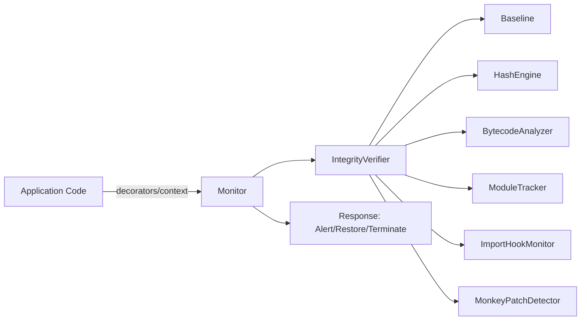

# Executive Summary

Cynapse is a pure-Python, cross-platform runtime memory integrity monitor for Python applications. It continuously verifies application integrity (functions, modules, import hooks) against a trusted baseline and responds to tampering in real time.

## Overview of the software
- Detects bytecode modification, function replacement, module injection/modification, monkey-patching, and import hook manipulation.
- Provides automatic responses: alert, restore, snapshot (forensics), or terminate, configurable via `MonitorConfig`.
- Offers simple APIs: decorators (`@protect_function`, `@protect_class`), context manager (`with Monitor(...)`), and builder (`Monitor.builder()`), plus `AsyncMonitor`.
- Framework integrations for Flask, Django, and FastAPI.

## Purpose and key objectives
- Ensure runtime integrity of Python code and critical execution paths.
- Provide defense-in-depth against runtime tampering and supply-chain risks at execution time.
- Minimize performance overhead while remaining highly observable and extensible.

## Target audience or end-users
- Python application developers and platform teams.
- Security engineers seeking runtime integrity controls for Python services, CLIs, or long-running processes.

## High-level architecture and technologies used
- Layered architecture (see `docs/design.md`): Core engine, Introspection, Detection, Response, Integrations, Platform abstraction.
- Pure Python (3.8–3.13), optional `blake3` and framework extras.
- Cross-platform support: Linux, Windows, macOS via `cynapse/platform/`.

## Major outcomes and impact
- Real-time detection of runtime tampering with minimal overhead (<2% CPU idle; see `README.md`).
- Simple integration path lowers friction; examples and tests validate functionality.
- Extensible design with optional auto-healing and future forensics/attestation hooks.

References: `cynapse/monitor.py`, `cynapse/core/bytecode.py`, `cynapse/core/verifier.py`, `docs/design.md`, `README.md`.
