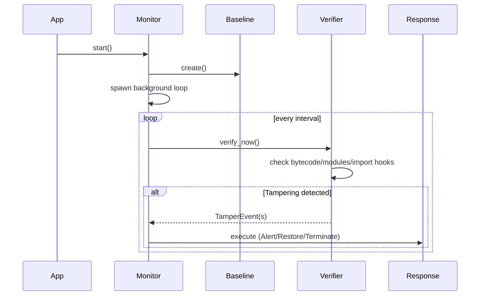

# System Overview

## Brief system description
Cynapse creates a cryptographic baseline of the application’s runtime state (functions, modules, import hooks), then continuously verifies that state. On deviation, it emits `TamperEvent`s and executes a configured response.

## Key features and capabilities
- Bytecode verification via `BytecodeAnalyzer` (`cynapse/core/bytecode.py`).
- Module tracking and hashing via `ModuleTracker` (`cynapse/introspection/modules.py`).
- Import hook monitoring via `ImportHookMonitor` (`cynapse/introspection/imports.py`).
- Monkey-patch detection via `MonkeyPatchDetector` (`cynapse/detection/monkey_patch.py`).
- Auto-healing via `AutoHealer` (`cynapse/core/healer.py`).
- Sync/async monitors and web framework integrations.

## Overall workflow or lifecycle

## Comparison with existing solutions
- Typical solutions focus on packaging/obfuscation or static integrity. Cynapse uniquely emphasizes runtime detection and response inside the live Python process.
- Works alongside other controls (signing, container hardening, least privilege) as part of defense-in-depth.

References: `cynapse/monitor.py`, `cynapse/core/verifier.py`, `docs/design.md`.
