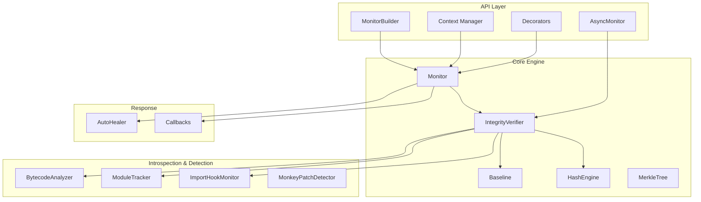
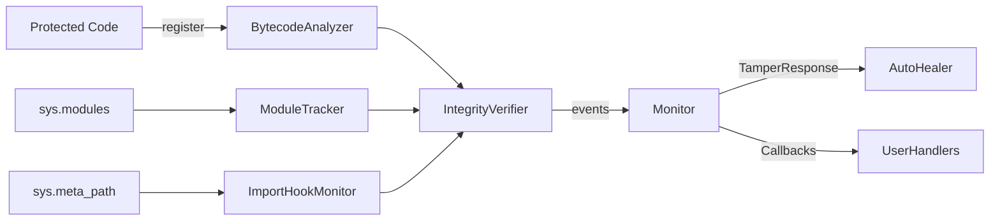
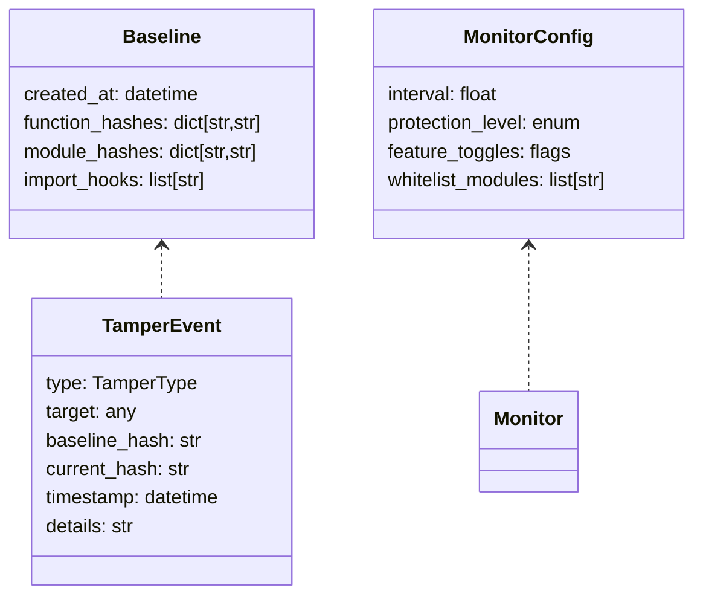

# System Design

## Architecture Design

### System architecture diagram (logical)

### Modules and submodules
- `cynapse/monitor.py`: Orchestrator, baseline + verify loop, responses.
- `cynapse/async_monitor.py`: Async variant using `asyncio` task loop.
- `cynapse/core/`: `baseline.py`, `bytecode.py`, `hash_engine.py`, `merkle.py`, `verifier.py`, `healer.py`.
- `cynapse/introspection/`: `modules.py`, `imports.py`.
- `cynapse/detection/`: `monkey_patch.py`.
- `cynapse/integrations/`: `flask.py`, `django.py`, `fastapi.py`.
- `cynapse/utils/config.py`: Builder and config helpers.

### Data flow diagram (DFD)

### ER/schema design (conceptual)

## Component Design
- `Monitor` (`cynapse/monitor.py`): Singleton orchestrator; baseline creation, background loop, callbacks, responses.
- `IntegrityVerifier` (`cynapse/core/verifier.py`): Aggregates checks for functions, modules, import hooks.
- `BytecodeAnalyzer` (`cynapse/core/bytecode.py`): Hashes and compares `CodeType` objects; supports restore.
- `Baseline` (`cynapse/core/baseline.py`): Stores trusted hashes; supports save/load/export.
- `HashEngine` (`cynapse/core/hash_engine.py`): LRU-cached hashing; optional `blake3`.
- `AutoHealer` (`cynapse/core/healer.py`): Attempts restoration based on `TamperEvent.can_restore`.
- `ModuleTracker`, `ImportHookMonitor`, `MonkeyPatchDetector`: Detect module/import/monkey-patch anomalies.
- `AsyncMonitor` (`cynapse/async_monitor.py`): Async loop variant for FastAPI and asyncio apps.

## Interfaces and interactions
- `Monitor.protect_function(func)` adds to baseline and tracking.
- `Monitor.verify_now()` runs modular checks respecting whitelists.
- `Monitor.on_tamper(cb)` registers a callback to influence response.
- `Monitor.get_status()` exposes metrics (optionally via `psutil`).

## UI/UX Design
- Pythonic APIs: decorators for zero-friction protection, builder for fluent config, context managers for lifecycle.
- Example flows in `examples/` demonstrate common UX patterns.

References: `docs/design.md`, `cynapse/` modules.
