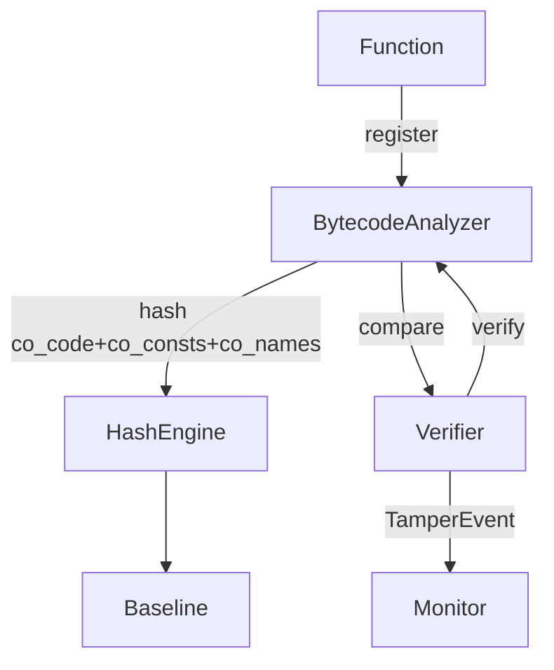
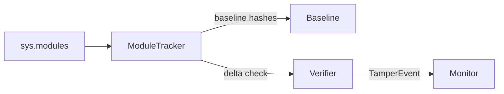

# Appendices

## Additional diagrams

### Bytecode verification flow

### Module tracking flow

## Detailed algorithms
- `BytecodeAnalyzer.diff_bytecode()` returns instruction-level differences for diagnostics.
- `IntegrityVerifier._hash_module()` aggregates function bytecode hashes and attribute fingerprints for module comparison.

## Code documentation or schemas
- See `cynapse/core/baseline.py` for baseline serialization/export.
- See `cynapse/core/merkle.py` for Merkle tree utilities (optional optimization path).
- See `cynapse/testing/tamper.py` for tamper simulation helpers used in tests and demos.

## Logs and snapshots
- Forensics snapshot is a placeholder hook in `Monitor._capture_forensic_snapshot()`; extend as needed for production capture.
