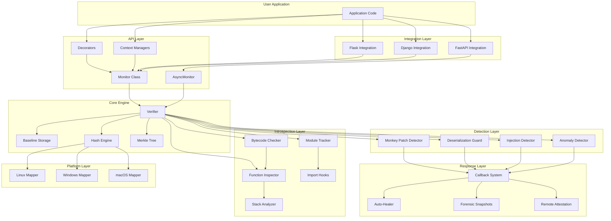
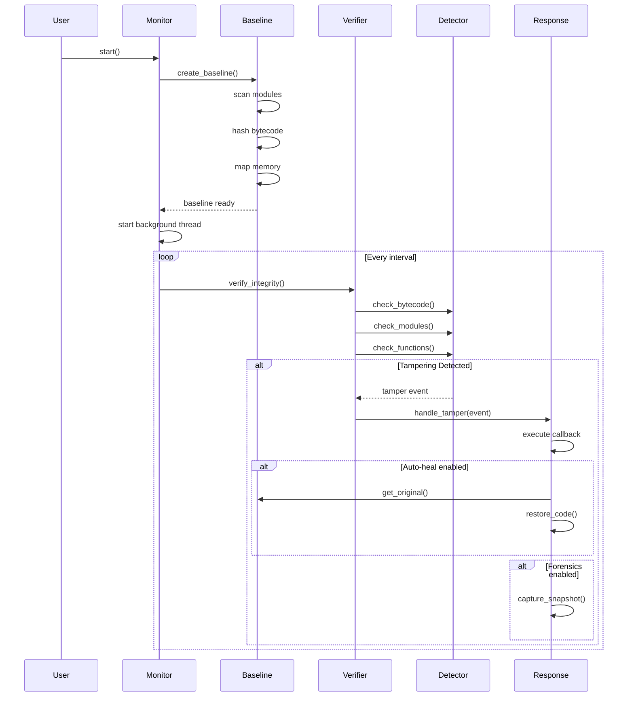

# Design Document

## Overview

Cynapse is a pure Python runtime memory integrity monitoring system designed to detect and respond to code tampering in running Python applications. The system operates by creating a cryptographic baseline of the application's initial state, then continuously verifying that state through periodic checks. When tampering is detected, Cynapse can alert, restore, capture forensics, or terminate based on configuration.

The architecture follows a layered approach with clear separation of concerns:
- **Platform Layer**: OS-specific memory mapping implementations
- **Core Layer**: Hashing, baseline management, verification logic
- **Introspection Layer**: Python runtime inspection (modules, functions, bytecode)
- **Detection Layer**: Specialized detectors for different attack types
- **Response Layer**: Tamper response handlers and recovery mechanisms
- **API Layer**: User-facing decorators, context managers, and integrations

### Key Design Principles

1. **Pure Python First**: Core functionality uses only stdlib, with optional accelerators
2. **Minimal Performance Impact**: Target <2% CPU overhead through adaptive sampling
3. **Cross-Platform**: Abstract platform differences behind common interfaces
4. **Fail Secure**: Safe defaults, graceful degradation, don't crash host application
5. **Extensible**: Plugin architecture for custom checks and responses
6. **Observable**: Comprehensive logging and telemetry

## Architecture

### High-Level Component Diagram



### System Flow



## Components and Interfaces

### 1. Monitor Class (Core Orchestrator)

The Monitor class is the main entry point and orchestrates all monitoring activities.

```python
class Monitor:
    """Main monitoring orchestrator."""
    
    def __init__(
        self,
        interval: float = 3.0,
        protection_level: ProtectionLevel = ProtectionLevel.MEDIUM,
        hash_algorithm: str = "sha256",
        adaptive_sampling: bool = True,
        enable_bytecode_verification: bool = True,
        enable_module_tracking: bool = True,
        enable_import_hooks: bool = True,
        enable_merkle_trees: bool = True,
        enable_auto_healing: bool = False,
        enable_forensics: bool = False,
        whitelist_modules: List[str] = None,
        whitelist_patterns: List[str] = None,
        protect_modules: List[str] = None,
        tamper_response: TamperResponse = TamperResponse.ALERT,
        on_tamper: Optional[Callable[[TamperEvent], TamperResponse]] = None,
        log_level: str = "INFO",
        log_format: str = "text",
        log_output: str = "stdout",
    ):
        """Initialize monitor with configuration."""
        pass
    
    def start(self) -> None:
        """Start monitoring in background thread."""
        pass
    
    def stop(self) -> None:
        """Stop monitoring and cleanup."""
        pass
    
    def protect_function(self, func: Callable) -> Callable:
        """Register a function for protection."""
        pass
    
    def protect_module(self, module_name: str) -> None:
        """Register a module for protection."""
        pass
    
    def get_status(self) -> MonitorStatus:
        """Get current monitoring status."""
        pass
    
    def __enter__(self) -> "Monitor":
        """Context manager entry."""
        self.start()
        return self
    
    def __exit__(self, exc_type, exc_val, exc_tb) -> None:
        """Context manager exit."""
        self.stop()
    
    @classmethod
    def builder(cls) -> "MonitorBuilder":
        """Get a builder for fluent configuration."""
        return MonitorBuilder()
```

### 2. Platform Abstraction Layer

Abstract base class for platform-specific memory operations:

```python
class MemoryMapper(ABC):
    """Abstract interface for platform-specific memory mapping."""
    
    @abstractmethod
    def get_memory_regions(self) -> List[MemoryRegion]:
        """Get all memory regions for current process."""
        pass
    
    @abstractmethod
    def read_memory(self, address: int, size: int) -> bytes:
        """Read memory at given address."""
        pass
    
    @abstractmethod
    def is_executable(self, region: MemoryRegion) -> bool:
        """Check if memory region is executable."""
        pass

class LinuxMapper(MemoryMapper):
    """Linux implementation using /proc/self/maps."""
    
    def get_memory_regions(self) -> List[MemoryRegion]:
        # parse /proc/self/maps
        pass

class WindowsMapper(MemoryMapper):
    """Windows implementation using VirtualQuery."""
    
    def get_memory_regions(self) -> List[MemoryRegion]:
        # use ctypes to call VirtualQuery
        pass

class MacOSMapper(MemoryMapper):
    """macOS implementation using vmmap or mach APIs."""
    
    def get_memory_regions(self) -> List[MemoryRegion]:
        # use vmmap or mach APIs
        pass
```

### 3. Hash Engine

Responsible for computing cryptographic hashes efficiently:

```python
class HashEngine:
    """Efficient hashing engine with optional accelerators."""
    
    def __init__(self, algorithm: str = "sha256"):
        """Initialize with specified algorithm (sha256 or blake3)."""
        self.algorithm = algorithm
        self._hash_cache: Dict[bytes, str] = {}
        
    def hash_bytes(self, data: bytes) -> str:
        """Hash arbitrary bytes."""
        # check cache first
        if data in self._hash_cache:
            return self._hash_cache[data]
        
        # compute hash
        if self.algorithm == "sha256":
            h = hashlib.sha256(data).hexdigest()
        elif self.algorithm == "blake3":
            # try to import blake3, fallback to sha256
            try:
                import blake3
                h = blake3.blake3(data).hexdigest()
            except ImportError:
                h = hashlib.sha256(data).hexdigest()
        
        # cache and return
        self._hash_cache[data] = h
        return h
    
    def hash_memory_region(self, region: MemoryRegion, chunk_size: int = 4096) -> List[str]:
        """Hash memory region in chunks."""
        hashes = []
        for offset in range(0, region.size, chunk_size):
            chunk = region.read(offset, min(chunk_size, region.size - offset))
            hashes.append(self.hash_bytes(chunk))
        return hashes
    
    def hash_bytecode(self, code_obj: CodeType) -> str:
        """Hash function bytecode including constants and names."""
        # combine co_code, co_consts, co_names for complete hash
        data = code_obj.co_code
        data += str(code_obj.co_consts).encode()
        data += str(code_obj.co_names).encode()
        return self.hash_bytes(data)
```

### 4. Merkle Tree

Organizes hashes hierarchically for efficient verification:

```python
class MerkleTree:
    """Merkle tree for efficient integrity verification."""
    
    def __init__(self, hasher: HashEngine):
        self.hasher = hasher
        self.root: Optional[MerkleNode] = None
        
    def build(self, leaves: List[str]) -> str:
        """Build tree from leaf hashes, return root hash."""
        if not leaves:
            return ""
        
        # build tree bottom-up
        nodes = [MerkleNode(h) for h in leaves]
        
        while len(nodes) > 1:
            parent_nodes = []
            for i in range(0, len(nodes), 2):
                left = nodes[i]
                right = nodes[i + 1] if i + 1 < len(nodes) else left
                parent_hash = self.hasher.hash_bytes(
                    (left.hash + right.hash).encode()
                )
                parent = MerkleNode(parent_hash, left, right)
                parent_nodes.append(parent)
            nodes = parent_nodes
        
        self.root = nodes[0]
        return self.root.hash
    
    def verify_path(self, leaf_index: int, leaf_hash: str) -> bool:
        """Verify a specific leaf without re-hashing entire tree."""
        # traverse from leaf to root, recomputing hashes
        pass
    
    def get_changed_indices(self, new_leaves: List[str]) -> List[int]:
        """Identify which leaves changed."""
        pass
```

### 5. Baseline Storage

Stores the trusted initial state:

```python
class Baseline:
    """Stores trusted baseline of application state."""
    
    def __init__(self, hasher: HashEngine, use_merkle: bool = True):
        self.hasher = hasher
        self.use_merkle = use_merkle
        self.created_at: Optional[datetime] = None
        
        # storage structures
        self.module_hashes: Dict[str, str] = {}
        self.function_hashes: Dict[str, str] = {}  # qualified name -> hash
        self.memory_hashes: Dict[int, List[str]] = {}  # address -> chunk hashes
        self.merkle_tree: Optional[MerkleTree] = None
        
    def create(
        self,
        modules: List[ModuleType],
        functions: List[Callable],
        memory_regions: List[MemoryRegion],
    ) -> None:
        """Create baseline from current state."""
        self.created_at = datetime.now()
        
        # hash all modules
        for module in modules:
            self.module_hashes[module.__name__] = self._hash_module(module)
        
        # hash all functions
        for func in functions:
            qualified_name = f"{func.__module__}.{func.__qualname__}"
            self.function_hashes[qualified_name] = self.hasher.hash_bytecode(
                func.__code__
            )
        
        # hash memory regions
        for region in memory_regions:
            self.memory_hashes[region.start] = self.hasher.hash_memory_region(region)
        
        # build merkle tree if enabled
        if self.use_merkle:
            all_hashes = (
                list(self.module_hashes.values())
                + list(self.function_hashes.values())
                + [h for hashes in self.memory_hashes.values() for h in hashes]
            )
            self.merkle_tree = MerkleTree(self.hasher)
            self.merkle_tree.build(all_hashes)
    
    def get_function_hash(self, func: Callable) -> Optional[str]:
        """Get baseline hash for a function."""
        qualified_name = f"{func.__module__}.{func.__qualname__}"
        return self.function_hashes.get(qualified_name)
    
    def get_module_hash(self, module_name: str) -> Optional[str]:
        """Get baseline hash for a module."""
        return self.module_hashes.get(module_name)
    
    def save(self, path: str) -> None:
        """Save baseline to disk."""
        pass
    
    def load(self, path: str) -> None:
        """Load baseline from disk."""
        pass
    
    def sign(self, private_key: bytes) -> bytes:
        """Cryptographically sign baseline."""
        pass
    
    def verify_signature(self, signature: bytes, public_key: bytes) -> bool:
        """Verify baseline signature."""
        pass
```


### 6. Verifier

Core verification logic that compares current state to baseline:

```python
class Verifier:
    """Core integrity verification engine."""
    
    def __init__(
        self,
        baseline: Baseline,
        hasher: HashEngine,
        detectors: List[Detector],
    ):
        self.baseline = baseline
        self.hasher = hasher
        self.detectors = detectors
        self.last_check: Optional[datetime] = None
        
    def verify_all(self) -> List[TamperEvent]:
        """Run all verification checks."""
        events = []
        
        # run each detector
        for detector in self.detectors:
            try:
                detector_events = detector.detect()
                events.extend(detector_events)
            except Exception as e:
                # log error but don't crash
                logger.error(f"Detector {detector.__class__.__name__} failed: {e}")
        
        self.last_check = datetime.now()
        return events
    
    def verify_function(self, func: Callable) -> Optional[TamperEvent]:
        """Verify a specific function."""
        baseline_hash = self.baseline.get_function_hash(func)
        if baseline_hash is None:
            return None  # not in baseline
        
        current_hash = self.hasher.hash_bytecode(func.__code__)
        
        if current_hash != baseline_hash:
            return TamperEvent(
                type=TamperType.BYTECODE_MODIFICATION,
                target=func,
                baseline_hash=baseline_hash,
                current_hash=current_hash,
                timestamp=datetime.now(),
            )
        
        return None
    
    def verify_module(self, module_name: str) -> Optional[TamperEvent]:
        """Verify a specific module."""
        baseline_hash = self.baseline.get_module_hash(module_name)
        if baseline_hash is None:
            # new module - might be injection
            return TamperEvent(
                type=TamperType.MODULE_INJECTION,
                target=module_name,
                timestamp=datetime.now(),
            )
        
        # re-hash module and compare
        current_module = sys.modules.get(module_name)
        if current_module is None:
            return TamperEvent(
                type=TamperType.MODULE_REMOVAL,
                target=module_name,
                timestamp=datetime.now(),
            )
        
        current_hash = self._hash_module(current_module)
        if current_hash != baseline_hash:
            return TamperEvent(
                type=TamperType.MODULE_MODIFICATION,
                target=module_name,
                baseline_hash=baseline_hash,
                current_hash=current_hash,
                timestamp=datetime.now(),
            )
        
        return None
```

### 7. Detector Interface

Abstract base for specialized detectors:

```python
class Detector(ABC):
    """Abstract base class for tamper detectors."""
    
    @abstractmethod
    def detect(self) -> List[TamperEvent]:
        """Run detection and return any tamper events found."""
        pass

class BytecodeDetector(Detector):
    """Detects bytecode modifications."""
    
    def __init__(self, baseline: Baseline, hasher: HashEngine, protected_functions: Set[Callable]):
        self.baseline = baseline
        self.hasher = hasher
        self.protected_functions = protected_functions
    
    def detect(self) -> List[TamperEvent]:
        events = []
        for func in self.protected_functions:
            baseline_hash = self.baseline.get_function_hash(func)
            if baseline_hash is None:
                continue
            
            current_hash = self.hasher.hash_bytecode(func.__code__)
            if current_hash != baseline_hash:
                events.append(TamperEvent(
                    type=TamperType.BYTECODE_MODIFICATION,
                    target=func,
                    baseline_hash=baseline_hash,
                    current_hash=current_hash,
                    timestamp=datetime.now(),
                ))
        return events

class MonkeyPatchDetector(Detector):
    """Detects function replacement and attribute modification."""
    
    def __init__(self, protected_objects: Dict[str, Any]):
        self.protected_objects = protected_objects
        self.original_ids: Dict[str, int] = {}
        self.original_dicts: Dict[str, Dict] = {}
        
        # capture initial state
        for name, obj in protected_objects.items():
            self.original_ids[name] = id(obj)
            if hasattr(obj, '__dict__'):
                self.original_dicts[name] = obj.__dict__.copy()
    
    def detect(self) -> List[TamperEvent]:
        events = []
        
        for name, obj in self.protected_objects.items():
            # check if object was replaced
            if id(obj) != self.original_ids[name]:
                events.append(TamperEvent(
                    type=TamperType.FUNCTION_REPLACEMENT,
                    target=name,
                    timestamp=datetime.now(),
                ))
            
            # check if __dict__ was modified
            if hasattr(obj, '__dict__'):
                current_dict = obj.__dict__
                original_dict = self.original_dicts[name]
                
                if current_dict.keys() != original_dict.keys():
                    events.append(TamperEvent(
                        type=TamperType.ATTRIBUTE_MODIFICATION,
                        target=name,
                        details=f"Keys changed: {current_dict.keys() ^ original_dict.keys()}",
                        timestamp=datetime.now(),
                    ))
        
        return events

class ModuleTracker(Detector):
    """Tracks sys.modules for injections and modifications."""
    
    def __init__(self, baseline_modules: Set[str]):
        self.baseline_modules = baseline_modules
    
    def detect(self) -> List[TamperEvent]:
        events = []
        current_modules = set(sys.modules.keys())
        
        # check for new modules
        new_modules = current_modules - self.baseline_modules
        for module_name in new_modules:
            # filter out known safe modules
            if not self._is_whitelisted(module_name):
                events.append(TamperEvent(
                    type=TamperType.MODULE_INJECTION,
                    target=module_name,
                    timestamp=datetime.now(),
                ))
        
        return events
    
    def _is_whitelisted(self, module_name: str) -> bool:
        """Check if module is in whitelist."""
        # check against whitelist patterns
        pass

class DeserializationGuard(Detector):
    """Monitors pickle and marshal operations."""
    
    def __init__(self):
        self.pickle_calls: List[Dict] = []
        self.marshal_calls: List[Dict] = []
        self._install_hooks()
    
    def _install_hooks(self):
        """Wrap pickle.loads and marshal.loads."""
        import pickle
        import marshal
        
        original_pickle_loads = pickle.loads
        original_marshal_loads = marshal.loads
        
        def wrapped_pickle_loads(data, *args, **kwargs):
            self.pickle_calls.append({
                'timestamp': datetime.now(),
                'data_size': len(data),
                'stack': inspect.stack(),
            })
            return original_pickle_loads(data, *args, **kwargs)
        
        def wrapped_marshal_loads(data):
            self.marshal_calls.append({
                'timestamp': datetime.now(),
                'data_size': len(data),
                'stack': inspect.stack(),
            })
            return original_marshal_loads(data)
        
        pickle.loads = wrapped_pickle_loads
        marshal.loads = wrapped_marshal_loads
    
    def detect(self) -> List[TamperEvent]:
        events = []
        
        # analyze recent calls for suspicious patterns
        for call in self.pickle_calls[-10:]:  # check last 10
            if self._is_suspicious(call):
                events.append(TamperEvent(
                    type=TamperType.SUSPICIOUS_DESERIALIZATION,
                    target='pickle.loads',
                    details=f"Suspicious pickle.loads call",
                    timestamp=call['timestamp'],
                ))
        
        return events
    
    def _is_suspicious(self, call: Dict) -> bool:
        """Heuristics to detect suspicious deserialization."""
        # check if called from unexpected location
        # check data size
        # check frequency
        pass

class ImportHookMonitor(Detector):
    """Monitors import system for hijacking."""
    
    def __init__(self):
        self.baseline_meta_path = sys.meta_path.copy()
        self.baseline_path_hooks = sys.path_hooks.copy()
    
    def detect(self) -> List[TamperEvent]:
        events = []
        
        # check if meta_path was modified
        if sys.meta_path != self.baseline_meta_path:
            events.append(TamperEvent(
                type=TamperType.IMPORT_HOOK_MANIPULATION,
                target='sys.meta_path',
                details=f"Import hooks modified",
                timestamp=datetime.now(),
            ))
        
        # check if path_hooks was modified
        if sys.path_hooks != self.baseline_path_hooks:
            events.append(TamperEvent(
                type=TamperType.IMPORT_HOOK_MANIPULATION,
                target='sys.path_hooks',
                details=f"Path hooks modified",
                timestamp=datetime.now(),
            ))
        
        return events
```

### 8. Response System

Handles tamper events with configurable responses:

```python
class ResponseHandler:
    """Orchestrates responses to tamper events."""
    
    def __init__(
        self,
        default_response: TamperResponse,
        callback: Optional[Callable[[TamperEvent], TamperResponse]],
        healer: Optional[AutoHealer],
        forensics: Optional[ForensicCapture],
        attestation: Optional[RemoteAttestation],
    ):
        self.default_response = default_response
        self.callback = callback
        self.healer = healer
        self.forensics = forensics
        self.attestation = attestation
    
    def handle(self, event: TamperEvent) -> None:
        """Handle a tamper event."""
        # determine response
        if self.callback:
            try:
                response = self.callback(event)
            except Exception as e:
                logger.error(f"Callback failed: {e}")
                response = self.default_response
        else:
            response = self.default_response
        
        # execute response
        if response == TamperResponse.ALERT:
            self._alert(event)
        elif response == TamperResponse.RESTORE:
            self._restore(event)
        elif response == TamperResponse.SNAPSHOT:
            self._snapshot(event)
        elif response == TamperResponse.TERMINATE:
            self._terminate(event)
    
    def _alert(self, event: TamperEvent) -> None:
        """Log alert and continue."""
        logger.error(f"TAMPER DETECTED: {event}")
    
    def _restore(self, event: TamperEvent) -> None:
        """Attempt to restore original code."""
        if self.healer and event.can_restore:
            try:
                self.healer.restore(event)
                logger.info(f"Successfully restored {event.target}")
            except Exception as e:
                logger.error(f"Restoration failed: {e}")
                self._alert(event)
        else:
            self._alert(event)
    
    def _snapshot(self, event: TamperEvent) -> None:
        """Capture forensic snapshot."""
        if self.forensics:
            try:
                self.forensics.capture(event)
                logger.info(f"Forensic snapshot captured for {event.target}")
            except Exception as e:
                logger.error(f"Snapshot failed: {e}")
        self._alert(event)
    
    def _terminate(self, event: TamperEvent) -> None:
        """Terminate application."""
        logger.critical(f"TERMINATING due to tamper: {event}")
        sys.exit(1)

class AutoHealer:
    """Automatically restores tampered code."""
    
    def __init__(self, baseline: Baseline):
        self.baseline = baseline
    
    def restore(self, event: TamperEvent) -> None:
        """Restore original code from baseline."""
        if event.type == TamperType.BYTECODE_MODIFICATION:
            self._restore_bytecode(event.target)
        elif event.type == TamperType.FUNCTION_REPLACEMENT:
            self._restore_function(event.target)
        elif event.type == TamperType.MODULE_MODIFICATION:
            self._restore_module(event.target)
    
    def _restore_bytecode(self, func: Callable) -> None:
        """Restore function bytecode."""
        # this is tricky - we need to replace the code object
        # Python doesn't allow direct modification of code objects
        # we need to create a new function with original code
        pass
    
    def _restore_function(self, name: str) -> None:
        """Restore replaced function."""
        pass
    
    def _restore_module(self, module_name: str) -> None:
        """Restore modified module."""
        pass

class ForensicCapture:
    """Captures forensic snapshots of tamper events."""
    
    def __init__(
        self,
        snapshot_dir: str,
        max_snapshot_size: int = 10 * 1024 * 1024,  # 10MB
        retention_days: int = 30,
    ):
        self.snapshot_dir = Path(snapshot_dir)
        self.max_snapshot_size = max_snapshot_size
        self.retention_days = retention_days
        self.snapshot_dir.mkdir(parents=True, exist_ok=True)
    
    def capture(self, event: TamperEvent) -> None:
        """Capture forensic snapshot."""
        timestamp = datetime.now().strftime("%Y%m%d_%H%M%S")
        snapshot_file = self.snapshot_dir / f"tamper_{timestamp}.json"
        
        snapshot = {
            'timestamp': event.timestamp.isoformat(),
            'type': event.type.name,
            'target': str(event.target),
            'baseline_hash': event.baseline_hash,
            'current_hash': event.current_hash,
            'details': event.details,
            'stack_trace': self._capture_stack(),
            'memory_dump': self._capture_memory(event.target),
        }
        
        with open(snapshot_file, 'w') as f:
            json.dump(snapshot, f, indent=2)
    
    def _capture_stack(self) -> List[str]:
        """Capture current stack trace."""
        return [str(frame) for frame in inspect.stack()]
    
    def _capture_memory(self, target: Any) -> Optional[str]:
        """Capture memory dump of target."""
        # capture relevant memory if possible
        pass
    
    def cleanup_old_snapshots(self) -> None:
        """Remove snapshots older than retention period."""
        cutoff = datetime.now() - timedelta(days=self.retention_days)
        for snapshot_file in self.snapshot_dir.glob("tamper_*.json"):
            if datetime.fromtimestamp(snapshot_file.stat().st_mtime) < cutoff:
                snapshot_file.unlink()

class RemoteAttestation:
    """Provides remote attestation capabilities."""
    
    def __init__(
        self,
        server_url: str,
        api_key: str,
    ):
        self.server_url = server_url
        self.api_key = api_key
    
    def generate_attestation(self, baseline: Baseline) -> Dict:
        """Generate cryptographic attestation report."""
        report = {
            'timestamp': datetime.now().isoformat(),
            'baseline_created': baseline.created_at.isoformat(),
            'merkle_root': baseline.merkle_tree.root.hash if baseline.merkle_tree else None,
            'module_count': len(baseline.module_hashes),
            'function_count': len(baseline.function_hashes),
        }
        
        # sign report
        signature = self._sign_report(report)
        report['signature'] = signature
        
        return report
    
    def send_attestation(self, report: Dict) -> bool:
        """Send attestation to remote server."""
        try:
            response = requests.post(
                f"{self.server_url}/attestation",
                json=report,
                headers={'Authorization': f'Bearer {self.api_key}'},
                timeout=5,
            )
            return response.status_code == 200
        except Exception as e:
            logger.error(f"Attestation failed: {e}")
            return False
    
    def _sign_report(self, report: Dict) -> str:
        """Cryptographically sign report."""
        # use HMAC or digital signature
        pass
```


### 9. Adaptive Sampling

Intelligently adjusts monitoring frequency based on risk:

```python
class AdaptiveSampler:
    """Adjusts monitoring frequency based on observed behavior."""
    
    def __init__(self, base_interval: float = 3.0):
        self.base_interval = base_interval
        self.region_scores: Dict[str, float] = {}  # risk scores per region
        self.tamper_history: List[TamperEvent] = []
        
    def get_interval(self, region: str) -> float:
        """Get monitoring interval for a region."""
        score = self.region_scores.get(region, 0.5)  # default medium risk
        
        # higher risk = shorter interval (more frequent checks)
        if score > 0.8:
            return self.base_interval * 0.25  # 4x more frequent
        elif score > 0.6:
            return self.base_interval * 0.5   # 2x more frequent
        elif score < 0.2:
            return self.base_interval * 2.0   # 2x less frequent
        else:
            return self.base_interval
    
    def update_score(self, region: str, event: Optional[TamperEvent]) -> None:
        """Update risk score based on observations."""
        current_score = self.region_scores.get(region, 0.5)
        
        if event:
            # tampering detected - increase risk
            new_score = min(1.0, current_score + 0.2)
            self.tamper_history.append(event)
        else:
            # no tampering - gradually decrease risk
            new_score = max(0.0, current_score - 0.01)
        
        self.region_scores[region] = new_score
    
    def analyze_patterns(self) -> None:
        """Analyze tamper history for patterns."""
        # identify frequently tampered regions
        # adjust scores based on patterns
        pass
```

### 10. Decorator API

User-friendly decorators for protection:

```python
def protect_function(func: Callable) -> Callable:
    """Decorator to protect a function."""
    # get global monitor instance
    monitor = Monitor._instance
    if monitor is None:
        raise RuntimeError("Monitor not initialized")
    
    # register function for protection
    monitor.protect_function(func)
    
    # return original function unchanged
    return func

def protect_class(cls: type) -> type:
    """Decorator to protect all methods in a class."""
    monitor = Monitor._instance
    if monitor is None:
        raise RuntimeError("Monitor not initialized")
    
    # protect all methods
    for name, method in inspect.getmembers(cls, inspect.isfunction):
        if not name.startswith('_'):
            monitor.protect_function(method)
    
    return cls
```

### 11. Async Support

Async version of monitor for async applications:

```python
class AsyncMonitor:
    """Async version of Monitor for async applications."""
    
    def __init__(self, **kwargs):
        # same config as Monitor
        self.config = kwargs
        self._task: Optional[asyncio.Task] = None
        self._stop_event = asyncio.Event()
    
    async def start(self) -> None:
        """Start monitoring in background task."""
        self._task = asyncio.create_task(self._monitor_loop())
    
    async def stop(self) -> None:
        """Stop monitoring."""
        self._stop_event.set()
        if self._task:
            await self._task
    
    async def _monitor_loop(self) -> None:
        """Background monitoring loop."""
        while not self._stop_event.is_set():
            try:
                # run verification
                events = await self._verify_async()
                
                # handle events
                for event in events:
                    await self._handle_event_async(event)
                
                # wait for next interval
                await asyncio.sleep(self.config['interval'])
            except Exception as e:
                logger.error(f"Monitor loop error: {e}")
    
    async def __aenter__(self) -> "AsyncMonitor":
        """Async context manager entry."""
        await self.start()
        return self
    
    async def __aexit__(self, exc_type, exc_val, exc_tb) -> None:
        """Async context manager exit."""
        await self.stop()
```

## Data Models

### Core Data Structures

```python
@dataclass
class MemoryRegion:
    """Represents a memory region."""
    start: int
    end: int
    size: int
    permissions: str  # e.g., "r-xp"
    path: Optional[str]
    
    def read(self, offset: int, size: int) -> bytes:
        """Read bytes from this region."""
        pass

@dataclass
class MerkleNode:
    """Node in Merkle tree."""
    hash: str
    left: Optional["MerkleNode"] = None
    right: Optional["MerkleNode"] = None

class TamperType(Enum):
    """Types of tampering that can be detected."""
    BYTECODE_MODIFICATION = "bytecode_modification"
    FUNCTION_REPLACEMENT = "function_replacement"
    MODULE_INJECTION = "module_injection"
    MODULE_MODIFICATION = "module_modification"
    MODULE_REMOVAL = "module_removal"
    ATTRIBUTE_MODIFICATION = "attribute_modification"
    IMPORT_HOOK_MANIPULATION = "import_hook_manipulation"
    SUSPICIOUS_DESERIALIZATION = "suspicious_deserialization"
    MEMORY_MODIFICATION = "memory_modification"

@dataclass
class TamperEvent:
    """Represents a detected tamper event."""
    type: TamperType
    target: Any
    timestamp: datetime
    baseline_hash: Optional[str] = None
    current_hash: Optional[str] = None
    details: Optional[str] = None
    stack_trace: Optional[List[str]] = None
    
    @property
    def can_restore(self) -> bool:
        """Check if this event can be auto-restored."""
        return self.type in [
            TamperType.BYTECODE_MODIFICATION,
            TamperType.FUNCTION_REPLACEMENT,
            TamperType.MODULE_MODIFICATION,
        ]

class TamperResponse(Enum):
    """Response actions for tamper events."""
    ALERT = "alert"           # log and continue
    RESTORE = "restore"       # auto-heal
    SNAPSHOT = "snapshot"     # capture forensics
    TERMINATE = "terminate"   # shut down
    CUSTOM = "custom"         # user-defined

class ProtectionLevel(Enum):
    """Protection levels with different trade-offs."""
    LOW = "low"           # minimal checks, lowest overhead
    MEDIUM = "medium"     # balanced
    HIGH = "high"         # comprehensive checks
    PARANOID = "paranoid" # maximum security, higher overhead

@dataclass
class MonitorStatus:
    """Current status of monitoring."""
    running: bool
    baseline_created: Optional[datetime]
    last_check: Optional[datetime]
    checks_performed: int
    tamper_events: int
    protected_functions: int
    protected_modules: int
    cpu_usage: float
    memory_usage: int
```

### Configuration Model

```python
@dataclass
class MonitorConfig:
    """Configuration for Monitor."""
    interval: float = 3.0
    protection_level: ProtectionLevel = ProtectionLevel.MEDIUM
    hash_algorithm: str = "sha256"
    adaptive_sampling: bool = True
    
    # feature toggles
    enable_bytecode_verification: bool = True
    enable_module_tracking: bool = True
    enable_import_hooks: bool = True
    enable_merkle_trees: bool = True
    enable_auto_healing: bool = False
    enable_forensics: bool = False
    
    # whitelisting
    whitelist_modules: List[str] = field(default_factory=lambda: ["pytest", "debugpy"])
    whitelist_patterns: List[str] = field(default_factory=list)
    protect_modules: List[str] = field(default_factory=list)
    
    # response
    tamper_response: TamperResponse = TamperResponse.ALERT
    on_tamper: Optional[Callable[[TamperEvent], TamperResponse]] = None
    
    # logging
    log_level: str = "INFO"
    log_format: str = "text"
    log_output: str = "stdout"
    
    # forensics
    snapshot_dir: str = "./cynapse_snapshots"
    max_snapshot_size: int = 10 * 1024 * 1024
    retention_days: int = 30
    
    # attestation
    attestation_enabled: bool = False
    attestation_server: Optional[str] = None
    attestation_api_key: Optional[str] = None
```

## Error Handling

### Error Hierarchy

```python
class CynapseError(Exception):
    """Base exception for Cynapse."""
    pass

class InitializationError(CynapseError):
    """Raised when initialization fails."""
    pass

class BaselineError(CynapseError):
    """Raised when baseline operations fail."""
    pass

class VerificationError(CynapseError):
    """Raised when verification fails."""
    pass

class RestorationError(CynapseError):
    """Raised when auto-healing fails."""
    pass

class PlatformError(CynapseError):
    """Raised when platform-specific operations fail."""
    pass
```

### Error Handling Strategy

1. **Platform Errors**: Log and gracefully degrade
   - If memory mapping fails, continue with available regions
   - If permissions are insufficient, work with what's accessible

2. **Internal Errors**: Log but don't crash host application
   - Detector failures are logged, other detectors continue
   - Verification errors are logged, monitoring continues

3. **User Errors**: Raise clear exceptions with helpful messages
   - Invalid configuration raises with suggestions
   - Missing modules raise with "did you mean" suggestions

4. **Recovery**: Always attempt to continue monitoring
   - Failed restoration falls back to alert
   - Failed forensics still logs the event

## Testing Strategy

### Unit Tests

Test each component in isolation:

```python
# test hash engine
def test_hash_engine_sha256():
    engine = HashEngine("sha256")
    data = b"test data"
    hash1 = engine.hash_bytes(data)
    hash2 = engine.hash_bytes(data)
    assert hash1 == hash2  # caching works
    assert len(hash1) == 64  # sha256 hex length

# test baseline creation
def test_baseline_creation():
    baseline = Baseline(HashEngine())
    baseline.create(modules=[], functions=[], memory_regions=[])
    assert baseline.created_at is not None

# test detector
def test_bytecode_detector():
    def test_func():
        return 42
    
    baseline = Baseline(HashEngine())
    baseline.function_hashes[f"{test_func.__module__}.{test_func.__qualname__}"] = "original_hash"
    
    detector = BytecodeDetector(baseline, HashEngine(), {test_func})
    events = detector.detect()
    # should detect modification since hash won't match
```

### Integration Tests

Test components working together:

```python
def test_full_monitoring_cycle():
    """Test complete monitoring workflow."""
    monitor = Monitor(interval=0.1)  # fast for testing
    
    @protect_function
    def sensitive():
        return "secret"
    
    monitor.start()
    time.sleep(0.2)  # let it run
    
    # tamper with function
    sensitive.__code__ = (lambda: "hacked").__code__
    
    time.sleep(0.2)  # let detector find it
    
    status = monitor.get_status()
    assert status.tamper_events > 0
    
    monitor.stop()
```

### Framework Integration Tests

Test with real frameworks:

```python
def test_flask_integration():
    """Test Flask integration."""
    app = Flask(__name__)
    monitor = FlaskMonitor(app, interval=1.0)
    
    @app.route('/test')
    def test_route():
        return "ok"
    
    with app.test_client() as client:
        response = client.get('/test')
        assert response.status_code == 200
```

### Tamper Simulation Tests

Verify detection works:

```python
def test_detect_bytecode_modification():
    """Verify bytecode modification is detected."""
    from cynapse.testing import TamperSimulator
    
    monitor = Monitor()
    
    @protect_function
    def target():
        return 1
    
    monitor.start()
    
    # simulate tampering
    simulator = TamperSimulator()
    simulator.modify_bytecode(target)
    
    # verify detection
    time.sleep(monitor.config.interval + 0.1)
    assert monitor.get_status().tamper_events > 0
```

### Performance Tests

Verify performance targets:

```python
def test_performance_overhead():
    """Verify CPU overhead is under 2%."""
    import psutil
    
    monitor = Monitor(interval=1.0)
    monitor.start()
    
    # measure CPU usage
    process = psutil.Process()
    cpu_percent = process.cpu_percent(interval=5.0)
    
    assert cpu_percent < 2.0
    
    monitor.stop()

def test_decorator_overhead():
    """Verify decorator overhead is under 0.1ms."""
    @protect_function
    def fast_func():
        return 42
    
    # measure call time
    times = []
    for _ in range(1000):
        start = time.perf_counter()
        fast_func()
        end = time.perf_counter()
        times.append(end - start)
    
    avg_time = sum(times) / len(times)
    assert avg_time < 0.0001  # 0.1ms
```


## Framework Integrations

### Flask Integration

```python
class FlaskMonitor:
    """Flask integration for Cynapse."""
    
    def __init__(
        self,
        app: Flask,
        interval: float = 5.0,
        protect_routes: Optional[List[str]] = None,
        **kwargs
    ):
        self.app = app
        self.monitor = Monitor(interval=interval, **kwargs)
        self.protect_routes = protect_routes or []
        
        # register middleware
        app.before_request(self._before_request)
        app.after_request(self._after_request)
        
        # start monitoring
        self.monitor.start()
    
    def _before_request(self):
        """Run before each request."""
        # check if route should be protected
        if self._should_protect(request.endpoint):
            # verify integrity before handling request
            events = self.monitor.verifier.verify_all()
            if events:
                # tampering detected
                return jsonify({'error': 'Security violation detected'}), 500
    
    def _after_request(self, response):
        """Run after each request."""
        return response
    
    def _should_protect(self, endpoint: str) -> bool:
        """Check if endpoint should be protected."""
        if not self.protect_routes:
            return True  # protect all by default
        
        for pattern in self.protect_routes:
            if endpoint and endpoint.startswith(pattern):
                return True
        return False
```

### Django Integration

```python
class CynapseMiddleware:
    """Django middleware for Cynapse."""
    
    def __init__(self, get_response):
        self.get_response = get_response
        
        # get config from settings
        from django.conf import settings
        config = getattr(settings, 'CYNAPSE_CONFIG', {})
        
        # initialize monitor
        self.monitor = Monitor(**config)
        self.monitor.start()
        
        # get protected views
        self.protect_views = config.get('protect_views', [])
    
    def __call__(self, request):
        # check if view should be protected
        if self._should_protect(request.resolver_match):
            # verify integrity
            events = self.monitor.verifier.verify_all()
            if events:
                from django.http import HttpResponseServerError
                return HttpResponseServerError('Security violation detected')
        
        response = self.get_response(request)
        return response
    
    def _should_protect(self, resolver_match) -> bool:
        """Check if view should be protected."""
        if not resolver_match:
            return False
        
        view_name = resolver_match.view_name
        
        for pattern in self.protect_views:
            if re.match(pattern, view_name):
                return True
        return False
```

### FastAPI Integration

```python
class FastAPIMonitor:
    """FastAPI integration for Cynapse."""
    
    def __init__(
        self,
        app: FastAPI,
        interval: float = 5.0,
        **kwargs
    ):
        self.app = app
        self.monitor = AsyncMonitor(interval=interval, **kwargs)
        self.protected_endpoints: Set[str] = set()
        
        # register middleware
        @app.middleware("http")
        async def cynapse_middleware(request: Request, call_next):
            # check if endpoint is protected
            if request.url.path in self.protected_endpoints:
                # verify integrity
                events = await self.monitor._verify_async()
                if events:
                    return JSONResponse(
                        status_code=500,
                        content={'error': 'Security violation detected'}
                    )
            
            response = await call_next(request)
            return response
        
        # start monitoring
        asyncio.create_task(self.monitor.start())
    
    def protect_endpoint(self, func: Callable) -> Callable:
        """Decorator to protect specific endpoints."""
        # extract path from route
        for route in self.app.routes:
            if hasattr(route, 'endpoint') and route.endpoint == func:
                self.protected_endpoints.add(route.path)
        
        return func
```

## Performance Optimization

### Caching Strategy

1. **Hash Caching**: Cache computed hashes to avoid recomputation
   - Use LRU cache with size limit
   - Invalidate on known modifications

2. **Baseline Caching**: Keep baseline in memory
   - Lazy load from disk if needed
   - Compress if memory constrained

3. **Region Caching**: Cache memory region enumeration
   - Refresh only when necessary
   - Track changes to invalidate cache

### Incremental Verification

```python
class IncrementalVerifier:
    """Optimized verifier that only checks changed regions."""
    
    def __init__(self, baseline: Baseline, hasher: HashEngine):
        self.baseline = baseline
        self.hasher = hasher
        self.change_tracker: Dict[str, int] = {}  # track modification counts
    
    def verify_incremental(self) -> List[TamperEvent]:
        """Only verify regions that likely changed."""
        events = []
        
        # identify high-risk regions
        high_risk = [
            region for region, count in self.change_tracker.items()
            if count > 0
        ]
        
        # verify high-risk regions first
        for region in high_risk:
            event = self._verify_region(region)
            if event:
                events.append(event)
                self.change_tracker[region] += 1
            else:
                # no change, decrease risk
                self.change_tracker[region] = max(0, self.change_tracker[region] - 1)
        
        return events
```

### Parallel Verification

For large applications, verify regions in parallel:

```python
from concurrent.futures import ThreadPoolExecutor

class ParallelVerifier:
    """Verifies multiple regions in parallel."""
    
    def __init__(self, baseline: Baseline, hasher: HashEngine, max_workers: int = 4):
        self.baseline = baseline
        self.hasher = hasher
        self.executor = ThreadPoolExecutor(max_workers=max_workers)
    
    def verify_parallel(self, regions: List[str]) -> List[TamperEvent]:
        """Verify regions in parallel."""
        futures = [
            self.executor.submit(self._verify_region, region)
            for region in regions
        ]
        
        events = []
        for future in futures:
            event = future.result()
            if event:
                events.append(event)
        
        return events
```

## Security Considerations

### Baseline Integrity

**Problem**: What if the baseline itself is compromised?

**Solutions**:
1. **External Verification**: Allow users to verify baseline against known-good state
2. **Cryptographic Signing**: Sign baseline with private key, verify with public key
3. **Trusted Boot**: Create baseline in trusted environment before deployment
4. **Checksum Verification**: Provide checksums for baseline files

```python
class SecureBaseline(Baseline):
    """Baseline with cryptographic signing."""
    
    def sign(self, private_key: bytes) -> bytes:
        """Sign baseline with private key."""
        from cryptography.hazmat.primitives import hashes, serialization
        from cryptography.hazmat.primitives.asymmetric import padding
        
        # serialize baseline
        data = self._serialize()
        
        # sign
        signature = private_key.sign(
            data,
            padding.PSS(
                mgf=padding.MGF1(hashes.SHA256()),
                salt_length=padding.PSS.MAX_LENGTH
            ),
            hashes.SHA256()
        )
        
        return signature
    
    def verify_signature(self, signature: bytes, public_key: bytes) -> bool:
        """Verify baseline signature."""
        try:
            data = self._serialize()
            public_key.verify(
                signature,
                data,
                padding.PSS(
                    mgf=padding.MGF1(hashes.SHA256()),
                    salt_length=padding.PSS.MAX_LENGTH
                ),
                hashes.SHA256()
            )
            return True
        except Exception:
            return False
```

### TOCTOU (Time-of-Check-Time-of-Use)

**Problem**: Code could be modified between verification and execution.

**Mitigation**:
1. Minimize time between check and use
2. Use atomic operations where possible
3. Document limitations
4. Consider continuous verification during execution

### Whitelist Management

**Problem**: Distinguishing legitimate changes from attacks.

**Solutions**:
1. **Sensible Defaults**: Whitelist known-safe modules (pytest, debugpy, etc.)
2. **Pattern Matching**: Allow regex patterns for flexible whitelisting
3. **Learning Mode**: Observe application behavior to build whitelist
4. **User Override**: Let users customize whitelist

```python
class WhitelistManager:
    """Manages whitelist of safe modules and patterns."""
    
    def __init__(self, modules: List[str], patterns: List[str]):
        self.modules = set(modules)
        self.patterns = [re.compile(p) for p in patterns]
        
        # add default safe modules
        self.modules.update([
            'pytest', 'debugpy', '_pytest', 'pluggy',
            'unittest', 'doctest', 'pdb',
        ])
    
    def is_whitelisted(self, module_name: str) -> bool:
        """Check if module is whitelisted."""
        # exact match
        if module_name in self.modules:
            return True
        
        # pattern match
        for pattern in self.patterns:
            if pattern.match(module_name):
                return True
        
        return False
    
    def add_module(self, module_name: str) -> None:
        """Add module to whitelist."""
        self.modules.add(module_name)
    
    def add_pattern(self, pattern: str) -> None:
        """Add pattern to whitelist."""
        self.patterns.append(re.compile(pattern))
```

### Resource Exhaustion

**Problem**: Attacker could trigger excessive monitoring to DoS the application.

**Mitigation**:
1. **Rate Limiting**: Limit tamper event processing rate
2. **Adaptive Sampling**: Reduce frequency under load
3. **Configurable Limits**: Let users set max events per interval
4. **Circuit Breaker**: Temporarily disable monitoring if overwhelmed

```python
class RateLimiter:
    """Rate limits tamper event processing."""
    
    def __init__(self, max_events_per_minute: int = 100):
        self.max_events = max_events_per_minute
        self.events: List[datetime] = []
    
    def should_process(self, event: TamperEvent) -> bool:
        """Check if event should be processed."""
        now = datetime.now()
        
        # remove old events
        cutoff = now - timedelta(minutes=1)
        self.events = [e for e in self.events if e > cutoff]
        
        # check limit
        if len(self.events) >= self.max_events:
            logger.warning("Rate limit exceeded, dropping event")
            return False
        
        self.events.append(now)
        return True
```

## Logging and Observability

### Structured Logging

```python
class StructuredLogger:
    """Structured logging for Cynapse."""
    
    def __init__(self, level: str = "INFO", format: str = "text"):
        self.level = getattr(logging, level.upper())
        self.format = format
        self.logger = logging.getLogger("cynapse")
        self.logger.setLevel(self.level)
        
        # configure handler
        handler = logging.StreamHandler()
        if format == "json":
            handler.setFormatter(JsonFormatter())
        else:
            handler.setFormatter(logging.Formatter(
                '%(asctime)s - %(name)s - %(levelname)s - %(message)s'
            ))
        self.logger.addHandler(handler)
    
    def log_event(self, event: TamperEvent) -> None:
        """Log a tamper event."""
        if self.format == "json":
            self.logger.error(json.dumps({
                'event': 'tamper_detected',
                'type': event.type.name,
                'target': str(event.target),
                'timestamp': event.timestamp.isoformat(),
                'baseline_hash': event.baseline_hash,
                'current_hash': event.current_hash,
                'details': event.details,
            }))
        else:
            self.logger.error(
                f"TAMPER DETECTED: {event.type.name} on {event.target}"
            )
    
    def log_status(self, status: MonitorStatus) -> None:
        """Log monitoring status."""
        if self.format == "json":
            self.logger.info(json.dumps({
                'event': 'status',
                'running': status.running,
                'checks_performed': status.checks_performed,
                'tamper_events': status.tamper_events,
                'cpu_usage': status.cpu_usage,
                'memory_usage': status.memory_usage,
            }))
        else:
            self.logger.info(
                f"Status: {status.checks_performed} checks, "
                f"{status.tamper_events} events, "
                f"{status.cpu_usage:.2f}% CPU"
            )

class JsonFormatter(logging.Formatter):
    """JSON formatter for structured logs."""
    
    def format(self, record: logging.LogRecord) -> str:
        log_data = {
            'timestamp': datetime.fromtimestamp(record.created).isoformat(),
            'level': record.levelname,
            'logger': record.name,
            'message': record.getMessage(),
        }
        
        if record.exc_info:
            log_data['exception'] = self.formatException(record.exc_info)
        
        return json.dumps(log_data)
```

### Metrics Collection

```python
class MetricsCollector:
    """Collects performance metrics."""
    
    def __init__(self):
        self.checks_performed = 0
        self.tamper_events = 0
        self.verification_times: List[float] = []
        self.cpu_samples: List[float] = []
        self.memory_samples: List[int] = []
    
    def record_check(self, duration: float) -> None:
        """Record a verification check."""
        self.checks_performed += 1
        self.verification_times.append(duration)
    
    def record_tamper(self) -> None:
        """Record a tamper event."""
        self.tamper_events += 1
    
    def record_resource_usage(self, cpu: float, memory: int) -> None:
        """Record resource usage."""
        self.cpu_samples.append(cpu)
        self.memory_samples.append(memory)
    
    def get_stats(self) -> Dict:
        """Get statistics."""
        return {
            'checks_performed': self.checks_performed,
            'tamper_events': self.tamper_events,
            'avg_verification_time': sum(self.verification_times) / len(self.verification_times) if self.verification_times else 0,
            'avg_cpu_usage': sum(self.cpu_samples) / len(self.cpu_samples) if self.cpu_samples else 0,
            'avg_memory_usage': sum(self.memory_samples) / len(self.memory_samples) if self.memory_samples else 0,
        }
```

## Package Structure

```
cynapse/
├── cynapse/
│   ├── __init__.py              # Public API exports
│   ├── monitor.py               # Monitor class
│   ├── async_monitor.py         # AsyncMonitor class
│   ├── decorators.py            # @protect_function, @protect_class
│   ├── builder.py               # MonitorBuilder
│   │
│   ├── core/
│   │   ├── __init__.py
│   │   ├── mapper.py            # MemoryMapper base
│   │   ├── bytecode.py          # Bytecode analysis
│   │   ├── hasher.py            # HashEngine
│   │   ├── merkle.py            # MerkleTree
│   │   ├── baseline.py          # Baseline storage
│   │   ├── verifier.py          # Verifier
│   │   └── healer.py            # AutoHealer
│   │
│   ├── platform/
│   │   ├── __init__.py
│   │   ├── base.py              # Abstract interfaces
│   │   ├── linux.py             # Linux implementation
│   │   ├── windows.py           # Windows implementation
│   │   └── macos.py             # macOS implementation
│   │
│   ├── introspection/
│   │   ├── __init__.py
│   │   ├── modules.py           # Module tracking
│   │   ├── objects.py           # Object scanning
│   │   ├── functions.py         # Function inspection
│   │   ├── imports.py           # Import hooks
│   │   └── stack.py             # Stack analysis
│   │
│   ├── detection/
│   │   ├── __init__.py
│   │   ├── detector.py          # Detector base class
│   │   ├── monkey_patch.py      # MonkeyPatchDetector
│   │   ├── deserialization.py   # DeserializationGuard
│   │   ├── injection.py         # InjectionDetector
│   │   └── anomaly.py           # AnomalyDetector
│   │
│   ├── response/
│   │   ├── __init__.py
│   │   ├── callbacks.py         # ResponseHandler
│   │   ├── forensics.py         # ForensicCapture
│   │   ├── attestation.py       # RemoteAttestation
│   │   └── recovery.py          # Recovery mechanisms
│   │
│   ├── integrations/
│   │   ├── __init__.py
│   │   ├── flask.py             # FlaskMonitor
│   │   ├── django.py            # CynapseMiddleware
│   │   ├── fastapi.py           # FastAPIMonitor
│   │   ├── celery.py            # Celery integration
│   │   └── jupyter.py           # Jupyter support
│   │
│   ├── utils/
│   │   ├── __init__.py
│   │   ├── config.py            # Configuration
│   │   ├── logging.py           # Logging setup
│   │   ├── whitelist.py         # WhitelistManager
│   │   ├── crypto.py            # Crypto utilities
│   │   └── metrics.py           # MetricsCollector
│   │
│   └── testing/
│       ├── __init__.py
│       ├── fixtures.py          # Test fixtures
│       ├── tamper.py            # TamperSimulator
│       └── assertions.py        # Custom assertions
│
├── tests/
│   ├── unit/
│   ├── integration/
│   ├── performance/
│   └── tamper_simulation/
│
├── examples/
│   ├── basic_usage.py
│   ├── decorator_protection.py
│   ├── flask_app.py
│   ├── django_project/
│   ├── fastapi_service.py
│   ├── ml_inference.py
│   ├── celery_worker.py
│   └── custom_handler.py
│
├── docs/
│   ├── index.md
│   ├── quickstart.md
│   ├── api_reference.md
│   ├── architecture.md
│   ├── integrations/
│   └── tutorials/
│
├── pyproject.toml
├── README.md
├── LICENSE
├── SECURITY.md
└── CHANGELOG.md
```

## Design Decisions and Rationale

### Why Pure Python?

**Decision**: Core functionality uses only Python stdlib.

**Rationale**:
- Maximum compatibility across platforms
- No compilation required
- Easy to audit and understand
- Reduces dependency conflicts
- Optional accelerators available for performance

### Why Singleton Monitor?

**Decision**: Monitor uses singleton pattern.

**Rationale**:
- Only one monitor should exist per process
- Simplifies decorator usage (no need to pass monitor instance)
- Prevents conflicting monitoring configurations
- Easier resource management

### Why Background Thread vs Process?

**Decision**: Use background thread for monitoring.

**Rationale**:
- Shared memory with main process (can inspect directly)
- Lower overhead than separate process
- Easier to coordinate with main application
- GIL impact minimized by adaptive sampling

### Why Merkle Tree?

**Decision**: Optional Merkle tree for hash organization.

**Rationale**:
- Efficient verification of large applications
- Only re-verify changed branches
- Cryptographically sound
- Industry standard for integrity verification

### Why Adaptive Sampling?

**Decision**: Dynamically adjust monitoring frequency.

**Rationale**:
- Reduces overhead for stable code
- Increases vigilance for suspicious regions
- Learns from application behavior
- Balances security and performance

## Future Enhancements

### Phase 2 Features (v1.1+)

1. **ML-Based Anomaly Detection**
   - Train models on normal behavior
   - Detect statistical anomalies
   - Reduce false positives

2. **Multi-Process Monitoring**
   - Monitor across process boundaries
   - Distributed consensus
   - Coordinated response

3. **Hardware Security Integration**
   - TPM support
   - Secure enclaves (SGX, TrustZone)
   - Hardware-backed attestation

4. **Advanced Forensics**
   - Memory dumps
   - Execution traces
   - Automated analysis

5. **SIEM Integration**
   - Splunk connector
   - ELK stack integration
   - DataDog integration

This design provides a solid foundation for building Cynapse while maintaining flexibility for future enhancements.
