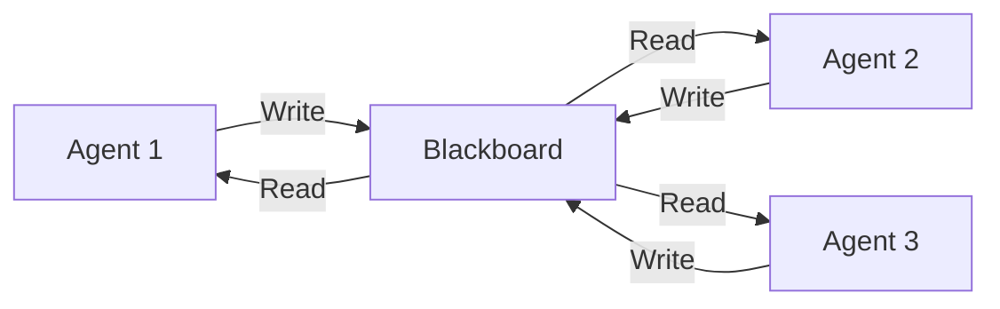

# MkDocs Material Best Practices Research
## Comprehensive Guide for State-of-the-Art Developer Documentation (2024-2025)

**Research Date:** October 8, 2025
**Focus:** Transforming Flock documentation into professional end-user facing documentation
**Framework:** MkDocs with Material theme for AI agent orchestration framework

---

## Executive Summary

This research document provides comprehensive best practices for creating state-of-the-art developer documentation using MkDocs Material theme. Key findings indicate that successful documentation in 2024-2025 combines:

1. **Diataxis framework** for content organization (Tutorials, How-To Guides, Explanation, Reference)
2. **Progressive disclosure** with beginner → intermediate → advanced learning paths
3. **Interactive elements** including live code examples, tabbed content, and annotations
4. **Automated API documentation** using mkdocstrings + gen-files + literate-nav
5. **Strategic navigation** using tabs, sections, and indexes for discoverability
6. **Multi-version documentation** with Mike for version management
7. **Social cards and SEO optimization** for improved reach
8. **Quick start patterns** focusing on "5-minute time-to-value"

---

## 1. MkDocs Material Theme Capabilities (2024-2025)

### 1.1 Core Philosophy

Material for MkDocs enables "documentation that simply works" - focusing on content creation while the framework handles presentation. Used by major organizations including:
- **Tech Giants:** Google, Microsoft, OpenAI, Netflix, AWS, LinkedIn
- **Python Ecosystem:** FastAPI, Pydantic, Typer, SQLModel
- **Research:** CERN, ArXiv, Harvard
- **Enterprise:** Bloomberg, HSBC, Intel, Salesforce

### 1.2 Essential Navigation Features

```yaml
theme:
  name: material
  features:
    # Instant loading (SPA-like behavior)
    - navigation.instant        # Fast page transitions
    - navigation.instant.progress  # Progress indicator
    - navigation.tracking       # URL updates with scroll

    # Navigation structure
    - navigation.tabs           # Top-level sections in header
    - navigation.tabs.sticky    # Tabs remain visible on scroll
    - navigation.sections       # Render top-level sections as groups
    - navigation.expand         # Expand all subsections by default
    - navigation.indexes        # Attach documents directly to sections
    - navigation.path           # Show breadcrumb navigation

    # Navigation enhancements
    - navigation.top            # Back-to-top button
    - navigation.footer         # Previous/next navigation in footer
    - navigation.prune          # Reduce HTML size by ~33%

    # Table of contents
    - toc.follow                # Sidebar scrolls with active item
    - toc.integrate             # Integrate TOC into left sidebar
```

**Best Practice:** Use `navigation.indexes` for section overview pages (e.g., `guides/index.md` provides introduction to all guides).

**Warning:** `navigation.prune` and `navigation.expand` are mutually exclusive.

### 1.3 Search Optimization Features

```yaml
theme:
  features:
    - search.suggest            # Display likely completions
    - search.highlight          # Highlight search terms on page
    - search.share              # Share button for search results

plugins:
  - search:
      separator: '[\s\-,:!=\[\]()"`/]+|\.(?!\d)|&[lg]t;|(?!\b)(?=[A-Z][a-z])'
      lang:
        - en
```

**Front Matter for Search Control:**
```markdown
---
search:
  boost: 2              # Boost page ranking (getting started pages)
  exclude: true         # Exclude from search (draft content)
---
```

### 1.4 Content Features

```yaml
theme:
  features:
    # Code blocks
    - content.code.copy         # Copy button on code blocks
    - content.code.annotate     # Allow code annotations
    - content.code.select       # Allow text selection in code

    # Content tabs
    - content.tabs.link         # Link content tabs across pages

    # Actions
    - content.action.edit       # Edit this page button
    - content.action.view       # View source button

    # Tooltips
    - content.tooltips          # Improved tooltip rendering
```

### 1.5 Advanced Markdown Extensions

```yaml
markdown_extensions:
  # Essential for developer docs
  - pymdownx.highlight:
      anchor_linenums: true     # Anchor line numbers for linking
      line_spans: __span
      pygments_lang_class: true
  - pymdownx.inlinehilite       # Inline code highlighting
  - pymdownx.snippets           # Include external code files
  - pymdownx.superfences:       # Advanced code blocks
      custom_fences:
        - name: mermaid         # Diagram support
          class: mermaid
          format: !!python/name:pymdownx.superfences.fence_code_format

  # Content tabs (multi-language examples)
  - pymdownx.tabbed:
      alternate_style: true
      combine_header_slug: true

  # Rich content
  - admonition                  # Callout boxes
  - pymdownx.details            # Collapsible admonitions
  - pymdownx.emoji:
      emoji_index: !!python/name:material.extensions.emoji.twemoji
      emoji_generator: !!python/name:material.extensions.emoji.to_svg
  - pymdownx.keys               # Keyboard key rendering
  - pymdownx.mark               # Highlighting text
  - pymdownx.smartsymbols       # Smart symbols (arrows, etc.)
  - pymdownx.tasklist:
      custom_checkbox: true     # Better task lists

  # Tables and data
  - tables
  - attr_list                   # Add HTML attributes to elements
  - def_list                    # Definition lists
  - md_in_html                  # Markdown inside HTML

  # Navigation
  - toc:
      permalink: true           # Permalink anchors
      toc_depth: 3             # Depth of TOC
      slugify: !!python/object/apply:pymdownx.slugs.slugify
        kwds:
          case: lower
```

---

## 2. Information Architecture Patterns

### 2.1 Diataxis Framework

The Diataxis framework is the industry standard for organizing technical documentation. It identifies four distinct documentation types:

| Type | Purpose | User Need | Analogy |
|------|---------|-----------|---------|
| **Tutorials** | Learning-oriented | "I want to get started" | Teaching a child to cook |
| **How-To Guides** | Task-oriented | "I want to accomplish X" | A recipe |
| **Explanation** | Understanding-oriented | "I want to understand why" | An article on culinary social history |
| **Reference** | Information-oriented | "I need to look up X" | An encyclopedia article |

**Key Principle:** Never mix these types. Each serves a distinct purpose and should be clearly separated.

#### Applied to Flock:

```
nav:
  - Home: index.md

  - Getting Started:           # TUTORIALS (Learning-oriented)
    - Quick Start: getting-started/quick-start.md
    - Installation: getting-started/installation.md
    - Your First Agent: getting-started/first-agent.md
    - Tutorial: Pizza Ordering: getting-started/tutorial-pizza.md

  - How-To Guides:             # HOW-TO (Task-oriented)
    - guides/index.md
    - Agents:
      - Create an Agent: guides/agents/create.md
      - Configure Agent Behavior: guides/agents/configure.md
      - Handle Agent Errors: guides/agents/error-handling.md
    - Blackboard:
      - Setup Blackboard: guides/blackboard/setup.md
      - Share Data: guides/blackboard/data-sharing.md
      - Query Blackboard: guides/blackboard/querying.md
    - Tracing:
      - Enable Tracing: guides/tracing/enable.md
      - Custom Spans: guides/tracing/custom-spans.md
      - Production Setup: guides/tracing/production.md

  - Explanation:               # EXPLANATION (Understanding-oriented)
    - concepts/index.md
    - Architecture Overview: concepts/architecture.md
    - Blackboard Pattern: concepts/blackboard-pattern.md
    - Agent Lifecycle: concepts/agent-lifecycle.md
    - Tracing System: concepts/tracing.md
    - Design Philosophy: concepts/design-philosophy.md

  - Reference:                 # REFERENCE (Information-oriented)
    - reference/index.md
    - API Reference:
      - Core: reference/api/core.md
      - Agents: reference/api/agents.md
      - Blackboard: reference/api/blackboard.md
      - Tracing: reference/api/tracing.md
    - Configuration: reference/configuration.md
    - CLI Reference: reference/cli.md
    - Environment Variables: reference/env-vars.md

  - Examples:
    - examples/index.md
    - Showcase: examples/showcase.md
    - Pizza Ordering: examples/pizza-ordering.md
    - Multi-Agent System: examples/multi-agent.md
    - Dashboard Integration: examples/dashboard.md
```

### 2.2 User Journey Mapping (Beginner → Advanced)

**Progressive Disclosure Strategy:**

1. **Beginner (Time to Value: 5-15 minutes)**
   - Single-page quick start
   - Minimal dependencies
   - Copy-paste ready code
   - Immediate visible results
   - One core concept at a time

2. **Intermediate (Exploration: 1-4 hours)**
   - How-to guides for common tasks
   - Multi-step workflows
   - Integration patterns
   - Best practices
   - Error handling

3. **Advanced (Mastery: Ongoing)**
   - Architecture deep-dives
   - Performance optimization
   - Production deployment
   - Custom integrations
   - Contributing to the project

**Implementation Pattern:**

```markdown
# Quick Start

Get started with Flock in 5 minutes.

## Installation

```bash
pip install flock-core
```

## Your First Agent

```python
from flock import Agent, Blackboard

# Create a simple agent
agent = Agent(name="greeting")

@agent.task
def greet(blackboard: Blackboard):
    name = blackboard.get("user_name", "World")
    return f"Hello, {name}!"

# Run the agent
bb = Blackboard(user_name="Developer")
result = agent.run(bb)
print(result)  # Output: Hello, Developer!
```

That's it! You've created and run your first agent.

## Next Steps

- [Tutorial: Build a Pizza Ordering System](tutorial-pizza.md) (15 min)
- [Learn about the Blackboard Pattern](../concepts/blackboard-pattern.md)
- [Explore Examples](../examples/index.md)
```

### 2.3 Navigation Depth Guidelines

**Research Finding:** Navigation hierarchies often fail when they exceed 3 levels or mix organizational schemes.

**Best Practices:**
- **Maximum depth:** 3 levels (Section → Category → Page)
- **Sections at top level:** 5-9 (following Miller's Law)
- **Use tabs for top-level sections** on wide screens
- **Section indexes** for overview pages
- **Avoid mixing:** Don't mix topic-based, task-based, and audience-based navigation

**Anti-Pattern (Too Deep):**
```yaml
nav:
  - Guides:
    - Advanced:
      - Tracing:
        - Production:
          - Setup:
            - AWS: guides/advanced/tracing/production/setup/aws.md  # Too deep!
```

**Better Pattern:**
```yaml
nav:
  - Guides:
    - Tracing: guides/tracing/index.md
    - Production Tracing: guides/tracing-production.md
    - AWS Deployment: guides/deployment-aws.md
```

---

## 3. Content Organization Strategies

### 3.1 File Structure

**Recommended Directory Structure:**

```
docs/
├── index.md                      # Landing page
├── getting-started/
│   ├── index.md                  # Overview
│   ├── installation.md
│   ├── quick-start.md            # 5-minute guide
│   └── tutorial-pizza.md         # 15-minute tutorial
├── guides/                       # How-to guides (task-oriented)
│   ├── index.md
│   ├── agents/
│   │   ├── index.md
│   │   ├── create.md
│   │   ├── configure.md
│   │   └── error-handling.md
│   ├── blackboard/
│   │   ├── index.md
│   │   ├── setup.md
│   │   └── data-sharing.md
│   └── tracing/
│       ├── index.md
│       ├── quickstart.md
│       ├── custom-spans.md
│       └── production.md
├── concepts/                     # Explanations (understanding)
│   ├── index.md
│   ├── architecture.md
│   ├── blackboard-pattern.md
│   ├── agent-lifecycle.md
│   └── design-philosophy.md
├── reference/                    # Reference (information)
│   ├── index.md
│   ├── api/                      # Auto-generated API docs
│   │   ├── index.md
│   │   ├── core.md
│   │   ├── agents.md
│   │   └── blackboard.md
│   ├── configuration.md
│   ├── cli.md
│   └── env-vars.md
├── examples/                     # Code examples
│   ├── index.md
│   ├── showcase.md
│   ├── pizza-ordering.md
│   └── multi-agent.md
├── community/                    # Community resources
│   ├── index.md
│   ├── contributing.md
│   ├── changelog.md
│   └── faq.md
├── assets/                       # Images, diagrams, etc.
│   ├── images/
│   ├── diagrams/
│   └── videos/
├── stylesheets/
│   └── extra.css
├── javascripts/
│   └── extra.js
└── internal/                     # Excluded from build
    ├── design_and_goals/
    └── patterns/
```

### 3.2 Index Pages for Sections

Every directory should have an `index.md` that serves as:
1. **Overview** of the section
2. **Navigation hub** with links to subsections
3. **Context** for when to use this section

**Example: `guides/index.md`**

```markdown
# How-To Guides

Practical guides for accomplishing specific tasks with Flock.

## Agents

Learn how to create and configure agents:

- [Create an Agent](agents/create.md) - Define your first agent
- [Configure Agent Behavior](agents/configure.md) - Customize agent execution
- [Handle Agent Errors](agents/error-handling.md) - Robust error handling

## Blackboard

Master the blackboard pattern:

- [Setup Blackboard](blackboard/setup.md) - Initialize and configure
- [Share Data Between Agents](blackboard/data-sharing.md) - Data flow patterns
- [Query Blackboard State](blackboard/querying.md) - Access blackboard data

## Tracing

Gain visibility into your system:

- [Enable Tracing](tracing/enable.md) - Quick start with tracing
- [Custom Spans](tracing/custom-spans.md) - Add custom instrumentation
- [Production Setup](tracing/production.md) - Deploy tracing to production

## Not sure where to start?

- **New to Flock?** Start with our [Quick Start Guide](../getting-started/quick-start.md)
- **Looking for API details?** See the [Reference Documentation](../reference/index.md)
- **Want to understand concepts?** Read the [Concepts section](../concepts/index.md)
```

---

## 4. API Documentation Integration

### 4.1 mkdocstrings Setup

**Required Plugins:**

```yaml
plugins:
  - search
  - mkdocstrings:
      enabled: !ENV [ENABLE_MKDOCSTRINGS, true]
      custom_templates: templates
      default_handler: python
      handlers:
        python:
          options:
            # Docstring style
            docstring_style: google        # or numpy, sphinx
            docstring_section_style: table # or list, spacy

            # Rendering options
            show_root_heading: true
            show_root_full_path: false
            show_root_members_full_path: false
            show_object_full_path: false
            show_category_heading: true
            show_if_no_docstring: false
            show_signature: true
            show_signature_annotations: true
            signature_crossrefs: true
            separate_signature: true

            # Members
            members_order: source          # or alphabetical
            show_bases: true
            show_source: true

            # Filters
            filters:
              - "!^_"                      # Exclude private members
              - "!^__"                     # Exclude dunder methods

            # Headings
            heading_level: 2
            show_symbol_type_heading: true
            show_symbol_type_toc: true

            # Cross-references
            enable_inventory: true
```

### 4.2 Automatic API Reference Generation

**Plugin Combination:**
- `mkdocs-gen-files` - Generate markdown files at build time
- `mkdocs-literate-nav` - Define navigation in markdown
- `mkdocs-section-index` - Create index pages for sections

```yaml
plugins:
  - search
  - gen-files:
      scripts:
        - scripts/gen_ref_pages.py
  - literate-nav:
      nav_file: SUMMARY.md
  - section-index
  - mkdocstrings:
      handlers:
        python:
          options:
            show_source: true
```

**Script: `scripts/gen_ref_pages.py`**

```python
"""Generate API reference pages automatically."""

from pathlib import Path
import mkdocs_gen_files

nav = mkdocs_gen_files.Nav()

# Source code directory
src_root = Path("src/flock")

# Iterate through all Python files
for path in sorted(src_root.rglob("*.py")):
    # Skip __pycache__ and test files
    if "__pycache__" in str(path) or "test_" in path.name:
        continue

    # Calculate module path
    module_path = path.relative_to(src_root.parent).with_suffix("")
    doc_path = path.relative_to(src_root.parent).with_suffix(".md")
    full_doc_path = Path("reference", "api", doc_path)

    # Calculate import path
    parts = tuple(module_path.parts)

    # Skip __init__.py but create index.md
    if parts[-1] == "__init__":
        parts = parts[:-1]
        doc_path = doc_path.with_name("index.md")
        full_doc_path = full_doc_path.with_name("index.md")
    elif parts[-1] == "__main__":
        continue

    # Add to navigation
    nav[parts] = doc_path.as_posix()

    # Generate markdown file with mkdocstrings directive
    with mkdocs_gen_files.open(full_doc_path, "w") as fd:
        identifier = ".".join(parts)
        print(f"# {identifier}", file=fd)
        print(f"::: {identifier}", file=fd)

    # Set edit path
    mkdocs_gen_files.set_edit_path(full_doc_path, path)

# Write navigation to SUMMARY.md
with mkdocs_gen_files.open("reference/api/SUMMARY.md", "w") as nav_file:
    nav_file.writelines(nav.build_literate_nav())
```

**Generated Structure:**
```
reference/
└── api/
    ├── SUMMARY.md              # Auto-generated navigation
    ├── index.md
    ├── flock/
    │   ├── index.md            # flock/__init__.py
    │   ├── agent.md            # flock/agent.py
    │   ├── blackboard.md       # flock/blackboard.py
    │   └── tracing/
    │       ├── index.md        # flock/tracing/__init__.py
    │       ├── tracer.md       # flock/tracing/tracer.py
    │       └── spans.md        # flock/tracing/spans.py
```

### 4.3 Manual API Reference Pages

For curated API documentation, combine auto-generation with manual curation:

**Example: `reference/api/core.md`**

```markdown
# Core API

The core Flock API for building agent systems.

## Agent

::: flock.Agent
    options:
      show_root_heading: true
      show_source: true
      members:
        - __init__
        - task
        - run
        - configure

## Blackboard

::: flock.Blackboard
    options:
      show_root_heading: true
      show_source: true
      members:
        - __init__
        - set
        - get
        - update
        - query

## Quick Examples

### Creating an Agent

```python
from flock import Agent

agent = Agent(
    name="my_agent",
    description="A simple agent"
)

@agent.task
def process(blackboard):
    # Agent logic here
    pass
```

### Using the Blackboard

```python
from flock import Blackboard

bb = Blackboard()
bb.set("key", "value")
result = bb.get("key")
```
```

---

## 5. Code Examples Best Practices

### 5.1 Tabbed Code Examples

Perfect for showing multiple language versions or different approaches:

```markdown
=== "Python 3.11+"

    ```python
    from typing import Self

    class Agent:
        def clone(self) -> Self:
            return Agent(name=self.name)
    ```

=== "Python 3.9+"

    ```python
    from typing import TypeVar

    T = TypeVar('T', bound='Agent')

    class Agent:
        def clone(self: T) -> T:
            return Agent(name=self.name)
    ```

=== "Async Version"

    ```python
    class Agent:
        async def clone(self) -> Self:
            return await Agent.create(name=self.name)
    ```
```

**Best Practice:** Use tabs for:
- Different Python versions
- Sync vs async variants
- Different configuration formats (YAML, JSON, TOML)
- Platform-specific code (Linux, macOS, Windows)

### 5.2 Code Annotations

Add inline explanations without cluttering code:

```markdown
```python
from flock import Agent, Blackboard

agent = Agent(
    name="order_processor",  # (1)!
    max_retries=3,           # (2)!
    timeout=30               # (3)!
)

@agent.task
def process_order(bb: Blackboard):  # (4)!
    order = bb.get("order")
    # Process order logic
    return {"status": "processed"}
```

1. Unique identifier for the agent
2. Number of retry attempts on failure
3. Timeout in seconds for agent execution
4. Blackboard is injected automatically
```
```

### 5.3 Code from Files (Snippets)

**Best Practice:** Keep examples in tested code files, then include snippets:

```markdown
```python
--8<-- "examples/pizza_ordering/agent.py:main_agent"
```
```

**In `examples/pizza_ordering/agent.py`:**

```python
# ... other code ...

# --8<-- [start:main_agent]
@agent.task
def process_pizza_order(blackboard: Blackboard) -> dict:
    """Process a pizza order from the blackboard."""
    order = blackboard.get("order")
    toppings = order.get("toppings", [])
    size = order.get("size", "medium")

    return {
        "order_id": generate_order_id(),
        "size": size,
        "toppings": toppings,
        "estimated_time": calculate_time(toppings)
    }
# --8<-- [end:main_agent]
```

**Benefits:**
- Examples are actually tested code
- Single source of truth
- Automatic updates when code changes

### 5.4 Admonitions for Code Context

```markdown
!!! example "Complete Working Example"

    ```python
    from flock import Agent, Blackboard

    # Create agent
    agent = Agent(name="greeter")

    @agent.task
    def greet(bb: Blackboard):
        return f"Hello, {bb.get('name')}!"

    # Run agent
    bb = Blackboard(name="World")
    result = agent.run(bb)
    print(result)  # Output: Hello, World!
    ```

    Run this example:
    ```bash
    python examples/01_hello_world.py
    ```

!!! warning "Breaking Change in 0.5.0"

    The `Agent.run()` method now returns a `Result` object instead of
    direct output. Update your code:

    ```python
    # Before (0.4.x)
    output = agent.run(blackboard)

    # After (0.5.0+)
    result = agent.run(blackboard)
    output = result.value
    ```

!!! tip "Performance Tip"

    For high-throughput scenarios, use async agents:

    ```python
    @agent.async_task
    async def process(bb: Blackboard):
        result = await external_api_call()
        return result
    ```
```

### 5.5 Interactive Code Playgrounds

**2024-2025 Trend:** Embed interactive code editors directly in documentation.

**Options:**

1. **PyScript Integration** (for Python)
```html
<py-script>
from flock import Agent, Blackboard

agent = Agent(name="demo")

@agent.task
def greet(bb):
    return f"Hello from PyScript!"

bb = Blackboard()
print(agent.run(bb))
</py-script>
```

2. **External Playground Links**
```markdown
Try this example in an online playground:

[Open in Repl.it](https://repl.it/@flock/quick-start){ .md-button .md-button--primary }
```

3. **Marimo Snippets** (Reactive notebooks)
```markdown
<marimo-button
  notebook-url="https://github.com/flock/examples/blob/main/notebooks/intro.py"
  code="
from flock import Agent
agent = Agent(name='demo')
"
>Try in Marimo</marimo-button>
```

---

## 6. Search and Discoverability Optimization

### 6.1 SEO and Metadata

**Page-Level Front Matter:**

```markdown
---
title: Quick Start Guide - Flock
description: Get started with Flock in 5 minutes. Learn how to create your first AI agent using the blackboard pattern.
keywords:
  - Flock
  - ai agents
  - blackboard pattern
  - quick start
  - python
search:
  boost: 2                      # Boost this page in search results
hide:
  - navigation                  # Hide navigation sidebar
  - toc                         # Hide table of contents
---

# Quick Start Guide

Get up and running with Flock in just 5 minutes.
```

**Site-Level Configuration:**

```yaml
site_name: Flock
site_description: Production-focused blackboard architecture for multi-agent AI orchestration
site_url: https://flock-flow.dev
site_author: white duck GmbH

# Social cards for better sharing
plugins:
  - social:
      cards: true
      cards_layout_options:
        background_color: "#1a1a2e"
        color: "#ffffff"

# SEO optimization
plugins:
  - optimize:
      enabled: true
  - minify:
      minify_html: true
      minify_js: true
      minify_css: true

extra:
  social:
    - icon: fontawesome/brands/github
      link: https://github.com/whiteducksoftware/flock
      name: Flock on GitHub
    - icon: fontawesome/brands/python
      link: https://pypi.org/project/flock-core/
      name: Flock on PyPI
    - icon: fontawesome/brands/discord
      link: https://discord.gg/flock
      name: Join our Discord
```

### 6.2 Search Boosting Strategy

**Boost Important Pages:**

```yaml
# In getting-started/quick-start.md
---
search:
  boost: 3                      # Highest priority
---

# In getting-started/installation.md
---
search:
  boost: 2.5
---

# In guides/*.md
---
search:
  boost: 1.5                    # Above average
---

# In reference/api/*.md
---
search:
  boost: 1                      # Default
---

# In internal/* (excluded)
---
search:
  exclude: true
---
```

### 6.3 Cross-References and Linking

**Internal Links:**

```markdown
See the [Agent Configuration](../reference/api/agents.md#configuration) for details.

Learn more about:
- [Blackboard Pattern](../concepts/blackboard-pattern.md)
- [Agent Lifecycle](../concepts/agent-lifecycle.md)
- [Tracing Setup](../guides/tracing/enable.md)
```

**With mkdocstrings:**

```markdown
Use the [`Agent.run()`][flock.Agent.run] method to execute your agent.

See [`Blackboard.get()`][flock.Blackboard.get] for retrieving data.
```

**Glossary/Abbreviations:**

```markdown
*[AI]: Artificial Intelligence
*[API]: Application Programming Interface
*[OODA]: Observe, Orient, Decide, Act
*[LLM]: Large Language Model

The OODA loop is a decision-making framework...
```

### 6.4 Tags and Categorization

```yaml
plugins:
  - tags:
      tags_file: tags.md        # Generate tags index page

extra:
  tags:
    agents: agents
    blackboard: blackboard
    tracing: tracing
    advanced: advanced
    beginner: beginner
```

**In Pages:**

```markdown
---
tags:
  - agents
  - beginner
  - tutorial
---

# Your First Agent

This tutorial teaches you how to create your first agent.
```

---

## 7. Version Management

### 7.1 Mike Setup for Multi-Version Docs

**Installation:**

```bash
pip install mike
```

**Configuration:**

```yaml
# mkdocs.yml
extra:
  version:
    provider: mike
    default: latest

plugins:
  - mike:
      alias_type: symlink        # or copy, redirect
      redirect_template: null
      deploy_prefix: ''
      canonical_version: null
      version_selector: true
      css_dir: css
      javascript_dir: js
```

**Deployment Workflow:**

```bash
# Deploy version 0.5.0 with "latest" alias
mike deploy --push --update-aliases 0.5.0 latest

# Deploy development version
mike deploy --push dev

# Set default version
mike set-default --push latest

# List all versions
mike list

# Delete old version
mike delete --push 0.3.0
```

**Version Warning Banner:**

```yaml
# In mkdocs.yml
extra:
  version:
    provider: mike
    default: stable

# Custom CSS for version warning
extra_css:
  - stylesheets/version-warning.css
```

**`stylesheets/version-warning.css`:**

```css
/* Version warning banner */
.md-version:not([data-version="latest"]) ~ .md-main .md-content {
  padding-top: 3rem;
}

.md-version:not([data-version="latest"]) ~ .md-main .md-content::before {
  content: "⚠️ You're viewing documentation for an older version. See the latest version.";
  display: block;
  background-color: #ff9800;
  color: white;
  padding: 1rem;
  margin: -2rem -2rem 2rem;
  text-align: center;
  font-weight: bold;
}
```

### 7.2 Version Selection Best Practices

**Versioning Strategy:**

1. **Major.Minor only** (0.5, 0.6, 1.0) - Patches update existing versions
2. **Aliases:**
   - `latest` - Most recent stable release
   - `dev` - Development/unreleased version
   - `stable` - Last LTS version (if applicable)
3. **Keep last 3-4 versions** for compatibility

**Example Version Structure:**

```
docs/
├── 0.5/          # Latest stable (alias: latest)
├── 0.4/          # Previous version
├── 0.3/          # Older version
└── dev/          # Development branch
```

---

## 8. Quick Start and Tutorial Patterns

### 8.1 The 5-Minute Quick Start

**Structure:**

1. **Installation** (1 command)
2. **Minimal Example** (copy-paste ready)
3. **Expected Output** (show what success looks like)
4. **Next Steps** (3-4 links)

**Template:**

```markdown
# Quick Start

Get started with Flock in 5 minutes.

## Installation

Install Flock using pip:

```bash
pip install flock-core
```

## Your First Agent

Create a file called `hello.py`:

```python
from flock import Agent, Blackboard

# Create an agent
agent = Agent(name="greeter")

@agent.task
def greet(blackboard: Blackboard):
    name = blackboard.get("user_name", "World")
    return f"Hello, {name}!"

# Run the agent
if __name__ == "__main__":
    bb = Blackboard(user_name="Developer")
    result = agent.run(bb)
    print(result.value)
```

Run it:

```bash
python hello.py
```

**Expected Output:**
```
Hello, Developer!
```

## What Just Happened?

1. Created an `Agent` with a name
2. Defined a `task` that reads from the `Blackboard`
3. Ran the agent with a blackboard containing data
4. Got a result back

## Next Steps

Now that you have Flock running, learn more:

- **[Tutorial: Pizza Ordering System](tutorial-pizza.md)** - Build a complete multi-agent system (15 min)
- **[Understand the Blackboard Pattern](../concepts/blackboard-pattern.md)** - Learn the core concept
- **[Explore Examples](../examples/index.md)** - See real-world use cases
- **[API Reference](../reference/api/index.md)** - Dive into the details

## Need Help?

- Check our [FAQ](../community/faq.md)
- Join the [Discord](https://discord.gg/flock)
- [Report an Issue](https://github.com/whiteducksoftware/flock/issues)
```

### 8.2 The 15-Minute Tutorial

**Structure:**

1. **Goal** - What we'll build
2. **Prerequisites** - What you need
3. **Step 1-5** - Incremental building
4. **Complete Code** - Full working example
5. **What You Learned** - Key takeaways
6. **Next Steps** - Where to go from here

**Example Pattern:**

```markdown
# Tutorial: Pizza Ordering System

Build a multi-agent pizza ordering system with Flock.

**Time:** 15 minutes
**Difficulty:** Beginner
**Prerequisites:** Python 3.9+, Flock installed

## What We'll Build

A system with three agents:
1. **Order Taker** - Validates pizza orders
2. **Kitchen** - Prepares the pizza
3. **Delivery** - Handles delivery

## Step 1: Setup

Create a new directory and file:

```bash
mkdir pizza-ordering
cd pizza-ordering
touch pizza_system.py
```

## Step 2: Create the Order Taker Agent

Add this code to `pizza_system.py`:

```python
from flock import Agent, Blackboard

order_taker = Agent(name="order_taker")

@order_taker.task
def validate_order(bb: Blackboard) -> dict:
    """Validate and normalize pizza order."""
    order = bb.get("customer_order")

    # Validation logic
    if not order.get("size") in ["small", "medium", "large"]:
        return {"error": "Invalid size"}

    return {
        "order_id": bb.get("order_id"),
        "size": order["size"],
        "toppings": order.get("toppings", []),
        "status": "validated"
    }
```

## Step 3: Add the Kitchen Agent

... (continue with incremental steps)

## Complete Code

Here's the full working system:

[Full code available in examples/pizza-ordering/](https://github.com/whiteducksoftware/flock/tree/main/examples/pizza-ordering)

```python
# Complete working code here...
```

## Run It

```bash
python pizza_system.py
```

## What You Learned

In this tutorial, you:

- ✅ Created multiple agents that work together
- ✅ Used the blackboard to share state between agents
- ✅ Implemented error handling in agents
- ✅ Orchestrated a multi-step workflow

## Next Steps

- **[Add Tracing](../guides/tracing/enable.md)** - Visualize the workflow
- **[Error Handling](../guides/agents/error-handling.md)** - Make it production-ready
- **[Deploy to Production](../guides/deployment.md)** - Take it live

## Get the Full Code

Clone the examples repository:

```bash
git clone https://github.com/whiteducksoftware/flock
cd flock/examples/pizza-ordering
```
```

### 8.3 Example Gallery Pattern

**`examples/index.md`:**

```markdown
# Examples

Real-world examples demonstrating Flock capabilities.

## Featured Examples

<div class="grid cards" markdown>

-   :material-pizza:{ .lg .middle } **Pizza Ordering System**

    ---

    Multi-agent system for processing pizza orders with validation,
    preparation, and delivery tracking.

    [:octicons-arrow-right-24: View Example](pizza-ordering.md)
    [:octicons-code-24: Source Code](https://github.com/whiteducksoftware/flock/tree/main/examples/pizza-ordering)

-   :material-chart-line:{ .lg .middle } **Dashboard Integration**

    ---

    Real-time visualization of agent activity using the built-in
    dashboard and tracing system.

    [:octicons-arrow-right-24: View Example](dashboard.md)
    [:octicons-code-24: Source Code](https://github.com/whiteducksoftware/flock/tree/main/examples/03-the-dashboard)

-   :material-robot:{ .lg .middle } **Multi-Agent Collaboration**

    ---

    Complex orchestration showing agents working together on a
    research task with parallel execution.

    [:octicons-arrow-right-24: View Example](multi-agent.md)
    [:octicons-code-24: Source Code](https://github.com/whiteducksoftware/flock/tree/main/examples/showcase)

</div>

## By Feature

### Agents
- [Simple Agent](simple-agent.md) - Basic agent creation
- [Async Agents](async-agents.md) - Asynchronous execution
- [Agent Dependencies](agent-deps.md) - Agent orchestration

### Blackboard
- [Data Sharing](blackboard-sharing.md) - Share data between agents
- [Complex Queries](blackboard-queries.md) - Advanced blackboard patterns

### Tracing
- [Basic Tracing](tracing-basic.md) - Enable and view traces
- [Custom Spans](tracing-custom.md) - Add custom instrumentation

## By Use Case

### Business Processes
- [Order Processing](order-processing.md)
- [Customer Support](customer-support.md)
- [Content Moderation](content-moderation.md)

### AI/ML Workflows
- [RAG Pipeline](rag-pipeline.md)
- [Agent Swarm](agent-swarm.md)
- [Tool-Using Agents](tool-agents.md)

## Run Examples Locally

Clone the repository and explore:

```bash
git clone https://github.com/whiteducksoftware/flock
cd flock/examples
pip install -r requirements.txt

# Run any example
python showcase/main.py
```
```

---

## 9. AI/ML Framework Documentation Patterns

### 9.1 Common Patterns from Leading Frameworks

**Analysis of FastAPI, Pydantic, LangChain, Hugging Face:**

1. **Strong Visual Identity**
   - Custom color schemes
   - Logo placement
   - Consistent iconography

2. **API-First Documentation**
   - Auto-generated API reference
   - Type annotations visible
   - Cross-referencing

3. **Interactive Examples**
   - Try-it-out features
   - Code playgrounds
   - Live demos

4. **Progressive Disclosure**
   - Quick start → Tutorial → Deep dive
   - Clearly marked difficulty levels
   - Expandable sections for advanced content

5. **Integration Guides**
   - Dedicated section for integrations
   - Partner ecosystem pages
   - Migration guides from competitors

### 9.2 Specific Recommendations for AI/Agent Frameworks

**Flock Specific Patterns:**

```markdown
# Documentation Structure for AI Agent Framework

## Home Page Elements:
- **Hero Section:** "Build production-ready AI agent systems"
- **Quick Start Teaser:** 3-line code snippet showing agent creation
- **Key Features:** 3-4 visual cards (Blackboard, Tracing, Dashboard)
- **Who Uses It:** Logos/testimonials if available
- **Get Started CTA:** Prominent button to Quick Start

## Core Sections:

### 1. Getting Started
- Installation (with pip, docker, from source)
- Quick Start (5 min - single agent)
- Tutorial (15 min - pizza ordering)
- Your First Agent System (30 min - multi-agent)

### 2. Concepts (Understanding)
- Blackboard Pattern (with diagrams)
- Agent Lifecycle (with flow diagrams)
- Orchestration Patterns
- Tracing Architecture
- Design Philosophy

### 3. How-To Guides (Tasks)
- Creating Agents
  - Basic agents
  - Async agents
  - Error handling
  - Testing strategies
- Blackboard Usage
  - Data sharing patterns
  - Query strategies
  - State management
- Tracing & Observability
  - Enable tracing
  - Custom spans
  - Production setup
  - Dashboard integration
- Production Deployment
  - Configuration
  - Scaling
  - Monitoring
  - Best practices

### 4. Reference
- API Documentation (auto-generated)
- Configuration Reference
- CLI Reference
- Environment Variables
- Glossary

### 5. Examples
- By Complexity: Simple → Intermediate → Advanced
- By Use Case: RAG, Multi-Agent, Tool Use
- By Feature: Tracing, Dashboard, Async

### 6. Community
- Contributing Guide
- Changelog
- FAQ
- GitHub Discussions
- Discord/Slack
```

### 9.3 Diagrams and Visualizations

**Essential for AI/Agent Frameworks:**

```markdown
# Blackboard Pattern

The blackboard pattern enables multiple agents to collaborate by sharing state.



## How It Works

1. **Agents write** results to the blackboard
2. **Other agents read** from the blackboard
3. **No direct communication** between agents
4. **Loose coupling** allows independent development

## Example

```python
from flock import Agent, Blackboard

# Agent 1: Gather data
gatherer = Agent(name="gatherer")

@gatherer.task
def gather(bb: Blackboard):
    bb.set("data", fetch_data())
    return {"status": "data_gathered"}

# Agent 2: Process data
processor = Agent(name="processor")

@processor.task
def process(bb: Blackboard):
    data = bb.get("data")
    result = analyze(data)
    bb.set("result", result)
    return {"status": "processed"}

# Run in sequence
bb = Blackboard()
gatherer.run(bb)
processor.run(bb)
print(bb.get("result"))
```

See [Architecture Diagram](../assets/diagrams/architecture.svg) for the complete system view.
```

**Recommended Diagram Types:**
- **Architecture diagrams** (system overview)
- **Flow diagrams** (agent execution)
- **Sequence diagrams** (agent interactions)
- **State diagrams** (lifecycle)
- **Data flow diagrams** (blackboard operations)

---

## 10. Modern Documentation Trends (2024-2025)

### 10.1 Interactive Documentation

**Key Trend:** Users spend 47% more time on interactive content.

**Implementation:**

1. **Live Code Editors**
   - PyScript for in-browser Python
   - Marimo for reactive notebooks
   - Link to external playgrounds (Repl.it, Google Colab)

2. **Interactive API Explorers**
   - Swagger/OpenAPI integration
   - GraphQL playgrounds
   - gRPC explorers

3. **Interactive Diagrams**
   - Clickable architecture diagrams
   - Animated flow charts
   - Interactive tutorials

### 10.2 AI-Powered Features

**Emerging in 2024-2025:**

1. **AI Search/Chat**
   - Algolia AI Search
   - ChatGPT-style documentation assistant
   - Context-aware suggestions

2. **Personalized Content**
   - Adapt to user level (beginner/advanced)
   - Remember previous pages visited
   - Suggest relevant content

3. **Auto-Generated Summaries**
   - TL;DR sections
   - Key takeaways
   - Related concepts

**Example Integration:**

```yaml
plugins:
  - search:
      lang: en
  # Future: AI-powered search
  - ai-search:
      provider: algolia
      api_key: !ENV ALGOLIA_API_KEY
      index_name: flock-docs
```

### 10.3 Rich Media Content

**Beyond Text:**

1. **Video Tutorials**
   - Embedded YouTube/Vimeo
   - Animated GIFs for UI workflows
   - Screen recordings

2. **Visual Learning**
   - Infographics
   - Concept maps
   - Visual changelogs

3. **Audio Content**
   - Podcast episodes
   - Narrated tutorials
   - Accessibility (screen readers)

**Example:**

```markdown
## Watch: Creating Your First Agent

<div style="position: relative; padding-bottom: 56.25%; height: 0; overflow: hidden;">
  <iframe
    src="https://www.youtube.com/embed/VIDEO_ID"
    style="position: absolute; top: 0; left: 0; width: 100%; height: 100%;"
    frameborder="0"
    allow="accelerometer; autoplay; clipboard-write; encrypted-media; gyroscope; picture-in-picture"
    allowfullscreen>
  </iframe>
</div>

**Prefer reading?** Continue with the [written tutorial](quick-start.md).
```

### 10.4 Documentation as Code

**Best Practices:**

1. **Version Control Everything**
   - Docs in same repo as code
   - Review docs in PRs
   - CI/CD for documentation

2. **Automated Testing**
   - Link checking
   - Code example testing
   - Screenshot diffing

3. **Continuous Deployment**
   - Auto-deploy on merge to main
   - Preview deploys for PRs
   - Version deployment with mike

**GitHub Actions Example:**

```yaml
# .github/workflows/docs.yml
name: Documentation

on:
  push:
    branches: [main]
  pull_request:

jobs:
  build:
    runs-on: ubuntu-latest
    steps:
      - uses: actions/checkout@v3

      - name: Setup Python
        uses: actions/setup-python@v4
        with:
          python-version: '3.11'

      - name: Install dependencies
        run: |
          pip install -r requirements-docs.txt

      - name: Build docs
        run: mkdocs build --strict

      - name: Test code examples
        run: pytest docs/examples/

      - name: Deploy to GitHub Pages
        if: github.event_name == 'push' && github.ref == 'refs/heads/main'
        run: |
          mike deploy --push --update-aliases ${{ github.ref_name }} latest
```

### 10.5 Accessibility (a11y)

**Essential for 2024-2025:**

1. **Semantic HTML**
   - Proper heading hierarchy
   - ARIA labels
   - Alt text for images

2. **Keyboard Navigation**
   - Skip links
   - Focus indicators
   - Keyboard shortcuts

3. **Screen Reader Support**
   - Meaningful link text
   - Image descriptions
   - Code block descriptions

4. **Color Contrast**
   - WCAG AA compliance minimum
   - Dark mode support
   - High contrast mode

**Implementation:**

```markdown
# Accessible Image Example

{
  loading=lazy
  alt="Flock architecture diagram showing three agents connected to a central blackboard. Agent 1 writes data, Agent 2 processes it, and Agent 3 generates output."
}

**Description for screen readers:** The diagram illustrates the blackboard pattern
with three independent agents (Agent 1, Agent 2, Agent 3) that communicate
exclusively through a central blackboard component, with no direct agent-to-agent
communication.
```

### 10.6 Performance Optimization

**2024-2025 Standards:**

1. **Page Load Speed**
   - Target: < 2s on 3G
   - Lazy loading images
   - Minified CSS/JS
   - Optimized images (WebP)

2. **Search Performance**
   - Instant search results
   - Search suggestions
   - Offline search

3. **Build Performance**
   - Incremental builds
   - Parallel processing
   - Caching

**Configuration:**

```yaml
plugins:
  - optimize:
      enabled: true
      cache: true
      cache_dir: .cache/plugins/optimize
      optimize_png: true
      optimize_png_speed: 1          # 1-10, lower = better compression
      optimize_jpg: true
      optimize_jpg_quality: 80        # 0-100
      optimize_svg: true

  - minify:
      minify_html: true
      minify_js: true
      minify_css: true
      htmlmin_opts:
        remove_comments: true
        remove_empty_space: true

  - offline:                          # PWA support
      enabled: true
```

---

## 11. Recommended MkDocs Material Configuration

### 11.1 Complete `mkdocs.yml` Template for Flock

```yaml
# Site Information
site_name: Flock
site_description: Production-focused blackboard architecture for multi-agent AI orchestration
site_author: white duck GmbH
site_url: https://flock-flow.dev  # Update with actual URL

# Repository
repo_name: whiteducksoftware/flock
repo_url: https://github.com/whiteducksoftware/flock
edit_uri: edit/main/docs/

# Copyright
copyright: Copyright &copy; 2025 white duck GmbH

# Theme Configuration
theme:
  name: material
  custom_dir: docs/overrides        # For template overrides

  # Color Scheme
  palette:
    # Light mode
    - scheme: default
      primary: indigo
      accent: indigo
      toggle:
        icon: material/brightness-7
        name: Switch to dark mode
    # Dark mode
    - scheme: slate
      primary: indigo
      accent: indigo
      toggle:
        icon: material/brightness-4
        name: Switch to light mode

  # Typography
  font:
    text: Roboto
    code: Roboto Mono

  # Logo and Icons
  logo: assets/logo.svg              # Add your logo
  favicon: assets/favicon.png
  icon:
    repo: fontawesome/brands/github
    admonition:
      note: octicons/tag-16
      abstract: octicons/checklist-16
      info: octicons/info-16
      tip: octicons/squirrel-16
      success: octicons/check-16
      question: octicons/question-16
      warning: octicons/alert-16
      failure: octicons/x-circle-16
      danger: octicons/zap-16
      bug: octicons/bug-16
      example: octicons/beaker-16
      quote: octicons/quote-16

  # Features
  features:
    # Navigation
    - navigation.instant            # Fast transitions
    - navigation.instant.progress   # Progress indicator
    - navigation.tracking           # URL updates
    - navigation.tabs               # Top-level tabs
    - navigation.tabs.sticky        # Sticky tabs
    - navigation.sections           # Section grouping
    - navigation.expand             # Expand sections
    - navigation.path               # Breadcrumbs
    - navigation.indexes            # Section index pages
    - navigation.top                # Back to top button
    - navigation.footer             # Prev/next links

    # Table of Contents
    - toc.follow                    # Follow active item
    - toc.integrate                 # Integrate into nav

    # Search
    - search.suggest                # Search suggestions
    - search.highlight              # Highlight terms
    - search.share                  # Share search results

    # Content
    - content.code.copy             # Copy code blocks
    - content.code.annotate         # Code annotations
    - content.code.select           # Select code
    - content.tabs.link             # Linked tabs
    - content.tooltips              # Better tooltips
    - content.action.edit           # Edit page button
    - content.action.view           # View source button

# Plugins
plugins:
  # Search
  - search:
      separator: '[\s\-,:!=\[\]()"`/]+|\.(?!\d)|&[lg]t;|(?!\b)(?=[A-Z][a-z])'
      lang: en

  # Tags
  - tags:
      tags_file: tags.md

  # Auto-generate API reference
  - gen-files:
      scripts:
        - scripts/gen_ref_pages.py

  # Literate navigation
  - literate-nav:
      nav_file: SUMMARY.md

  # Section indexes
  - section-index

  # API documentation
  - mkdocstrings:
      enabled: !ENV [ENABLE_MKDOCSTRINGS, true]
      default_handler: python
      handlers:
        python:
          options:
            docstring_style: google
            docstring_section_style: table
            show_root_heading: true
            show_root_full_path: false
            show_source: true
            show_signature: true
            show_signature_annotations: true
            signature_crossrefs: true
            separate_signature: true
            members_order: source
            heading_level: 2
            filters:
              - "!^_"
              - "!^__"

  # Social cards
  - social:
      cards: true
      cards_layout_options:
        background_color: "#1a1a2e"
        color: "#ffffff"

  # Optimization
  - optimize:
      enabled: !ENV [CI, false]

  # Minification
  - minify:
      minify_html: true
      minify_js: true
      minify_css: true

  # Redirects (for moved pages)
  - redirects:
      redirect_maps:
        'old-page.md': 'new-page.md'

# Markdown Extensions
markdown_extensions:
  # Python Markdown
  - abbr                            # Abbreviations
  - admonition                      # Admonitions
  - attr_list                       # Add HTML attributes
  - def_list                        # Definition lists
  - footnotes                       # Footnotes
  - md_in_html                      # Markdown in HTML
  - tables                          # Tables
  - toc:
      permalink: true               # Permalink anchors
      toc_depth: 3
      slugify: !!python/object/apply:pymdownx.slugs.slugify
        kwds:
          case: lower

  # PyMdown Extensions
  - pymdownx.arithmatex:            # Math notation
      generic: true
  - pymdownx.betterem:              # Better emphasis
      smart_enable: all
  - pymdownx.caret                  # Superscript
  - pymdownx.mark                   # Highlighting
  - pymdownx.tilde                  # Subscript
  - pymdownx.details                # Collapsible blocks
  - pymdownx.emoji:                 # Emoji support
      emoji_index: !!python/name:material.extensions.emoji.twemoji
      emoji_generator: !!python/name:material.extensions.emoji.to_svg
  - pymdownx.highlight:             # Code highlighting
      anchor_linenums: true
      line_spans: __span
      pygments_lang_class: true
  - pymdownx.inlinehilite           # Inline code
  - pymdownx.keys                   # Keyboard keys
  - pymdownx.magiclink:             # Auto-link URLs
      repo_url_shorthand: true
      user: whiteducksoftware
      repo: flock
  - pymdownx.smartsymbols           # Smart symbols
  - pymdownx.snippets:              # Include snippets
      base_path: [docs, examples]
      check_paths: true
  - pymdownx.superfences:           # Advanced fences
      custom_fences:
        - name: mermaid
          class: mermaid
          format: !!python/name:pymdownx.superfences.fence_code_format
  - pymdownx.tabbed:                # Content tabs
      alternate_style: true
      combine_header_slug: true
  - pymdownx.tasklist:              # Task lists
      custom_checkbox: true

# Exclude from build
exclude_docs: |
  internal/
  **/drafts/

# Extra Configuration
extra:
  # Version management
  version:
    provider: mike
    default: latest

  # Social links
  social:
    - icon: fontawesome/brands/github
      link: https://github.com/whiteducksoftware/flock
      name: Flock on GitHub
    - icon: fontawesome/brands/python
      link: https://pypi.org/project/flock-core/
      name: Flock on PyPI
    - icon: fontawesome/brands/discord
      link: https://discord.gg/flock            # Update with actual link
      name: Join our Discord
    - icon: fontawesome/brands/x-twitter
      link: https://x.com/whiteducksoftware
      name: Follow on X

  # Analytics (optional)
  analytics:
    provider: google
    property: G-XXXXXXXXXX          # Update with actual GA4 ID
    feedback:
      title: Was this page helpful?
      ratings:
        - icon: material/emoticon-happy-outline
          name: This page was helpful
          data: 1
          note: Thanks for your feedback!
        - icon: material/emoticon-sad-outline
          name: This page could be improved
          data: 0
          note: Thanks for your feedback! Help us improve by opening an issue.

# Additional CSS and JavaScript
extra_css:
  - stylesheets/extra.css
  - stylesheets/code.css

extra_javascript:
  - javascripts/extra.js
  - javascripts/mathjax.js           # If using math
  - https://polyfill.io/v3/polyfill.min.js?features=es6
  - https://cdn.jsdelivr.net/npm/mathjax@3/es5/tex-mml-chtml.js

# Navigation Structure
nav:
  - Home: index.md

  - Getting Started:
      - getting-started/index.md
      - Installation: getting-started/installation.md
      - Quick Start: getting-started/quick-start.md
      - Tutorial: Pizza Ordering: getting-started/tutorial-pizza.md

  - How-To Guides:
      - guides/index.md
      - Agents:
          - guides/agents/index.md
          - Create an Agent: guides/agents/create.md
          - Configure Behavior: guides/agents/configure.md
          - Error Handling: guides/agents/error-handling.md
          - Testing: guides/agents/testing.md
      - Blackboard:
          - guides/blackboard/index.md
          - Setup: guides/blackboard/setup.md
          - Data Sharing: guides/blackboard/data-sharing.md
          - Querying: guides/blackboard/querying.md
      - Tracing:
          - guides/tracing/index.md
          - Quick Start: guides/tracing/quickstart.md
          - Custom Spans: guides/tracing/custom-spans.md
          - Production Setup: guides/tracing/production.md
      - Dashboard:
          - guides/dashboard/index.md
          - Setup: guides/dashboard/setup.md
          - Visualization: guides/dashboard/visualization.md
      - Deployment:
          - guides/deployment/index.md
          - Configuration: guides/deployment/configuration.md
          - Scaling: guides/deployment/scaling.md
          - Monitoring: guides/deployment/monitoring.md

  - Concepts:
      - concepts/index.md
      - Architecture: concepts/architecture.md
      - Blackboard Pattern: concepts/blackboard-pattern.md
      - Agent Lifecycle: concepts/agent-lifecycle.md
      - Tracing System: concepts/tracing.md
      - Design Philosophy: concepts/design-philosophy.md

  - Reference:
      - reference/index.md
      - API Reference: reference/api/
      - Configuration: reference/configuration.md
      - CLI Reference: reference/cli.md
      - Environment Variables: reference/env-vars.md
      - Glossary: reference/glossary.md

  - Examples:
      - examples/index.md
      - Pizza Ordering: examples/pizza-ordering.md
      - Multi-Agent System: examples/multi-agent.md
      - Dashboard Integration: examples/dashboard.md
      - RAG Pipeline: examples/rag-pipeline.md

  - Community:
      - community/index.md
      - Contributing: community/contributing.md
      - Changelog: community/changelog.md
      - FAQ: community/faq.md
      - Code of Conduct: community/code-of-conduct.md

# Watch for changes (development)
watch:
  - src/flock
  - examples
```

### 11.2 Additional Files Needed

**`scripts/gen_ref_pages.py`** - See section 4.2 for complete script

**`docs/stylesheets/extra.css`:**

```css
/* Custom styles for Flock documentation */

/* Better code block styling */
.highlight {
  border-radius: 0.5rem;
}

/* Grid cards for examples */
.grid.cards > ul {
  display: grid;
  grid-template-columns: repeat(auto-fit, minmax(250px, 1fr));
  gap: 1rem;
}

/* Hero section on home page */
.hero {
  text-align: center;
  padding: 4rem 2rem;
}

.hero h1 {
  font-size: 3rem;
  margin-bottom: 1rem;
}

/* Feature cards */
.feature-card {
  background: var(--md-code-bg-color);
  border-radius: 0.5rem;
  padding: 1.5rem;
  margin-bottom: 1rem;
}

/* Difficulty badges */
.badge {
  display: inline-block;
  padding: 0.25rem 0.5rem;
  border-radius: 0.25rem;
  font-size: 0.75rem;
  font-weight: bold;
  text-transform: uppercase;
}

.badge.beginner {
  background: #4caf50;
  color: white;
}

.badge.intermediate {
  background: #ff9800;
  color: white;
}

.badge.advanced {
  background: #f44336;
  color: white;
}

/* Time estimate */
.time-estimate {
  color: var(--md-default-fg-color--light);
  font-style: italic;
}

/* Version warning */
.md-version:not([data-version="latest"]) ~ .md-main .md-content::before {
  content: "⚠️ You're viewing documentation for an older version. See the latest version.";
  display: block;
  background-color: #ff9800;
  color: white;
  padding: 1rem;
  margin: 0 0 2rem;
  text-align: center;
  font-weight: bold;
  border-radius: 0.25rem;
}
```

**`docs/javascripts/extra.js`:**

```javascript
// Custom JavaScript for Flock documentation

// Add copy feedback to code blocks
document.addEventListener('DOMContentLoaded', function() {
  // Code block copy button enhancement
  document.querySelectorAll('.md-clipboard').forEach(function(button) {
    button.addEventListener('click', function() {
      const originalText = button.getAttribute('title');
      button.setAttribute('title', 'Copied!');
      setTimeout(() => {
        button.setAttribute('title', originalText);
      }, 2000);
    });
  });

  // Add difficulty badges to tutorial pages
  const tutorials = document.querySelectorAll('article[data-difficulty]');
  tutorials.forEach(function(article) {
    const difficulty = article.getAttribute('data-difficulty');
    const badge = document.createElement('span');
    badge.className = `badge ${difficulty}`;
    badge.textContent = difficulty;
    const h1 = article.querySelector('h1');
    if (h1) {
      h1.appendChild(badge);
    }
  });
});
```

---

## 12. Examples of Excellent MkDocs Sites

### 12.1 Python Libraries

1. **FastAPI** (https://fastapi.tiangolo.com/)
   - **Strengths:** Clear navigation, excellent examples, interactive API docs
   - **Pattern:** Quick start → Tutorial → Advanced → Reference
   - **Notable:** Multi-language code examples, deployment guides

2. **Pydantic** (https://docs.pydantic.dev/)
   - **Strengths:** Comprehensive API docs, migration guides, concept explanations
   - **Pattern:** Concepts → How-To → API Reference
   - **Notable:** Version management, detailed type system docs

3. **MkDocs Material** (https://squidfunk.github.io/mkdocs-material/)
   - **Strengths:** Dog-fooding their own theme, comprehensive feature showcase
   - **Pattern:** Setup → Reference → Customization → Plugins
   - **Notable:** Interactive examples, sponsorship integration

### 12.2 AI/ML Frameworks

1. **LangChain** (https://python.langchain.com/)
   - **Strengths:** Integration guides, use-case focused examples
   - **Pattern:** Get Started → Use Cases → Integrations → API
   - **Notable:** Provider-specific guides, cookbook

2. **Hugging Face Transformers** (https://huggingface.co/docs/transformers/)
   - **Strengths:** Task-oriented guides, model cards, notebook integration
   - **Pattern:** Quicktour → Tutorials → Task Guides → API
   - **Notable:** Interactive model demos, multi-framework support

### 12.3 Developer Tools

1. **Stripe** (https://stripe.com/docs)
   - **Strengths:** Integration-first, multiple SDKs, playground
   - **Pattern:** Get Started → Build → Products → API
   - **Notable:** Interactive API explorer, code examples in 7+ languages

2. **Cloudflare** (https://developers.cloudflare.com/)
   - **Strengths:** Product-focused, learning paths, video content
   - **Pattern:** Products → Learning Paths → Reference → API
   - **Notable:** Video tutorials, playground environments

### 12.4 Key Takeaways

**Common Success Patterns:**

1. **5-minute quick start** that shows immediate value
2. **Progressive disclosure** from beginner to advanced
3. **Code examples everywhere** - no page without code
4. **Search prominence** - always visible and fast
5. **Clear navigation** - never more than 3 clicks to any page
6. **Visual aids** - diagrams, screenshots, videos
7. **API reference** - auto-generated and cross-referenced
8. **Version management** - clear version selector
9. **Community links** - GitHub, Discord, Stack Overflow
10. **Feedback mechanism** - "Was this helpful?" buttons

---

## 13. Action Plan for Flock Documentation

### 13.1 Immediate Actions (Week 1)

1. **Restructure Navigation**
   - Implement Diataxis framework (Tutorials, How-To, Concepts, Reference)
   - Create section index pages
   - Update `mkdocs.yml` navigation

2. **Enhance Quick Start**
   - Reduce to true 5-minute experience
   - Add expected output
   - Include next steps

3. **Add Missing Content**
   - `getting-started/tutorial-pizza.md` (from examples)
   - Section index pages (`guides/index.md`, etc.)
   - `concepts/` directory with explanations

### 13.2 Short-term Improvements (Month 1)

1. **API Documentation**
   - Setup mkdocstrings
   - Create gen-files script
   - Generate API reference

2. **Code Examples**
   - Add tabbed examples
   - Include code annotations
   - Link to tested example files

3. **Search Optimization**
   - Add front matter to all pages
   - Boost important pages
   - Add tags

### 13.3 Long-term Enhancements (Quarter 1)

1. **Interactive Elements**
   - Add PyScript demos
   - Create interactive diagrams
   - Video tutorials

2. **Version Management**
   - Setup Mike
   - Deploy multiple versions
   - Version warning banners

3. **Community Features**
   - FAQ page
   - Contributing guide
   - Changelog

### 13.4 Success Metrics

**Track these metrics:**

1. **Engagement**
   - Time on page (target: > 2 min for tutorials)
   - Bounce rate (target: < 50%)
   - Pages per session (target: > 3)

2. **Search**
   - Search usage (target: > 40% of visitors)
   - Search success rate (target: > 70%)
   - Top search queries

3. **Feedback**
   - "Was this helpful?" ratings (target: > 75% positive)
   - GitHub issues related to docs (target: decrease)
   - Community questions (target: decrease)

4. **Conversion**
   - Quick start completion rate
   - Tutorial completion rate
   - Time to first working example

---

## 14. References and Resources

### 14.1 Official Documentation

- **MkDocs:** https://www.mkdocs.org/
- **Material for MkDocs:** https://squidfunk.github.io/mkdocs-material/
- **mkdocstrings:** https://mkdocstrings.github.io/
- **Mike (Versioning):** https://github.com/jimporter/mike
- **Diataxis Framework:** https://diataxis.fr/

### 14.2 Key Articles

- "What is Diátaxis?" - https://diataxis.fr/
- "The Best MkDocs Plugins" - Christoph Rieke
- "Documentation Trends 2025" - FluidTopics
- "Interactive Documentation Rise" - Redocly
- "Technical Documentation Best Practices" - Write the Docs

### 14.3 Example Repositories

- **Pydantic:** https://github.com/pydantic/pydantic
- **Pydantic AI:** https://github.com/pydantic/pydantic-ai
- **FastAPI:** https://github.com/tiangolo/fastapi
- **Material for MkDocs:** https://github.com/squidfunk/mkdocs-material

### 14.4 Tools and Plugins

- **mkdocs-gen-files:** Auto-generate documentation
- **mkdocs-literate-nav:** Navigation in Markdown
- **mkdocs-section-index:** Section index pages
- **mkdocs-awesome-nav:** Advanced navigation control
- **mkdocs-minify:** Minification
- **mkdocs-optimize:** Image optimization
- **mkdocs-redirects:** Handle moved pages

---

## 15. Conclusion

State-of-the-art developer documentation in 2024-2025 requires:

1. **Clear Structure:** Diataxis framework (Tutorials, How-To, Concepts, Reference)
2. **Fast Onboarding:** 5-minute quick start with immediate value
3. **Progressive Disclosure:** Beginner → Intermediate → Advanced paths
4. **Rich Content:** Code examples, diagrams, videos, interactive elements
5. **Excellent Search:** Optimized discoverability with boost and suggestions
6. **Auto-Generated API Docs:** Using mkdocstrings + gen-files + literate-nav
7. **Version Management:** Multi-version docs with Mike
8. **Modern UX:** Tabs, sections, indexes, social cards, dark mode
9. **Accessibility:** WCAG compliance, keyboard navigation, semantic HTML
10. **Performance:** Fast loading, offline support, optimized assets

For Flock specifically:
- Emphasize the **blackboard pattern** with clear diagrams
- Showcase **tracing/observability** as a key differentiator
- Provide **production-ready patterns** (not just toy examples)
- Create a **tutorial using the pizza ordering example** (already exists in code)
- Position as **"the production-focused agent framework"**

The documentation should make developers feel confident they can:
- Get started in 5 minutes
- Understand the core concepts in 15 minutes
- Build a production system in a day
- Deploy and monitor with confidence

---

**Next Steps:** Review and implement recommendations in priority order based on the Action Plan (Section 13).
