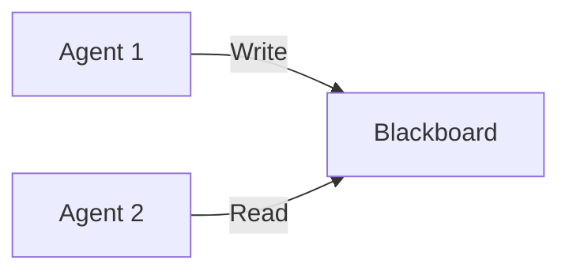

# MkDocs Best Practices - Quick Reference

This is a condensed reference guide. See [MKDOCS_BEST_PRACTICES_RESEARCH.md](MKDOCS_BEST_PRACTICES_RESEARCH.md) for comprehensive details.

---

## Core Principles

### Diataxis Framework (Industry Standard)

Organize documentation into 4 distinct types:

| Type | Purpose | User Says | Example |
|------|---------|-----------|---------|
| **Tutorials** | Learning | "I want to get started" | Quick Start, Pizza Tutorial |
| **How-To Guides** | Tasks | "I need to do X" | Create Agent, Setup Tracing |
| **Explanation** | Understanding | "Why does this work?" | Blackboard Pattern, Architecture |
| **Reference** | Information | "What's the API?" | API Docs, Configuration |

**Rule:** Never mix these types in the same document.

---

## Recommended Navigation Structure

```yaml
nav:
  - Home: index.md

  - Getting Started:              # TUTORIALS
      - Quick Start: getting-started/quick-start.md
      - Tutorial: getting-started/tutorial.md

  - How-To Guides:                # HOW-TO
      - guides/index.md
      - Agents: guides/agents/
      - Blackboard: guides/blackboard/
      - Tracing: guides/tracing/

  - Concepts:                     # EXPLANATION
      - concepts/index.md
      - Architecture: concepts/architecture.md
      - Blackboard Pattern: concepts/blackboard-pattern.md

  - Reference:                    # REFERENCE
      - API: reference/api/
      - Configuration: reference/configuration.md

  - Examples: examples/
  - Community: community/
```

---

## Essential Features to Enable

```yaml
theme:
  features:
    # Navigation
    - navigation.instant          # SPA behavior
    - navigation.tabs             # Top tabs
    - navigation.indexes          # Section index pages
    - navigation.path             # Breadcrumbs
    - navigation.top              # Back to top

    # Search
    - search.suggest
    - search.highlight
    - search.share

    # Content
    - content.code.copy           # Copy buttons
    - content.code.annotate       # Code annotations
    - content.tabs.link           # Linked tabs
```

---

## Quick Start Must-Haves

1. **5-minute time limit**
2. **Single installation command**
3. **Copy-paste ready code**
4. **Expected output shown**
5. **3-4 next step links**

```markdown
# Quick Start

## Installation
```bash
pip install flock-core
```

## Your First Agent
```python
# Simple, complete, working code
```

## Expected Output
```
Hello, World!
```

## Next Steps
- [Tutorial](tutorial.md) (15 min)
- [Concepts](../concepts/index.md)
- [Examples](../examples/index.md)
```

---

## Code Examples Best Practices

### Tabbed Examples

```markdown
=== "Python 3.11+"
    ```python
    # Code here
    ```

=== "Python 3.9+"
    ```python
    # Code here
    ```
```

### Code Annotations

```markdown
```python
agent = Agent(
    name="processor",  # (1)!
    timeout=30         # (2)!
)
```

1. Unique agent identifier
2. Timeout in seconds
```
```

### Include Tested Code

```markdown
```python
--8<-- "examples/pizza/agent.py:main_snippet"
```
```

---

## Admonitions (Callouts)

```markdown
!!! tip "Performance Tip"
    Use async agents for high throughput

!!! warning "Breaking Change in 0.5.0"
    API changed - update your code

!!! example "Complete Example"
    Full working code here

!!! note
    General information

??? info "Collapsible (Click to expand)"
    Hidden by default
```

---

## API Documentation Auto-Generation

### Required Plugins

```yaml
plugins:
  - search
  - gen-files:
      scripts:
        - scripts/gen_ref_pages.py
  - literate-nav:
      nav_file: SUMMARY.md
  - section-index
  - mkdocstrings:
      handlers:
        python:
          options:
            docstring_style: google
            show_source: true
```

### Script: `scripts/gen_ref_pages.py`

See full research document for complete script that:
- Scans all Python files
- Generates markdown with `::: module.path`
- Creates SUMMARY.md navigation
- Sets edit paths

---

## Search Optimization

### Page Front Matter

```markdown
---
title: Quick Start Guide - Flock
description: Get started in 5 minutes with AI agents
search:
  boost: 2              # Higher ranking
tags:
  - getting-started
  - beginner
---
```

### Site Configuration

```yaml
plugins:
  - search:
      separator: '[\s\-,:!=\[\]()"`/]+|\.(?!\d)|&[lg]t;|(?!\b)(?=[A-Z][a-z])'
```

---

## Version Management with Mike

```bash
# Deploy version
mike deploy --push --update-aliases 0.5.0 latest

# Set default
mike set-default --push latest

# Deploy dev version
mike deploy --push dev
```

```yaml
# mkdocs.yml
extra:
  version:
    provider: mike
    default: latest
```

---

## Essential Markdown Extensions

```yaml
markdown_extensions:
  # Core
  - admonition
  - pymdownx.details
  - pymdownx.superfences:
      custom_fences:
        - name: mermaid
          class: mermaid
          format: !!python/name:pymdownx.superfences.fence_code_format

  # Code
  - pymdownx.highlight:
      anchor_linenums: true
  - pymdownx.snippets
  - pymdownx.tabbed:
      alternate_style: true

  # Content
  - attr_list
  - md_in_html
  - tables
  - toc:
      permalink: true
```

---

## Diagrams with Mermaid

```markdown

```

---

## File Structure

```
docs/
├── index.md                    # Landing page
├── getting-started/
│   ├── index.md
│   ├── installation.md
│   ├── quick-start.md
│   └── tutorial.md
├── guides/                     # How-to guides
│   ├── index.md
│   ├── agents/
│   ├── blackboard/
│   └── tracing/
├── concepts/                   # Explanations
│   ├── index.md
│   ├── architecture.md
│   └── blackboard-pattern.md
├── reference/                  # Reference
│   ├── index.md
│   ├── api/                    # Auto-generated
│   ├── configuration.md
│   └── cli.md
├── examples/
│   ├── index.md
│   └── *.md
├── community/
│   ├── index.md
│   ├── contributing.md
│   └── changelog.md
├── assets/
│   ├── images/
│   └── diagrams/
├── stylesheets/
│   └── extra.css
├── javascripts/
│   └── extra.js
└── internal/                   # Excluded
```

---

## Performance & SEO

```yaml
plugins:
  # Social cards
  - social:
      cards: true

  # Optimization
  - optimize:
      enabled: true

  # Minification
  - minify:
      minify_html: true
```

---

## 2024-2025 Trends

1. **Interactive Code** - PyScript, playgrounds, live editors
2. **AI Integration** - AI search, chatbots, personalized content
3. **Rich Media** - Videos, animations, interactive diagrams
4. **Accessibility** - WCAG AA, keyboard nav, screen readers
5. **Performance** - < 2s load time, offline support, PWA

---

## Success Metrics

Track:
- Time on page (target: > 2 min)
- Search usage (target: > 40%)
- Positive feedback (target: > 75%)
- Tutorial completion rate

---

## Quick Wins for Flock

1. Add `getting-started/tutorial-pizza.md` using existing example
2. Create section index pages (`guides/index.md`, etc.)
3. Add code annotations to examples
4. Setup mkdocstrings for API docs
5. Add search boost to getting-started pages
6. Create mermaid diagram of blackboard pattern
7. Add "Next Steps" to every tutorial
8. Include expected output in all examples

---

## Examples to Study

- **FastAPI** - https://fastapi.tiangolo.com/
- **Pydantic** - https://docs.pydantic.dev/
- **Material for MkDocs** - https://squidfunk.github.io/mkdocs-material/
- **LangChain** - https://python.langchain.com/

---

**Full Research:** [MKDOCS_BEST_PRACTICES_RESEARCH.md](MKDOCS_BEST_PRACTICES_RESEARCH.md)
