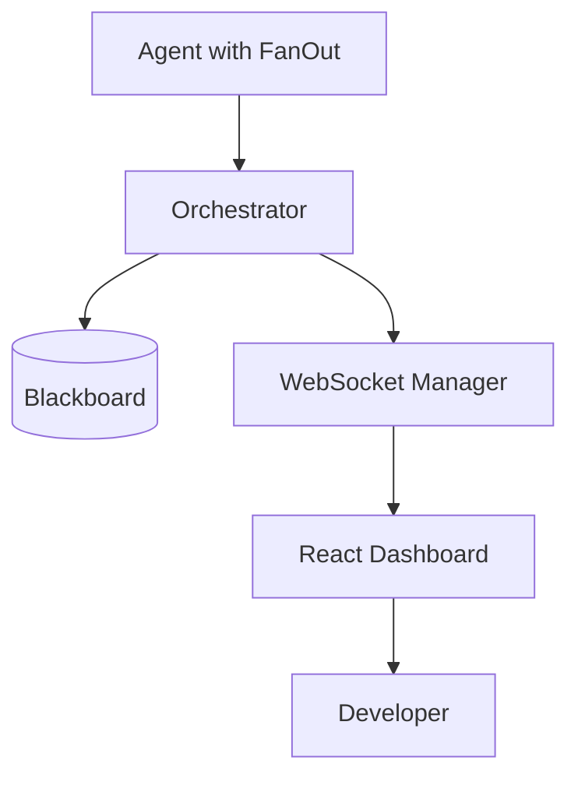
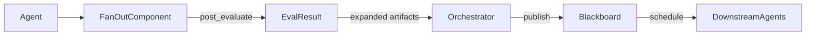
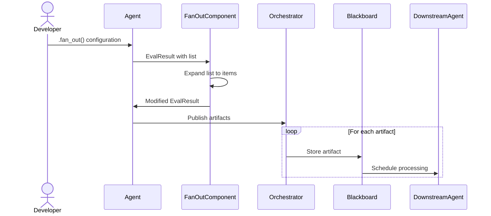

# Solution Design Document

## Validation Checklist
- [x] Quality Goals prioritized (top 3-5 architectural quality attributes)
- [x] Constraints documented (technical, organizational, security/compliance)
- [x] Implementation Context complete (required sources, boundaries, external interfaces, project commands)
- [x] Solution Strategy defined with rationale
- [x] Building Block View complete (components, directory map, interface specifications)
- [x] Runtime View documented (primary flow, error handling, complex logic)
- [x] Deployment View specified (environment, configuration, dependencies, performance)
- [x] Cross-Cutting Concepts addressed (patterns, interfaces, system-wide patterns, implementation patterns)
- [x] Architecture Decisions captured with trade-offs
- [x] **All Architecture Decisions confirmed by user** (no pending confirmations)
- [x] Quality Requirements defined (performance, usability, security, reliability)
- [x] Risks and Technical Debt identified (known issues, technical debt, implementation gotchas)
- [x] Test Specifications complete (critical scenarios, coverage requirements)
- [x] Glossary defined (domain and technical terms)
- [x] No [NEEDS CLARIFICATION] markers remain

---

## Constraints

- Technical: Python 3.10+, asyncio support, Pydantic 2.x, React 19.x, TypeScript 5.x
- Organizational: Follow existing component patterns, maintain backward compatibility
- Security/Compliance: Respect artifact visibility, maintain audit trails, rate limit WebSocket events

## Implementation Context

### Required Context Sources

#### General Context

```yaml
# Internal documentation and patterns
- doc: docs/patterns/fan-out-pattern.md
  relevance: HIGH
  why: "Core pattern analysis and architectural approach"

- doc: docs/patterns/component-architecture.md
  relevance: HIGH
  why: "Component lifecycle and hook patterns"

- doc: docs/patterns/fanout-implementation-guide.md
  relevance: HIGH
  why: "Detailed implementation blueprint"

- doc: docs/patterns/ui-fanout-requirements.md
  relevance: HIGH
  why: "UI components and visualization requirements"

- doc: docs/patterns/parallel-streaming-architecture.md
  relevance: HIGH
  why: "Runtime mode detection and streaming patterns"

- doc: AGENTS.md
  relevance: MEDIUM
  why: "Project structure and conventions"
```

#### Component: Backend (Flock Core)

```yaml
Location: src/flock/

# Source code files that must be understood
- file: src/flock/components.py
  relevance: HIGH
  sections: [AgentComponent, post_evaluate hook]
  why: "Base class for FanOutComponent implementation"

- file: src/flock/agent.py
  relevance: HIGH
  sections: [AgentBuilder]
  why: "Where .fan_out() method will be added"

- file: src/flock/orchestrator.py
  relevance: MEDIUM
  sections: [serve method, Context]
  why: "Runtime mode detection implementation"

- file: src/flock/engines/dspy_engine.py
  relevance: HIGH
  sections: [streaming logic]
  why: "Parallel streaming modifications"

- file: src/flock/runtime.py
  relevance: MEDIUM
  why: "EvalResult structure for artifact handling"
```

#### Component: Dashboard (Frontend)

```yaml
Location: frontend/src/

# Source code files that must be understood
- file: frontend/src/components/graph/MessageNode.tsx
  relevance: HIGH
  why: "Base node component to extend"

- file: frontend/src/store/websocket.ts
  relevance: HIGH
  why: "WebSocket event handling"

- file: frontend/src/components/graph/GraphCanvas.tsx
  relevance: MEDIUM
  why: "Graph rendering and layout"
```

### Implementation Boundaries

- **Must Preserve**: Existing agent APIs, backward compatibility, blackboard semantics
- **Can Modify**: Component implementations, WebSocket events, UI components
- **Must Not Touch**: Core orchestrator scheduling logic, artifact persistence

### External Interfaces

#### System Context Diagram



### Project Commands

```bash
# Component: Backend (Flock)
Location: /Users/ara/Projects/flock-workshop/flock

## Environment Setup
Install Dependencies: poe install  # or: uv sync --dev --all-groups --all-extras
Environment Variables: export OPENAI_API_KEY="sk-..."
Start Development: poe serve  # or: uvicorn src.flock.cli:app

# Testing Commands
Unit Tests: poe test  # or: uv run pytest tests/
Integration Tests: poe test-integration
E2E Tests: poe test-e2e
Test Coverage: poe test-cov

# Code Quality Commands
Linting: poe lint  # or: ruff check src/
Type Checking: uv run mypy src/flock/
Formatting: poe format  # or: ruff format src/

# Build & Compilation
Build Project: uv build
Watch Mode: N/A (Python)

# Component: Frontend (Dashboard)
Location: frontend/

## Environment Setup
Install Dependencies: npm install
Start Development: npm run dev

# Testing Commands
Unit Tests: npm test
Test Coverage: npm run test:coverage

# Code Quality Commands
Type Checking: npm run type-check
Formatting: npm run format

# Build
Build Project: npm run build
```

## Solution Strategy

- Architecture Pattern: Component-based plugin architecture with lifecycle hooks
- Integration Approach: FanOutComponent intercepts post_evaluate to transform artifacts
- Justification: Maintains separation of concerns, engine stays pure, orchestrator unmodified
- Key Decisions: Explicit .fan_out() for clarity, runtime mode detection for parallel streaming

## Building Block View

### Components



### Directory Map

**Component**: Backend (Flock)
```
src/flock/
├── components/
│   └── fanout.py              # NEW: FanOutComponent implementation
├── agent.py                   # MODIFY: Add .fan_out() builder method
├── runtime.py                 # MODIFY: Add RuntimeMode enum
├── orchestrator.py            # MODIFY: Set runtime_mode in serve()
└── engines/
    └── dspy_engine.py         # MODIFY: Check runtime_mode for streaming
```

**Component**: Frontend (Dashboard)
```
frontend/src/
├── components/
│   └── graph/
│       ├── FanOutNode.tsx     # NEW: Fan-out visualization node
│       └── MessageNode.tsx    # MODIFY: Add fan-out relationship props
├── store/
│   └── websocket.ts          # MODIFY: Handle fan-out events
└── types/
    └── events.ts             # MODIFY: Add fan-out event types
```

### Interface Specifications

#### Data Storage Changes

No database schema changes required.

#### Internal API Changes

```yaml
# Python API Extension
Method: AgentBuilder.fan_out()
  Parameters:
    list_field: str = "items"
    preserve_correlation: bool = True
    max_items: Optional[int] = None
  Returns: Self (for chaining)

# WebSocket Event Extensions
Event: message_published
  Additional Fields:
    is_fan_out_parent: boolean
    fan_out_count: number
    parent_artifact_id: string
    sequence_index: number
```

## Runtime View

### Primary Flow

#### Primary Flow: Fan-Out Execution
1. User adds `.fan_out()` to agent builder
2. Agent publishes artifact with list field
3. FanOutComponent intercepts in post_evaluate hook
4. Component expands list into individual artifacts
5. Orchestrator publishes each artifact separately
6. Downstream agents process items in parallel
7. Dashboard visualizes parallel execution



### Error Handling
- Empty list: No artifacts published (intentional no-op)
- Missing field: Pass through unchanged, log warning
- Memory limit: Apply max_items cap, log truncation

## Deployment View

No change to existing deployment - feature is opt-in via `.fan_out()` method.

## Cross-Cutting Concepts

### Pattern Documentation

```yaml
# Existing patterns used
- pattern: docs/patterns/component-architecture.md
  relevance: CRITICAL
  why: "Base pattern for FanOutComponent implementation"

# New patterns created
- pattern: docs/patterns/fan-out-pattern.md
  relevance: CRITICAL
  why: "Core fan-out pattern documentation"
```

### System-Wide Patterns

- Security: Maintain artifact visibility and correlation IDs
- Error Handling: Graceful degradation, log warnings for edge cases
- Performance: Lazy creation, batch events for large fan-outs
- Logging/Auditing: Track fan-out operations with metrics

### Implementation Patterns

See `/docs/patterns/fanout-implementation-guide.md` for complete code patterns.

## Architecture Decisions

- [x] **Component-based approach**: Use AgentComponent for fan-out
  - Rationale: Clean separation, reusable, pluggable
  - Trade-offs: Requires understanding component lifecycle
  - User confirmed: ✓

- [x] **Explicit .fan_out() method**: Require explicit opt-in
  - Rationale: Clear intent, no surprises, discoverable
  - Trade-offs: Not automatic, requires code change
  - User confirmed: ✓

- [x] **Runtime mode detection**: Enable parallel streaming in dashboard
  - Rationale: Remove artificial limitation, better UX
  - Trade-offs: Added complexity in Context
  - User confirmed: ✓

## Quality Requirements

- Performance: <10ms overhead for small fan-outs, <500ms for large (1000 items)
- Usability: Discoverable via IDE autocomplete, clear documentation
- Security: Respect visibility, rate limit events (100/sec)
- Reliability: Graceful edge case handling, no data loss

## Risks and Technical Debt

### Known Technical Issues

- Current streaming limitation is artificial (CLI-only constraint)
- WebSocket may need backpressure for very large fan-outs

### Technical Debt

- Single stream limitation should be removed for dashboard
- Consider batch artifact creation for performance

### Implementation Gotchas

- Rich Live conflicts prevent multiple CLI streams
- Correlation ID preservation critical for tracking
- Memory usage scales with fan-out size

## Test Specifications

### Critical Test Scenarios

**Scenario 1: Basic Fan-Out**
```gherkin
Given: Agent configured with .fan_out(list_field="items")
When: Agent publishes artifact with items=["a", "b", "c"]
Then: Three individual artifacts created
And: Each has parent correlation ID
And: Each has sequence metadata
```

**Scenario 2: Edge Cases**
```gherkin
Given: Agent with fan-out enabled
When: Empty list published
Then: No artifacts created
And: No errors raised
```

**Scenario 3: Parallel Streaming**
```gherkin
Given: Dashboard mode active
When: Multiple agents stream simultaneously
Then: All streams display in parallel
And: No stream conflicts occur
```

### Test Coverage Requirements

- **Business Logic**: Fan-out expansion logic, metadata preservation
- **Integration Points**: Component hooks, WebSocket events
- **Edge Cases**: Empty lists, missing fields, max_items limits
- **Performance**: Large fan-outs, memory usage

## Glossary

### Domain Terms

| Term | Definition | Context |
|------|------------|---------|
| Fan-out | Expanding a list into individual items | Core pattern for parallel processing |
| Artifact | Typed message on blackboard | Unit of work in Flock |
| Correlation ID | Links related artifacts | Maintains relationships |

### Technical Terms

| Term | Definition | Context |
|------|------------|---------|
| post_evaluate | Component lifecycle hook | Where fan-out transformation occurs |
| RuntimeMode | Execution context enum | Determines streaming behavior |
| EvalResult | Evaluation output container | Contains artifacts to publish |
