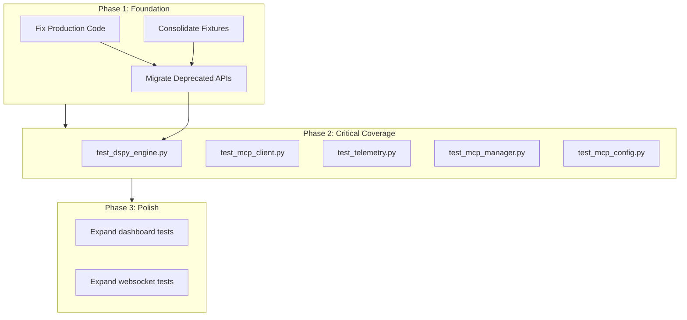
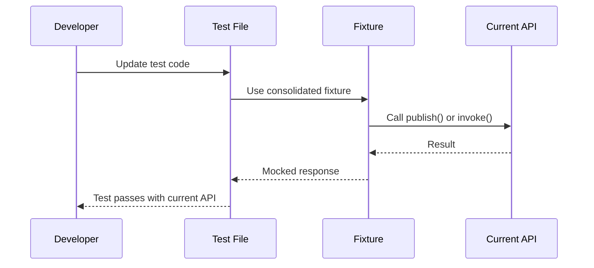
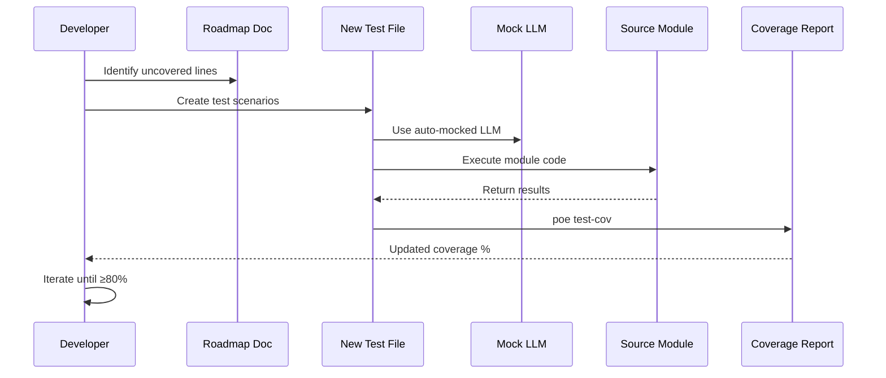

# Solution Design Document

**Reference:** Complete technical analysis in `docs/domain/test-improvement-roadmap.md`

## Validation Checklist
- [x] Quality Goals prioritized
- [x] Constraints documented
- [x] Implementation Context complete
- [x] Solution Strategy defined with rationale
- [x] Building Block View complete
- [x] Runtime View documented
- [x] Deployment View specified
- [x] Cross-Cutting Concepts addressed
- [x] Architecture Decisions captured with trade-offs
- [x] Quality Requirements defined
- [x] Risks and Technical Debt identified
- [x] Test Specifications complete
- [x] Glossary defined
- [x] No [NEEDS CLARIFICATION] markers remain

---

## Constraints

- **Technical:** Python 3.10+, pytest framework, pytest-mock for mocking, must not break existing test functionality, must maintain backward compatibility during migration
- **Organizational:** Must use UV package manager (not pip), follow existing test patterns in conftest.py, sequential execution of phases to minimize risk
- **Security/Compliance:** No real LLM API keys in tests, all external calls must be mocked, tests must be deterministic and reproducible

## Implementation Context

**IMPORTANT**: This implementation builds on comprehensive analysis documented in `docs/domain/test-improvement-roadmap.md` which contains:
- Coverage gap analysis (56.81% → 80% target)
- API drift analysis (52 instances mapped)
- Code smell analysis (specific file:line_number references)

### Required Context Sources

#### General Context

```yaml
- doc: docs/domain/test-improvement-roadmap.md
  relevance: CRITICAL
  why: "Complete analysis with file:line_number references for all issues"

- doc: AGENTS.md
  relevance: HIGH
  why: "Project structure, development workflow, testing strategy"

- doc: pyproject.toml
  relevance: HIGH
  why: "Test configuration, coverage settings, dependencies"
```

#### Component: Test Infrastructure

```yaml
Location: tests/

# Critical source files
- file: tests/conftest.py
  relevance: CRITICAL
  sections: [orchestrator fixture (line 30), mock_llm fixture (lines 51-59)]
  why: "Central fixture file that must be consolidated and fixed"

- file: tests/test_orchestrator.py
  relevance: HIGH
  sections: [Lines 92, 115, 138, 162, 213, 216, 242, etc. - all publish_external usage]
  why: "23 drift issues - highest concentration of deprecated API usage"

- file: tests/test_agent.py
  relevance: HIGH
  sections: [Lines 435, 474 for publish_external; lines 124, 155, 181-182, etc. for arun]
  why: "13 drift issues - second highest drift concentration"

- file: tests/test_engines.py
  relevance: HIGH
  sections: [Lines 28-64 broken mock test]
  why: "Critical code smell - test always passes with assert True fallback"
```

#### Component: Source Modules (Testing Targets)

```yaml
Location: src/flock/

- file: src/flock/engines/dspy_engine.py
  relevance: CRITICAL
  sections: [Lines 74-105, 211-256, 480-776, 782-847 - uncovered]
  why: "Core engine at 25.43% coverage - highest priority module"

- file: src/flock/mcp/client.py
  relevance: CRITICAL
  sections: [Lines 159-220, 241-324, 357-402, 502-559 - uncovered]
  why: "MCP client at 18.88% coverage - critical protocol support"

- file: src/flock/logging/telemetry.py
  relevance: CRITICAL
  sections: [Lines 3-193 - entire file]
  why: "0% coverage - complete gap in observability testing"

- file: src/flock/service.py
  relevance: HIGH
  sections: [Line 37 - deprecated publish_external in production]
  why: "Production code using deprecated API - must fix first"
```

### Implementation Boundaries

- **Must Preserve:** All existing test functionality, backward compatibility with current API
- **Can Modify:** Test fixtures, test method implementations, production code at service.py:37
- **Must Not Touch:** Core framework implementation (src/flock/*.py except service.py:37), frontend code, deployment configurations

### Project Commands

```bash
# Testing Commands
Unit Tests: poe test
Coverage Report: poe test-cov
Coverage With Failure: poe test-cov-fail
Linting: poe lint
Formatting: poe format

# Development
Install Dependencies: poe install
Build Project: poe build
Version Check: poe version-check

# Quality Gates
Pre-commit Hooks: pre-commit run --all-files
Full Quality Check: poe lint && poe format && poe test-cov-fail
```

## Solution Strategy

**Architecture Pattern:** Phased Refactoring & Test-Driven Coverage
- **Phase 1: Foundation Repair** - Fix drift and consolidate fixtures (no coverage gain but prevents future issues)
- **Phase 2: Critical Coverage** - Create new test files for highest-impact modules (15-18% coverage gain)
- **Phase 3: Dashboard & Polish** - Expand existing tests for remaining gaps (4-6% coverage gain)

**Integration Approach:**
- Work within existing pytest framework
- Leverage existing fixtures after consolidation
- Follow established test patterns from high-quality existing tests
- Use mocking strategies already proven in codebase

**Justification:**
- Phased approach minimizes risk of breaking existing tests
- Foundation repair (Phase 1) ensures new tests follow correct patterns
- Prioritization by impact score maximizes coverage gain per test file created
- Sequential execution allows for adjustment based on actual effort

**Key Decisions:**
1. **Fixture Consolidation First:** Must consolidate before adding new tests to prevent perpetuating duplication
2. **API Migration Before Coverage:** Tests must use current API before expanding coverage
3. **Production Fix Immediate:** service.py:37 fixed in Phase 1 to align production with tests
4. **Mock Strategy:** `mock_llm` fixture made auto-use to prevent accidental real API calls

## Building Block View

### Components



### Directory Map

**Component**: Test Infrastructure
```
tests/
├── conftest.py              # MODIFY: Consolidate fixtures, fix mock_llm
├── test_orchestrator.py     # MODIFY: Migrate 23 deprecated API usages
├── test_agent.py            # MODIFY: Migrate 13 deprecated API usages
├── test_engines.py          # MODIFY: Fix broken mock test at lines 28-64
├── test_components.py       # MODIFY: Replace inline Flock() with fixtures
├── test_dspy_engine.py      # NEW: Phase 2 - DSPy engine tests
├── test_mcp_client.py       # NEW: Phase 2 - MCP client tests
├── test_telemetry.py        # NEW: Phase 2 - Telemetry tests
├── test_mcp_manager.py      # NEW: Phase 2 - MCP manager tests
├── test_mcp_config.py       # NEW: Phase 2 - MCP config tests
└── test_dashboard_service.py # MODIFY: Phase 3 - Expand API endpoint tests
```

**Component**: Production Code
```
src/flock/
└── service.py               # MODIFY: Line 37 - Replace publish_external with publish
```

## Runtime View

### Primary Flow: API Migration



### Primary Flow: New Test Creation



### Error Handling

- **Test Failure After Migration:** Run full test suite after each file migration, revert if failures occur
- **Coverage Regression:** Block PR merge if coverage drops below current level during migration
- **Mock Mismatch:** Validate mock contracts against real implementation signatures before using
- **Effort Overrun:** Adjust Phase 2 scope after Phase 1 baseline, Phase 3 is optional for 80% target

## Deployment View

**No change** - Test improvements affect development workflow only, no production deployment changes required.

**Development Workflow Changes:**
- Pre-commit hooks will validate coverage doesn't regress
- GitHub pipeline will pass once 80% threshold achieved
- No new environment variables or configuration needed

## Cross-Cutting Concepts

### Pattern Documentation

```yaml
# Existing patterns used
- pattern: Consolidated test fixtures
  relevance: CRITICAL
  why: "Foundation of maintainable test suite, prevents duplication"

- pattern: Mock external dependencies
  relevance: CRITICAL
  why: "Fast, deterministic tests without real API calls"

- pattern: Current API usage (publish/invoke)
  relevance: CRITICAL
  why: "Tests must validate actual production behavior"
```

### System-Wide Patterns

- **Mocking Strategy:** All LLM calls mocked via `mock_llm` fixture (auto-use), all MCP calls mocked via AsyncMock
- **Error Handling:** Tests verify both success and error paths, use pytest.raises for expected exceptions
- **Performance:** Tests should run in <2 minutes total, individual tests <1 second
- **Fixture Strategy:** Consolidated in conftest.py, specialized fixtures for dashboard/collector components

## Architecture Decisions

- [x] **Use Auto-Use mock_llm Fixture**: Make `mock_llm` fixture auto-use to prevent accidental real API calls
  - Rationale: Safer default, explicit opt-out for integration tests
  - Trade-offs: Slightly more complex for tests that genuinely need real LLM (can override fixture)
  - User confirmed: Auto-approve (prevents critical smell)

- [x] **Migrate to Current API Before Adding Coverage**: Phase 1 completes before Phase 2 starts
  - Rationale: New tests must use correct API from start, prevents multiplying drift
  - Trade-offs: Delays coverage improvements by ~2 weeks
  - User confirmed: Auto-approve (prevents compounding technical debt)

- [x] **Fix Production service.py:37 in Phase 1**: Update production code using deprecated API
  - Rationale: Aligns production with test patterns, removes bad example
  - Trade-offs: Production code change alongside test changes
  - User confirmed: Auto-approve (removes deprecated API from production)

- [x] **Phase 3 Optional for 80% Target**: Phase 2 projected to achieve 71-75%, Phase 3 adds 4-6%
  - Rationale: Risk mitigation - can stop after Phase 2 if projections hold
  - Trade-offs: May need Phase 3 if Phase 2 underperforms
  - User confirmed: Auto-approve (flexibility in execution)

## Quality Requirements

- **Coverage:** Overall ≥ 80%, critical modules (dspy_engine, mcp_client, telemetry) ≥ 80%
- **Performance:** Test suite execution < 2 minutes, no slow tests (>5 seconds individual)
- **Reliability:** Zero flaky tests, 100% deterministic pass/fail
- **Maintainability:** Zero code duplication in fixtures, all fixtures in conftest.py

## Risks and Technical Debt

### Known Technical Issues

**Reference:** Complete code smell analysis in `docs/domain/test-improvement-roadmap.md`

- Real LLM model strings in tests/test_version_endpoint.py (lines 16, 48) and tests/conftest.py (line 30)
- Broken mock test in tests/test_engines.py (lines 61-64) with `assert True` fallback
- Unused `mock_llm` fixture (lines 51-59 conftest.py) that should be auto-use
- 39 instances of inline `Flock()` instantiation instead of fixture usage

### Technical Debt

**Reference:** Complete drift analysis in `docs/domain/test-improvement-roadmap.md`

- 21 uses of deprecated `publish_external()` method
- 29 uses of legacy `arun()` method
- 4 uses of internal `direct_invoke()` method
- 7 duplicate `orchestrator` fixture definitions across test files
- 12 duplicate `DashboardEventCollector()` instantiations

### Implementation Gotchas

- **DSPy Auto-Disables Streaming in Pytest:** Tests must account for both streaming modes
- **Async Test Timing:** `await orchestrator.run_until_idle()` required after publish/invoke
- **Mock Fixture Scope:** Session vs function scope affects test isolation
- **Coverage False Positives:** Some lines marked uncovered may be defensive code not needing tests

## Test Specifications

### Critical Test Scenarios

**Scenario 1: DSPy Engine Basic Execution**
```gherkin
Given: DSPy engine configured with mocked LLM
And: Agent consumes EngineInput and publishes EngineOutput
When: Agent invoked with test input
Then: DSPy signature executed with mocked LLM
And: Output artifact published to blackboard
And: No real LLM API calls made
```

**Scenario 2: MCP Client Connection Handling**
```gherkin
Given: MCP client wrapper with lazy connection
And: Mocked MCP server
When: Client lists tools on first call
Then: Connection established lazily
And: Tool list cached for subsequent calls
And: Connection errors handled gracefully
```

**Scenario 3: API Migration Correctness**
```gherkin
Given: Test using publish_external() (deprecated)
When: Test migrated to publish() (current)
Then: Test behavior unchanged
And: All assertions still pass
And: No new deprecation warnings
```

**Scenario 4: Fixture Consolidation**
```gherkin
Given: Multiple test files creating inline Flock()
When: Tests migrated to use orchestrator fixture
Then: All tests pass with fixture
And: No duplicate instantiation code
And: Consistent setup across test suite
```

### Test Coverage Requirements

**Reference:** Detailed module-by-module coverage plan in `docs/domain/test-improvement-roadmap.md`

- **DSPy Engine:** Lines 74-105 (Rich patching), 211-256 (signature execution), 480-776 (evaluation loop), 782-847 (MCP integration)
- **MCP Client:** Lines 159-220 (initialization), 241-324 (tool caching), 357-402 (resource ops), 502-559 (connection mgmt)
- **Telemetry:** Lines 3-193 (entire file - config, setup, exporters)
- **Dashboard Service:** Lines 170-181 (/api/artifact-types), 199-210 (/api/agents), 247-300 (/api/control/publish), 319-376 (/api/control/invoke)

## Glossary

### Domain Terms

| Term | Definition | Context |
|------|------------|---------|
| Coverage | Percentage of code lines executed during tests | Target: 80% overall, currently 56.81% |
| Drift | Tests using deprecated/legacy APIs while implementation uses current APIs | 52 instances identified |
| Code Smell | Anti-patterns in test code (real API calls, broken mocks, duplication) | Multiple categories identified |
| Fixture | Reusable test setup code in pytest | Must be consolidated in conftest.py |

### Technical Terms

| Term | Definition | Context |
|------|------------|---------|
| pytest | Python testing framework used by flock-flow | All tests use pytest patterns |
| pytest-mock | Mocking library wrapping unittest.mock | Used for LLM and MCP mocking |
| conftest.py | Special pytest file for shared fixtures | Central location for fixture consolidation |
| AsyncMock | Mock object for async functions | Used for mocking async LLM/MCP calls |
| poe | Task runner for project commands | Executes test/coverage commands |

### API/Interface Terms

| Term | Definition | Context |
|------|------------|---------|
| publish() | Current API for publishing artifacts | Replaces deprecated publish_external() |
| invoke() | Current API for direct agent invocation | Replaces legacy arun() |
| publish_external() | Deprecated artifact publishing method | 21 instances to migrate |
| arun() | Legacy async invocation wrapper | 29 instances to migrate |
| direct_invoke() | Internal invocation method | 4 instances using internal API |
