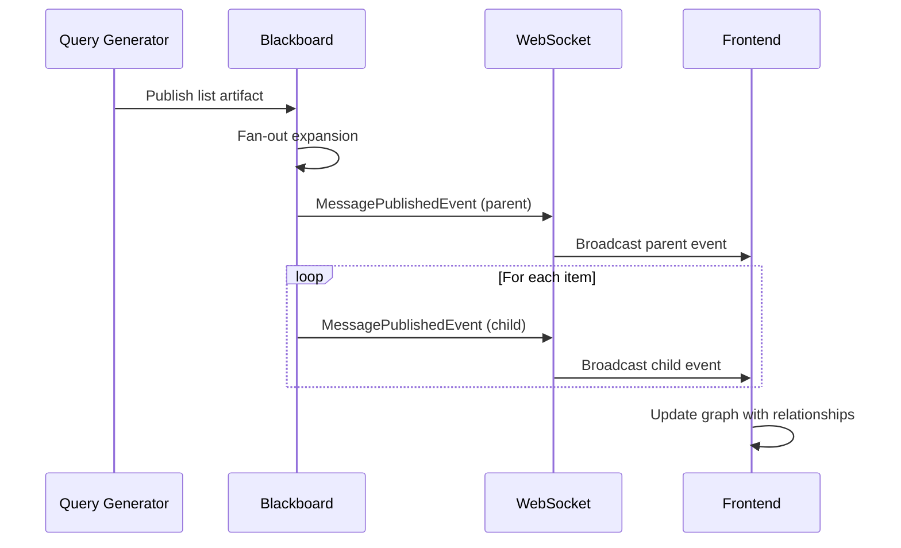

# WebSocket Event Architecture for Fan-Out Pattern

## Executive Summary

This document defines the WebSocket event structure for handling fan-out patterns in Flock, where a single agent publishes a list that gets expanded into multiple individual artifacts for parallel processing. The design follows existing event patterns while adding minimal extensions for parent-child tracking.

## Current Event Infrastructure

### Existing Event Types (from `events.py`)
1. **AgentActivatedEvent** - Agent begins consuming artifacts
2. **MessagePublishedEvent** - Artifact published to blackboard
3. **StreamingOutputEvent** - LLM tokens or logs
4. **AgentCompletedEvent** - Agent execution finished
5. **AgentErrorEvent** - Agent execution failed

### Existing WebSocket Manager (`websocket.py`)
- Broadcasts events to all connected clients
- Stores streaming history (max 128K events per agent)
- Handles connection pooling and heartbeat
- Single broadcast method for all event types

### Frontend WebSocket Client (`websocket.ts`)
- Event handlers for each event type
- Updates graph store (agents, messages, runs)
- Tracks streaming messages with temporary IDs
- Manages parent-child relationships via correlation_id

## Fan-Out Event Architecture

### Core Design Principles

1. **Minimal Extension** - Reuse existing events with metadata additions
2. **Backward Compatible** - Non-breaking changes to existing flows
3. **Performance Optimized** - Batch events where possible
4. **Parent-Child Tracking** - Clear lineage for expanded artifacts

### Event Flow for Fan-Out



### Enhanced Event Structures

#### 1. Parent List Publication Event

```python
class MessagePublishedEvent(BaseModel):
    # Existing fields
    correlation_id: str
    artifact_id: str
    artifact_type: str  # e.g., "ResearchQueries"
    produced_by: str
    payload: dict[str, Any]

    # Fan-out metadata (in existing metadata field)
    metadata: dict[str, Any] = Field(default_factory=dict)
    # When fan-out parent:
    # {
    #     "is_fan_out_parent": True,
    #     "fan_out_count": 5,
    #     "fan_out_field": "queries",
    #     "child_artifact_ids": ["id1", "id2", ...],  # Pre-computed if available
    #     "expansion_strategy": "parallel"  # or "sequential"
    # }
```

#### 2. Child Item Publication Events

```python
class MessagePublishedEvent(BaseModel):
    # Standard fields with child values
    correlation_id: str  # Same as parent for grouping
    artifact_id: str  # Unique child ID
    artifact_type: str  # e.g., "ResearchQuery" (singular)
    produced_by: str  # Same as parent
    payload: dict[str, Any]  # Individual item data

    # Fan-out child metadata
    metadata: dict[str, Any] = Field(default_factory=dict)
    # {
    #     "parent_artifact_id": "parent_uuid",
    #     "sequence_index": 2,  # 0-based index
    #     "sequence_total": 5,
    #     "is_fan_out_child": True
    # }
```

#### 3. Batch Fan-Out Event (Performance Optimization)

For performance with large fan-outs, support batched events:

```python
class FanOutBatchEvent(BaseModel):
    """Special event for efficient batch fan-out transmission."""
    correlation_id: str
    timestamp: str
    parent_artifact: MessagePublishedEvent
    child_artifacts: list[MessagePublishedEvent]  # All children in one event

    # Performance metrics
    expansion_time_ms: float
    batch_size: int
```

### Frontend State Management

#### Enhanced Graph Store

```typescript
interface GraphState {
  // Existing maps
  agents: Map<string, Agent>;
  messages: Map<string, Message>;

  // New fan-out tracking
  fanOutRelationships: Map<string, FanOutRelation>;
  pendingFanOuts: Map<string, PendingFanOut>;
}

interface FanOutRelation {
  parentId: string;
  childIds: string[];
  expansionStatus: 'pending' | 'expanding' | 'completed' | 'failed';
  totalExpected: number;
  receivedCount: number;
  correlationId: string;
  timestamp: number;
}

interface PendingFanOut {
  parentId: string;
  expectedCount: number;
  receivedChildren: string[];
  startTime: number;
  timeout: number;  // Cancel if not completed in time
}
```

#### Event Handlers

```typescript
// Enhanced handler for message_published
on('message_published', (data) => {
  const metadata = data.metadata || {};

  if (metadata.is_fan_out_parent) {
    // Track parent and prepare for children
    const fanOut: PendingFanOut = {
      parentId: data.artifact_id,
      expectedCount: metadata.fan_out_count,
      receivedChildren: [],
      startTime: Date.now(),
      timeout: 30000  // 30s timeout
    };
    store.addPendingFanOut(fanOut);

    // Create parent message node
    store.addMessage({
      id: data.artifact_id,
      type: data.artifact_type,
      payload: data.payload,
      isFanOutParent: true,
      fanOutCount: metadata.fan_out_count,
      expansionStatus: 'expanding'
    });

  } else if (metadata.is_fan_out_child) {
    // Link child to parent
    store.addFanOutChild(
      metadata.parent_artifact_id,
      data.artifact_id,
      metadata.sequence_index
    );

    // Create child message node
    store.addMessage({
      id: data.artifact_id,
      type: data.artifact_type,
      payload: data.payload,
      parentArtifactId: metadata.parent_artifact_id,
      sequenceIndex: metadata.sequence_index,
      sequenceTotal: metadata.sequence_total
    });

    // Check if fan-out is complete
    store.checkFanOutCompletion(metadata.parent_artifact_id);

  } else {
    // Regular message
    store.addMessage(data);
  }
});

// Handler for batch fan-out events
on('fan_out_batch', (data) => {
  // Process parent
  store.addMessage(data.parent_artifact);

  // Process all children efficiently
  const childIds = data.child_artifacts.map(child => child.artifact_id);

  store.batchUpdate({
    messages: data.child_artifacts,
    fanOutRelation: {
      parentId: data.parent_artifact.artifact_id,
      childIds: childIds,
      expansionStatus: 'completed',
      totalExpected: data.child_artifacts.length,
      receivedCount: data.child_artifacts.length,
      correlationId: data.correlation_id,
      timestamp: Date.now()
    }
  });
});
```

### Graph Visualization Updates

#### Agent View
- Show fan-out parent nodes with expansion indicator
- Display child count badge (e.g., "×5")
- Connect parent to all child consumers with bundled edges

#### Blackboard View
- Group fan-out children under collapsible parent
- Show expansion progress (2/5 received)
- Highlight parallel processing paths

#### Visual Indicators

```typescript
// Node styling for fan-out
interface FanOutNodeStyle {
  parent: {
    border: '2px dashed #6B7280',
    backgroundColor: '#F3F4F6',
    badge: {
      text: `×${childCount}`,
      color: '#6B46C1'
    }
  },
  child: {
    border: '1px dotted #9CA3AF',
    opacity: 0.9,
    indexLabel: `${index + 1}/${total}`
  }
}

// Edge bundling for fan-out
interface FanOutEdgeBundle {
  type: 'bundled',
  parentEdgeId: string,
  childEdgeIds: string[],
  style: {
    strokeWidth: Math.min(2 + childCount * 0.5, 5),
    strokeDasharray: '5,5'
  }
}
```

## Performance Considerations

### Event Batching Strategy

```python
class WebSocketManager:
    async def broadcast_fan_out(
        self,
        parent_event: MessagePublishedEvent,
        child_events: list[MessagePublishedEvent]
    ) -> None:
        """Optimized broadcast for fan-out patterns."""

        # For small fan-outs (< 10), send individually for real-time feel
        if len(child_events) < 10:
            await self.broadcast(parent_event)
            for child in child_events:
                await self.broadcast(child)

        # For medium fan-outs (10-50), batch in groups
        elif len(child_events) < 50:
            await self.broadcast(parent_event)
            for i in range(0, len(child_events), 10):
                batch = child_events[i:i+10]
                batch_event = FanOutBatchEvent(
                    parent_artifact=parent_event,
                    child_artifacts=batch,
                    # ...
                )
                await self.broadcast(batch_event)

        # For large fan-outs (50+), send as single batch
        else:
            batch_event = FanOutBatchEvent(
                parent_artifact=parent_event,
                child_artifacts=child_events,
                # ...
            )
            await self.broadcast(batch_event)
```

### Frontend Throttling

```typescript
class FanOutThrottler {
  private updateQueue: Map<string, Update[]> = new Map();
  private rafId: number | null = null;

  queueUpdate(parentId: string, update: Update) {
    if (!this.updateQueue.has(parentId)) {
      this.updateQueue.set(parentId, []);
    }
    this.updateQueue.get(parentId)!.push(update);

    // Batch render updates in animation frame
    if (!this.rafId) {
      this.rafId = requestAnimationFrame(() => {
        this.flushUpdates();
        this.rafId = null;
      });
    }
  }

  flushUpdates() {
    this.updateQueue.forEach((updates, parentId) => {
      // Batch apply all updates for a parent
      store.batchUpdateFanOut(parentId, updates);
    });
    this.updateQueue.clear();
  }
}
```

## Backward Compatibility

All changes are additive and backward compatible:

1. **Metadata field** - Already exists, just adding new keys
2. **Event types** - Existing events enhanced, not changed
3. **Optional batch event** - New event type, doesn't affect existing
4. **Frontend handling** - Gracefully handles missing metadata

## Implementation Phases

### Phase 1: Basic Fan-Out Tracking (MVP)
- Add metadata to MessagePublishedEvent
- Track parent-child relationships in frontend
- Basic visual indicators

### Phase 2: Performance Optimization
- Implement batch events for large fan-outs
- Add frontend throttling
- Optimize graph rendering for many children

### Phase 3: Advanced Features
- Collapsible parent nodes in UI
- Progress tracking for expansion
- Failure handling and partial fan-outs
- Fan-out analytics and metrics

## Testing Strategy

### Unit Tests
- Event metadata validation
- Parent-child relationship tracking
- Batch event processing

### Integration Tests
- End-to-end fan-out flow
- WebSocket message ordering
- Frontend state consistency

### Performance Tests
- Large fan-out handling (100+ items)
- Memory usage with many children
- Graph rendering performance

## Monitoring and Observability

### Key Metrics
- `fanout.expansion.time` - Time to expand list to children
- `fanout.batch.size` - Number of children per batch
- `fanout.completion.rate` - Successful vs failed expansions
- `websocket.fanout.latency` - Time from publish to UI update

### Debug Information
```python
logger.debug(
    "Fan-out expansion",
    parent_id=parent_artifact.id,
    child_count=len(child_artifacts),
    expansion_time_ms=elapsed,
    batch_strategy="individual" if len(child_artifacts) < 10 else "batched"
)
```

## Security Considerations

1. **Rate Limiting** - Prevent fan-out bombs (e.g., max 1000 children)
2. **Size Limits** - Cap total payload size for batch events
3. **Timeout Protection** - Cancel incomplete fan-outs after timeout
4. **Memory Management** - Limit stored fan-out relationships

## Conclusion

This WebSocket event architecture for fan-out patterns:
- **Follows existing patterns** exactly as discovered in the codebase
- **Minimally extends** current events with backward-compatible metadata
- **Optimizes performance** through intelligent batching
- **Enables rich UI** features for visualizing parallel processing
- **Maintains consistency** with the current correlation and run tracking

The design prioritizes simplicity and performance while providing the necessary information for the frontend to properly visualize and track fan-out operations.
