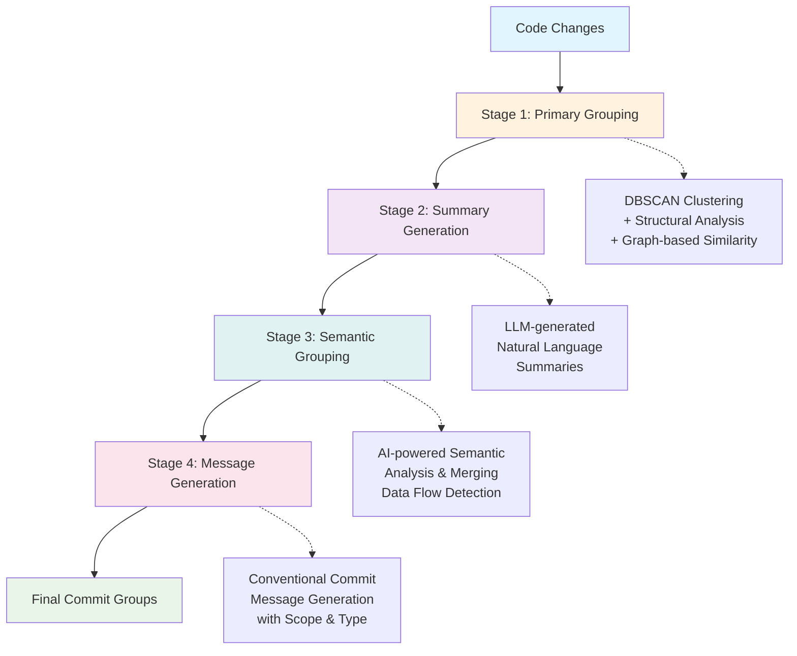

# 🧠 GroupIt

**AI-powered Git commit grouping tool for semantic code organization**

GroupIt revolutionizes how you manage Git commits by intelligently analyzing your code changes and automatically grouping related modifications into logical, semantic commits. Using advanced AI models and structural analysis, it transforms chaotic development workflows into clean, meaningful commit histories that tell the story of your code evolution.

[](https://www.python.org/downloads/)
[](https://opensource.org/licenses/MIT)
[](https://github.com/jarry3369/groupit/issues)

## 🚀 Features

- **🎯 Intelligent Grouping**: AI-powered semantic analysis groups related changes across multiple files
- **🔍 Multi-Language Support**: Comprehensive support for 50+ programming languages and file types
- **🤖 LLM Integration**: Compatible with OpenAI GPT-4, Google Gemini, and local Ollama models
- **📊 Structural Analysis**: DBSCAN clustering with architectural pattern recognition
- **💬 Conventional Commits**: Automatic generation of conventional commit messages
- **🌊 4-Stage Pipeline**: Primary grouping → Summary generation → Semantic grouping → Message generation
- **🎨 Beautiful CLI**: Rich terminal interface with colored output and progress indicators
- **⚡ Performance Optimized**: Caching, parallel processing, and batch operations

## 🛠️ Installation

from [PyPI](https://pypi.org/project/groupit/)

```bash
pip install groupit
```

## 🔧 Configuration

### LLM Provider Setup

GroupIt supports multiple LLM providers. Choose one based on your needs:

#### OpenAI (Recommended)
```bash
export OPENAI_API_KEY="your-api-key-here"
```

#### Google Gemini
```bash
export GEMINI_API_KEY="your-api-key-here"
```

#### Ollama (Local/Free)
```bash
# Install Ollama first: https://ollama.ai
ollama pull llama3.2  # or your preferred model
# No API key required for local models
```

### Environment Variables

```bash
# LLM Configuration
export GROUPIT_LLM_PROVIDER="openai"  # openai, gemini, ollama
export GROUPIT_LLM_TEMPERATURE="0.3"

# Clustering Parameters
export GROUPIT_CLUSTERING_EPS="0.35"
export GROUPIT_CLUSTERING_MIN_SAMPLES="2"

# Performance Settings
export GROUPIT_ENABLE_CACHING="true"
export GROUPIT_MAX_WORKERS="4"

# Logging
export GROUPIT_LOG_LEVEL="INFO"
export GROUPIT_DEBUG="false"
```

## 📖 Usage

### Quick Start

```bash
# Analyze staged changes with OpenAI
groupit analyze --staged --llm openai

# Analyze working directory with Gemini
groupit analyze --llm gemini --output results.json

# Use local Ollama (no API key needed)
groupit analyze --llm ollama --model llama3.2

# Create commits from analysis results
groupit commit results.json --execute
```

### Command Reference

#### Analyze Changes
```bash
groupit analyze [OPTIONS]

Options:
  --staged              Analyze only staged changes
  --llm PROVIDER        LLM provider (openai, gemini, ollama)
  --api-key KEY         API key for LLM provider
  --model MODEL         Specific model to use
  --temperature TEMP    LLM temperature (0.0-2.0)
  --eps FLOAT           DBSCAN clustering epsilon
  --min-samples INT     DBSCAN minimum samples
  --output FILE         Save results to JSON file
  --verbose, -v         Enable verbose output
  --quiet, -q           Suppress non-essential output
```

#### Create Commits
```bash
groupit commit results.json [OPTIONS]

Options:
  --execute             Actually create commits (default: dry-run)
  --auto-confirm        Don't ask for confirmation
  --force               Force creation even if repo is dirty
```

#### Check Status
```bash
groupit status [OPTIONS]

Options:
  --json                Output in JSON format
  --detailed            Show detailed information
```

#### Validate Configuration
```bash
groupit validate [OPTIONS]

Options:
  --llm-provider PROVIDER  Validate specific provider
  --api-key KEY           API key to validate
  --fix                   Attempt to fix issues
```

## 🔄 How It Works

GroupIt uses a sophisticated 4-stage pipeline to transform your messy code changes into clean, semantic commits:



### Stage 1: Primary Grouping
- **DBSCAN clustering** on code similarity vectors
- **Structural analysis** of file relationships and imports
- **Architectural pattern** recognition (page-component relationships, data flow)
- **Graph-based similarity** using NetworkX for dependency analysis

### Stage 2: Summary Generation
- **Natural language summaries** of each group using LLM
- **Context extraction** from file types, directories, and patterns
- **Fallback heuristics** for robust operation without LLM

### Stage 3: Semantic Grouping
- **Advanced LLM analysis** for data flow patterns
- **Cross-group relationship** detection
- **User journey mapping** to identify related features
- **Intelligent merging** of semantically related groups

### Stage 4: Message Generation
- **Conventional commit** message generation
- **Automatic scope detection** from file paths and types
- **Type classification** (feat, fix, refactor, docs, etc.)
- **Multi-line messages** with detailed descriptions

## 📁 Language Support

GroupIt supports 50+ programming languages and file types:

| Category | Languages/Types |
|----------|-----------------|
| **Frontend** | JavaScript, TypeScript, React (JSX/TSX), Vue, Svelte, HTML, CSS, SCSS/Sass |
| **Backend** | Python, Java, Kotlin, Scala, C/C++, C#, Go, Rust, PHP, Ruby, Swift |
| **Mobile** | iOS (Swift, Objective-C), Android (Java, Kotlin), React Native, Flutter |
| **Infrastructure** | Docker, Kubernetes, Terraform, CI/CD (GitHub Actions, GitLab CI) |
| **Data & Config** | JSON, YAML, TOML, XML, SQL, CSV, Environment files |
| **Build Systems** | Maven, Gradle, npm/yarn, pip, Cargo, CMake, Makefile |
| **Game Development** | Unity (C#), Unreal Engine, Godot (GDScript) |
| **Blockchain** | Solidity, Vyper |

## 🎯 Examples

### Example 1: Feature Development
```bash
# You've been working on a user authentication feature
# Modified: login.tsx, auth.service.ts, user.model.ts, auth.test.ts

groupit analyze --staged --llm openai
```

**Result:**
```
Group 1: feat(auth): implement user login functionality
├── login.tsx - Login form component
├── auth.service.ts - Authentication service
└── user.model.ts - User data model

Group 2: test(auth): add authentication tests
└── auth.test.ts - Test suite for auth functionality
```

### Example 2: Refactoring
```bash
# Refactored database layer across multiple files
groupit analyze --llm gemini --temperature 0.2
```

**Result:**
```
Group 1: refactor(database): modernize connection handling
├── db/connection.py - Connection pool implementation
├── db/models.py - Model base classes
└── config/database.yml - Database configuration

Group 2: refactor(database): optimize query performance
├── repositories/user_repo.py - User queries
└── repositories/product_repo.py - Product queries
```

## 🔧 Advanced Configuration

### Configuration File

Create `groupit.json` in your project root:

```json
{
  "llm": {
    "provider": "openai",
    "model": "gpt-4",
    "temperature": 0.3,
    "timeout": 30
  },
  "clustering": {
    "eps": 0.35,
    "min_samples": 2,
    "alpha": 0.4,
    "max_iterations": 2
  },
  "performance": {
    "enable_caching": true,
    "max_workers": 4,
    "batch_size": 5
  },
  "logging": {
    "level": "INFO",
    "enable_file": false
  }
}
```

Use with:
```bash
groupit analyze --config groupit.json
```

### Performance Tuning

For large repositories:
```bash
# Increase batch size for better throughput
groupit analyze --batch-size 10 --max-workers 8

# Reduce clustering sensitivity for fewer groups
groupit analyze --eps 0.5 --min-samples 3

# Use caching for repeated analysis
groupit analyze --no-caching=false
```

## 🤝 Contributing

We welcome contributions! Please see our [Contributing Guide](CONTRIBUTING.md) for details.

### Development Setup

```bash
git clone https://github.com/jarry3369/groupit.git
cd groupit
uv sync --dev
uv run pytest
```

### Running Tests

```bash
# Run all tests
uv run pytest

# Run with coverage
uv run pytest --cov=groupit --cov-report=html

# Run specific test category
uv run pytest tests/unit/
uv run pytest tests/integration/
```

## 📊 Performance

GroupIt is optimized for real-world development workflows:

- **Processing Speed**: ~100-500 changes per minute
- **Memory Usage**: < 512MB for typical repositories
- **API Efficiency**: Batch processing minimizes LLM API calls
- **Caching**: Intelligent caching reduces repeated analysis

Benchmarks on common scenarios:
- Small changes (1-10 files): < 10 seconds
- Medium refactoring (10-50 files): 30-60 seconds  
- Large feature (50+ files): 2-5 minutes

## 🐛 Troubleshooting

### Common Issues

**LLM API Key Issues:**
```bash
# Verify your API key is set
groupit validate --llm-provider openai

# Test with a different provider
groupit analyze --llm ollama  # No API key needed
```

**Clustering Problems:**
```bash
# Adjust clustering sensitivity
groupit analyze --eps 0.5 --min-samples 1

# Enable debug mode for detailed logs
groupit analyze --debug
```

**Performance Issues:**
```bash
# Disable caching temporarily
groupit analyze --no-caching

# Reduce batch size
groupit analyze --batch-size 2
```

### Getting Help

- 📖 [Documentation](https://github.com/jarry3369/groupit/blob/main/README.md)
- 🐛 [Issues](https://github.com/jarry3369/groupit/issues)

## 📄 License

This project is licensed under the MIT License - see the [LICENSE](LICENSE) file for details.

---

**Made with ❤️ by [jarry3369](https://github.com/jarry3369)**

*Transform your commit history from chaos to clarity with GroupIt.*