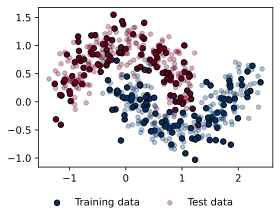

# Classification on Two Moons Toy Data

This toy example shows how to train a variational neural network for binary classification on the two moons dataset using *implicit* regularization via SGD initialized to the prior, as described in [this paper](https://arxiv.org/abs/2505.20235). This approach avoids the computational cost of explicit regularization for non-trivial variational families and preserves beneficial inductive biases.

You can run this example yourself via the corresponding [standalone script](run.py).

## Data

We begin by generating synthetic training and test data based on the two moons classification technique.

<figure markdown="1">

</figure>

## Model

Next, we define a fully-connected stochastic neural network using a pre-defined [``models.MLP``](../../../api/models.md#inferno.models.MLP).

```python title="Model"
--8<-- "docs/examples/varibo/classification/run.py:model"
```

1.  PyTorch ``nn.Module``s can be used as part of ``inferno`` models.

## Training

We train the model via the expected loss,
\(
\bar{\ell}(\theta) = \mathbb{E}_{q_\theta(w)}[\ell(y, f_w(X))]
\)
i.e. the average loss of the model when drawing weights from the variational distribution \(q_\theta(w)\).
In practice, for efficiency we only use a single sample per batch during training.

```python title="Training"
--8<-- "docs/examples/varibo/classification/run.py:training"
```

## Results

### Learning Curves

<figure markdown="1">

</figure>

### Decision Boundary

<figure markdown="1">

</figure>

<!-- 
Show code above but don't execute and include generated plots.

- How to format code blocks: https://squidfunk.github.io/mkdocs-material/reference/code-blocks/#usage
- Options for including code from a separate file: https://facelessuser.github.io/pymdown-extensions/extensions/snippets/#snippets-notation
- Options for executing code in blocks: https://pawamoy.github.io/markdown-exec/usage/#render-the-source-code-as-well
- Options for displaying plots: https://pawamoy.github.io/markdown-exec/gallery/#with-matplotlib
- Options for sharing variables between code blocks etc.: https://pawamoy.github.io/markdown-exec/usage
-->
