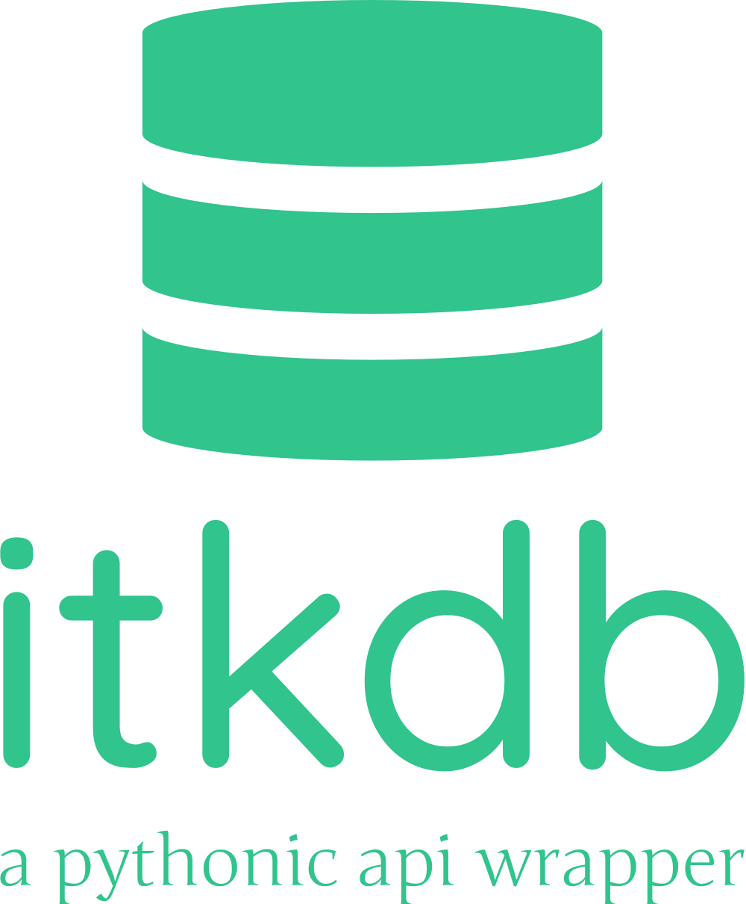

# itkdb

{ align="left" width="300" role="img" }

--8<-- "README.md:badges"

---

itkdb is a python wrapper around the ITk Production Database API for the ATLAS
ITk project documented at [itk.docs][].

## Features

<!-- prettier-ignore-start -->

- Widely used by both the strips and pixels communities
- Low-level wrapper around [requests][] (can drop into existing code)
- Automatic (re)authentication and session caching (if desired)
- Implements industry-standard security checks (including JWT verification)
- Highly tested with both unit tests and integration tests to ensure backwards-compatibility (best-effort)
- Caching of results from database can be automatic
- Pagination automatically done in a pythonic manner
- First-class support for files from either the production database or from EOS
- Mainline support for uploading files to / downloading files from EOS
- Error messages are formatted easily for Unicorn Database Developers to debug (just copy/paste!)
- Jupyter support for inline information
- Easy to contribute and extend
- Usable CLI
- and more!

<!-- prettier-ignore-end -->

## License

itkdb is distributed under the terms of the [GPL-v3.0+][license-link] license.

## Navigation

Documentation for specific `MAJOR.MINOR` versions can be chosen by using the
dropdown on the top of every page. The `dev` version reflects changes that have
not yet been released.

Also, desktop readers can use special keyboard shortcuts:

| Keys                                                         | Action                          |
| ------------------------------------------------------------ | ------------------------------- |
| <ul><li><kbd>,</kbd> (comma)</li><li><kbd>p</kbd></li></ul>  | Navigate to the "previous" page |
| <ul><li><kbd>.</kbd> (period)</li><li><kbd>n</kbd></li></ul> | Navigate to the "next" page     |
| <ul><li><kbd>/</kbd></li><li><kbd>s</kbd></li></ul>          | Display the search modal        |
