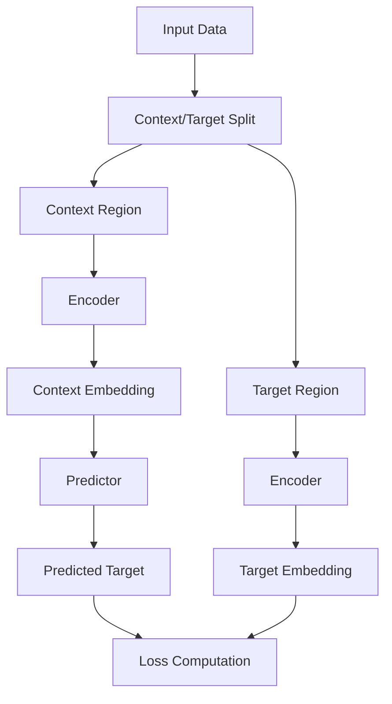

# Self-Supervised Learning with JEPA

JEPA implements a powerful self-supervised learning paradigm that learns meaningful representations without requiring labeled data. This section explains the core concepts and methodologies.

## What is Self-Supervised Learning?

Self-supervised learning is a machine learning paradigm where models learn to represent data by solving pretext tasks derived from the data itself, without requiring human-annotated labels.

### Key Principles

:::{admonition} No External Labels
:class: note
The model creates its own supervision signal from the input data structure
:::

:::{admonition} Pretext Tasks
:class: tip
Carefully designed tasks that force the model to learn meaningful representations
:::

:::{admonition} Transfer Learning
:class: important
Learned representations can be fine-tuned for downstream tasks with minimal labeled data
:::

## JEPA's Approach to Self-Supervision

JEPA learns by **predicting parts of the input from other parts**, creating a natural supervision signal that encourages the model to understand:

- **Spatial relationships** (in images)
- **Temporal dependencies** (in sequences)
- **Semantic connections** (in text or multimodal data)
- **Causal patterns** (in time series)

### The Prediction Framework



## Masking Strategies

The choice of masking strategy is crucial for effective self-supervised learning. JEPA supports multiple approaches:

### Random Masking

**Best for:** General-purpose learning, when no specific structure is known

```python
# Random patches are masked
mask_strategy = "random"
mask_ratio = 0.15  # 15% of patches masked randomly
```

**Advantages:**
- Simple and robust
- Works across different data types
- Good for exploratory learning

**Use cases:**
- Initial model development
- Cross-domain pretraining
- General feature learning

### Block Masking

**Best for:** Spatial data where local structure matters

```python
# Contiguous blocks are masked
mask_strategy = "block"
block_size = 16      # 16x16 pixel blocks
mask_ratio = 0.25    # 25% of image area masked
```

**Advantages:**
- Preserves local spatial structure
- Forces learning of long-range dependencies
- More challenging pretext task

**Use cases:**
- Computer vision tasks
- Medical imaging
- Satellite imagery analysis

### Structured Masking

**Best for:** Data with known structural patterns

```python
# Domain-specific masking patterns
mask_strategy = "structured"
structure_type = "temporal"  # or "semantic", "syntactic", etc.
```

**Examples:**
- **Temporal masking**: Hide future time steps
- **Semantic masking**: Mask complete objects or concepts
- **Syntactic masking**: Mask grammatical components in text

## Learning Objectives

### Contrastive Learning

JEPA can use contrastive objectives where the model learns to:

1. **Pull together** representations of context and target from the same sample
2. **Push apart** representations from different samples
3. **Learn invariances** to irrelevant transformations

```python
def contrastive_loss(pred_embedding, target_embedding, temperature=0.1):
    # Normalize embeddings
    pred_norm = F.normalize(pred_embedding, dim=-1)
    target_norm = F.normalize(target_embedding, dim=-1)
    
    # Compute similarities
    similarity = torch.matmul(pred_norm, target_norm.T) / temperature
    
    # Contrastive loss
    labels = torch.arange(pred_norm.size(0)).to(pred_norm.device)
    loss = F.cross_entropy(similarity, labels)
    
    return loss
```

### Reconstruction Learning

Alternative approach where the model directly reconstructs target features:

```python
def reconstruction_loss(pred_embedding, target_embedding):
    # Direct regression loss
    return F.mse_loss(pred_embedding, target_embedding)
```

### Masked Language Modeling (MLM)

For text data, JEPA can implement BERT-style masking:

```python
def mlm_loss(predictions, targets, mask):
    # Only compute loss on masked positions
    masked_predictions = predictions[mask]
    masked_targets = targets[mask]
    return F.cross_entropy(masked_predictions, masked_targets)
```

## Domain-Specific Pretext Tasks

### Computer Vision

**Spatial Prediction Tasks:**
- Predict masked image patches
- Predict relative positions of patches
- Predict spatial transformations

```python
# Image patch prediction
class ImagePatchPredictor:
    def __init__(self, patch_size=16):
        self.patch_size = patch_size
        
    def create_task(self, image):
        # Split image into patches
        patches = self.patchify(image)
        
        # Randomly mask some patches
        context_patches, target_patches, mask = self.mask_patches(patches)
        
        return context_patches, target_patches, mask
```

**Temporal Prediction Tasks:**
- Predict future frames in video
- Predict motion vectors
- Predict temporal ordering

### Natural Language Processing

**Linguistic Prediction Tasks:**
- Masked token prediction (BERT-style)
- Next sentence prediction
- Sentence order prediction

```python
# Masked language modeling
class MLMPredictor:
    def create_task(self, text):
        tokens = self.tokenize(text)
        
        # Mask 15% of tokens
        masked_tokens, targets, mask = self.mask_tokens(tokens, ratio=0.15)
        
        return masked_tokens, targets, mask
```

**Semantic Prediction Tasks:**
- Predict missing entities
- Predict discourse relations
- Predict syntactic structures

### Time Series

**Temporal Prediction Tasks:**
- Predict future values
- Predict missing time steps
- Predict seasonal patterns

```python
# Time series forecasting
class TimeSeriesPredictor:
    def create_task(self, series, context_length=100):
        # Use past as context, future as target
        context = series[:context_length]
        target = series[context_length:]
        
        return context, target
```

**Cross-Variable Prediction:**
- Predict one variable from others
- Predict correlations between variables
- Predict causal relationships

## Advanced Self-Supervision Techniques

### Multi-Scale Learning

Learn representations at multiple scales simultaneously:

```python
class MultiScaleLearning:
    def __init__(self, scales=[1, 2, 4]):
        self.scales = scales
        
    def create_tasks(self, data):
        tasks = []
        for scale in self.scales:
            # Create different resolution versions
            scaled_data = self.downsample(data, scale)
            context, target = self.create_context_target(scaled_data)
            tasks.append((context, target, scale))
        return tasks
```

### Cross-Modal Learning

Learn from multiple data modalities:

```python
class CrossModalLearning:
    def create_task(self, image, text):
        # Use one modality to predict the other
        if random.random() > 0.5:
            context, target = image, text
        else:
            context, target = text, image
            
        return context, target
```

### Augmentation-Based Learning

Learn invariance to data augmentations:

```python
class AugmentationLearning:
    def create_task(self, data):
        # Create two different augmented views
        view1 = self.augment(data)
        view2 = self.augment(data)
        
        # Learn to predict one from the other
        return view1, view2
```

## Evaluation of Self-Supervised Models

### Intrinsic Evaluation

Evaluate the pretext task performance:

```python
def evaluate_pretext_task(model, test_loader):
    model.eval()
    total_loss = 0
    
    for batch in test_loader:
        context, target = batch
        predicted = model.predict(context)
        loss = model.loss(predicted, target)
        total_loss += loss.item()
        
    return total_loss / len(test_loader)
```

### Downstream Task Evaluation

The real test: how well do learned representations transfer?

```python
def evaluate_downstream(encoder, task_data):
    # Freeze encoder
    for param in encoder.parameters():
        param.requires_grad = False
        
    # Add task-specific head
    classifier = nn.Linear(encoder.output_dim, num_classes)
    
    # Train only the classifier
    optimizer = torch.optim.Adam(classifier.parameters())
    
    # Evaluate on downstream task
    # ... training loop ...
    
    return accuracy
```

### Linear Probing

Test representation quality with linear evaluation:

```python
def linear_probe(encoder, labeled_data):
    # Extract features with frozen encoder
    features = []
    labels = []
    
    encoder.eval()
    with torch.no_grad():
        for data, label in labeled_data:
            feature = encoder(data)
            features.append(feature)
            labels.append(label)
    
    # Train linear classifier
    classifier = LinearClassifier()
    classifier.fit(features, labels)
    
    return classifier.evaluate()
```

## Best Practices for Self-Supervised Learning

### Data Preprocessing

1. **Minimal preprocessing**: Let the model learn invariances
2. **Consistent normalization**: Use standard preprocessing pipelines
3. **Quality over quantity**: Clean data is more important than large datasets

### Task Design

1. **Progressive difficulty**: Start with easier pretext tasks
2. **Multiple objectives**: Combine different self-supervised objectives
3. **Domain knowledge**: Incorporate understanding of your data structure

### Training Strategies

1. **Long training**: Self-supervised models benefit from extended training
2. **Large batch sizes**: Use large batches for stable contrastive learning
3. **Learning rate scheduling**: Use warmup and cosine annealing
4. **Regularization**: Apply dropout and weight decay

### Architecture Choices

1. **Encoder capacity**: Use sufficiently large encoders for complex data
2. **Predictor design**: Simple predictors often work better
3. **Embedding dimensions**: Balance expressiveness with computational cost

## Common Pitfalls and Solutions

### Representation Collapse

**Problem**: Model learns trivial representations

**Solutions:**
- Use contrastive learning with negative samples
- Apply regularization techniques
- Monitor representation diversity

### Overfitting to Pretext Task

**Problem**: Model excels at pretext task but doesn't transfer

**Solutions:**
- Use multiple pretext tasks
- Regular downstream evaluation
- Early stopping based on transfer performance

### Computational Efficiency

**Problem**: Self-supervised training is computationally expensive

**Solutions:**
- Use mixed precision training
- Implement efficient data loading
- Consider model compression techniques

## Integration with JEPA

JEPA makes self-supervised learning accessible by:

1. **Abstracting complexity**: Simple interface for complex self-supervised tasks
2. **Flexible architectures**: Support for any encoder-predictor combination
3. **Built-in strategies**: Pre-implemented masking and learning strategies
4. **Easy experimentation**: Quick iteration on different approaches

```python
# Simple self-supervised training with JEPA
from jepa import JEPATrainer
from jepa.config import SelfSupervisedConfig

config = SelfSupervisedConfig(
    mask_strategy="block",
    mask_ratio=0.25,
    learning_objective="contrastive",
    temperature=0.1
)

trainer = JEPATrainer(config)
trainer.train()  # Handles all the complexity internally
```

For practical implementations of these concepts, see the [Examples](../examples/index.md) section.
