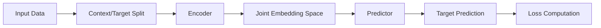

# JEPA Framework

<div align="center">


[](https://badge.fury.io/py/jepa)
[](https://www.python.org/downloads/)
[](https://opensource.org/licenses/MIT)
[](https://jepa.readthedocs.io/)

**A powerful self-supervised learning framework for Joint-Embedding Predictive Architecture (JEPA)**

[Installation](#installation) •
[Quick Start](#quick-start) •
[Documentation](https://jepa.readthedocs.io/) •
[Examples](#examples) •
[Contributing](#contributing)

</div>

## 🚀 Overview

JEPA (Joint-Embedding Predictive Architecture) is a cutting-edge self-supervised learning framework that learns rich representations by predicting parts of the input from other parts. This implementation provides a flexible, production-ready framework for training JEPA models across multiple modalities.

### Key Features

🔧 **Modular Design**
- Flexible encoder-predictor architecture
- Support for any PyTorch model as encoder/predictor
- Easy to extend and customize for your specific needs

🌍 **Multi-Modal Support**
- **Computer Vision**: Images, videos, medical imaging
- **Natural Language Processing**: Text, documents, code
- **Time Series**: Sequential data, forecasting, anomaly detection
- **Audio**: Speech, music, environmental sounds
- **Multimodal**: Vision-language, audio-visual learning

⚡ **High Performance**
- Mixed precision training (FP16/BF16)
- Distributed training support (DDP, FSDP)
- Memory-efficient implementations
- Optimized for both research and production

📊 **Comprehensive Logging**
- Weights & Biases integration
- TensorBoard support
- Console logging with rich formatting
- Multi-backend logging system

🎛️ **Production Ready**
- CLI interface for easy deployment
- Flexible YAML configuration system
- Comprehensive testing suite
- Docker support and containerization
- Type hints throughout

## 🏗️ Architecture

JEPA follows a simple yet powerful architecture:



The model learns by:
1. **Splitting** input into context and target regions
2. **Encoding** both context and target separately  
3. **Predicting** target embeddings from context embeddings
4. **Learning** representations that capture meaningful relationships

## 📦 Installation

### From PyPI (Recommended)

```bash
pip install jepa
```

### From Source

```bash
git clone https://github.com/dipsivenkatesh/jepa.git
cd jepa
pip install -e .
```

### Development Installation

```bash
git clone https://github.com/dipsivenkatesh/jepa.git
cd jepa
pip install -e ".[dev,docs]"
```

### Docker

```bash
docker pull dipsivenkatesh/jepa:latest
docker run -it dipsivenkatesh/jepa:latest
```

## 🚀 Quick Start

### Python API

```python
from jepa import JEPA, JEPATrainer, load_config

# Load configuration
config = load_config("config/default_config.yaml")

# Create model and trainer
model = JEPA(config.model)
trainer = JEPATrainer(model, config)

# Start training
trainer.train()

# Or use the quick start function
from jepa import quick_start
trainer = quick_start("config/default_config.yaml")
```

### Action-Conditioned Variant

Use `JEPAAction` when actions influence the next state. Provide a state encoder, an action encoder, and a predictor that consumes the concatenated `[z_t, a_t]` embedding.

```python
from jepa import JEPAAction
import torch.nn as nn

state_dim = 512
action_dim = 64

# Example encoders (replace with your own)
state_encoder = nn.Sequential(
    nn.Flatten(),
    nn.Linear(784, state_dim),
)
action_encoder = nn.Sequential(
    nn.Linear(10, 128), nn.ReLU(),
    nn.Linear(128, action_dim),
)

# Predictor takes [state_dim + action_dim] → state_dim
predictor = nn.Sequential(
    nn.Linear(state_dim + action_dim, 512), nn.ReLU(),
    nn.Linear(512, state_dim),
)

model = JEPAAction(state_encoder, action_encoder, predictor)
```

### Command Line Interface

```bash
# Train a model
jepa-train --config config/default_config.yaml

# Train with custom parameters
jepa-train --config config/vision_config.yaml \
           --batch-size 64 \
           --learning-rate 0.001 \
           --num-epochs 100

# Evaluate a trained model
jepa-evaluate --config config/default_config.yaml \
              --checkpoint checkpoints/best_model.pth

# Generate a configuration template
jepa-train --generate-config my_config.yaml

# Get help
jepa-train --help
```

### Configuration

JEPA uses YAML configuration files for easy experiment management:

```yaml
# config/my_experiment.yaml
model:
  encoder_type: "transformer"
  encoder_dim: 768
  predictor_type: "mlp"
  predictor_hidden_dim: 2048

training:
  batch_size: 32
  learning_rate: 0.0001
  num_epochs: 100
  warmup_epochs: 10

data:
  train_data_path: "data/train"
  val_data_path: "data/val"
  sequence_length: 16

logging:
  wandb:
    enabled: true
    project: "jepa-experiments"
  tensorboard:
    enabled: true
    log_dir: "./tb_logs"
```

## 🎯 Use Cases

### Computer Vision
- **Image Classification**: Pre-train backbones for downstream tasks
- **Object Detection**: Learn robust visual representations
- **Medical Imaging**: Analyze medical scans and imagery
- **Satellite Imagery**: Process large-scale geographic data

### Natural Language Processing
- **Language Models**: Pre-train transformer architectures
- **Document Understanding**: Learn document-level representations
- **Code Analysis**: Understand code structure and semantics
- **Cross-lingual Learning**: Build multilingual representations

### Time Series Analysis
- **Forecasting**: Pre-train models for prediction tasks
- **Anomaly Detection**: Learn normal patterns in sequential data
- **Financial Modeling**: Analyze market trends and patterns
- **IoT Sensors**: Process sensor data streams

### Multimodal Learning
- **Vision-Language**: Combine images and text understanding
- **Audio-Visual**: Learn from synchronized audio and video
- **Cross-Modal Retrieval**: Search across different modalities
- **Embodied AI**: Integrate multiple sensor modalities

## 📚 Examples

### Vision Example
```python
from jepa import JEPADataset, JEPATrainer, load_config
import torch.nn as nn

# Custom vision encoder
class VisionEncoder(nn.Module):
    def __init__(self, input_dim=3, hidden_dim=512):
        super().__init__()
        self.conv_layers = nn.Sequential(
            nn.Conv2d(input_dim, 64, 7, 2, 3),
            nn.ReLU(),
            nn.Conv2d(64, 128, 3, 2, 1),
            nn.ReLU(),
            nn.AdaptiveAvgPool2d((1, 1)),
            nn.Flatten(),
            nn.Linear(128, hidden_dim)
        )
    
    def forward(self, x):
        return self.conv_layers(x)

# Load config and customize
config = load_config("config/vision_config.yaml")
trainer = JEPATrainer(config=config, custom_encoder=VisionEncoder)
trainer.train()
```

### NLP Example
```python
from transformers import AutoModel
from jepa import JEPA, JEPATrainer

# Use pre-trained transformer as encoder
class TransformerEncoder(nn.Module):
    def __init__(self, model_name="bert-base-uncased"):
        super().__init__()
        self.transformer = AutoModel.from_pretrained(model_name)
    
    def forward(self, input_ids, attention_mask=None):
        outputs = self.transformer(input_ids, attention_mask=attention_mask)
        return outputs.last_hidden_state.mean(dim=1)  # Pool over sequence

config = load_config("config/nlp_config.yaml")
trainer = JEPATrainer(config=config, custom_encoder=TransformerEncoder)
trainer.train()
```

### Time Series Example
```python
from jepa import create_dataset, JEPATrainer

# Create time series dataset
dataset = create_dataset(
    data_path="data/timeseries.csv",
    sequence_length=50,
    prediction_length=10,
    features=['sensor1', 'sensor2', 'sensor3']
)

config = load_config("config/timeseries_config.yaml")
trainer = JEPATrainer(config=config, train_dataset=dataset)
trainer.train()
```

## 📖 Documentation

- **[Full Documentation](https://jepa.readthedocs.io/)** - Complete API reference and guides
- **[Installation Guide](https://jepa.readthedocs.io/en/latest/guides/installation.html)** - Detailed installation instructions
- **[Configuration Guide](https://jepa.readthedocs.io/en/latest/guides/configuration.html)** - How to configure your experiments
- **[Training Guide](https://jepa.readthedocs.io/en/latest/guides/training.html)** - Training best practices
- **[API Reference](https://jepa.readthedocs.io/en/latest/api/)** - Complete API documentation

## 🔧 Development

### Setting up Development Environment

```bash
git clone https://github.com/dipsivenkatesh/jepa.git
cd jepa

# Create virtual environment
python -m venv venv
source venv/bin/activate  # On Windows: venv\Scripts\activate

# Install in development mode
pip install -e ".[dev,docs]"

# Install pre-commit hooks
pre-commit install
```

### Running Tests

```bash
# Run all tests
pytest

# Run with coverage
pytest --cov=jepa --cov-report=html

# Run specific test
pytest tests/test_model.py::test_jepa_forward
```

### Code Quality

```bash
# Format code
black jepa/
isort jepa/

# Type checking
mypy jepa/

# Linting
flake8 jepa/
```

## 🤝 Contributing

We welcome contributions! Please see our [Contributing Guide](CONTRIBUTING.md) for details.

### Ways to Contribute
- 🐛 **Bug Reports**: Submit detailed bug reports
- ✨ **Feature Requests**: Suggest new features or improvements  
- 📖 **Documentation**: Improve documentation and examples
- 🔧 **Code**: Submit pull requests with bug fixes or new features
- 🎯 **Use Cases**: Share your JEPA applications and results

### Development Workflow
1. Fork the repository
2. Create a feature branch: `git checkout -b feature-name`
3. Make your changes and add tests
4. Ensure all tests pass: `pytest`
5. Submit a pull request

## 📄 Citation

If you use JEPA in your research, please cite:

```bibtex
@software{jepa2025,
  title = {JEPA: Joint-Embedding Predictive Architecture Framework},
  author = {Venkatesh, Dilip},
  year = {2025},
  url = {https://github.com/dipsivenkatesh/jepa},
  version = {0.1.0}
}
```

## 📝 License

This project is licensed under the MIT License - see the [LICENSE](LICENSE) file for details.

## 🙏 Acknowledgments

- Inspired by the original JEPA paper and Meta's research
- Built with PyTorch, Transformers, and other amazing open-source libraries
- Thanks to all contributors and users of the framework

## 📞 Support

- **GitHub Issues**: [Report bugs or request features](https://github.com/dipsivenkatesh/jepa/issues)
- **Documentation**: [Read the full documentation](https://jepa.readthedocs.io/)
- **Discussions**: [Join community discussions](https://github.com/dipsivenkatesh/jepa/discussions)

---

<div align="center">

**[⭐ Star this repo](https://github.com/dipsivenkatesh/jepa) | [📖 Read the docs](https://jepa.readthedocs.io/) | [🐛 Report issues](https://github.com/dipsivenkatesh/jepa/issues)**

*Built with ❤️ by [Dilip Venkatesh](https://dipsivenkatesh.github.io/)*

</div>
