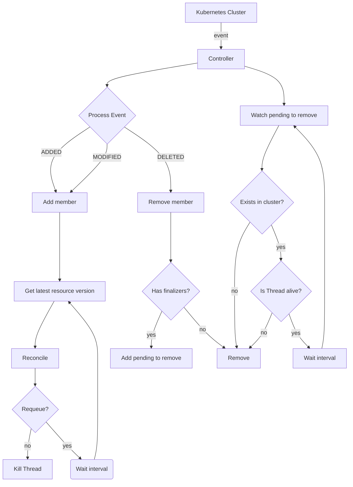
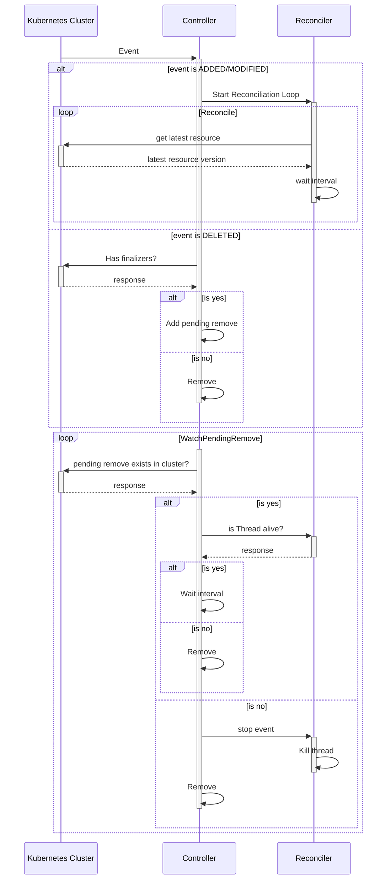

# Kuroboros Framework

Kuroboros is an object-oriented Python framework designed for developing Kubernetes Operators using the [Controller Pattern](https://kubernetes.io/docs/concepts/architecture/controller/#controller-pattern). 

The name derives from "**K**ubernetes" and "O**uroboros**", the symbolic serpent in a perpetual cycle.

## Features

- Typed object definitions for CRDs
- Automated generation and deployment of Kubernetes manifests via Kustomize
- Built-in support for validation and mutation webhooks
- Metrics exposure for Prometheus
- Leader election for high availability
- Automatic RBAC manifest generation


## Table of Contents

- [Quickstart](#quickstart)
- [Operator](#operator)
- [Controller](#controller)
  - [Controller Flow Chart](#controller-flow-chart)
  - [Controller Sequence Diagram](#controller-sequence-diagram)
- [Group Version Info (`group_version.py`)](#group-version-info-group_versionpy)
- [Custom Resource Definition (`crd.py`)](#custom-resource-definition-crdpy)
  - [CRD Properties](#crd-properties)
- [Reconciler (`reconciler.py`)](#reconciler-reconcilerpy)
    - [Performing operations over resources in Kubernetes](#performing-operations-over-resources-in-kubernetes)
- [Admission Webhooks](#admission-webhooks)
  - [Validation Webhook (`validation.py`)](#validation-webhook-validationpy)
  - [Mutation Webhook (`mutation.py`)](#mutation-webhook-mutationpy)
- [CLI](#cli)
  - [Usage](#usage)
  - [Commands](#commands)
    - [`start`](#start)
    - [`generate`](#generate)
    - [`new`](#new)
    - [`build`](#build)
    - [`deploy OVERLAY`](#deploy-overlay)
- [Metrics](#metrics)
- [Configuration](#configuration)

---

## Quickstart

### 1. Create a New Operator Project

Create a new directory for your operator and initialize the project:

```sh
mkdir cache-operator
cd cache-operator
pip install kuroboros
kuroboros new operator cache-operator
kuroboros new controller --kind Cache --api-version v1beta1 --group kuroboros.io
```

This will generate the following structure:

```
cache-operator
├── controllers
│   ├── cache
│   │   ├── group_version.py
│   │   └── v1beta1
│   │       ├── crd.py
│   │       └── reconciler.py
│   └── __init__.py
├── Dockerfile
├── requirements.txt
└── operator.toml
```

---

### 2. Define CRD Spec and Status

Edit `./controllers/cache/v1beta1/crd.py` to define your CRD's specification and status.  
After making changes, regenerate your CRD manifest:

```sh
kuroboros generate crd
```

**Example:**

```python
from kuroboros.schema import CRDSchema, OpenAPISchema, prop

class CacheResourceObjects(OpenAPISchema):
    cpu = prop(str)
    memory = prop(str)

class CacheResources(OpenAPISchema):
    requests = prop(CacheResourceObjects)
    limits = prop(CacheResourceObjects)

class CacheStatus(OpenAPISchema):
    current_size = prop(int)
    phase = prop(str, enum=["Healthy", "Progressing"])

class Cache(CRDSchema):
    image_tag = prop(str, required=True, default="redis", enum=["redis"])
    desired_size = prop(int, required=True, default=3, minimum=1, maximum=20)
    resources = prop(CacheResources)
    status = prop(CacheStatus)
```

---

### 3. Implement Reconciliation Logic

Define your reconciliation logic in `./controllers/cache/v1beta1/reconciler.py`:

```python
from kuroboros.reconciler import BaseReconciler
from controllers.cache.v1beta1.crd import Cache
from datetime import timedelta
import threading

class CacheReconciler(BaseReconciler[Cache]):
    def reconcile(self, obj: Cache, stopped: threading.Event):
        # Implement your reconciliation logic here
        self.patch(
            name=obj.name,
            namespace=obj.namespace,
            patch_body=obj.to_dict(),
            subresources=["status"]
        )
        return timedelta(seconds=10)
```

---

### 4. Build and Push Your Operator Image

Build your operator Docker image:

```sh
kuroboros build
```

Push the image to your registry:

```sh
docker push <your-operator-image>:<your-tag>
```
or load it into minukbe
```sh
minikube load <your-operator-image>:<your-tag>
```

---

### 5. Generate and Deploy Kubernetes Manifests

Generate all required Kubernetes manifests, create a Kustomize overlay, and deploy to your cluster:

```sh
kuroboros generate manifests
kuroboros generate overlay local
kuroboros deploy local
```

Your operator is now ready to manage custom resources in your Kubernetes cluster. For advanced configuration and usage, refer to the documentation below.

See the full example repository [here](https://github.com/jedwards94/kuroboros-example).

---

## Operator

The `Operator` manages multiple `Controllers`, tracks the number of running threads, and supervises the webhook server (running in a Falcon app behind Gunicorn in a separate process).

---

## Controller

A `Controller` consists of a `GroupVersionInfo`, a `Reconciler`, and optionally, `ValidationWebhook` and/or `MutationWebhook`.  
The `GroupVersionInfo` specifies which CRs the controller manages. The controller adds members when it receives `ADDED` or `MODIFIED` events and removes them on `DELETED` events.

When a member is added, the controller creates a `Reconciler` for the CR and starts its reconciliation loop in a separate thread. If a `MODIFIED` event is received while the loop is running, the event is skipped. When a `DELETED` event is received, the controller signals the reconciler to stop as soon as possible.

---

### Controller Flow Chart



---

### Controller Sequence Diagram



---

## Group Version Info (`group_version.py`)

The `group_version.py` file in the `/controllers` directory defines the CRD's `kind`, `api_version`, and `group`.  
This information is used by both the controller and the CLI to manage and generate manifests for the CRD.

**Example:**
```python
from kuroboros.group_version_info import GroupVersionInfo

gvi = GroupVersionInfo(
    api_version="v1beta1",
    group="kuroboros.io",
    kind="Cache",
)
```

---

## Custom Resource Definition (`crd.py`)

The CRD model defines the schema for your custom resource and is used to generate the Kubernetes manifest.  
Every CRD **must** inherit from `CRDSchema` for the CLI to recognize it.

### CRD Properties

Define properties in your CRD using the `prop(type, **kwargs)` function.

**Supported types:**
- `str`, `int`, `float`, `dict`, `bool`, `byte`
- `list[str]`, `list[int]`, `list[float]`, `list[bool]`, `list[byte]`
- Subclasses of `OpenAPISchema` and `list` of them
- `kubernetes.client` classes

You can create reusable property definitions with `OpenAPISchema`.

#### Keyword Arguments

The `prop` function accepts `properties` and `required` as keyword arguments, as well as any additional OpenAPI or Kubernetes-specific fields.  
See the [Kubernetes CRD validation docs](https://kubernetes.io/docs/tasks/extend-kubernetes/custom-resources/custom-resource-definitions/#validation) for details.

#### Classes as Properties

You can define classes as properties using `kubernetes.client` and `OpenAPISchema` classes. Take in consideration that using `kubernetes.client` classes doesn't allow to cutomizes requirements in the propertie, such as setting its minimum, default or max value.

#### Example

```python
from kubernetes.client import V1ObjectMeta
from kuroboros.schema import CRDSchema, OpenAPISchema, prop

class CacheResourceObjects(OpenAPISchema):
    cpu = prop(str)
    memory = prop(str)

class CacheResources(OpenAPISchema):
    requests = prop(CacheResourceObjects)
    limits = prop(CacheResourceObjects)

class CacheSpec(OpenAPISchema):
    image_tag = prop(str, required=True, default="valkey/valkey", enum=["valkey/valkey", "redis"])
    desired_size = prop(int, required=True, default=3, minimum=1, maximum=20)
    resources = prop(CacheResources)

class Cache(CRDSchema):
    metadata = prop(V1ObjectMeta)
    kind = prop(str)
    api_version = prop(str)

    spec = prop(CacheSpec)
    status = prop(dict, properties={
        "current_size": prop(int, default=0),
        "phase": prop(str, enum=["Healthy", "Progressing"])
    })
```

#### Documentation and Additional Printer Columns

- Docstrings are used for OpenAPI schema descriptions in the CRD manifest.
- Use the `description` argument in `prop()` for field descriptions.
- To add an `additionalPrinterColumn`, add a tuple to the `print_columns` dictionary in your `CRDSchema`:

```python
class MyColumn(OpenAPISchema):
    """A custom class field"""
    str_field = prop(str)

class MyCRDSpec(OpenAPISchema):
    """A custom class field"""
    int_field = prop(int)
    custom_column = prop(MyColumn)

class MyCRD(CRDSchema):
    """MyCRD Defines a Custom Resource"""
    spec = prop(MyCRDSpec)
    print_columns = {
        "intCol": (".spec.intColumn", "integer")
    }
```

---

## Reconciler (`reconciler.py`)

The `Reconciler` implements the `reconcile` method.  
Each CR instance gets its own reconciler running in a separate thread.  
Class-level variables in `BaseReconciler` should be used with care due to concurrency.

The `reconcile` method returns a `Result` that tells the reconciller if it should keep reconciling or stop. It takes `requeue: bool` and `requeue_after_seconds: float` as parameters of its constructor with `True` and `0` as its defaults. You can ralso aise a `RetriableException(backoff: float)` to retry the reconcile function in the specified `backoff`


### Performing operations over resources in Kubernetes
The reconciler has a `kubernetes.dynamic.DynamicClient` built-in and accesible through the:
- `get(name: str, namespace: str | None = None, ...)`: Gets resource(s) given its `**kwargs` passed to `DynamicClient` (example: `label_selctor="app=redis"` or `name="resource-name"`)
- `patch(name: str, namespace: str | None = None, subresources: list[str], content_type: str, patch_body: dict,...)`: Patches a object given its name and posibly namespace using the `"application/merge-patch+json"` patch. Accepts a `subresources: list[str]` to patch the object subresources.
- `create(namespace: str | None = None, body: dict,...)`: Creates a object in the given namespace with the given OpenAPI `Dict``
- `delete(...)`: Deletes a object given its name and posibly namespace

Each method accepts `api_version`, `kind` and `typ` parameters, if `kind` was given but not `api_version`, the operation will be performed over the prefered version in the cluster. If given a `typ` parameter of a kubernetes resource (for example: `kubernetes.client.V1Deployment`) or a subclass of `CRDSchema`, the result will be serialized to this type, if not give, the result will be a `object`.

**Note**: Using subclasses of `CRDSchema` as `typ` doesn't need the `kind` and `api_version` parameters, as they are infered from their `GroupVersionInfo`.

**Key points:**
- Return a `Result(requeue_after_seconds=float)` to schedule a requeue in a specific interval.
- Return a `Result()` to schedule a requeue inmediately.
- Return a `Result(requeue=False)` to stop the reconciliation until further updates.
- A `Result(requeue=False, requeue_after_seconds: 10)` will stop the reconciliation until further updates as `requeue` has priority.

**Example:**

```python
import threading
from kuroboros.reconciler import BaseReconciler, Result
from controllers.cache.v1beta1.crd import Cache

class CacheReconciler(BaseReconciler[Cache]):
    def reconcile(self, logger, obj: Cache, stopped: threading.Event):
        if some_condition:
            return Result(requeue_after_seconds=5)
        return Result(requeue=False)
```

**Testing:**

Use `unittest` and patch Kubernetes-related functions of the Reconciler. Remember to set the `GroupVersionInfo` in your `CRDSchema` and `BaseReconciler` subclasses and load you config file:

```python
import logging
import threading
import unittest
from unittest.mock import patch
from kuroboros.config import KuroborosConfig

from controllers.cache.v1beta1.crd import Cache, CacheStatus
from controllers.cache.v1beta1.reconciler import CacheReconciler
from controllers.cache.group_version import gvi


test_data = {
    "kind": "Cache",
    "api_version": "kuroboros.io/v1beta1",
    "metadata": {
        "name": "test",
        "namespace": "default",
        "uid": "1",
        "resource_version": "1",
    },
    "spec": {
        "engine": "redis",
        "engineVersion": "latest",
        "volume_size": "1Gi",
        "desired_size": "1",
        "resources": {
            "requests": {"cpu": "1", "memory": "1Gi"},
            "limits": {"cpu": "1", "memory": "1Gi"},
        },
    },
}


class TestReconciler(unittest.TestCase):

    def setUp(self) -> None:
        CacheReconciler.set_gvi(gvi)
        Cache.set_gvi(gvi)
        KuroborosConfig.load("operator.toml")
        return super().setUp()

    def test_reconciler_run(self):
        reconciler = CacheReconciler(("default", "test"))
        cache = Cache(**test_data)
        event = threading.Event()
        with patch.object(reconciler, "patch", return_value=None) as patch_:
            reconciler.reconcile(cache, event)
            self.assertIsNotNone(cache.status)
            self.assertIsInstance(cache.status, CacheStatus)
            patch_.assert_called_once()
```

---

## Admission Webhooks

Kuroboros supports validation and mutation webhooks.

Each webhook recieaves a `request: Request[CRDSchema]` parameter, wich consist on the `AdmissionReview` request property. 
You can read more about the aviability of some field in the [Kubernetes Documentaion](https://kubernetes.io/docs/reference/access-authn-authz/extensible-admission-controllers/#request) 

### Validation Webhook (`validation.py`)

Inherit from `BaseValidationWebhook` and implement:

- `validate(request: Request[MyCRD])`

**Example:**

```python
from kuroboros.webhook import BaseValidationWebhook, Request
from kuroboros.exceptions import ValidationWebhookError
from controllers.cache.v1beta1.crd import Cache


class CacheValidation(BaseValidationWebhook[Cache]):
    register_on = ["CREATE", "UPDATE"]

    allowed_images = {
        "redis": ["7.1", "latest"],
        "memcached": ["latest"],
        "valkey": ["latest"],
    }

    def validate(self, request: Request[Cache]):
        assert request.object is not None
        engine = request.object.spec.engine
        engine_version = request.object.spec.engine_version
        if engine_version not in self.allowed_images[engine]:
            raise ValidationWebhookError(
                f"{engine_version} is not a valid version for {engine}"
            )

```

### Mutation Webhook (`mutation.py`)

Inherit from `BaseMutationWebhook` and implement:

- `mutate(request: Request[MyCRD]) -> MyCRD`

**Example:**

```python
from kuroboros.webhook import BaseMutationWebhook, Request, OperationsEnum
from controllers.cache.v1beta1.crd import Cache

class CacheMutation(BaseMutationWebhook[Cache]):
    def mutate(self, request: Request[Cache]) -> Cache:
        assert request.object is not None
        if request.object.metadata.annotations is None:
            request.object.metadata.annotations = {}
        if request.operation == OperationsEnum.CREATE:
            request.object.metadata.annotations["owner"] = request.user_info["username"]
            
        request.object.metadata.annotations["lastUpdatedBy"] = request.user_info["username"]
        return request.object

```

---

## CLI

The `kuroboros` CLI is the main entrypoint for managing your operator, controllers, and Kubernetes manifests.

### Usage

```sh
kuroboros [OPTIONS] COMMAND [ARGS]
```

**Global Options:**
- `-c, --config TEXT`  Configuration file to use (default: `operator.toml`)
- `-l, --log-level TEXT`  Log level for the app

The `-l, --log-level` option overrides the `operator.log_level` in your config file.

---

### Commands

#### `start`
Starts the operator, loading the config file and all controllers.

**Options:**
- `--skip-controllers`     Skip all controllers startup
- `--skip-webhook-server`  Skip the webhook server startup

**Usage:**
```sh
kuroboros start
```

---

#### `generate`
Generate Kubernetes manifests.

- `generate manifests`: Generates all manifests in `./config/base`.
- `generate rbac`: Generates RBAC manifests in `./config/base/rbac`.  
  Policies are defined in your config file under `[[generate.rbac.policies]]`:

  ```toml
  [[generate.rbac.policies]]
  api_groups = [""]
  resources = ["pods"]
  verbs = ["create", "patch", "update", "list", "watch"]
  ```

- `generate deployment`: Generates deployment manifests in `./config/base/deployment`.  
  The `[build.image]` section in your config sets the image:

  ```toml
  [build]
  [build.image]
  registry = "my.registry.io"
  repository = "cache-operator"
  tag_suffix = "-dev"
  tag_prefix = "rc"
  tag = "$PYPROJECT_VERSION"
  ```
  Using `tag = "$PYPROJECT_VERSION"` will set the tag to the `pryproject.toml` `project.version` value, using `$TAG_OR_SHORT_COMMIT_SHA` will use the commit tag if available and fallback to the short SHA.

- `generate webhooks`: Generates webhook manifests in `./config/base/webhooks`.
- `generate crd`: Generates CRD manifests in `./config/base/crd`.
- `generate overlay [NAME]`: Generates a new Kustomize overlay in `./config/overlays/[NAME]`.

---

#### `new`
Create new modules.

- `new controller`: Creates a new controller in `./controllers`.

  **Options:**
  - `--kind TEXT`         Kind of the CRD (required)
  - `--api-version TEXT`  API version (e.g., `v1beta1`) (required)
  - `--group TEXT`        Group owner of the CRD (required)

  **Example:**
  ```sh
  kuroboros new controller --kind Cache --api-version v1beta1 --group acme.com
  ```

- `new webhook`: Creates a new webhook in `./controllers/<api-version>`.

  **Options:**
  - `--kind TEXT`         Kind of the CRD (required)
  - `--api-version TEXT`  API version (required)
  - `--type TEXT`         Webhook type (`validation` or `mutation`) (required)

  **Example:**
  ```sh
  kuroboros new webhook --kind Cache --api-version v1beta1 --type validation
  ```

- `new operator [NAME]`: Creates the necessary files for a new operator project.

  **Usage:**
  ```sh
  kuroboros new operator [NAME]
  ```

---

#### `build`
Builds the operator image using Docker.  
Uses the `[image]` section in your config for tagging.

If you need more controll over the build process change the `[build.builder]` section in your configuration. Set the `build.builder.binary` and `build.builder.args` to the ones that suit your use case. Keep in mind that the `$IMG` environment variable, wich contains the tag of the image, is available when running the build process.
```toml
[build]
[build.builder]
binary = "docker"
args = ["build", ".", "-t", "$IMG"]
```

**Usage:**
```sh
kuroboros build
```

---

#### `deploy OVERLAY`
Applies the specified overlay to your current kubeconfig context.

**Usage:**
```sh
kuroboros deploy OVERLAY
```

---

## Metrics

The operator collects and exposes metrics about running threads.  
Metrics are exposed at port `8080` and collected every 5 seconds by default.  
You can configure these settings in your config file:

```toml
[operator.metrics]
interval_seconds = 5
port = 8080
```

---

## Configuration

The operator uses a TOML configuration file (`operator.toml` by default).  
Only the `[operator]` section is included in the deployment ConfigMap.  
You can also use environment variables for configuration.

**Example:**

```toml
[operator]
name = "kuroboros-operator"
log_level = "INFO"
leader_acquire_interval_seconds = 10
pending_remove_interval_seconds = 5
cleanup_interval_seconds = 5

[operator.webhook_server]
port = 443
cert_path = "/etc/tls/tls.crt"
key_path = "/etc/tls/tls.key"
gunicorn_workers = 1

[operator.metrics]
interval_seconds = 5
port = 8080

[image]
registry = ""
repository = "kuroboros-operator"
tag = "latest"

[[generate.rbac.policies]]
api_groups = [""]
resources = ["pods"]
verbs = ["create", "patch", "update", "list", "watch"]
```

## Recepies

### Using Minikube to develop
If you are using your local registry to build the images, remember to make it accesible to minikube and change the `Deployment` in the Kustomize layout with a patch like:
```yaml
patches:
    - target:
        group: apps
        version: v1
        kind: Deployment
        name: deployment-name
      patch: |-
        - op: replace
          path: /spec/template/spec/containers/0/imagePullPolicy
          value: Never
```

### Using `cert-manager` for Webhooks certificates

If you are using `cert-manager` for your certificates, you can use them for the webhook server, to do so you will need to inject the ca-bundle into your webhook configuration.
**example**
```yaml
- target:
    group: admissionregistration.k8s.io
    version: v1
    kind: MutatingWebhookConfiguration
    name: cache-operator-mutation-webhook
  patch: |-
    - op: add
      path: /metadata/annotations
      value:
        cert-manager.io/inject-ca-from: cache-operator/my-selfsigned-ca
```

### High Aviability

The reconciliation loop is controlled by leadership election, so only one instance of the operator can run the reconciliation, but every operator runs the webhook server (if needed). So only one operator in the deployment reconciles, but every operator accept webhook requests. If you wish to split the deployments, you can make your reconciler deployment runs with the arg `--skip-webhook-server` and the webhook deployment with `--skip-controllers`
