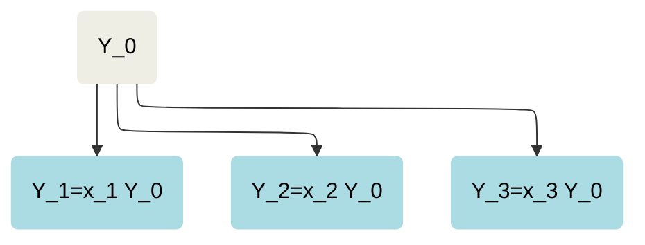

# maxent_disaggregation

[][pypi status]
[][pypi status]
[][pypi status]
[][license]

[][read the docs]
[][tests]


[][black]

[pypi status]: https://pypi.org/project/maxent_disaggregation/
[read the docs]: https://maxent-disaggregation.readthedocs.io/en/latest/index.html
[tests]: https://github.com/jakobsarthur/maxent_disaggregation/actions?workflow=Tests
[codecov]: https://app.codecov.io/gh/jakobsarthur/maxent_disaggregation
[pre-commit]: https://github.com/pre-commit/pre-commit
[black]: https://github.com/psf/black

[maxent_disaggregation](https://github.com/jakobsarthur/maxent_disaggregation) is a python package to help with the propagation of uncertainty when disaggregating data, based on the maximum entropy principle. It samples from various forms of the Dirichlet distribution, maximising the entropy based on the available information. 


## Installation

You can install _maxent_disaggregation_ via `pip` from [PyPI](https://pypi.org/project/maxent-disaggregation/):

```console
$ pip install maxent_disaggregation
```

The goal of `maxent_disaggregation` is to provide an easy to use `Python` tool 
that helps you with uncertainty propagation when data disaggregation is involved. Data
disaggregation usually involves splitting one data point $$Y_0$$ into $$K$$ 
disaggregate quantities $$Y_1, Y_2, ..., Y_K$$ using proxy data. It is a common 
problem in many different research disciplines.




For more detailed description of the package, theory please see the [documentation page](https://maxent-disaggregation.readthedocs.io/en/latest/index.html). For a quickstart see below:


## Quick start

```python
from maxent_disaggregation import maxent_disagg
import numpy as np

# best guess or mean of the total quantity Y_0 (if available)
mean_aggregate = 10
# best guess of the standard deviation of the total quantity Y_0 (if available)
sd_aggregate = 1
# min/max value of the total quantity Y_o (if applicable/available) (optional)
min_aggregate = 0
max_aggregate = np.inf
# best guess values and uncertainties from proxy data for the shares (x_i) if available (of not available put in np.nan)
shares_disaggregates = [0.4, 0.25, 0.2, 0.15]
sds_shares = [0.1, np.nan, 0.04, 0.001]

# Now draw 10000 samples
samples, _ = maxent_disagg(n=10000, 
                        mean_0=mean_aggregate,
                        sd_0=sd_aggregate,
                        min_0=min_aggregate,
                        max_0=max_aggregate, 
                        shares=shares_disaggregates, 
                        sds=sds_shares, 
                        )

# Now plot the sampled distributions
from maxent_disaggregation import plot_samples_hist
# the input values are provided for the legend
plot_samples_hist(samples, 
                  mean_0=mean_aggregate,
                  sd_0=sd_aggregate, 
                  shares=shares_disaggregates, 
                  sds=sds_shares)
```


We can also easily plot the covariances between the different disaggrate quantities:

```python
# Plot the covariances between the disaggregates
from maxent_disaggregation import plot_covariances
plot_covariances(samples)
```


## Reference
If you find this package useful please share and cite our paper: [DOI]

## Contributing

Contributions are very welcome.
To learn more, see the [Contributor Guide][Contributor Guide].

## License

Distributed under the terms of the [MIT license][License],
_maxent_disaggregation_ is free and open source software.

## Issues

If you encounter any problems,
please [file an issue][Issue Tracker] along with a detailed description.


<!-- github-only -->

[command-line reference]: https://maxent_disaggregation.readthedocs.io/en/latest/usage.html
[License]: https://github.com/jakobsarthur/maxent_disaggregation/blob/main/LICENSE
[Contributor Guide]: https://github.com/jakobsarthur/maxent_disaggregation/blob/main/CONTRIBUTING.md
[Issue Tracker]: https://github.com/jakobsarthur/maxent_disaggregation/issues

