## Advanced Workflows

### Team Collaboration

### Context Accumulation

Each phase builds on previous work:

### Multi-Feature Development

```mermaid
gantt
    title Parallel Feature Development with mem8
    dateFormat HH:mm
    section Feature A
    Research      :a1, 00:00, 30m
    Plan         :a2, after a1, 20m
    Implement    :a3, after a2, 2h
    section Feature B
    Research     :b1, 00:15, 30m
    Plan        :b2, after b1, 20m
    Implement   :b3, after b2, 2h
    section Integration
    Test        :c1, after a3 b3, 30m
    PR          :c2, after c1, 15m
```

## Context Engineering Architecture

mem8 implements [Anthropic's context engineering principles](https://www.anthropic.com/engineering/effective-context-engineering-for-ai-agents) to maximize Claude's effectiveness while minimizing context usage.

### The Context Economy

### mem8's Context Engineering Approach

#### 1. Sub-Agent Architecture

Instead of loading entire codebases into context, mem8 spawns specialized sub-agents:

**Key Benefits:**
- **Parallel Exploration** - Multiple agents search simultaneously
- **Context Isolation** - Each agent has focused context
- **Result Compaction** - Only high-signal findings returned
- **Scalable** - Works on codebases of any size

#### 2. Structured Note-Taking

mem8 creates persistent, structured documents that serve as lightweight context:

**vs Loading Full Files:**
- **Research doc** (~2KB) vs **Full codebase** (~500KB+)
- **Plan doc** (~5KB) vs **Re-analyzing everything** (~1MB+)
- **File reference** (`auth.py:45`) vs **Full file content** (~10KB)

#### 3. Just-in-Time Context Retrieval

Context loaded only when needed:

#### 4. Compaction Through Synthesis

### Anthropic's Principles → mem8 Implementation

| Principle | mem8 Implementation |
|-----------|---------------------|
| **Minimal Context** | File references (`file:line`) not full files |
| **Just-in-Time** | Load research docs only when relevant |
| **Sub-Agents** | Parallel exploration with `codebase-locator`, etc. |
| **Structured Notes** | Research → Plan → Implement documents |
| **Compaction** | Synthesize sub-agent findings into concise docs |
| **Autonomous Navigation** | Agents explore codebase independently |
| **Lightweight References** | Links to thoughts, not full content |

### Context Budget Example

**Feature: Add OAuth2 Support**

**Context Savings:**
- **Without mem8:** ~2M tokens (reload codebase each time)
- **With mem8:** ~200K tokens (use persistent documents)
- **10x reduction** in context usage

## Why Memory-First Development Works

### Context Preservation

### Compounding Knowledge

Each cycle adds to your project's knowledge base:

1. **First Feature:** Research from scratch → plan → implement
2. **Second Feature:** Browse past research → faster planning → reuse patterns
3. **Third Feature:** Rich context → precise plans → confident implementation
4. **Nth Feature:** Comprehensive memory → minimal research → rapid delivery

