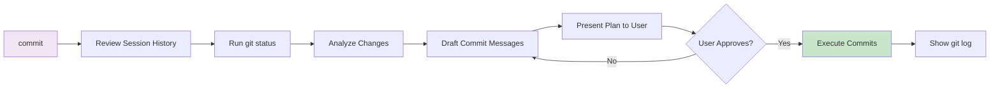

# Phase 4: Commit with `/m8-commit`
Create conventional commits based on session context.

### Commit Process

### Commit Guidelines

**mem8 follows best practices:**
- **Conventional commits** format (feat:, fix:, docs:, etc.)
- **Focused commits** - groups related changes
- **Clear messages** - explains why, not just what
- **User attribution** - commits are authored by you, not Claude
- **No AI mentions** - professional commit history
