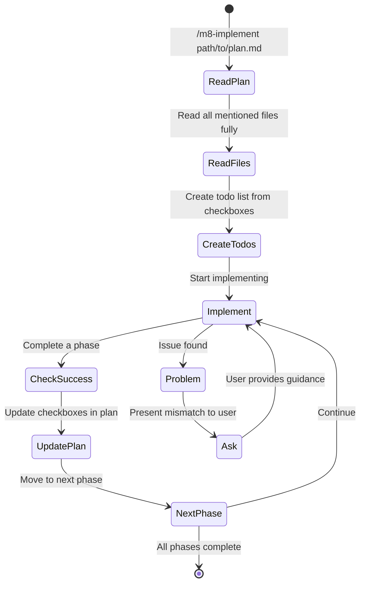

# Phase 3: Implement with `/m8-implement`
Execute the plan with full context, checking off steps as you go.

### Implementation Flow

### Key Behaviors

**Plan-Aware Implementation:**
- Reads plan and understands context
- Trusts completed checkboxes (resumable)
- Updates plan file as work progresses
- Asks for guidance when reality differs from plan

**Success Criteria:**
- Runs tests after each phase
- Fixes issues before proceeding
- Maintains forward momentum
