# Core Workflows

mem8 is built around a memory-first development cycle that enhances Claude Code with persistent context and structured workflows.

## The Research → Plan → Implement → Commit Cycle

This is the primary workflow that mem8 enables. Each phase builds on the previous, creating a continuous loop of structured development.

```mermaid
graph LR
    A[🔍 Research] --> B[📋 Plan]
    B --> C[⚡ Implement]
    C --> D[✅ Commit]
    D --> E[🚀 PR]
    E -.Next Feature.-> A

    style A fill:#e1f5ff
    style B fill:#fff4e1
    style C fill:#e8f5e9
    style D fill:#f3e5f5
    style E fill:#fce4ec
```



### Why This Works

Each phase:
- **Stores context** in `memory/` for future reference
- **Uses sub-agents** to parallelize work
- **Builds on previous work** through file references
- **Creates artifacts** that Claude Code can read

## Workflow Pages

- **[Research](./research)** - Deep codebase analysis with parallel sub-agents
- **[Plan](./plan)** - Create implementation plans from research
- **[Implement](./implement)** - Execute plans with full context
- **[Commit](./commit)** - Create conventional commits
- **[Utility Commands](./utility)** - Supporting commands for workflow management
- **[Advanced Workflows](./advanced)** - Team collaboration and optimization

## Quick Start

```bash
# 1. Research the codebase
/m8-research "authentication system"

# 2. Create an implementation plan
/m8-plan "add OAuth2 support"

# 3. Execute the plan
/m8-implement

# 4. Commit your changes
/m8-commit
```

## Key Benefits

### Context Accumulation
Each cycle adds to your project's knowledge base, making subsequent features faster to implement.

### Parallel Exploration
Sub-agents work simultaneously to gather comprehensive insights in minimal time.

### Structured Memory
Persistent thoughts enable long-term context retention across sessions and team members.
