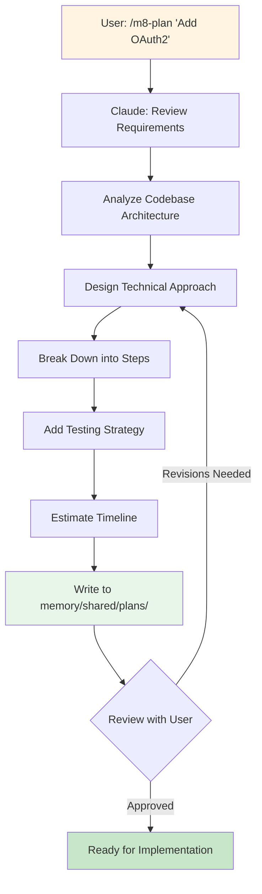

# Phase 2: Plan with `/m8-plan`
Design implementation with concrete steps based on research findings.

### Planning Process



### Plan Structure

```markdown
# Implementation Plan: Add OAuth2 Support

## Requirements
- [ ] Support GitHub OAuth2
- [ ] Support Google OAuth2
- [ ] Maintain existing JWT flow

## Technical Approach
Extend current JWT system with OAuth2 provider abstraction...

## Implementation Steps

### Phase 1: OAuth2 Provider Interface
- [ ] Create `auth/providers/base.py` with OAuth2Provider ABC
- [ ] Implement GitHub provider
- [ ] Add provider registry

### Phase 2: Integration
- [ ] Update middleware to support OAuth2 flow
- [ ] Add callback endpoint
- [ ] Store provider tokens

### Phase 3: Testing
- [ ] Unit tests for each provider
- [ ] Integration tests for OAuth2 flow
- [ ] Manual testing checklist

## Testing Strategy
...
```

### Plan Benefits

- **Executable roadmap** - checkboxes track progress
- **Reference for Claude** - next phase loads this plan
- **Team communication** - clear documentation of approach
- **Future reference** - understand why decisions were made
