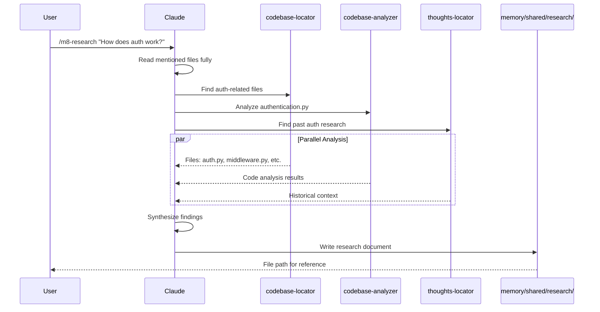

# Phase 1: Research with `/m8-research`
Deep codebase analysis using parallel sub-agents to understand architecture and patterns.

### How It Works



### What You Get

**Structured Research Document:**
```markdown
# Research: How Does Authentication Work?

## Summary
- Token-based JWT authentication
- Middleware validates on every request
- Redis stores active sessions

## Detailed Findings

### Authentication Flow (auth/middleware.py:45-67)
The middleware intercepts requests and validates JWT tokens...

[file references with line numbers]

## Architecture Insights
- Stateless JWT design allows horizontal scaling
- Refresh token rotation prevents token theft
- Rate limiting per user prevents abuse

## Code References
- `auth/middleware.py:45` - JWT validation
- `auth/tokens.py:23` - Token generation
- `auth/redis_store.py:12` - Session storage
```

### Key Features

- **Parallel sub-agents** explore different aspects simultaneously
- **Full file context** - reads mentioned files completely before spawning agents
- **Persistent memory** - research saved to `memory/shared/research/`
- **Git metadata** - captures commit, branch, researcher for context
- **File references** - clickable links to specific lines of code
