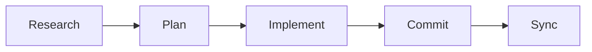

# Workflows

Common development patterns and workflows with mem8.

## Overview

mem8 supports structured development workflows that help you organize your work and maintain context throughout your development process.

## Core Workflows

### Research → Plan → Implement → Commit

The recommended workflow for feature development:



#### 1. Research

Understand the codebase and gather context:

```bash
# In Claude Code
/m8-research "authentication system"
```

Creates: `memory/shared/research/authentication-system-YYYYMMDD.md`

#### 2. Plan

Design your approach:

```bash
/m8-plan "add OAuth2 support"
```

Creates: `memory/shared/plans/add-oauth2-support.md`

#### 3. Implement

Execute your plan with context:

```bash
/m8-implement memory/shared/plans/add-oauth2-support.md
```

Claude Code loads your plan and implements step-by-step.

#### 4. Commit

Create a conventional commit:

```bash
/m8-commit
```

Generates appropriate commit message based on changes.

#### 5. Sync

Share with your team:

```bash
mem8 sync
```

## Team Workflows

### Shared Research

Share findings with your team:

1. **Research** - Document findings in `memory/shared/research/`
2. **Commit** - Commit to git
3. **Sync** - `mem8 sync --direction push`
4. **Team pulls** - Others run `mem8 sync --direction pull`

### Pull Request Documentation

Document PRs for future reference:

```bash
# After creating PR
/m8-describe-pr https://github.com/org/repo/pull/123
```

Creates: `memory/shared/prs/123_description.md`

### Decision Records

Track architectural decisions:

1. Create in `memory/shared/decisions/`
2. Follow ADR format
3. Link to PRs and issues
4. Sync with team

## Daily Workflows

### Morning Routine

```bash
# Pull team updates
mem8 sync --direction pull

# Check for issues
mem8 doctor

# Review recent work
mem8 search "research" --limit 5
```

### During Development

Use the Research → Plan → Implement → Commit cycle for each feature.

### End of Day

```bash
# Ensure all work is documented
mem8 status

# Share with team
mem8 sync --direction push
```

## Advanced Workflows

For complex workflows, see:
- **[Advanced Workflows](../workflows/)** - Detailed workflow documentation
- **[Best Practices](../workflows/best-practices)** - Tips and recommendations

## Workflow Customization

### Custom Commands

Create custom slash commands in `.claude/commands/`:

```markdown
# .claude/commands/my-workflow.md
Describe your custom workflow here.
Claude Code will follow these instructions.
```

Use with: `/my-workflow`

### Custom Agents

Create specialized agents in `.claude/agents/`:

```markdown
# .claude/agents/code-reviewer.md
You are a code reviewer agent.
Review code for:
- Security issues
- Performance problems
- Best practices
```

## Integration with Tools

### Git Integration

mem8 works alongside your git workflow:

```bash
# Create feature branch
git checkout -b feature/oauth2

# Research and plan
/m8-research "authentication"
/m8-plan "OAuth2"

# Implement
/m8-implement memory/shared/plans/oauth2.md

# Commit with context
/m8-commit
```

### CI/CD Integration

Use mem8 in your CI/CD:

```yaml
# .github/workflows/docs.yml
- name: Check documentation
  run: |
    mem8 doctor
    mem8 status --detailed
```

## Next Steps

- **[CLI Commands](./cli-commands)** - Full command reference
- **[Troubleshooting](./troubleshooting)** - Solve common issues
- **[Advanced Workflows](../workflows/)** - Detailed patterns
