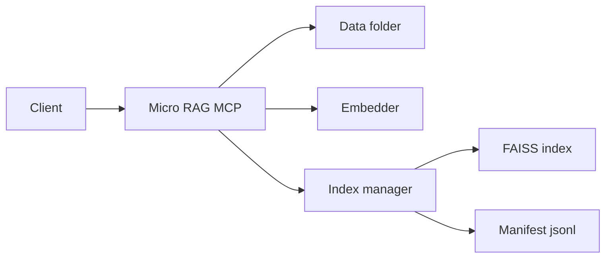
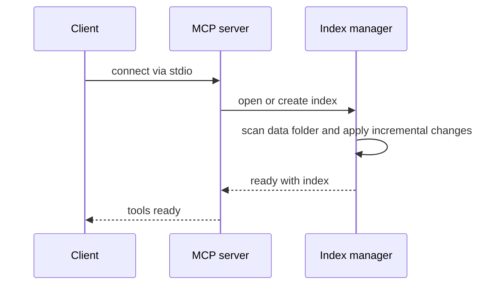

# micro-rag-mcp: Minimal local RAG MCP server

Minimal, local Retrieval Augmented Generation indexing and search MCP server for folders of documents. Designed for multiple instances via uvx with different data folders. Stores a persistent FAISS index under each data folder in an index directory.

## Goals
- Minimal and elegant: a single stdio MCP server process with two tools: search and reindex
- Local only: no network calls; works offline once models are downloaded
- Fast startup: incremental indexing by file mtime with content checksum verification
- Low footprint: sentence-transformers all-MiniLM-L6-v2, FAISS IndexFlatIP, numpy

## Default behavior
- Embeddings: sentence-transformers all-MiniLM-L6-v2
- File types: .txt, .md, .pdf, .docx
- Chunking: 1000 characters, 200 overlap, paragraph aware
- Similarity: cosine via L2 normalized vectors and FAISS IndexFlatIP
- Index location: <data_folder>/index
- Startup: scan files and apply incremental changes to the index
- Concurrency: simple file lock index.lock to serialize reindex operations
- Logging: human logs to stderr; tool results are structured

## Multi-instance support

- You can run multiple independent MCP server instances by specifying different `--title` and `--inst` arguments for each process.
- Both `--title` and `--inst` are **required**.
- The `--title` is used as the FastMCP server name.
- The `--inst` is passed verbatim as the FastMCP instructions (can be a sentence, multi-line, etc).
- The default index location remains `<data_folder>/index` for all instances unless you override with `--index-folder`.

### Example MCP config with two instances

```json
{
  "mcpServers": {
    "team_alpha": {
      "command": "uvx",
      "args": [
        "micro-rag-mcp@0.1.4",
        "--data-folder", "/docs/teamA",
        "--title", "Secret Islands",
        "--inst", "Team Alpha read-only mode with nightly refresh"
      ]
    },
    "team_beta": {
      "command": "uvx",
      "args": [
        "micro-rag-mcp@0.1.4",
        "--data-folder", "/docs/teamB",
        "--title", "Secret Islands",
        "--inst", "Team Beta write-enabled with manual refresh"
      ]
    }
  }
}
```

- To use multi-line instructions, use `\n` inside the string:
  - `"--inst", "Team Alpha\nRead-only\nRefresh: 02:00 IST"`

- Each item in the `args` array is a single argument; spaces and newlines are preserved as part of the string.


## Minimal architecture

### Planned source files
- [src/micro_rag_mcp/server.py](src/micro_rag_mcp/server.py)
- [src/micro_rag_mcp/index.py](src/micro_rag_mcp/index.py)
- [src/micro_rag_mcp/embedder.py](src/micro_rag_mcp/embedder.py)
- [src/micro_rag_mcp/ingest.py](src/micro_rag_mcp/ingest.py)
- [src/micro_rag_mcp/types.py](src/micro_rag_mcp/types.py)
- [src/micro_rag_mcp/utils.py](src/micro_rag_mcp/utils.py)
- [src/micro_rag_mcp/__main__.py](src/micro_rag_mcp/__main__.py)
- [src/micro_rag_mcp/__init__.py](src/micro_rag_mcp/__init__.py)

### Data flow



### Startup sequence



## Storage layout under <data_folder>/index
- faiss.index: serialized FAISS index
- manifest.jsonl: one JSON record per chunk
- files.json: per-file summary and last processed state
- version: schema version string
- index.lock: lock file during reindex

### manifest.jsonl record

```json
{
  "id": 12345,
  "path": "/abs/or/relative/path/to/file.md",
  "ext": ".md",
  "mtime": 1739650000.123,
  "checksum": "sha256:ab...cd",
  "chunk_index": 7,
  "char_start": 4200,
  "char_end": 5200,
  "text": "chunk text...",
  "embedding_dim": 384,
  "deleted": false
}
```

### files.json record

```json
{
  "path": "/abs/or/relative/path/to/file.md",
  "mtime": 1739650000.123,
  "checksum": "sha256:ab...cd",
  "chunk_ids": [1201, 1202, 1203],
  "ext": ".md"
}
```

## Incremental reindex algorithm
- Acquire index.lock; if exists, fail tool call with a clear error
- Load files.json and manifest.jsonl into memory maps
- Walk data folder for allowed extensions
- For each file
  - If new file, ingest, chunk, embed, add vectors and manifest records
  - If mtime differs or checksum differs, delete old chunks, add new chunks
- For files in files.json not present on disk, mark their chunks deleted and optionally reclaim ids later
- Persist FAISS, manifest.jsonl append, files.json
- Release lock and return counts

## Search algorithm
- Encode query to embedding
- L2 normalize query and index vectors
- Top k search via FAISS
- For each hit, fetch manifest record, compute snippet, return result

## MCP tools

### Tool name: search
- Params
  - query: string, required
  - top_k: integer, default 5, min 1, max 50
  - score_threshold: float, default 0.2, 0..1
- Returns
  - results: array of
    - path: string
    - score: float
    - snippet: string
    - chunk_index: integer
    - char_start: integer
    - char_end: integer
    - mtime: float
    - ext: string
- Errors
  - if index missing, server returns empty list and logs a warning

### Tool name: reindex
- Params
  - force: boolean, default false
  - path_glob: string, optional shell pattern relative to data folder
- Returns
  - files_added: integer
  - files_updated: integer
  - files_removed: integer
  - chunks_total: integer
  - elapsed_ms: integer
- Errors
  - if indexing already in progress, return a busy error

## CLI usage via uvx

- One off run

```bash
uvx micro-rag-mcp --data-folder /some/hr_docs --title "HR RAG" --inst "HR instance for confidential search"
```

- Override defaults

```bash
uvx micro-rag-mcp --data-folder /some/docs --index-folder /some/docs/index --exts .txt,.md,.pdf,.docx --title "Docs RAG" --inst "Docs instance"
```

## Local testing before PyPI upload

Before uploading to PyPI, test your package locally to ensure it works correctly with `uvx`:

### 1. Development Installation
```bash
# Install in development mode for rapid iteration
uv pip install -e .
micro-rag-mcp --help
```

### 2. Local uvx Testing
```bash
# Test uvx with local package
uvx --from ./ micro-rag-mcp --help

# Create test data and test functionality
mkdir -p test_data
echo "This is a test document about Python programming." > test_data/doc1.txt
echo "Another document about machine learning and AI." > test_data/doc2.md

# Test with real data
uvx --from ./ micro-rag-mcp --data-folder test_data
```

### 3. Build and Install Locally
```bash
# Build the package
uv build

# Install the built wheel
uv pip install dist/micro_rag_mcp-0.1.0-py3-none-any.whl

# Test uvx with installed package
uvx micro-rag-mcp --help
```

### 4. Clean Environment Testing
```bash
# Test in isolated virtual environment
uv venv test_env
source test_env/bin/activate
uv pip install dist/micro_rag_mcp-0.1.0-py3-none-any.whl
micro-rag-mcp --help
deactivate
```

### 5. Package Validation
```bash
# Check package metadata
uv pip show micro-rag-mcp

# Verify entry points
uv pip show -f micro-rag-mcp | grep -A5 "Entry-points"

# Test import
python -c "import micro_rag_mcp; print('Import successful')"
```

## MCP client configuration examples

See the "Multi-instance support" section above for recommended configuration with required `--title` and `--inst` arguments.


## Dependencies to declare in [pyproject.toml](pyproject.toml)
- mcp
- sentence-transformers
- faiss-cpu
- numpy
- pypdf
- python-docx
- pydantic
- charset-normalizer

## Implementation notes
- Use stdio transport from the Python mcp package
- Always write human logs to stderr to avoid polluting tool responses
- Normalize embeddings before adding to IndexFlatIP to approximate cosine
- Batch embeddings to manage memory; suggested batch size 64
- For pdf extraction, fall back to text if pages fail; skip images
- For docx, join paragraphs with double newline
- Use UTF-8 with errors replace for text files
- Use SHA256 on normalized text for checksums

## Security and privacy
- Operates only on local folders passed explicitly
- No network calls at runtime except model downloads on first use
- No PII leaves the machine

## Testing plan
- Create a sample folder with mixed file types
- Run uvx micro-rag-mcp --data-folder sample
- Use search tool from client to validate results and scores
- Modify a file and rerun reindex tool; ensure updates are reflected
- Remove a file and rerun reindex; ensure tombstones are applied

## Roadmap
- Background compaction to rebuild faiss and drop tombstones
- Optional rerankers for improved quality
- Additional readers for html and csv
- Hybrid search with BM25 for markdown headings

## Repository layout targets
- [README.md](README.md)
- [pyproject.toml](pyproject.toml)
- [src/micro_rag_mcp/__main__.py](src/micro_rag_mcp/__main__.py)
- [src/micro_rag_mcp/server.py](src/micro_rag_mcp/server.py)
- [src/micro_rag_mcp/index.py](src/micro_rag_mcp/index.py)
- [src/micro_rag_mcp/ingest.py](src/micro_rag_mcp/ingest.py)
- [src/micro_rag_mcp/embedder.py](src/micro_rag_mcp/embedder.py)
- [src/micro_rag_mcp/types.py](src/micro_rag_mcp/types.py)
- [src/micro_rag_mcp/utils.py](src/micro_rag_mcp/utils.py)

## Approval
- If this design matches expectations, the next steps are to update dependencies, scaffold files, and implement the two tools. See the todo list in this workspace.
## First-Run and Model Initialization Behavior

- On server startup, the sentence-transformer model is downloaded in the background.
- A background initial reindex is triggered automatically after the model is ready (no need to call reindex manually on first run).
- If a search is called before or during model setup, it will wait up to 5 seconds for the model to become ready. If the model is not ready within 5 seconds, search returns an empty result set (no error).
- Once the model is ready and the background reindex completes, search will return results as expected.
- This ensures that search never fails or blocks indefinitely, even if called immediately after server startup.
