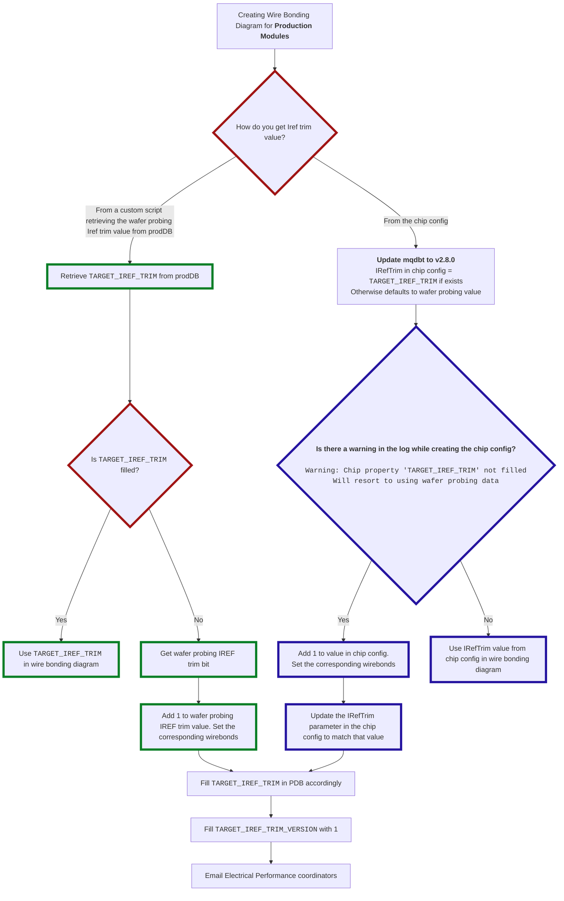

# Guides and Instructions

## IRef Trim

We run a script to centrally update `TARGET_IREF_TRIM` for all the FE chips in
the PDB (that are not already assembled in modules). This script will be run
centrally every few days/weeks as new FE chips are uploaded in PDB and as FE
chips can’t be updated if they’re being shipped in the PDB.

### Action item for groups

- Please update your scripts that used the value from wafer probing ( IREF trim
  bit from “Electrical FE chip tests” test) to use the new property
  `TARGET_IREF_TRIM`.
  - In case `TARGET_IREF_TRIM` value is not filled, your script should default
    to wafer probing value `+1` ( IREF trim bit from “Electrical FE chip tests”
    test `+ 1` )

  !!! warning

      If this happens, report it back to us! (it should not happen)

- If you use `mqdbt` to retrieve the Iref trim, please update it to `v2.8.0`
  which will retrieve the Iref trim from the new field. In case
  `TARGET_IREF_TRIM` value is not filled, there will be a warning in your log.
  Use wafer probing value `+1` in those cases.
- In general, in case Iref trim from wafer probing was `15`, it stays `15`. If
  the `TARGET_IREF_TRIM` and `TARGET_IREF_TRIM_VERSION` are not set, but you’re
  wirebonding the wafer probing value `+1`, please update them accordingly
  (`TARGET_IREF_TRIM_VERSION` should be set to `1`).

Please see the flowchart diagram below
([adapted from Google Drive](https://drive.google.com/file/d/1aXKuzrX9OFWTlj0RLyq6FrhjVKi-I_V_/view?usp=sharing)).

### Reference

- [https://indico.cern.ch/event/1560266/#120-electrical-failure-modes-o](https://indico.cern.ch/event/1560266/contributions/6574093/attachments/3089549/5471270/20250619_electricPerf.pdf)
- [https://indico.cern.ch/event/1567113/#1-iref-vddad-studies](https://indico.cern.ch/event/1567113/contributions/6602194/attachments/3100473/5493535/Curtin%20Seth%20ITkPix%20July%208%20Presentation.pdf)
