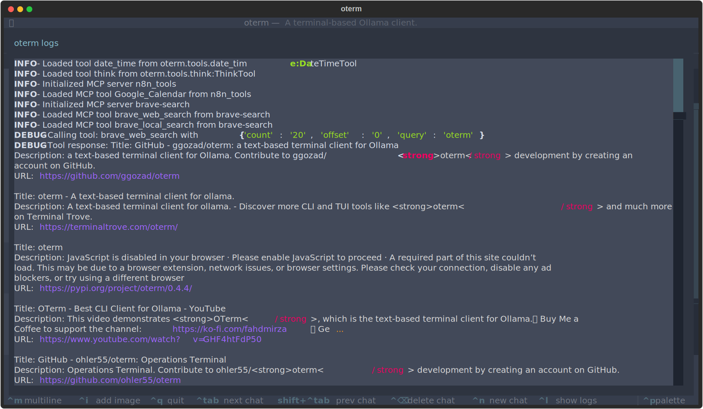

# Development & Debugging

## Inspecting logs

You can inspect basic logs from oterm by invoking the log viewer with <kbd>^ Ctrl</kbd>+<kbd>l</kbd> or by using the command palette. This is particurly useful if you want to debug tool calling.


oterm's internal log viewer showing the Brave Search MCP tool in action.

## Setup for development

- Create a virtual environment
```sh
uv venv
```
- Activate the virtual environment
```sh
source .venv/bin/activate
# or on Windows
source .venv\Scripts\activate
```

- Install oterm
```sh
uv pip install oterm
```
or checkout the repository and install the oterm package from source
```sh
git clone git@github.com:ggozad/oterm.git
uv sync
```

### Debugging

- In order to inspect logs from oterm, open a new terminal and run:
```sh
source .venv/bin/activate
textual console -x SYSTEM -x EVENT -x WORKER -x DEBUG
```
This will start the textual console and listen all log messages from oterm, hiding some of the textual UI messsages.

- You can now start oterm in debug mode:
```sh
source .venv/bin/activate
textual run -c --dev oterm
```

## Documentation

oterm uses [mkdocs](https://www.mkdocs.org/) with [material](https://squidfunk.github.io/mkdocs-material/) to generate the documentation. To build the documentation, run:
```sh
source .venv/bin/activate
mkdocs serve -o
```
This will start a local server and open the documentation pages in your default web browser.
