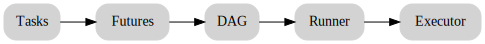

# Parslet Architecture

Parslet's runtime flows through a small set of primitives:

```
tasks -> futures -> DAG -> Runner -> Executor
```



1. `parslet_task` wraps Python callables and registers **tasks**.
2. Calling a task returns a `ParsletFuture` placeholder for its result.
3. A `DAG` links futures into a dependency graph.
4. `DAGRunner` walks the graph and drives an underlying **executor**.

The public API is intentionally tiny:
`parslet_task`, `ParsletFuture`, `DAG`, and `DAGRunner`.
