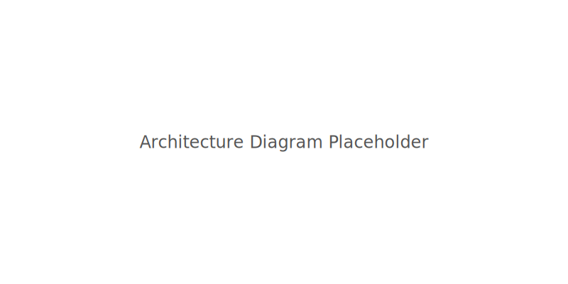

The Parslet Engine: How It All Fits Together
===========================================

The heart of Parslet is designed to be small, simple, and easy to understand. Think of it as a small team of workers, each with a very specific job. This design lets you run simple recipes on your phone but also handle bigger jobs on your laptop.

Here's a look at the main players on the team:

*   **The Recipe Steps (`@parslet_task` & `ParsletFuture`)**
    This is where it all starts. You take a normal Python function and add a ``@parslet_task`` stamp to it. When you call it, you get back an "IOU" note (a ``ParsletFuture``). You create the order of your recipe by passing these IOUs from one step to the next.

*   **The Flowchart Builder (`DAG`)**
    This worker takes your final IOU and follows all the connections backward to draw a complete flowchart (a DAG) of your recipe. It uses a powerful library called ``networkx`` to make sure your recipe doesn't have any impossible loops.

*   **The Head Chef (`DAGRunner` & `AdaptiveScheduler`)**
    This is the boss who runs the whole kitchen. The ``DAGRunner`` takes the flowchart and starts executing the steps. It has a smart helper, the ``AdaptiveScheduler``, which checks your phone's CPU, RAM, and battery to decide how many assistant chefs (worker threads) to use. This keeps everything running smoothly without crashing your device.

*   **The Photographer (`Exporter`)**
    This is an optional worker you can call on. Its job is to take a picture of your flowchart, saving it as a DOT or PNG file so you can see a visual map of your recipe.

*   **The Translator (`Parsl Bridge`)**
    This worker helps your Parslet recipes speak a different language. It provides tools to let your recipes run on Parslet's "big brother," the powerful Parsl system, for when you need to do some really heavy lifting on a big server.

Want to see how this team works together in practice? The best way is to look at our examples!
- ``examples/hello.py`` shows you the absolute basics.
- ``examples/image_filter.py`` shows you how to build a simple photo-editing recipe.
- ``rad_pipeline.py`` shows off a more advanced recipe for doing AI-powered diagnosis on a phone.

To learn how to get a picture of your own recipe, see our guide on :doc:`exporting`.
For a step-by-step guide on writing your first recipe, check out :doc:`usage`.