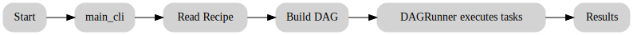

# A Look Under the Hood: How Parslet Works

Ever wondered how Parslet actually works its magic? How does it know what to do and in what order? Let's pop the hood and take a friendly look at the engine that makes Parslet tick.

Imagine you've given your personal assistant (that's Parslet!) a recipe. Here are the main characters involved in getting it done:

### The Core Team: Parslet's Internal Workers

#### 1. The Recipe Cards (`task.py`)

This is where it all begins. This part of the code defines what a "task" is.

-   **`@parslet_task` (The "Task" Stamp):** This is like a special stamp you put on a regular Python function. When you stamp a function with `@parslet_task`, you're telling Parslet, "Hey, this is one of the steps in my recipe!"

-   **`ParsletFuture` (The IOU Note):** This is the real magic. When you call a stamped function, it doesn't run right away. Instead, it hands you back a special "IOU" note. This note is a *promise* that the result will be ready in the future. It holds all the info about the step: which function to run, what ingredients (arguments) to use, and a unique ID.

    When you pass one of these IOU notes to another task, you're telling Parslet, "You need to wait for this IOU to be paid before you can start this next step." This is how Parslet learns the order of your recipe!

#### 2. The Master Flowchart Builder (`dag.py`)

This worker's job is to take all your IOU notes and draw a big flowchart (a **D**irected **A**cyclic **G**raph, or **DAG**) of your entire recipe.

-   **`DAG` Class:** When you give this worker your final IOU, it works backward, following all the other IOUs to map out every connection. It uses a super-smart library called `networkx` to build this map. This map lets Parslet:
    -   **Check for Mistakes:** It makes sure you haven't accidentally created a loop, like "Step A needs Step B, and Step B needs Step A." That would run forever!
    -   **Find the Best Path:** It figures out the most efficient order to do everything.

#### 3. The Head Chef (`runner.py`)

This is the worker that actually does the cooking!

-   **`DAGRunner` Class:** The Head Chef takes the flowchart from the Flowchart Builder and starts executing the tasks.
    -   It uses a team of assistant chefs (a `ThreadPoolExecutor`) to work on multiple steps at once if they don't depend on each other.
    -   **Getting the Ingredients:** Before starting a step, the Chef looks at the required IOUs. It waits until the promises are fulfilled and the real results (the ingredients) are ready.
    -   **Updating the IOUs:** Once a step is done, the Chef takes the result and updates the IOU note, either with the successful result or with an error message if something went wrong.
    -   **Keeping Time:** The Chef also keeps a stopwatch on every task, so you can see how long each step took.

#### 4. The Front Counter (`main_cli.py`)

This is the part of Parslet you talk to from your command line. It's the friendly face of the whole operation.

-   It takes your order (like `parslet run my_recipe.py`).
-   It finds your recipe file and gives it to the other workers.
-   It tells the Head Chef to start cooking.
-   When everything is done, it shows you the final results and the Chef's report card (the benchmarks).

### The Journey of a Recipe: From Your Keyboard to a Result

So, what happens step-by-step when you type `parslet run my_recipe.py`?

1.  **Order Up!** The **Front Counter** (`main_cli`) gets your command.
2.  **Read the Recipe:** It finds and reads your `my_recipe.py` file.
3.  **Find the Final Step:** It calls your `main()` function to get the final IOU note for your recipe.
4.  **Draw the Map:** It gives that final IOU to the **Flowchart Builder** (`DAG`), which follows all the connections and draws the complete map of your recipe. It also double-checks the map for any impossible loops.
5.  **Get the Cooking Order:** The **Head Chef** (`DAGRunner`) asks the builder for the best, most efficient order to do the steps.
6.  **Start Cooking!** The Head Chef goes through the steps one by one.
    -   For each step, it waits for the results from any previous steps (the IOUs).
    -   Once it has the ingredients, it gives the step to one of its assistant chefs to run.
    -   When a step is done, the Chef updates the IOU with the result or an error.
7.  **All Done!** Once the final IOU is ready, the Head Chef tells the Front Counter.
8.  **Here's Your Food!** The Front Counter prints the final results and a summary of how everything went.

### Special Features, Explained Simply

-   **Being Smart About Your Phone:** The Head Chef is smart. Before it starts, it checks your phone's CPU and battery. If you use `--battery-mode`, it tells its assistant chefs to take it easy to save power.
-   **Saving Your Progress:** If you use `--checkpoint-file`, the Head Chef writes down every single step it completes. If the recipe gets interrupted, it can pick up right where it left off.
-   **Security Guards:** Parslet has a "DEFCON" security system. It scans your code for anything obviously dangerous, checks for tampering, and can safely handle crashes without bringing down the whole system.
-   **Speaking Other Languages:** Parslet knows that other tools like Dask and Parsl exist. It has a built-in translator (`parslet convert`) that can rewrite recipes from those tools into a Parslet recipe you can run right away.

That's it! Parslet is designed to be simple on the outside, but it has a smart, efficient, and robust team of workers under the hood making sure your recipes get done right, every time.