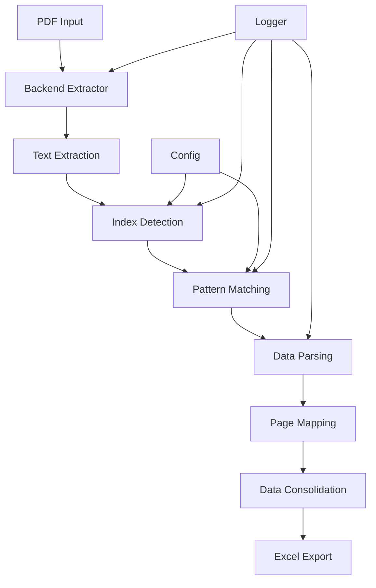

# 📋 Proyecto: Extractor Automático de Índices de Notas desde PDFs Financieros

## 🎯 Visión General

Sistema automatizado para detectar, extraer y estructurar índices de notas desde PDFs de estados financieros chilenos (formato NIIF), generando un archivo Excel con la relación nota-página y métricas de confianza.

## 🏗️ Arquitectura del Sistema



## 📁 Estructura del Repositorio

```
pdf-notes-extractor/
├── 📄 README.md                      # Documentación principal
├── 📄 pyproject.toml                 # Configuración del proyecto y dependencias
├── 📄 setup.cfg                      # Configuración adicional de herramientas
├── 📄 .gitignore                     # Archivos ignorados por git
├── 📄 .env.example                   # Variables de entorno de ejemplo
├── 📄 Makefile                       # Comandos útiles del proyecto
│
├── 📁 src/
│   └── 📁 notes_extractor/
│       ├── 📄 __init__.py           # Inicialización del paquete
│       ├── 📄 __main__.py           # Entry point para ejecución como módulo
│       ├── 📄 config.py             # Configuración centralizada
│       ├── 📄 constants.py          # Constantes del proyecto
│       ├── 📄 exceptions.py         # Excepciones personalizadas
│       │
│       ├── 📁 core/
│       │   ├── 📄 __init__.py
│       │   ├── 📄 patterns.py       # Patrones regex y utilidades
│       │   ├── 📄 heuristics.py     # Motor de scoring para detección
│       │   ├── 📄 parser.py         # Parser principal de índices
│       │   ├── 📄 normalizer.py     # Normalización y limpieza de datos
│       │   └── 📄 mapper.py         # Mapeo página impresa → PDF
│       │
│       ├── 📁 extractors/
│       │   ├── 📄 __init__.py
│       │   ├── 📄 base.py           # Clase abstracta base
│       │   ├── 📄 pdfplumber_extractor.py
│       │   ├── 📄 pymupdf_extractor.py
│       │   └── 📄 pypdf2_extractor.py
│       │
│       ├── 📁 models/
│       │   ├── 📄 __init__.py
│       │   ├── 📄 note_entry.py     # Modelo de datos para entradas
│       │   ├── 📄 index_page.py     # Modelo para páginas de índice
│       │   └── 📄 extraction_result.py
│       │
│       ├── 📁 exporters/
│       │   ├── 📄 __init__.py
│       │   ├── 📄 base.py           # Interfaz base para exportadores
│       │   ├── 📄 excel_exporter.py # Exportador a Excel
│       │   └── 📄 json_exporter.py  # Exportador a JSON (opcional)
│       │
│       ├── 📁 utils/
│       │   ├── 📄 __init__.py
│       │   ├── 📄 logger.py         # Sistema de logging
│       │   ├── 📄 validators.py     # Validaciones de entrada
│       │   ├── 📄 file_utils.py     # Utilidades para archivos
│       │   └── 📄 text_utils.py     # Procesamiento de texto
│       │
│       ├── 📁 cli/
│       │   ├── 📄 __init__.py
│       │   ├── 📄 main.py           # CLI principal
│       │   └── 📄 commands.py       # Comandos CLI
│       │
│       └── 📁 pipeline/
│           ├── 📄 __init__.py
│           ├── 📄 orchestrator.py   # Orquestador del pipeline
│           └── 📄 stages.py         # Etapas del pipeline
│
├── 📁 tests/
│   ├── 📄 __init__.py
│   ├── 📄 conftest.py               # Fixtures de pytest
│   ├── 📁 unit/
│   │   ├── test_patterns.py
│   │   ├── test_heuristics.py
│   │   ├── test_parser.py
│   │   └── test_normalizer.py
│   ├── 📁 integration/
│   │   ├── test_pipeline.py
│   │   └── test_extractors.py
│   └── 📁 fixtures/
│       ├── sample_pdfs/
│       └── expected_outputs/
│
├── 📁 scripts/
│   ├── 📄 validate_pdf.py          # Script de validación
│   ├── 📄 batch_process.py         # Procesamiento por lotes
│   └── 📄 generate_report.py       # Generación de reportes
│
├── 📁 docs/
│   ├── 📄 architecture.md          # Arquitectura detallada
│   ├── 📄 api.md                   # Documentación API
│   ├── 📄 patterns.md              # Documentación de patrones
│   └── 📄 examples.md              # Ejemplos de uso
│
└── 📁 examples/
    ├── 📄 basic_usage.py
    ├── 📄 advanced_config.py
    └── 📁 sample_pdfs/

```

## 🔧 Configuración de Dependencias

### pyproject.toml
```toml
[build-system]
requires = ["setuptools>=61.0", "wheel"]
build-backend = "setuptools.build_meta"

[project]
name = "pdf-notes-extractor"
version = "1.0.0"
description = "Extractor automático de índices de notas desde PDFs financieros"
readme = "README.md"
requires-python = ">=3.8"
license = {text = "MIT"}
authors = [
    {name = "Tu Nombre", email = "tu@email.com"}
]
classifiers = [
    "Development Status :: 4 - Beta",
    "Intended Audience :: Financial and Insurance Industry",
    "Topic :: Office/Business :: Financial",
    "License :: OSI Approved :: MIT License",
    "Programming Language :: Python :: 3",
    "Programming Language :: Python :: 3.8",
    "Programming Language :: Python :: 3.9",
    "Programming Language :: Python :: 3.10",
    "Programming Language :: Python :: 3.11",
]

dependencies = [
    "pdfplumber>=0.11.0",
    "pandas>=2.0.0",
    "openpyxl>=3.1.0",
    "xlsxwriter>=3.2.0",
    "click>=8.1.0",
    "pydantic>=2.0.0",
    "python-dotenv>=1.0.0",
    "colorlog>=6.7.0",
    "tqdm>=4.65.0",
]

[project.optional-dependencies]
dev = [
    "pytest>=7.4.0",
    "pytest-cov>=4.1.0",
    "pytest-mock>=3.11.0",
    "black>=23.0.0",
    "isort>=5.12.0",
    "flake8>=6.0.0",
    "mypy>=1.4.0",
    "pre-commit>=3.3.0",
]
alternative = [
    "PyMuPDF>=1.24.0",
    "PyPDF2>=3.0.0",
]
ocr = [
    "pytesseract>=0.3.10",
    "pdf2image>=1.16.3",
]

[project.scripts]
notes-extractor = "notes_extractor.cli.main:cli"

[tool.setuptools.packages.find]
where = ["src"]

[tool.black]
line-length = 100
target-version = ['py38']

[tool.isort]
profile = "black"
line_length = 100

[tool.mypy]
python_version = "3.8"
warn_return_any = true
warn_unused_configs = true
```

## 🏭 Pipeline de Procesamiento

### Diagrama de Flujo del Pipeline

```
┌─────────────────┐
│   PDF Input     │
└────────┬────────┘
         │
    ┌────▼────┐
    │Validation│
    └────┬────┘
         │
┌────────▼────────┐
│Text Extraction  │ ◄── Backend Selection
└────────┬────────┘     (pdfplumber/PyMuPDF/PyPDF2)
         │
┌────────▼────────┐
│Index Detection  │ ◄── Heuristics Engine
└────────┬────────┘
         │
┌────────▼────────┐
│Pattern Matching │ ◄── Regex Patterns
└────────┬────────┘
         │
┌────────▼────────┐
│  Data Parsing   │
└────────┬────────┘
         │
┌────────▼────────┐
│Page Mapping     │ ◄── Optional
└────────┬────────┘
         │
┌────────▼────────┐
│Normalization    │
└────────┬────────┘
         │
┌────────▼────────┐
│Consolidation    │
└────────┬────────┘
         │
┌────────▼────────┐
│  Excel Export   │
└─────────────────┘
```

## 📊 Modelos de Datos

### NoteEntry
```python
class NoteEntry:
    nota_id: str           # "1", "1.1", "II"
    titulo: str            # Título de la nota
    pagina_impresa: int    # Página según el índice
    pagina_pdf: Optional[int]  # Página real en el PDF
    pagina_fuente: int     # Página del índice donde se encontró
    confianza: float       # Score de confianza [0-1]
    metadata: Dict         # Información adicional
```

### IndexPage
```python
class IndexPage:
    page_number: int       # Número de página en el PDF
    score: float          # Score de detección
    note_count: int       # Cantidad de notas detectadas
    has_header: bool      # Si tiene encabezado de índice
    dot_leaders: int      # Líneas con puntos líderes
    confidence: float     # Confianza general
```

## 🎯 Heurísticas de Detección

### Sistema de Scoring

| Factor | Peso | Descripción |
|--------|------|-------------|
| Líneas de nota | 3.0 | Líneas que comienzan con "Nota" |
| Puntos líderes | 2.0 | Líneas con .... seguido de número |
| Header presente | 3.0 | Encabezado "Índice de notas" detectado |
| Notas únicas | 1.0 | Cantidad de notas distintas |
| Consecutividad | 0.5 | Bonus por secuencia 1,2,3... |
| Densidad | 1.5 | Ratio notas/total líneas |

### Fórmula de Score
```
score = 3*note_lines + 2*dot_lines + 3*header_hit + 
        1*unique_notes + 0.5*consec_bonus + 1.5*density
```

## 🔍 Patrones Regex

### Patrones Principales

```regex
# Encabezados de índice
HEADER = r'\b(índice de notas?|notas a los estados financieros|notas explicativas)\b'

# Línea de nota simple
NOTE_LINE = r'^\s*(?:nota|notas?)\s+(\d+(?:[.\-]\d+[a-z]?)?|[IVXLC]+)'

# Entrada completa con página
FULL_ENTRY = r'^\s*(?:nota|notas?)\s+([^:.\-–—]+)[:.\-–—]?\s*(.*?)\s*[.\s]{3,}(\d{1,4})\s*$'

# Subnotas
SUBNOTE = r'^\s*(\d+)\.(\d+[a-z]?)\s*[:.\-–—]?\s*(.*)$'
```

## 📝 Casos de Uso Soportados

### Formatos de Índice

1. **Estándar con puntos líderes**
   ```
   Nota 1 - Información general..................... 15
   Nota 2 - Resumen políticas contables............ 18
   ```

2. **Con espacios/tabs**
   ```
   Nota 1 - Información general                     15
   Nota 2 - Resumen políticas contables            18
   ```

3. **Formato tabla**
   ```
   | Nota | Descripción                  | Página |
   |------|------------------------------|--------|
   | 1    | Información general          | 15     |
   | 2    | Resumen políticas contables | 18     |
   ```

4. **Con subnotas**
   ```
   Nota 1 - Información general.................... 15
   Nota 1.1 - Bases de preparación................ 16
   Nota 1.2 - Moneda funcional.................... 17
   ```

5. **Numeración romana**
   ```
   Nota I - Información general.................... 15
   Nota II - Resumen políticas contables.......... 18
   ```

## 🚀 Flujo de Ejecución

### 1. Inicialización
- Cargar configuración
- Seleccionar backend extractor
- Configurar logging

### 2. Extracción
- Validar PDF de entrada
- Extraer texto por página
- Opcionalmente extraer coordenadas

### 3. Detección
- Calcular scores por página
- Identificar páginas candidatas
- Expandir a bloques consecutivos

### 4. Parsing
- Aplicar patrones regex
- Extraer nota_id, titulo, pagina
- Calcular confianza por entrada

### 5. Normalización
- Limpiar espacios y caracteres
- Convertir romanos (para ordenar)
- Validar rangos de páginas

### 6. Consolidación
- Eliminar duplicados
- Priorizar por confianza
- Ordenar por nota_id

### 7. Mapeo (Opcional)
- Detectar numeración en pies de página
- Calcular offset/función de mapeo
- Aplicar mapeo a páginas

### 8. Exportación
- Crear DataFrame con pandas
- Generar hojas Excel
- Aplicar formato y estilos

## 🎮 Interfaz CLI

### Comandos Disponibles

```bash
# Procesamiento básico
notes-extractor extract input.pdf -o output.xlsx

# Con backend específico
notes-extractor extract input.pdf -o output.xlsx --backend pymupdf

# Con límite de escaneo
notes-extractor extract input.pdf -o output.xlsx --scan-first 50

# Con mapeo de páginas
notes-extractor extract input.pdf -o output.xlsx --map-pages

# Modo debug
notes-extractor extract input.pdf -o output.xlsx --debug

# Procesamiento por lotes
notes-extractor batch ./pdfs/ -o ./outputs/

# Validación de PDF
notes-extractor validate input.pdf
```

### Parámetros CLI

| Parámetro | Tipo | Default | Descripción |
|-----------|------|---------|-------------|
| `--backend` | Choice | pdfplumber | Backend de extracción |
| `--scan-first` | Int | None | Límite de páginas a escanear |
| `--min-note-lines` | Int | 3 | Mínimo de líneas de nota |
| `--confidence-threshold` | Float | 0.6 | Umbral de confianza |
| `--map-pages` | Flag | False | Activar mapeo de páginas |
| `--export-format` | Choice | excel | Formato de salida |
| `--lang` | Choice | es | Idioma (es/en) |
| `--debug` | Flag | False | Modo debug con logs detallados |

## 📈 Métricas y Validación

### Métricas de Calidad

1. **Precisión**: % de notas correctamente identificadas
2. **Recall**: % de notas del PDF encontradas
3. **F1-Score**: Media armónica de precisión y recall
4. **Confianza promedio**: Score promedio de entradas
5. **Tiempo de procesamiento**: Segundos por PDF

### Validaciones

- ✅ PDF no corrupto
- ✅ Texto extraíble (no escaneado)
- ✅ Al menos una página de índice detectada
- ✅ Mínimo de notas encontradas
- ✅ Páginas en rango válido (1-9999)

## 🔐 Manejo de Errores

### Excepciones Personalizadas

```python
class PDFExtractionError(Exception): pass
class IndexNotFoundError(Exception): pass
class InvalidPDFError(Exception): pass
class BackendNotAvailableError(Exception): pass
```

### Estrategias de Recuperación

1. **PDF corrupto**: Intentar con backend alternativo
2. **Sin índice detectado**: Reducir umbrales y reintentar
3. **Formato no reconocido**: Aplicar heurísticas alternativas
4. **Mapeo fallido**: Continuar sin mapeo y advertir

## 🧪 Testing

### Cobertura de Tests

- Unit tests: >90% cobertura
- Integration tests: Flujo completo
- Regression tests: Casos conocidos
- Performance tests: Tiempos de procesamiento

### Casos de Test

1. PDFs con 1 página de índice
2. PDFs con múltiples páginas de índice
3. Índices sin puntos líderes
4. Subnotas y numeración mixta
5. PDFs sin índice (debe fallar gracefully)

## 📚 Documentación Adicional

### Para Desarrolladores
- Guía de contribución
- Estándares de código
- Proceso de release

### Para Usuarios
- Manual de usuario
- Troubleshooting
- FAQ

## 🚦 Roadmap

### v1.0 (Actual)
- ✅ Extracción básica de índices
- ✅ Soporte multi-backend
- ✅ Exportación a Excel

### v1.1 (Próxima)
- ⏳ Soporte OCR para PDFs escaneados
- ⏳ API REST
- ⏳ Interface web básica

### v2.0 (Futuro)
- ⏳ Machine Learning para detección
- ⏳ Extracción de contenido de notas
- ⏳ Dashboard de análisis