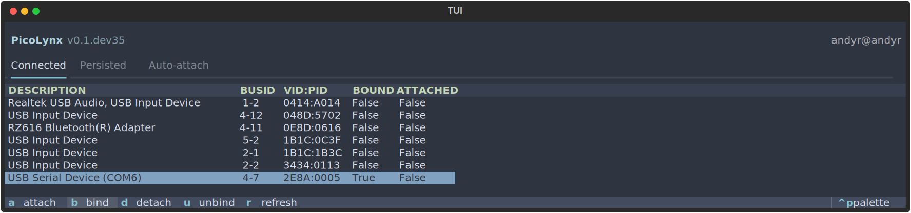
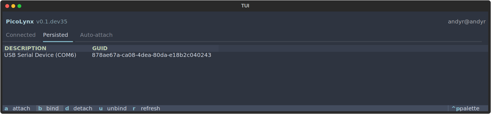

# PicoLynx - Attach Microcontrollers to WSL

PicoLynx is a Windows-only TUI (Text-based User Interface) application for attaching and detaching microcontroller devices to WSL (Windows Subsystem for Linux) distributions. It monitors Windows [`WM_DEVICECHANGE`](https://learn.microsoft.com/en-us/windows/win32/devio/wm-devicechange) messages with `pywin32` and leverages `usbipd-win` to manage device connections.

The TUI will react to USB Serial and USB Storage device connections and can run `usbipd-win` commands on any device in its interface.






https://github.com/user-attachments/assets/d5382270-cae8-4eb4-90a6-28ccb96e5250

> [!CAUTION]
> If a device is disconnected when attached to WSL, it will remain in the connected device table. `WM_DEVICECHANGE` events under these circumstances are not granular enough, but a manual detach ('d' press) or refresh ('r' press) will trigger an update.

## Features

- **Manual control**: Easily attach, bind, detach, or unbind devices using keyboard shortcuts.
- **Live device table**: View connected and persisted devices in real time.
- **Windows message monitoring**: Reacts instantly to hardware changes.
- **Thread-safe**: Ensures safe device operations even with concurrent events.
- **Beautiful TUI**: Built with `Textual` for a modern terminal experience & many theme options.
- **Auto-detect**: Detects devices as they are connected & disconnected.
- **Auto-attach (TODO)**: Auto-attachment of persisted devices on connection.

## Requirements

Windows 10/11 is the only supported platform, given the nature of this package. `PicoLynx` requires administrator privileges to interact with USB/Serial devices. If not run as administrator, it will prompt for elevation.

### Install `usbipd-win`

This tool enables sharing locally connected USB devices to other machines, including Hyper-V guests and WSL 2. Full instructions are available at [usbipd-win Github](https://github.com/dorssel/usbipd-win). Window package manager can be used to install the tool:

```sh
winget install usbipd
```

### Install `WSL`

Microsoft WSL documentation is available @ [learn.microsoft.com](https://learn.microsoft.com/en-us/windows/wsl/install). The following Windows features are required, which can be enabled by searching for 'Turn Windows features on or off' in the Start Menu:

- Virtual Machine Platform
- Windows Hypervisor Platform
- Windows Subsystem for Linux

Its worth updating WSL if newly enabled:

```sh
wsl --update
```

To install a Linux distribution, refer to the guide listed above, or see my Void Linux & Alpine Linux WSL repo guides for an example of a manual distro installation.

## `PicoLynx` Installation

[Astral uv](https://docs.astral.sh/uv/) package manager is recommended for a fast, isolated, and reliable install. To install `uv`, use the following command:

```sh
powershell -ExecutionPolicy ByPass -c "irm https://astral.sh/uv/install.ps1 | iex"
```

You can install `PicoLynx` globally with the following `uv` command:

```sh
uv tool install picolynx
```

Or:

```sh
uv tool install "git+https://github.com/andyrids/picolynx.git"
```

You can run `PicoLynx` without installing, by running the following command:

```sh
uvx picolynx
```

Or:

```sh
uvx "git+https://github.com/andyrids/picolynx.git"
```

## Keyboard Shortcuts

The TUI command palette can be opened with `ctrl + p`, which has options for theme changes and the full command help panel. Tabs can be navigated and switched to with the `tab` key and tables can be traversed with the arrow keys.

| Key | Action  |
| --- | ------- |
|  a  | Attach  |
|  b  | Bind    |
|  d  | Detach  |
|  u  | Unbind  |
|  r  | Refresh |

Select a device in the table and press the corresponding key to perform the action.

## Development

Clone the repository and enter the `picolynx` directory.

```sh
git clone git@github.com:andyrids/picolynx.git
```

```sh
cd picolynx
```

The `just` command runner ([GitHub page](https://github.com/casey/just)) is a handy way to save and run project-specific commands, which are written in a file called `justfile`.

If you use `just`, you can add use the commands below to run `PicoLynx` in development mode, with the `textual` console integration.

This command uses `uv` to sync the package dependencies and create a `.venv`:

```sh
just sync
```

Alias for:

```sh
uv sync
```

Running the command below in one terminal, will activate the `textual` console, which listens to a running textual app in `--dev` mode:

```sh
just console
```

Alias for:

```sh
uv run textual console -x EVENT -x SYSTEM
```

Running this command will run `PicoLynx` in development mode, with a logging level set to 'DEBUG'.

```sh
just dev
```

Alias for:

```sh
uv run textual run --dev src/picolynx/__main__.py --log-level DEBUG
```

The logging level can be modified in with a `--log-level` option, which takes the following choices; '*DEBUG*', '*INFO*', '*WARNING*' (default), '*ERROR*' & '*CRITICAL*'.

```sh
uv run textual run --dev src/picolynx/__main__.py --log-level INFO
```

## Acknowledgements

- [`usbipd-win`](https://github.com/dorssel/usbipd-win)
- [`textual`](https://textual.textualize.io/)
- [`textual-cookbook`](https://github.com/ttygroup/textual-cookbook)
- [`transcendent-textual`](https://github.com/Textualize/transcendent-textual)
- [`Astral uv`](https://docs.astral.sh/uv/)
- [`just`](https://github.com/casey/just)
