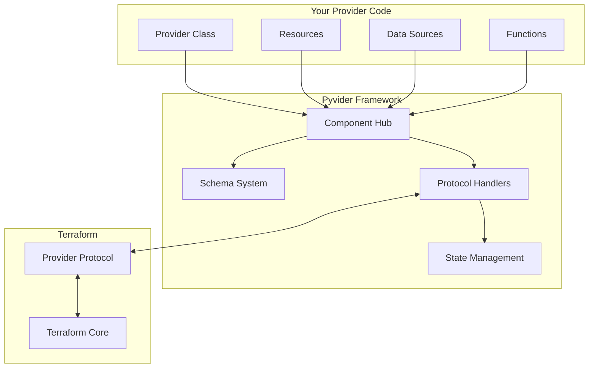

# 🐍 Pyvider: Build Terraform Providers in Pure Python

<p align="center">
  
</p>

<p align="center">
    <a href="https://pypi.org/project/pyvider/">
        
    </a>
    <a href="https://github.com/provide-io/pyvider/actions/workflows/ci.yml">
        
    </a>
    <a href="https://codecov.io/gh/provide-io/pyvider">
        
    </a>
    <a href="https://github.com/provide-io/pyvider/blob/main/LICENSE">
        
    </a>
    <a href="https://www.python.org/downloads/">
        
    </a>
</p>

**Pyvider** is the first production-ready Python framework for building Terraform providers. Write infrastructure as code using Python's elegance, type safety, and rich ecosystem—without sacrificing the power and reliability of Terraform.

---

## ✨ Why Pyvider?

Building Terraform providers traditionally requires Go expertise and deep knowledge of Terraform's plugin protocol. Pyvider changes the game:

- **🐍 Pure Python**: Write providers in the language you love, with full access to Python's vast ecosystem
- **🎯 Type-Safe**: Leverage Python's type hints and attrs for compile-time safety and IDE support
- **🚀 Zero Boilerplate**: Decorators handle all the protocol complexity—you focus on your infrastructure logic
- **🧪 Test-Driven**: Built-in testing framework with pytest integration for reliable providers
- **📦 Production-Ready**: Battle-tested implementation of Terraform Plugin Protocol v6
- **⚡ High Performance**: Optimized gRPC communication with async support throughout

## 🎯 Key Features

### 🏗️ Component-Based Architecture
```python
from pyvider.providers import register_provider
from pyvider.resources import register_resource
from pyvider.data_sources import register_data_source
from pyvider.functions import register_function

@register_provider("mycloud")
class MyCloudProvider:
    """Your cloud provider implementation"""
    pass

@register_resource("virtual_machine")  
class VirtualMachine:
    """Manages virtual machine lifecycle"""
    pass

@register_data_source("image_catalog")
class ImageCatalog:
    """Fetches available VM images"""
    pass

@register_function(name="generate_password")
class GeneratePassword:
    """Generates secure passwords"""
    pass
```

### 🔒 Type-Safe Schema Definition
```python
import attrs
from pyvider.schema import Schema, Attribute

@attrs.define
class VMConfig:
    name: str = Attribute(required=True, description="VM instance name")
    size: str = Attribute(default="medium", description="Instance size")
    tags: dict[str, str] = Attribute(description="Resource tags")
```

### 🧪 Comprehensive Testing
```python
import pytest
from pyvider.testing import ProviderTestCase

class TestVirtualMachine(ProviderTestCase):
    def test_create_vm(self):
        result = self.apply_resource("virtual_machine", {
            "name": "test-vm",
            "size": "large"
        })
        assert result.state["status"] == "running"
```

### 🎮 Powerful CLI
```bash
# Component discovery
pyvider components list

# Development server
pyvider provide --debug

# Schema validation
pyvider schema validate

# Package for distribution
pyvider build
```

## 📦 Installation

Install Pyvider using your favorite package manager:

```bash
# Using pip
pip install pyvider

# Using uv (recommended for development)
uv add pyvider

# With all optional dependencies
pip install pyvider[all]
```

## 🚀 Quick Start

Create your first Terraform provider in under 5 minutes:

### 1. Define Your Provider

```python
# my_provider.py
from pyvider.providers import register_provider, BaseProvider, ProviderMetadata
from pyvider.resources import register_resource, BaseResource
from pyvider.schema import Attribute
import attrs

@register_provider("mycloud")
class CloudProvider(BaseProvider):
    """Example cloud provider"""
    
    def __init__(self):
        super().__init__(
            metadata=ProviderMetadata(
                name="mycloud",
                version="1.0.0"
            )
        )
    
    @attrs.define
    class Config:
        api_key: str = Attribute(
            required=True,
            sensitive=True,
            description="API key for authentication"
        )
        region: str = Attribute(
            default="us-east-1",
            description="Default region"
        )

@register_resource("instance")
class Instance(BaseResource):
    """Cloud compute instance"""
    
    @attrs.define
    class Config:
        name: str = Attribute(required=True)
        size: str = Attribute(default="t2.micro")
        ami: str = Attribute(required=True)
    
    @attrs.define  
    class State:
        id: str = Attribute(computed=True)
        public_ip: str = Attribute(computed=True)
        status: str = Attribute(computed=True)
    
    async def create(self, config: Config) -> State:
        # Your cloud API calls here
        return self.State(
            id=f"i-{config.name}",
            public_ip="203.0.113.42",
            status="running"
        )
    
    async def read(self, state: State) -> State | None:
        # Check if resource still exists
        return state
    
    async def update(self, config: Config, state: State) -> State:
        # Update the resource
        return state
    
    async def delete(self, state: State) -> None:
        # Clean up the resource
        pass
```

### 2. Use in Terraform

```hcl
terraform {
  required_providers {
    mycloud = {
      source = "example.com/mycompany/mycloud"
    }
  }
}

provider "mycloud" {
  api_key = var.api_key
  region  = "us-west-2"
}

resource "mycloud_instance" "web" {
  name = "web-server"
  size = "t3.large"
  ami  = "ami-12345678"
}

output "instance_ip" {
  value = mycloud_instance.web.public_ip
}
```

### 3. Test Your Provider

```python
# test_provider.py
import pytest
from pyvider.testing import ProviderFixture

@pytest.fixture
def provider():
    return ProviderFixture("my_provider")

def test_instance_lifecycle(provider):
    # Create instance
    result = provider.apply("mycloud_instance", "test", {
        "name": "test-instance",
        "ami": "ami-12345"
    })
    
    assert result.state["status"] == "running"
    assert result.state["id"].startswith("i-")
    
    # Update instance
    result = provider.apply("mycloud_instance", "test", {
        "name": "test-instance",
        "ami": "ami-12345",
        "size": "t3.xlarge"
    })
    
    assert result.state["size"] == "t3.xlarge"
    
    # Destroy instance
    provider.destroy("mycloud_instance", "test")
```

## 🏛️ Architecture

Pyvider implements a clean, layered architecture:



### Core Components

- **🎯 Component Hub**: Automatic discovery and registration via decorators
- **📋 Schema System**: Type-safe, validated data models with attrs
- **🔌 Protocol Layer**: Complete Terraform Plugin Protocol v6 implementation
- **💾 State Management**: Encrypted private state for sensitive data
- **🔄 Lifecycle Handlers**: Full CRUD operations with async support
- **🧩 Capabilities**: Extensible plugin system for reusable functionality

## 📚 Documentation

### Getting Started
- [Installation Guide](docs/getting-started/installation.md)
- [Quick Start Tutorial](docs/getting-started/quick-start.md)
- [Your First Provider](docs/tutorials/first-provider.md)

### Core Concepts
- [Architecture Overview](docs/core-concepts/architecture.md)
- [Component Model](docs/core-concepts/component-model.md)
- [Schema System](docs/core-concepts/schema-system.md)
- [Protocol Implementation](docs/core-concepts/protocol.md)

### Developer Guides
- [Creating Providers](docs/guides/creating-providers.md)
- [Building Resources](docs/guides/building-resources.md)
- [Data Sources](docs/guides/data-sources.md)
- [Provider Functions](docs/guides/provider-functions.md)
- [Ephemeral Resources](docs/guides/ephemeral-resources.md)

### API Reference
- [Decorators](docs/api-reference/decorators.md)
- [Schema API](docs/api-reference/schema.md)
- [CLI Commands](docs/api-reference/cli.md)
- [Testing Utilities](docs/api-reference/testing.md)

### Advanced Topics
- [Capabilities System](docs/advanced/capabilities.md)
- [State Encryption](docs/advanced/state-management.md)
- [Performance Tuning](docs/advanced/performance.md)
- [Debugging Providers](docs/advanced/debugging.md)

## 🎯 Use Cases

Pyvider excels at:

- **☁️ Cloud Infrastructure**: AWS, Azure, GCP providers with boto3, azure-sdk, etc.
- **🔧 Internal Tools**: Company-specific infrastructure and services
- **🔌 API Integrations**: RESTful services, GraphQL endpoints, webhooks
- **📊 Data Platforms**: Databases, data warehouses, streaming platforms
- **🤖 ML/AI Infrastructure**: Model deployments, training pipelines, notebooks
- **🔐 Security Tools**: Certificate management, secret rotation, compliance

## 🚦 Production Ready

- **✅ Terraform Certified**: Fully compliant with HashiCorp specifications
- **🧪 Extensively Tested**: >90% code coverage with property-based testing
- **⚡ Performance Optimized**: Benchmarked for production workloads
- **🔒 Security First**: Built-in encryption for sensitive state data
- **📊 Observable**: Structured logging with provide.foundation
- **🌍 Cross-Platform**: Linux, macOS, Windows support

## 🤝 Contributing

We welcome contributions! See our [Contributing Guide](CONTRIBUTING.md) for details.

```bash
# Set up development environment
source ./env.sh

# Run tests
pytest

# Check code quality
ruff check
mypy src/pyvider

# Build provider
python scripts/build_provider.py
```

## 📄 License

Apache 2.0 - See [LICENSE](LICENSE) for details.

## 🔗 Resources

- **Documentation**: [Full Documentation](https://pyvider.readthedocs.io)
- **Examples**: [Example Providers](examples/)
- **PyPI**: [pyvider on PyPI](https://pypi.org/project/pyvider/)
- **GitHub**: [Source Code](https://github.com/provide-io/pyvider)
- **Discord**: [Community Chat](https://discord.gg/pyvider)

## 🙏 Acknowledgments

Built with ❤️ by the team at [Provide](https://provide.io) using:
- [structlog](https://www.structlog.org/) for structured logging
- [attrs](https://www.attrs.org/) for classes done right
- [grpcio](https://grpc.io/) for protocol communication
- [cryptography](https://cryptography.io/) for state encryption

---

<p align="center">
  <strong>Ready to build your next Terraform provider in Python?</strong><br>
  <a href="docs/getting-started/quick-start.md">Get Started →</a>
</p>