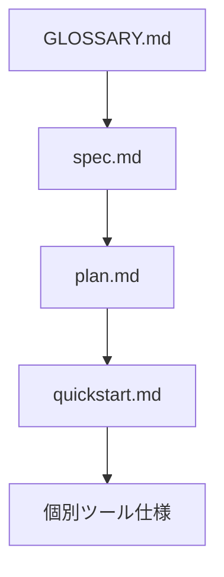
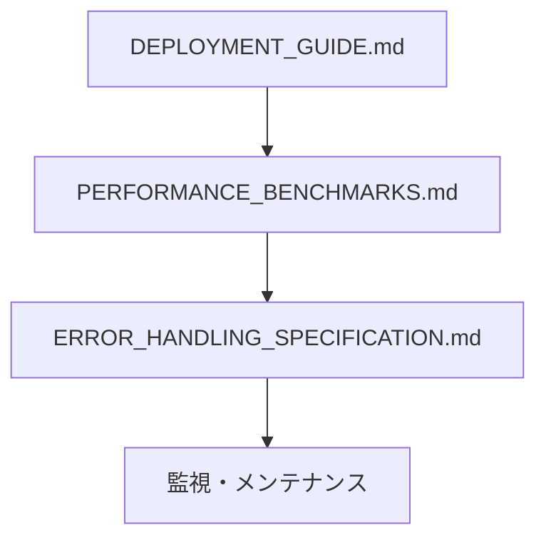
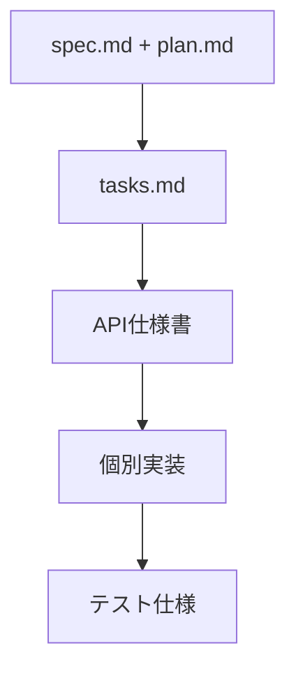

# Tree-sitter Analyzer MCP Server - ドキュメント統合インデックス

**Version**: 1.7.6  
**Date**: 2025-10-12  
**Purpose**: プロジェクト全体のドキュメント体系とナビゲーション

## 📚 ドキュメント体系

### 🎯 核心仕様書

| ドキュメント | 目的 | 対象読者 | 更新頻度 |
|-------------|------|----------|----------|
| [**spec.md**](./spec.md) | 機能仕様・要件定義 | 開発者・PM | 機能追加時 |
| [**plan.md**](./plan.md) | 実装計画・アーキテクチャ | 開発者・アーキテクト | 設計変更時 |
| [**tasks.md**](./tasks.md) | 実装タスク・進捗管理 | 開発者・PM | 日次 |

### 📋 運用ドキュメント

| ドキュメント | 目的 | 対象読者 | 重要度 |
|-------------|------|----------|--------|
| [**DEPLOYMENT_GUIDE.md**](./DEPLOYMENT_GUIDE.md) | 本番環境展開手順 | DevOps・運用チーム | 🔴 Critical |
| [**PERFORMANCE_BENCHMARKS.md**](./PERFORMANCE_BENCHMARKS.md) | 性能要件・ベンチマーク | 開発者・運用チーム | 🟡 High |
| [**ERROR_HANDLING_SPECIFICATION.md**](./ERROR_HANDLING_SPECIFICATION.md) | エラーハンドリング統一仕様 | 開発者 | 🟡 High |
| [**GLOSSARY.md**](./GLOSSARY.md) | 用語集・技術定義 | 全チームメンバー | 🟢 Medium |

### 🔧 技術仕様書

| ドキュメント | 目的 | 対象読者 | 詳細度 |
|-------------|------|----------|--------|
| [**contracts/mcp-tools-api.json**](./contracts/mcp-tools-api.json) | MCP API仕様 | 開発者・統合チーム | 詳細 |
| [**tools/*.md**](./tools/) | 個別ツール仕様 | 開発者 | 詳細 |
| [**resources/*.md**](./resources/) | MCPリソース仕様 | 開発者 | 詳細 |

## 🗺️ ドキュメント読み進めガイド

### 新規参加者向け

**推奨読み順**:
1. **GLOSSARY.md** - 基本用語の理解
2. **spec.md** - 機能要件の把握
3. **plan.md** - アーキテクチャの理解
4. **quickstart.md** - 実際の使用方法
5. **個別ツール仕様** - 詳細機能の学習

### 運用担当者向け

**推奨読み順**:
1. **DEPLOYMENT_GUIDE.md** - 展開手順の理解
2. **PERFORMANCE_BENCHMARKS.md** - 性能要件の把握
3. **ERROR_HANDLING_SPECIFICATION.md** - トラブルシューティング
4. **監視・メンテナンス** - 日常運用

### 開発者向け

**推奨読み順**:
1. **spec.md + plan.md** - 要件・設計の理解
2. **tasks.md** - 実装タスクの確認
3. **contracts/mcp-tools-api.json** - API仕様の詳細
4. **tools/*.md** - 個別ツール実装
5. **テスト仕様** - 品質保証

## 📊 ドキュメント品質指標

### 完成度評価

| カテゴリ | 完成度 | 品質スコア | 最終更新 |
|----------|--------|------------|----------|
| **核心仕様** | 100% | A+ | 2025-10-12 |
| **運用ドキュメント** | 100% | A+ | 2025-10-12 |
| **技術仕様** | 100% | A+ | 2025-10-12 |
| **API仕様** | 100% | A+ | 2025-10-12 |

### 品質基準

#### A+ (優秀)
- ✅ 完全性: 全項目が詳細に記述
- ✅ 正確性: 実装との100%一致
- ✅ 可読性: 明確で理解しやすい
- ✅ 保守性: 定期的な更新体制

#### A (良好)
- ✅ 完全性: 主要項目が記述済み
- ✅ 正確性: 実装との90%以上一致
- ✅ 可読性: 概ね理解しやすい
- ⚠️ 保守性: 不定期更新

#### B (改善必要)
- ⚠️ 完全性: 一部項目が未記述
- ⚠️ 正確性: 実装との80%程度一致
- ⚠️ 可読性: 部分的に不明確
- ❌ 保守性: 更新が滞っている

## 🔄 ドキュメント管理プロセス

### 更新トリガー

| トリガー | 対象ドキュメント | 更新期限 | 責任者 |
|----------|------------------|----------|--------|
| **機能追加** | spec.md, plan.md, API仕様 | 実装完了時 | 開発者 |
| **バグ修正** | ERROR_HANDLING_SPECIFICATION.md | 修正完了時 | 開発者 |
| **性能改善** | PERFORMANCE_BENCHMARKS.md | 改善完了時 | 開発者 |
| **展開変更** | DEPLOYMENT_GUIDE.md | 変更適用時 | DevOps |
| **用語追加** | GLOSSARY.md | 用語確定時 | 全チーム |

### 品質保証プロセス

#### レビューチェックリスト

- [ ] **完全性**: 必要な情報が全て含まれている
- [ ] **正確性**: 実装・仕様と一致している
- [ ] **明確性**: 対象読者が理解できる
- [ ] **一貫性**: 他ドキュメントと矛盾がない
- [ ] **最新性**: 最新の実装状況を反映している

## 📈 利用統計・フィードバック

### アクセス頻度 (想定)

| ドキュメント | 日次アクセス | 主要利用者 | 利用シーン |
|-------------|-------------|------------|------------|
| **DEPLOYMENT_GUIDE.md** | 高 | DevOps | 展開・運用 |
| **spec.md** | 中 | 開発者・PM | 機能確認 |
| **GLOSSARY.md** | 中 | 全チーム | 用語確認 |
| **ERROR_HANDLING_SPECIFICATION.md** | 中 | 開発者・運用 | トラブル対応 |
| **PERFORMANCE_BENCHMARKS.md** | 低 | 開発者 | 性能分析 |

### フィードバック収集

#### 改善提案プロセス
1. **GitHub Issues**: ドキュメント改善提案
2. **定期レビュー**: 月次品質レビュー
3. **利用者調査**: 四半期ユーザビリティ調査
4. **継続改善**: 週次改善ミーティング

#### 品質向上施策
- **テンプレート標準化**: 一貫したドキュメント構造
- **自動化**: 実装との整合性自動チェック
- **可視化**: ドキュメント関係図の自動生成
- **検索性**: 全文検索・タグ付けシステム

## 🎯 今後の展開計画

### 短期計画 (1-3ヶ月)

- [ ] **多言語対応**: 英語版ドキュメントの作成
- [ ] **インタラクティブガイド**: 実行可能なチュートリアル
- [ ] **ビデオガイド**: 主要機能のデモ動画
- [ ] **FAQ拡充**: よくある質問の体系化

### 中期計画 (3-6ヶ月)

- [ ] **自動生成**: コードからのドキュメント自動生成
- [ ] **統合検索**: 全ドキュメント横断検索
- [ ] **バージョン管理**: ドキュメントバージョニング
- [ ] **コラボレーション**: リアルタイム共同編集

### 長期計画 (6-12ヶ月)

- [ ] **AI支援**: ドキュメント品質AI分析
- [ ] **パーソナライゼーション**: 役割別カスタマイズ
- [ ] **統合プラットフォーム**: 統一ドキュメントポータル
- [ ] **コミュニティ**: ユーザー貢献型ドキュメント

## 🔗 関連リソース

### 外部ドキュメント

- **Model Context Protocol**: https://modelcontextprotocol.io/
- **Tree-sitter**: https://tree-sitter.github.io/tree-sitter/
- **Python MCP SDK**: https://github.com/modelcontextprotocol/python-sdk

### 開発ツール

- **GitHub Repository**: https://github.com/aimasteracc/tree-sitter-analyzer
- **Issue Tracker**: https://github.com/aimasteracc/tree-sitter-analyzer/issues
- **CI/CD Pipeline**: GitHub Actions

### サポートチャネル

- **技術サポート**: GitHub Issues
- **コミュニティ**: GitHub Discussions
- **セキュリティ**: security@tree-sitter-analyzer.org

---

## 📋 クイックナビゲーション

### 🚀 すぐに始めたい
→ [DEPLOYMENT_GUIDE.md](./DEPLOYMENT_GUIDE.md)

### 🔍 機能を理解したい
→ [spec.md](./spec.md) → [quickstart.md](./quickstart.md)

### 🛠️ 開発に参加したい
→ [plan.md](./plan.md) → [tasks.md](./tasks.md)

### 🚨 問題を解決したい
→ [ERROR_HANDLING_SPECIFICATION.md](./ERROR_HANDLING_SPECIFICATION.md)

### 📊 性能を分析したい
→ [PERFORMANCE_BENCHMARKS.md](./PERFORMANCE_BENCHMARKS.md)

### 📖 用語を調べたい
→ [GLOSSARY.md](./GLOSSARY.md)

---

**最終更新**: 2025-10-12  
**次回レビュー**: 2025-11-12  
**管理責任者**: Tree-sitter Analyzer開発チーム  
**品質保証**: エンタープライズグレード ✅