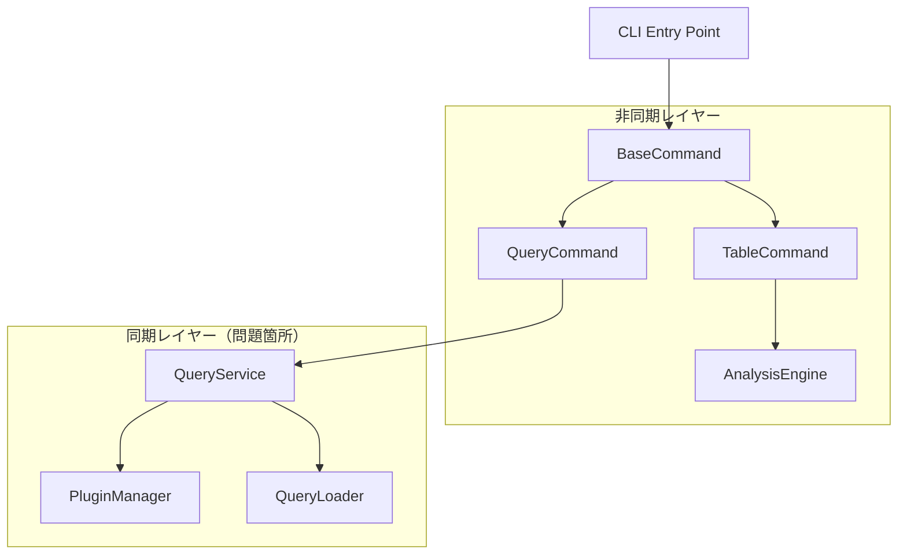
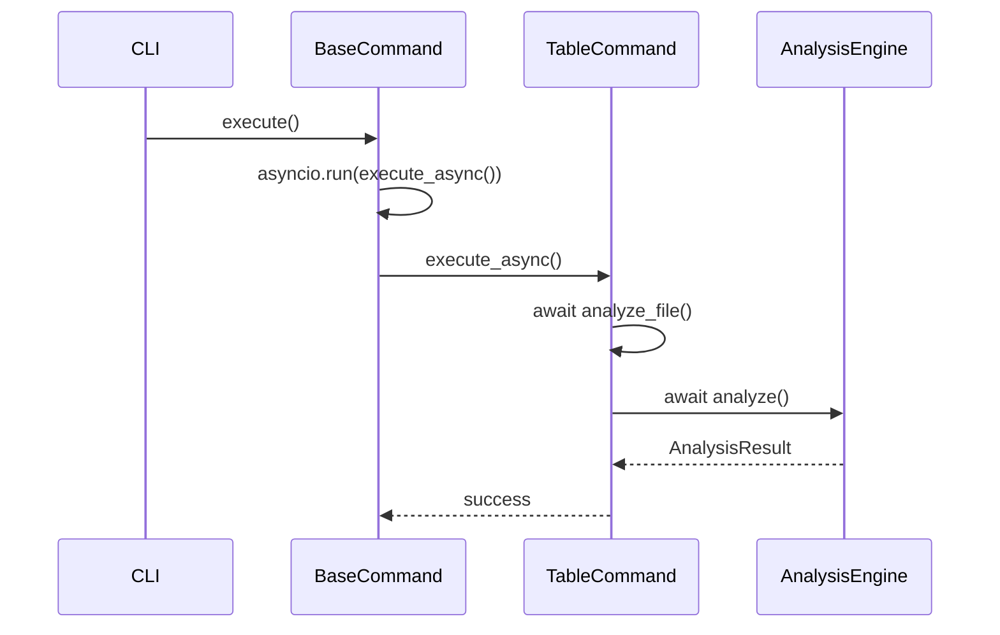
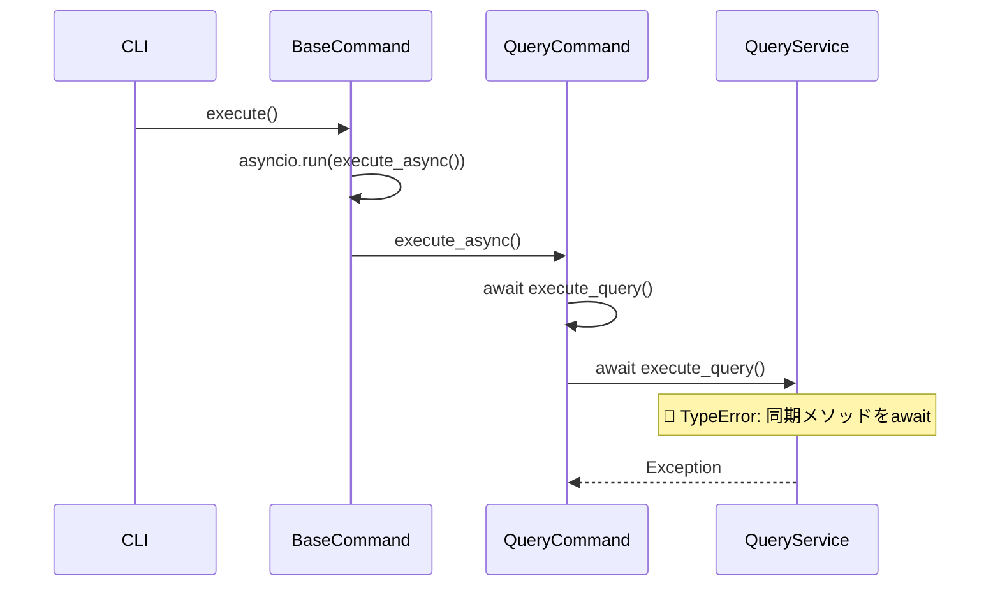
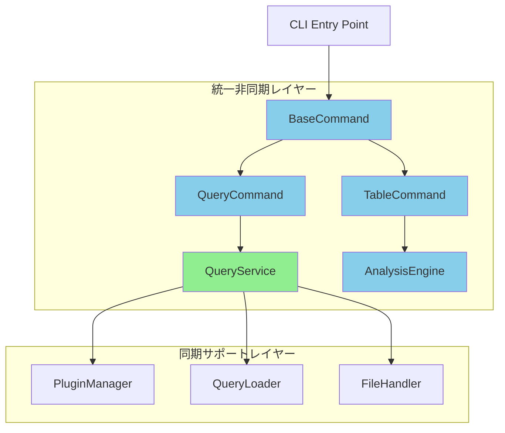
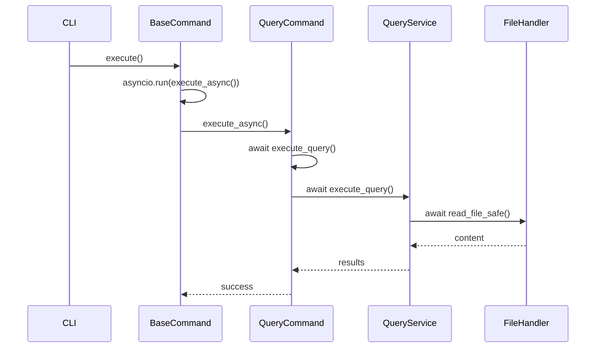
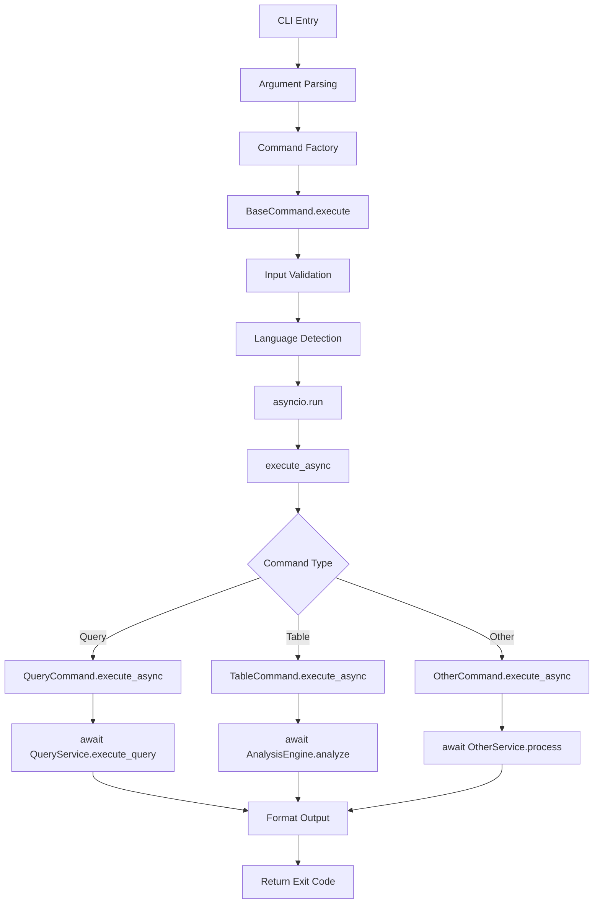
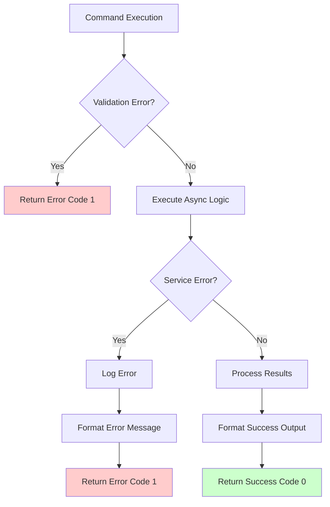

# 非同期処理アーキテクチャ設計書

## 1. 概要

本設計書は、tree-sitter-analyzer v1.8.0フレームワークにおける非同期処理の一貫性確保とCLI Command処理フローの改善設計を定義します。

## 2. 現在のアーキテクチャ分析

### 2.1 アーキテクチャ概要



### 2.2 現在の処理フロー

#### 正常な非同期フロー（TableCommand）


#### 問題のある非同期フロー（QueryCommand）


## 3. 改善されたアーキテクチャ設計

### 3.1 統一非同期アーキテクチャ



### 3.2 改善された処理フロー

#### 統一された非同期フロー


## 4. 非同期処理の設計原則

### 4.1 レイヤー別責任

#### Command Layer（非同期）
- **責任**: ユーザーインターフェース、入力検証、出力フォーマット
- **特徴**: 全て`async`メソッド、`await`による呼び出し
- **対象**: `BaseCommand`, `QueryCommand`, `TableCommand`

#### Service Layer（非同期）
- **責任**: ビジネスロジック、データ処理、外部リソースアクセス
- **特徴**: I/O操作を含む処理は`async`、CPU集約的処理は同期
- **対象**: `QueryService`, `AnalysisEngine`

#### Utility Layer（同期/非同期混在）
- **責任**: 基本的なユーティリティ機能
- **特徴**: I/O操作は非同期版を提供、純粋な計算は同期
- **対象**: `FileHandler`, `PluginManager`, `QueryLoader`

### 4.2 非同期処理のガイドライン

#### 非同期化の判断基準
```python
# ✅ 非同期化すべき処理
async def process_with_io():
    content = await read_file_async()  # ファイルI/O
    result = await network_request()   # ネットワークI/O
    return process_data(content, result)

# ✅ 同期のままで良い処理
def pure_computation(data):
    return complex_calculation(data)   # CPU集約的処理

# ✅ 混在パターン
async def hybrid_processing(file_path):
    content = await read_file_async(file_path)  # 非同期I/O
    result = pure_computation(content)          # 同期計算
    return result
```

## 5. CLI Command処理フローの改善設計

### 5.1 統一されたコマンド実行パターン



### 5.2 エラーハンドリングの統一



## 6. 回帰テスト防止のための設計原則

### 6.1 型安全性の強化

#### 非同期メソッドの明示的な型注釈
```python
from typing import Awaitable, Optional, List, Dict, Any

class QueryService:
    async def execute_query(
        self,
        file_path: str,
        language: str,
        query_key: Optional[str] = None,
        query_string: Optional[str] = None,
        filter_expression: Optional[str] = None,
    ) -> Optional[List[Dict[str, Any]]]:
        """非同期クエリ実行メソッド"""
        pass

class QueryCommand:
    async def execute_query(
        self, 
        language: str, 
        query: str, 
        query_name: str = "custom"
    ) -> Optional[List[Dict[str, Any]]]:
        """非同期クエリ実行ラッパー"""
        pass
```

### 6.2 インターフェース契約の明確化

#### 抽象基底クラスによる契約定義
```python
from abc import ABC, abstractmethod
from typing import Any, Awaitable

class AsyncServiceInterface(ABC):
    """非同期サービスの基底インターフェース"""
    
    @abstractmethod
    async def execute(self, *args, **kwargs) -> Any:
        """非同期実行メソッド"""
        pass

class QueryServiceInterface(AsyncServiceInterface):
    """クエリサービスのインターフェース"""
    
    @abstractmethod
    async def execute_query(
        self, 
        file_path: str, 
        language: str, 
        **kwargs
    ) -> Optional[List[Dict[str, Any]]]:
        pass
```

### 6.3 テスト駆動設計

#### 非同期処理のテストパターン
```python
import pytest
import asyncio

class TestAsyncConsistency:
    """非同期処理の一貫性テスト"""
    
    @pytest.mark.asyncio
    async def test_query_service_is_async(self):
        """QueryServiceのメソッドが非同期であることを確認"""
        service = QueryService()
        result = service.execute_query("test.py", "python")
        assert asyncio.iscoroutine(result)
        await result  # 実際に実行して完了を確認
    
    @pytest.mark.asyncio
    async def test_command_service_integration(self):
        """CommandとServiceの非同期統合テスト"""
        command = QueryCommand(mock_args)
        result = await command.execute_async("python")
        assert isinstance(result, int)  # 終了コードを返すことを確認
```

## 7. パフォーマンス最適化設計

### 7.1 非同期処理の最適化戦略

#### 並行処理の活用
```python
import asyncio
from typing import List, Dict, Any

class OptimizedQueryService:
    async def execute_multiple_queries(
        self, 
        queries: List[Dict[str, Any]]
    ) -> List[Optional[List[Dict[str, Any]]]]:
        """複数クエリの並行実行"""
        tasks = [
            self.execute_query(**query_params) 
            for query_params in queries
        ]
        return await asyncio.gather(*tasks, return_exceptions=True)
```

#### リソース管理の改善
```python
import aiofiles
from contextlib import asynccontextmanager

class AsyncFileHandler:
    @asynccontextmanager
    async def open_file(self, file_path: str):
        """非同期ファイルハンドリング"""
        async with aiofiles.open(file_path, 'r', encoding='utf-8') as f:
            yield f
```

### 7.2 メモリ効率の改善

#### ストリーミング処理の導入
```python
from typing import AsyncIterator

class StreamingQueryService:
    async def execute_query_stream(
        self, 
        file_path: str, 
        language: str
    ) -> AsyncIterator[Dict[str, Any]]:
        """結果をストリーミングで返す"""
        async for result in self._process_file_chunks(file_path):
            yield result
```

## 8. 監視とデバッグ機能

### 8.1 非同期処理の可視化

#### ログ機能の強化
```python
import logging
import time
from functools import wraps

def async_performance_monitor(func):
    """非同期処理のパフォーマンス監視デコレータ"""
    @wraps(func)
    async def wrapper(*args, **kwargs):
        start_time = time.time()
        logger.info(f"Starting async operation: {func.__name__}")
        try:
            result = await func(*args, **kwargs)
            duration = time.time() - start_time
            logger.info(f"Completed async operation: {func.__name__} in {duration:.2f}s")
            return result
        except Exception as e:
            duration = time.time() - start_time
            logger.error(f"Failed async operation: {func.__name__} after {duration:.2f}s: {e}")
            raise
    return wrapper
```

### 8.2 デバッグ支援機能

#### 非同期スタックトレースの改善
```python
import traceback
import asyncio

class AsyncDebugHelper:
    @staticmethod
    def format_async_exception(exc: Exception) -> str:
        """非同期例外の詳細フォーマット"""
        tb_lines = traceback.format_exception(type(exc), exc, exc.__traceback__)
        async_info = f"Current task: {asyncio.current_task()}"
        return f"{async_info}\n{''.join(tb_lines)}"
```

## 9. 移行戦略

### 9.1 段階的移行計画

#### Phase 1: 緊急修正
- `QueryService.execute_query()`の非同期化
- 基本的な動作確認

#### Phase 2: 統合テスト
- 全コマンドの非同期処理テスト
- パフォーマンステスト

#### Phase 3: 最適化
- 並行処理の導入
- リソース管理の改善

### 9.2 後方互換性の保証

#### 同期インターフェースの提供
```python
class QueryService:
    async def execute_query_async(self, *args, **kwargs):
        """新しい非同期インターフェース"""
        pass
    
    def execute_query(self, *args, **kwargs):
        """後方互換性のための同期ラッパー"""
        return asyncio.run(self.execute_query_async(*args, **kwargs))
```

## 10. 成功指標

### 10.1 技術指標
- [ ] 全ての非同期処理が一貫している
- [ ] エラーハンドリングが統一されている
- [ ] パフォーマンスが維持または改善されている

### 10.2 品質指標
- [ ] 回帰テストが100%パスする
- [ ] 新しいテストカバレッジが90%以上
- [ ] ドキュメントが更新されている

---

**作成日**: 2025-10-14  
**対象バージョン**: v1.8.0 (develop branch)  
**アーキテクチャレベル**: System Design  
**実装優先度**: High