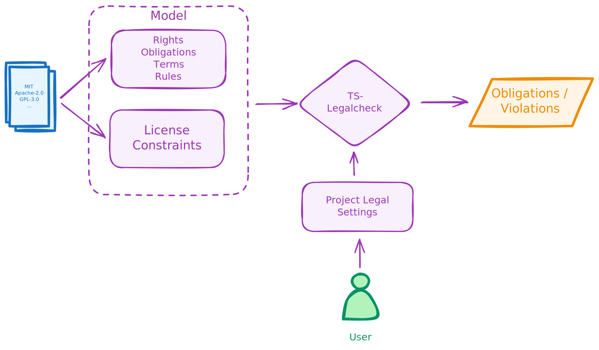

# TS-Legalcheck

**ts-legalcheck** is a tool for automatically checking legal obligations and violations related to the use of software components licensed under one or more open-source licenses within a project. It consists of a powerful constraints engine leveraging the state-of-the-art SMT solver Z3 and several flexible and easily extendable sets of rules describing constraints and definitions extracted from various open-source licenses. The internal format for constraints and definitions allows formal definitions without limitations, enabling not only switching between different models but also combining them. One great example is the use of the OSADL checklists, available as a model for **ts-legalcheck**, together with a set of violation rules developed by EACG GmbH.

## Introduction

The following diagram represents the main functional principle of **ts-legalcheck**. The tool accepts as input a model consisting of data extracted from open-source licenses. It contains known *rights*, *obligations*, and *terms*, as well as different rules describing in which situations certain obligations apply and, for example, which conditions may violate license usage.



Besides a model, the **ts-legalcheck** engine also expects user input describing the legal settings of a project, which define different aspects such as distribution model, distribution form, or modification of third-party components used in the project. We refer to such input as a use case or legal situation. Based on the model, legal settings, and the set of open-source licenses used in the project, the engine decides whether the usage of certain licenses is possible in the provided use case and, if so, provides a set of obligations that must be fulfilled.

The different models created by EACG GmbH can be found in the `data/LicenseConstraints_vX.[json|toml]` files, and the OSADL model in the `data/osadl/LicenseConstraints_v1.0.toml` file.

## Installation

**ts-legalcheck** is available as a PyPI package as well as a ready-to-use Docker image.

### PyPI

**Requirements**: Python >= 3.10

```bash
pip install ts-legalcheck
```


## Docker

```bash
docker pull trustsource/ts-legalcheck
```

## Usage

### Installed via PyPI

When **ts-legalcheck** is installed from PyPI, it can be used directly as a command-line tool from the shell.

#### License Test

The **test** command is used to check whether a use case violates license usage and, if not, provides a list of obligations that must be fulfilled:

```bash
ts-legalcheck test -l <LICENSE> -d <MODEL LOCATION> <USE-CASE LOCATION> 
```

##### Example:

The following example tests if the *Apache-2.0* license can be used in a project with the legal settings from `examples/sc01_ProprietarySoftware.toml` and, if so, which obligations must be fulfilled.

```bash
ts-legalcheck test -l Apache-2.0 -d data/LicenseConstraints_v4.5.toml examples/sc01_ProprietarySoftware.toml
```

### Installed as a Docker image

When **ts-legalcheck** is pulled as a Docker image, it can be executed within a Docker container. For example, the previous example can be executed using Docker as follows:

```bash
docker run -it --rm -v ./examples:/examples trustsource/ts-legalcheck test -l Apache-2.0 -d /data/LicenseConstraints_v4.5.toml /examples/sc01_ProprietarySoftware.toml
```

**NOTE**: No extra installation step is required; by executing this command, the **ts-legalcheck** image is pulled automatically.

