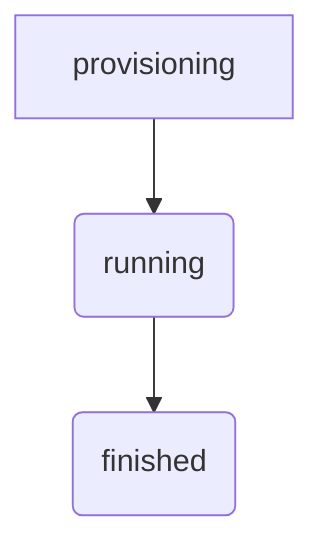
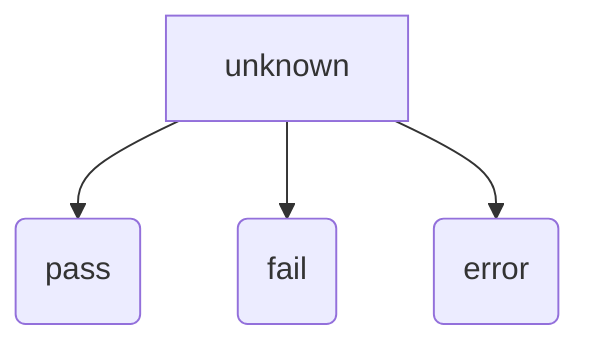

# Test Status and Result

The API provide two fields for knowing the `status` and `result` of a specific
test.
For details of each individual tests ran during a test, see the `results` field.

## Status

The valid status values are:

* `provisioning` - The system is provisioning a device.
* `running` - The test is currently running.
* `finished` - The test is finished and result are available.

## Result

The valid values are

* `unknown` - The test isn't finished yet
* `pass` - Every tests are passing
* `fail` - At least one test failed
* `error` - Something went wrong. See the logs

## Results

For each individual test ran during a test, the `results` field will describe the outcome.

The `results` is a directory where the key is the test name.

The valid values are:

* `pass`
* `fail`
