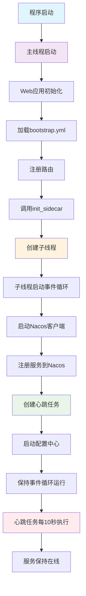
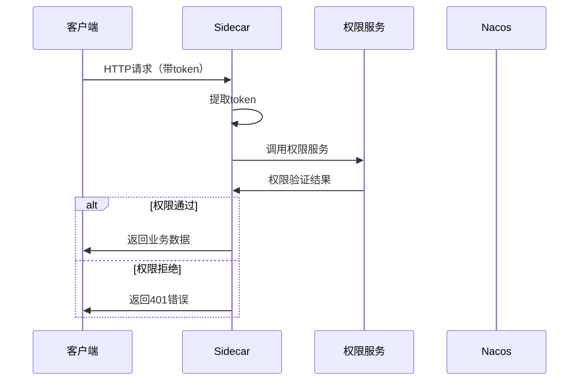

# Ultra Pass Sidecar

> 功能描述: sidecar库文档，包含API说明、安装指南、使用示例、异构服务支持等  
> @author: lzg  
> @created: 2025-07-01 15:47:21  
> @version: 1.0.0  

Ultra Pass Python Sidecar 是一个简洁的Python微服务sidecar库，支持自动注册到Nacos和Feign风格调用。

## 功能特性

- ✅ **自动服务注册**：一键注册到Nacos服务发现中心
- ✅ **Feign风格调用**：类似Java Feign的简洁客户端调用
- ✅ **异构服务支持**：支持调用Java、Python等不同语言的服务
- ✅ **配置中心支持**：自动从Nacos配置中心拉取配置
- ✅ **命名空间支持**：支持Nacos命名空间隔离
- ✅ **权限拦截器**：自动权限检查和token传递
- ✅ **心跳保活**：自动心跳机制，保持服务在线
- ✅ **优雅关闭**：支持信号处理，优雅注销服务
- ✅ **多框架支持**：支持Flask、FastAPI等主流框架
- ✅ **轻量级设计**：最小化依赖，只包含核心功能

## 快速开始

### 1. 安装依赖

```bash
pip install ultra-paas-sidecar==0.0.83
```

### 2. 配置文件

创建 `bootstrap.yml`：

```yaml
server:
  port: 9202

application:
  name: python-test-server
  code: 10001  # 应用代码，用于权限验证

profiles:
  active: dev

# 权限配置（可选）
auth:
  enabled: true     # 是否开启权限检查
  fail_open: false  # 容错机制，权限服务失败时的行为
  exclude_paths:    # 排除权限检查的路径
    - /api/hello
    - /api/health
    - /static
  timeout: 5000     # 权限检查超时时间(毫秒)

cloud:
  nacos:
    discovery:
      server-addr: 34.212.106.66:8848
      ip: 10.12.6.236
      namespace: upcloudx        # 命名空间
      username: nacos           # 用户名
      password: qrFt.jIrt4561#  # 密码
    config:
      server-addr: 34.212.106.66:8848
      file-extension: yml
      namespace: upcloudx        # 命名空间
      username: nacos           # 用户名
      password: qrFt.jIrt4561#  # 密码
      shared-configs:
        - application-${spring.profiles.active}.${spring.cloud.nacos.config.file-extension}
```

### 3. 服务端使用

```python
from flask import Flask
from ultra_pass_sidecar import init_sidecar, config_local, config_remote

app = Flask(__name__)

@app.route('/api/hello/<name>')
def hello(name):
    return {'message': f'Hello, {name}!'}

if __name__ == '__main__':
    # 一行代码启动sidecar
    init_sidecar(app) 
    
    # 从本地读取端口
    port = config_local('server.port', 9202)
    
    # 从配置中心读取其他配置
    redis_host = config_remote('spring.data.redis.host', 'localhost')
    app.run(host='0.0.0.0', port=port, debug=True)
```

### 4. 客户端使用

```python
import asyncio
from ultra_pass_sidecar import feign, get

@feign("python-test-server")
class HelloService:
    @get("/api/hello/{name}")
    async def hello(self, name: str):
        pass

async def main():
    service = HelloService()
    result = await service.hello("World")
    print(result)

if __name__ == '__main__':
    asyncio.run(main())
```

### 5. 权限服务定义

如果需要自定义权限服务，可以在子系统中定义：

```python
from ultra_pass_sidecar import feign, get

@feign("your-auth-service")  # 使用你的权限服务名称
class AuthPermissionService:
    """权限微服务接口"""
    
    @get("/external/auth/check")
    async def check_permission(self, url: str, code: str = None, token: str = None):
        """权限校验接口"""
        pass
    
    @get("/external/menu/resources")
    async def get_menu_resources(self, code: str):
        """获取菜单资源"""
        pass 

    @get("/external/user/info")
    async def get_user_info(self):
        """获取用户信息"""
        pass
```

### 6. 多框架支持示例

#### Flask应用
```python
from flask import Flask
from ultra_pass_sidecar import init_sidecar

app = Flask(__name__)

@app.route('/api/users/<user_id>')
def get_user(user_id):
    return {'user_id': user_id, 'name': f'User{user_id}'}

if __name__ == '__main__':
    init_sidecar(app)  # 自动设置权限拦截器
    app.run(host='0.0.0.0', port=9202)
```

#### FastAPI应用
```python
from fastapi import FastAPI
from ultra_pass_sidecar import init_sidecar

app = FastAPI()

@app.get("/api/users/{user_id}")
async def get_user(user_id: int):
    return {'user_id': user_id, 'name': f'User{user_id}'}

if __name__ == '__main__':
    init_sidecar(app)  # 自动设置权限拦截器
    import uvicorn
    uvicorn.run(app, host='0.0.0.0', port=9202)
```

## 系统架构

### 线程架构图



### 权限检查流程



## API 参考

### 核心函数

#### `init_sidecar(app=None)`
初始化sidecar，自动注册服务到Nacos。

**参数：**
- `app`: Web应用实例（Flask、FastAPI等），可选

#### `feign(service_name: str)`
定义Feign客户端的装饰器。

#### `get(path: str)` / `post(path: str)`
HTTP请求装饰器。

#### `config_remote(config_key: str, default: Any = None)`
从Nacos配置中心获取配置值。

#### `config_local(config_key: str, default: Any = None)`
从本地bootstrap.yml获取配置值。

### 配置说明

| 配置项 | 说明 | 示例 |
|--------|------|------|
| `server.port` | 服务端口 | `9202` |
| `application.name` | 服务名称 | `python-test-server` |
| `application.code` | 应用代码 | `10001` |
| `cloud.nacos.discovery.server-addr` | Nacos地址 | `44.253.185.145:8848` |
| `cloud.nacos.discovery.namespace` | 命名空间 | `upcloudx` |
| `cloud.nacos.discovery.username` | 用户名 | `nacos` |
| `cloud.nacos.discovery.password` | 密码 | `qrFt.jIrt4561#` |

### Token传递机制

Sidecar 会自动从以下位置获取 token 并传递给微服务：

1. **Authorization头**：`Authorization: Bearer <token>`
2. **Cookie**：`token=<token>`, `access_token=<token>`
3. **URL参数**：`?token=<token>`, `?access_token=<token>`
4. **自定义头**：`X-Auth-Token: <token>`, `X-Token: <token>`

**优先级**：Authorization头 > Cookie > URL参数 > 自定义头

## 心跳机制

- **心跳间隔**：10秒
- **超时时间**：90秒（3次心跳失败后下线）
- **自动重连**：心跳失败时自动重试
- **优雅关闭**：程序退出时自动注销服务

## 技术栈

### 核心依赖
- **Python 3.8+** - 编程语言
- **aiohttp** - 异步HTTP客户端
- **PyYAML** - YAML配置文件解析
- **nacos-sdk-python** - Nacos服务发现和配置中心
- **asyncio** - 异步编程支持

### Web框架支持
- **FastAPI>=0.100.0** - 现代高性能Web框架
- **Flask>=2.0.0** - 轻量级Web框架
- **Flask-CORS>=3.0.0** - 跨域资源共享
- **Uvicorn>=0.15.0** - ASGI服务器

### 开发工具
- **Pytest** - 测试框架
- **Black** - 代码格式化
- **Flake8** - 代码检查
- **MyPy** - 类型检查

## 安装选项

### 核心安装
```bash
pip install ultra-paas-sidecar
```

### 开发环境安装
```bash
pip install ultra-paas-sidecar[dev]
```

## 部署和运维

### 生产环境部署

#### 使用Gunicorn部署Flask应用
```bash
# 安装Gunicorn
pip install gunicorn

# 启动应用
gunicorn -w 4 -b 0.0.0.0:9202 --worker-class gevent demo_server:app
```

#### 使用Uvicorn部署FastAPI应用
```bash
# 启动应用
uvicorn demo_server:app --host 0.0.0.0 --port 9202 --workers 4
```

#### 使用Docker部署
```dockerfile
FROM python:3.9-slim

WORKDIR /app
COPY requirements.txt .
RUN pip install -r requirements.txt

COPY . .
EXPOSE 9202

CMD ["python", "demo_server.py"]
```

### 监控和日志

#### 健康检查
```bash
# 检查服务状态
curl http://localhost:9202/health

# 检查Nacos注册状态
curl http://localhost:8848/nacos/v1/ns/instance/list?serviceName=python-test-server
```

#### 调试日志
Sidecar 会输出详细的调试信息，包括：
- 微服务调用信息
- 请求头、参数、token
- 响应状态和内容

## 注意事项

1. **端口配置**：确保bootstrap.yml中的端口未被占用
2. **网络连接**：确保能访问Nacos服务器
3. **IP配置**：生产环境需要配置正确的服务IP
4. **命名空间**：确保使用正确的Nacos命名空间
5. **权限配置**：生产环境建议启用权限检查
6. **Token格式**：确保token格式正确（JWT等）
7. **跨域配置**：前端调用时可能需要配置CORS

## 更新日志

### v0.0.83
- ✅ 支持Nacos命名空间隔离
- ✅ 支持Nacos用户名密码认证
- ✅ 优化token传递机制（Bearer格式）
- ✅ 清理无用依赖，大幅减少包大小
- ✅ 升级FastAPI到0.100.0版本
- ✅ 添加详细调试日志
- ✅ 修复权限服务调用问题
