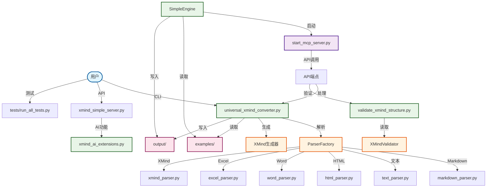

# 🧠 XMind AI MCP 智能思维导图工具

一个功能强大的工具，支持将多种文件格式转换为XMind思维导图，集成AI驱动的分析和MCP服务器功能。

[](https://opensource.org/licenses/MIT)

## 🚀 核心功能

### 1. 通用文件转换器
- **多格式支持**: 支持Markdown、文本、HTML、Word、Excel转换为XMind
- **智能检测**: 自动识别文件类型和结构
- **批量处理**: 一键转换多个文件
- **灵活输出**: 自定义输出路径和命名模式

### 2. 独立模式
- **直接转换**: 无需服务器设置即可转换文件
- **命令行界面**: 简单的命令格式，快速转换
- **格式选项**: 强制指定格式或自动检测
- **进度反馈**: 实时转换状态

### 3. MCP服务器模式
- **RESTful API**: 完整的HTTP API，支持所有转换操作
- **IDE集成**: 与Trae等IDE无缝集成
- **实时处理**: 通过API调用即时转换
- **健康监控**: 服务器状态和性能指标

### 4. AI驱动的分析
- **结构分析**: 智能思维导图结构优化
- **内容建议**: AI生成的主题推荐
- **质量指标**: 全面的思维导图质量评估
- **格式验证**: 确保XMind兼容性和标准

## 📁 项目结构

```
XmindMcp/
├── configs/                      # MCP配置文件
├── docs/                         # 文档和指南
├── examples/                     # 示例输入文件
├── output/                       # 转换后的XMind文件
├── tests/                        # 测试套件
├── universal_xmind_converter.py  # 核心转换引擎
├── xmind_simple_server.py        # MCP服务器实现
├── validate_xmind_structure.py   # XMind验证工具
└── xmind_ai_extensions.py        # AI分析功能
```

## 🔄 代码调用关系图



### 调用关系说明

| 层级 | 文件 | 主要功能 | 依赖关系 |
|-----|-----|-------------|-------------|
| **用户界面** | `complete_test_suite.py` | 完整测试套件 | 调用MCP服务器API |
| | `batch_convert_demo.py` | 批量转换演示 | 直接调用转换器 |
| **服务器** | `start_mcp_server.py` | MCP服务器启动器 | 创建引擎实例 |
| **核心引擎** | `xmind_simple_server.py` | XMind简化引擎 | 调用转换器和验证器 |
| | `xmind_ai_extensions.py` | AI扩展功能 | 提供智能建议 |
| **转换工具** | `universal_xmind_converter.py` | 通用格式转换器 | 创建解析工厂 |
| **验证工具** | `validate_xmind_structure.py` | 结构验证器 | 读取和验证XMind文件 |

### 数据流向

1. **输入流程**: `examples/` → `ParserFactory` → `create_xmind_file` → `output/`
2. **验证流程**: `output/` → `XMindValidator` → 结构分析 → 质量报告
3. **AI流程**: 用户输入 → `AIExtensions` → 智能建议 → 思维导图优化

## 🔧 快速开始

### ⚡ 超快速启动（推荐）
```bash
# 一键启动，自动安装依赖
python quick_start.py
```

### 🐳 Docker启动
```bash
# 使用docker-compose
docker-compose up
```

### 📦 传统安装启动
```bash
# 1. 安装依赖
pip install beautifulsoup4 python-docx openpyxl fastapi uvicorn

# 2. 启动服务器
python xmind_mcp_server.py
```

### 2. 文件转换（独立模式）

#### 单文件转换
```bash
# 基础转换（自动检测格式）
python universal_xmind_converter.py <input_file>

# 指定输出路径
python universal_xmind_converter.py <input_file> --output <output_path>

# 强制指定格式
python universal_xmind_converter.py <input_file> --format markdown
```

#### 批量转换
```bash
# 转换目录中的所有文件
python universal_xmind_converter.py <input_directory> --batch

# 转换特定文件类型
python universal_xmind_converter.py <directory> --batch --format markdown,html,txt
```

#### 示例
```bash
# 转换Markdown文件
python universal_xmind_converter.py examples/test_markdown.md

# 转换并指定输出
python universal_xmind_converter.py examples/test_document.docx --output my_mind_map.xmind

# 批量转换所有文本文件
python universal_xmind_converter.py examples/ --batch
```

### 3. MCP服务器模式

#### 启动服务器
```bash
# 使用默认端口（8080）启动
python xmind_simple_server.py

# 自定义端口
python xmind_simple_server.py --port 9000

# 调试模式
python xmind_simple_server.py --debug
```

#### API端点
服务器运行后，可用的端点：
- `POST /tools/convert_to_xmind` - 转换文件为XMind
- `POST /tools/read_xmind` - 读取XMind文件内容
- `POST /tools/analyze_mind_map` - 分析思维导图结构
- `POST /tools/create_mind_map` - 创建新思维导图
- `POST /tools/list_xmind_files` - 列出XMind文件
- `GET /health` - 健康检查

#### 使用示例
```bash
# 通过API转换（使用curl）
curl -X POST "http://localhost:8080/tools/convert_to_xmind" \
  -H "Content-Type: application/json" \
  -d '{"source_filepath": "examples/test.md", "output_filepath": "output/result.xmind"}'

# 读取XMind文件
curl -X POST "http://localhost:8080/tools/read_xmind" \
  -H "Content-Type: application/json" \
  -d '{"filepath": "output/result.xmind"}'
```

### 4. IDE集成（Trae MCP）

#### 配置模板
在IDE中创建MCP配置：

```json
{
  "mcpServers": {
    "xmind-converter": {
      "command": "python",
      "args": ["<absolute_path_to_project>/xmind_simple_server.py"],
      "description": "XMind AI MCP"
    }
  }
}
```

#### 替换占位符
- `<absolute_path_to_project>` - 您的项目目录绝对路径
- 如需修改端口：添加 `"--port", "8080"` 到参数中

#### 配置示例
```json
{
  "mcpServers": {
    "xmind-converter": {
      "command": "python",
      "args": ["D:/projects/xmind-converter/xmind_simple_server.py", "--port", "8080"],
      "description": "XMind AI MCP"
    }
  }
}
```

### 5. 运行测试
```bash
# 运行所有测试
python tests/run_all_tests.py

# 英文模式
python tests/run_all_tests.py --english

# 测试特定模块
python tests/test_setup.py
python tests/test_core.py
```

## 📋 可用工具

配置成功后，您可以在Trae中使用以下工具：

1. **read_xmind_file** - 读取XMind文件内容
2. **create_mind_map** - 创建新思维导图
3. **analyze_mind_map** - 分析思维导图结构
4. **convert_to_xmind** - 转换文件为XMind格式
5. **list_xmind_files** - 列出XMind文件
6. **ai_generate_topics** - AI生成主题建议

## 🎯 使用示例

### 独立模式 - 文件转换

#### 单文件转换
```bash
# 基础转换（自动检测格式）
python universal_xmind_converter.py input.md output.xmind

# 强制指定格式
python universal_xmind_converter.py input.txt output.xmind --format text

# 自定义输出目录
python universal_xmind_converter.py input.md /path/to/output/ --output-dir
```

#### 批量转换
```bash
# 转换目录中所有支持的文件
python universal_xmind_converter.py --batch examples/ output/

# 转换特定文件类型
python universal_xmind_converter.py --batch examples/ output/ --include "*.md,*.txt"

# 递归批量转换
python universal_xmind_converter.py --batch examples/ output/ --recursive
```

### 转换Markdown为思维导图
```python
# 在Trae中调用MCP工具
convert_to_xmind({
    "source_filepath": "examples/playwright-learning-guide.md",
    "output_filepath": "output/my-guide.xmind"
})
```

### AI生成思维导图
```python
ai_generate_topics({
    "context": "前端开发学习路径",
    "max_topics": 15
})
```

### 分析现有思维导图
```python
analyze_mind_map({
    "filepath": "output/test_outline.xmind"
})
```

## 📖 详细文档

- **[通用转换器使用指南](UNIVERSAL_CONVERTER_USAGE.md)** - 多格式转换详情
- **[Trae MCP配置指南](TRAE_MCP_SETUP.md)** - 详细的MCP配置方法
- **[转换验证报告](conversion_validation_report.md)** - 转换质量验证结果
- **[XMind AI MCP设计方案](xmind_ai_mcp_design.md)** - 技术架构设计

## 🎨 支持的格式

### Markdown格式
```markdown
# 主标题
## 一级分支
### 二级分支
## 另一个一级分支
```

### 文本大纲
```
主标题
  一级分支
```

### HTML格式
```html
<h1>主标题</h1>
<h2>一级分支</h2>
<h3>二级分支</h3>
```

### 支持的文件类型
- **Markdown** (.md, .markdown)
- **文本** (.txt, .text)
- **HTML** (.html, .htm)
- **Word** (.docx)
- **Excel** (.xlsx)
- **CSV** (.csv)
- **JSON** (.json)
- **XML** (.xml)
- **YAML** (.yaml, .yml)

## 🤝 贡献指南

1. Fork 本仓库
2. 创建您的功能分支 (`git checkout -b feature/amazing-feature`)
3. 提交您的更改 (`git commit -m '添加一些令人惊叹的功能'`)
4. 推送到分支 (`git push origin feature/amazing-feature`)
5. 打开一个拉取请求

## 🔍 验证和质量

- ✅ **9种文件格式**转换验证全部通过
- ✅ **结构完整性**保持原始层级关系
- ✅ **内容保真度**完整保留文本内容
- ✅ **格式兼容性**符合XMind标准

## 🛠️ 技术特点

- **模块化设计**: 易于扩展和维护
- **错误处理**: 完善的异常处理机制
- **性能优化**: 支持大文件流式处理
- **智能检测**: 自动识别文件类型
- **标准兼容**: 生成标准XMind格式文件

## 📝 更新日志

- **v2.0** - 集成AI MCP服务器功能
- **v1.2** - 添加自动文件类型识别
- **v1.1** - 支持多格式批量转换
- **v1.0** - 基础Markdown转换功能

## 📝 许可证

本项目采用 MIT 许可证 - 详见 [LICENSE](LICENSE) 文件

## 🙏 致谢

- XMind 团队提供的优秀思维导图工具
- Trae IDE 提供的强大开发环境
- 所有帮助改进本项目的贡献者